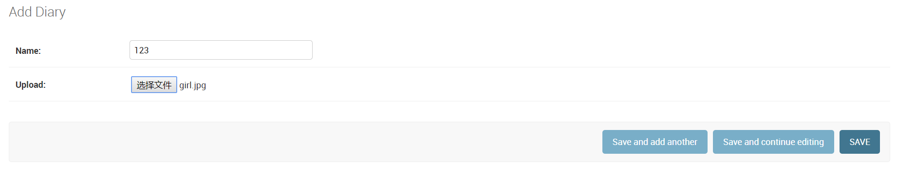

# Django Model 设计

Django Model设计是Django五项基础核心设计之一（Model设计，URL配置，View编写，Template设计，From使用），也是MVC模式中重要的环节。

Model是数据模型，并不是数据库，它描述了数据的构成和他们之间的逻辑关系，在Django中，Model设计实质上就是一个类，所以我们可以直接站在类的角度来看Model，这样可以尽量避免一些晦涩的概念影响理解。

下面是python中一个基本类的构成

```python
class ClassName(object):
    # 属性（类属性）
    Attribute = ""
    # 方法
    def Method():
        pass
```

根据上面python中的类，我们依次研究Django Model

* 基类：定义Django Model的类必须继承自models.Model
* 类名：在Django Model设计中，类名会被当作是这个数据模型的名称。
* 类属性：Django Model设计过程中，类属性有两方面的作用，一是申明字段，二是申明关系（一对多，多对多，一对一）
* 方法：由于是派生类，所以我们不需要自己定义很多方法，Model基类已经做的足够完善了，只是在有必要的时候我们需要重写一些方法，如常见的`__str__`等
* 内嵌类Meta：Django Model设计过程中，内嵌类Meta用来定义元数据，所谓元数据就是不是字段的任何数据，比如定义排序规则等

下面依次介绍字段，关系，重写方法，Meta

## 1.字段 Field

都说官方文档才是学习一门语言最好的教程，[访问官方文档](https://docs.djangoproject.com/zh-hans/2.1/ref/models/fields/)

### 1.1 字段类型（Field types）

字面意思，用来申明该字段的类型，比如常见的字符，数字，日期，邮箱等待，下面列举常见的字段类型

#### AutoField（主键）

这一个字段一般不需要我们手动定义，主要用于ID的自动递增，Django会默认为我们创建一个`id`

```python
# 每一个Model Django都会为我们添加这个字段
id = models.AutoField(primary_key=True)
```

如果想把自己定义的字段设置为主键，需要添加参数primary_key，这时（显式设置主键）Django将不会为我们添加ID字段

与之类似还有一个BigAutoField，它支持更大的范围，最大到9223372036854775807（九百二十亿亿）足够绝大多数的使用

#### IntegerField（整数字段）

字面意思，用来保存整数的字段，支持 -2147483648 到 2147483647 的数字

同样与之类似有BigIntegerField 支持-9223372036854775808 到 9223372036854775807 的数字

类似还有FloatField，支持浮点数

#### BooleanField（布尔字段）

用来存储布尔值，与之类似的还有NullBooleanField，NullBooleanField相当于BooleanField(null=true),不过在Django 2.1 之后不建议使用后者，应为它有可能在未来版本被弃用

#### CharField（字符字段）

这应该是最常用的一个字段了吧，用于少量的字符串的储存（大量字符串请使用TextField）这个字段有一个**必须参数max_length**用来申明允许储存的最大长度

```python
 class CharField(Field):
    description = _("String (up to %(max_length)s)")
    # ...
    def _check_max_length_attribute(self, **kwargs):
        if self.max_length is None:
            return [
                checks.Error(
                    "CharFields must define a 'max_length' attribute.",
                    obj=self,
                    id='fields.E120',
                )
            ]
```

根据源码，我们可以发现如果不指定max_length会直接报"CharFields must define a 'max_length' attribute."

#### DateField（时间日期字段）

该字段有两个常用参数 auto_now 和 auto_now_add

* auto_now ：指定这个参数，可以在每次调用save()时将当前时间作为字段的值（会覆盖默认值或之前的值），但使用QuerySet.update()等方法不会跟新值
* auto_now_add : 在初始化会以当前时间戳作为值给字段赋值，不管你有没有定义默认值，定义了也会被覆盖
* 区别：使用auto_now会在每次save()时修改字段值，而auto_now_add只是在首次创建对象时才会把当前时间给字段。
* 如果你想能够修改这个字段的值，请使用`default=date.today`需要引入`from datetime.date.today()`
* auto_now,auto_now_add与default是互斥的，任何一种组合都会出错
* 将auto_now或auto_now_add设置为True的结果与editable = False和blank = True的效果一样

与DateField类似的还有**DateTimeField**

* 如果使用DateTimeField想要修改字段的值，需要使用`default=timezone.now` 同样需要引入`from django.utils.timezone.now()`
* 另外还有**TimeField**,用来表示时间，接受的参数与DateField一样


#### EmailField

实质上是CharField，不过使用EmailValidator检查了字符串是否是有效电子邮件地址而已，默认max_length=254

#### TextField

实质上也是一个CharField，是一个比较大的文本字段

#### FileField

```python
class FileField(upload_to=None, max_length=100, **options)
```

正如文档所说，这是一个文件上传字段，有两个可选参数upload_to和max_length,后者默认100

##### upload_to

见名知意，upload_to用来申明上传目录，如果给定一个字符串类型初值，Django会在他后面添加时间（就是以上传时间分类文件），用户上传文件一般保存到media目录中，media目录路径需要在setting.py里定义

```py
MEDIA_ROOT = os.path.join(BASE_DIR, "media")
```

这个media文件夹如果我们没有建立，保存文件时Django会自动创建

```python
class MyModel(models.Model):
    # file will be uploaded to MEDIA_ROOT/uploads
    upload = models.FileField(upload_to='uploads/')
    # or...
    # file will be saved to MEDIA_ROOT/uploads/2015/01/30
    upload = models.FileField(upload_to='uploads/%Y/%m/%d/')
```

如果需要动态存储文件，如按用户存储，可以把一个函数的返回值作为upload_to的值，这个函数必须接受两个参数：instance（主键，传给当前文件的唯一实例）和filename（文件名），如：

```python
def user_directory_path(instance, filename):
    # file will be uploaded to MEDIA_ROOT/user_<id>/<filename>
    return 'user_{0}/{1}'.format(instance.user.id, filename)

class MyModel(models.Model):
    upload = models.FileField(upload_to=user_directory_path)
```

这里看着有点复杂，其实也不难，instance是当前FileField的模型实例的模型实例，也就是我们定义的字段，上面的示例是的user是和User表对应的，当然也可以不是user，比如：

```python
def user_directory_path(instance, filename):
    # 我没有用user，而是自己定义了一个name字段
    return 'user_{0}/{1}'.format(instance.name, filename)

class Diary(models.Model):
    name = models.CharField(max_length=10)
    creat_time = models.DateTimeField(auto_now_add=True)
    time = models.TimeField(auto_now=True)
    upload = models.FileField(upload_to=user_directory_path,default="")
    class Meta:
        verbose_name = "Diary"
        verbose_name_plural = "Diarys"
```



保存之后就可以看见项目根目录下的文件了


使用时间也是一样的

## TODO:明天再写后面的
