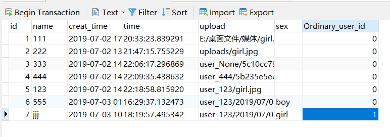

# Django Model 设计

Django Model设计是Django五项基础核心设计之一（Model设计，URL配置，View编写，Template设计，From使用），也是MVC模式中重要的环节。

Model是数据模型，并不是数据库，它描述了数据的构成和他们之间的逻辑关系，在Django中，Model设计实质上就是一个类，所以我们可以直接站在类的角度来看Model，这样可以尽量避免一些晦涩的概念影响理解。

下面是python中一个基本类的构成

```python
class ClassName(object):
    # 属性（类属性）
    Attribute = ""
    # 方法
    def Method():
        pass
```

根据上面python中的类，我们依次研究Django Model

* 基类：定义Django Model的类必须继承自models.Model
* 类名：在Django Model设计中，类名会被当作是这个数据模型的名称。
* 类属性：Django Model设计过程中，类属性有两方面的作用，一是申明字段，二是申明关系（一对多，多对多，一对一）
* 方法：由于是派生类，所以我们不需要自己定义很多方法，Model基类已经做的足够完善了，只是在有必要的时候我们需要重写一些方法，如常见的`__str__`等
* 内嵌类Meta：Django Model设计过程中，内嵌类Meta用来定义元数据，所谓元数据就是不是字段的任何数据，比如定义排序规则等

下面依次介绍字段，关系,Meta

## 1.字段 Field

都说官方文档才是学习一门语言最好的教程，[访问官方文档](https://docs.djangoproject.com/zh-hans/2.1/ref/models/fields/)

### 1.1 字段类型（Field types）

字面意思，用来申明该字段的类型，比如常见的字符，数字，日期，邮箱等待，下面列举常见的字段类型

#### AutoField（主键）

这一个字段一般不需要我们手动定义，主要用于ID的自动递增，Django会默认为我们创建一个`id`

```python
# 每一个Model Django都会为我们添加这个字段
id = models.AutoField(primary_key=True)
```

如果想把自己定义的字段设置为主键，需要添加参数primary_key，这时（显式设置主键）Django将不会为我们添加ID字段

与之类似还有一个BigAutoField，它支持更大的范围，最大到9223372036854775807（九百二十亿亿）足够绝大多数的使用

#### IntegerField（整数字段）

字面意思，用来保存整数的字段，支持 -2147483648 到 2147483647 的数字

同样与之类似有BigIntegerField 支持-9223372036854775808 到 9223372036854775807 的数字

类似还有FloatField，支持浮点数

#### BooleanField（布尔字段）

用来存储布尔值，与之类似的还有NullBooleanField，NullBooleanField相当于BooleanField(null=true),不过在Django 2.1 之后不建议使用后者，应为它有可能在未来版本被弃用

#### CharField（字符字段）

这应该是最常用的一个字段了吧，用于少量的字符串的储存（大量字符串请使用TextField）这个字段有一个**必须参数max_length**用来申明允许储存的最大长度

```python
 class CharField(Field):
    description = _("String (up to %(max_length)s)")
    # ...
    def _check_max_length_attribute(self, **kwargs):
        if self.max_length is None:
            return [
                checks.Error(
                    "CharFields must define a 'max_length' attribute.",
                    obj=self,
                    id='fields.E120',
                )
            ]
```

根据源码，我们可以发现如果不指定max_length会直接报"CharFields must define a 'max_length' attribute."

#### DateField（时间日期字段）

该字段有两个常用参数 auto_now 和 auto_now_add

* auto_now ：指定这个参数，可以在每次调用save()时将当前时间作为字段的值（会覆盖默认值或之前的值），但使用QuerySet.update()等方法不会跟新值
* auto_now_add : 在初始化会以当前时间戳作为值给字段赋值，不管你有没有定义默认值，定义了也会被覆盖
* 区别：使用auto_now会在每次save()时修改字段值，而auto_now_add只是在首次创建对象时才会把当前时间给字段。
* 如果你想能够修改这个字段的值，请使用`default=date.today`需要引入`from datetime.date.today()`
* auto_now,auto_now_add与default是互斥的，任何一种组合都会出错
* 将auto_now或auto_now_add设置为True的结果与editable = False和blank = True的效果一样

与DateField类似的还有**DateTimeField**

* 如果使用DateTimeField想要修改字段的值，需要使用`default=timezone.now` 同样需要引入`from django.utils.timezone.now()`
* 另外还有**TimeField**,用来表示时间，接受的参数与DateField一样


#### EmailField

实质上是CharField，不过使用EmailValidator检查了字符串是否是有效电子邮件地址而已，默认max_length=254

#### TextField

实质上也是一个CharField，是一个比较大的文本字段

#### FileField

```python
class FileField(upload_to=None, max_length=100, **options)
```

正如文档所说，这是一个文件上传字段，有两个可选参数upload_to和max_length,后者默认100

##### upload_to

见名知意，upload_to用来申明上传目录，如果给定一个字符串类型初值，Django会在他后面添加时间（就是以上传时间分类文件），用户上传文件一般保存到media目录中，media目录路径需要在setting.py里定义

```py
MEDIA_ROOT = os.path.join(BASE_DIR, "media")
```

这个media文件夹如果我们没有建立，保存文件时Django会自动创建

```python
class MyModel(models.Model):
    # file will be uploaded to MEDIA_ROOT/uploads
    upload = models.FileField(upload_to='uploads/')
    # or...
    # file will be saved to MEDIA_ROOT/uploads/2015/01/30
    upload = models.FileField(upload_to='uploads/%Y/%m/%d/')
```

如果需要动态存储文件，如按用户存储，可以把一个函数的返回值作为upload_to的值，这个函数必须接受两个参数：instance（主键，传给当前文件的唯一实例）和filename（文件名），如：

```python
def user_directory_path(instance, filename):
    # file will be uploaded to MEDIA_ROOT/user_<id>/<filename>
    return 'user_{0}/{1}'.format(instance.user.id, filename)

class MyModel(models.Model):
    upload = models.FileField(upload_to=user_directory_path)
```

这里看着有点复杂，其实也不难，instance是当前FileField的模型实例的模型实例，也就是我们定义的字段，上面的示例是的user是和User表对应的，当然也可以不是user，比如：

```python
def user_directory_path(instance, filename):
    # 我没有用user，而是自己定义了一个name字段
    return 'user_{0}/{1}'.format(instance.name, filename)

class Diary(models.Model):
    name = models.CharField(max_length=10)
    creat_time = models.DateTimeField(auto_now_add=True)
    time = models.TimeField(auto_now=True)
    upload = models.FileField(upload_to=user_directory_path,default="")
    class Meta:
        verbose_name = "Diary"
        verbose_name_plural = "Diarys"
```


保存之后就可以看见项目根目录下的文件了


使用时间也是一样的

```python
class Diary(models.Model):
    name = models.CharField(max_length=10)
    creat_time = models.DateTimeField(auto_now_add=True)
    time = models.TimeField(auto_now=True)
    # upload = models.FileField(upload_to=user_directory_path,default="")
    upload = models.FileField(upload_to='user_123/%Y/%m/%d/',default="")
    class Meta:
        verbose_name = "Diary"
        verbose_name_plural = "Diarys"

    def __str__(self):
        return self.name
```


##### FileField 和 FieldFile

当您访问model上的FileField时，会获得一个FieldFile的实例作为访问基础文件的代理。它是继承自python的File的，有read(),write()等，还自己封装了一些方法，如url，name等，看[官网](https://docs.djangoproject.com/zh-hans/2.1/ref/models/fields/#django.db.models.FileField)

#### ImageField

```python
class ImageField(FileField):
    attr_class = ImageFieldFile
    descriptor_class = ImageFileDescriptor
    description = _("Image")

    def __init__(self, verbose_name=None, name=None, width_field=None, height_field=None, **kwargs):
        self.width_field, self.height_field = width_field, height_field
        super().__init__(verbose_name, name, **kwargs)
```

由源码可以看到，ImageField是继承自FileField的一个字段，除了FileField中的特殊属性外，它额外添加了width_field, height_field两个属性用来描述图片大小，它会检查一个文件是否是图片，其他用法与FileField一样。

#### 其他

除了上面常见的这些，还有一些字段，诸如用作URL的**URLField**，还有不同大小的IntField，如**PositiveSmallIntegerField**，**PositiveIntegerField**，**SmallIntegerField**，用作IP地址的**GenericIPAddressField**等待，此外，你也可以自定义字段，看文档就好。

### 1.2 参数总结

之前遇到很多参数，如max_length，default等，这里再做总结

#### null

如果为True，Django将在数据库中将空值存储为NULL。 默认值为False。

避免在基于字符串的字段（如CharField和TextField）上使用null。 如果基于字符串的字段具有null = True，则表示它具有“无数据”的两个可能值：NULL和空字符串。 在大多数情况下，为“无数据”提供两个可能的值是多余的; Django约定是使用空字符串，而不是NULL。

#### blank

如果为真，则允许该字段为空。默认是假的。注意，这与null不同。null纯粹与数据库相关，而blank则与验证相关。如果字段为blank=True，表单验证将允许输入空值。如果字段为空=False，则需要该字段。

#### choices

为字段提供选项，首先他的值应该是一个可迭代对象，如列表或元组，其次每一项中都应该包含两个元素，第一个是要存储到数据库中的真实值，第二个是展示给人的值，比如

```python
class Diary(models.Model):
    SEX_CHOICES = (
        ('boy', 'BOY'),
        ('girl', 'GIRL'),
        ('else', 'ELSE')
    )
    sex = models.CharField(max_length=10,choices=SEX_CHOICES,default="")
```

这个Model展示在admin页面是这样的，请忽略其他字段，那是之前写的


在随便存储一个值后，在MySQL数据库中可以看到是这样的（最后一项）


展示给我们的是后面大写的，而存储在数据库中的则是前面小写的

除此之外，如果Model中有多个字段需要选项，可以把这些选项分类放在同一个可迭代对象中，如

```py
MEDIA_CHOICES = (
    ('Audio', (
            ('vinyl', 'Vinyl'),
            ('cd', 'CD'),
        )
    ),
    ('Video', (
            ('vhs', 'VHS Tape'),
            ('dvd', 'DVD'),
        )
    ),
    ('unknown', 'Unknown'),
)
```

#### default

指定默认值，可以是默认字符串也可以是函数返回值

#### db_column

用于此字段的数据库列的名称。 如果没有给出，Django将使用该字段的名称。

#### db_index

如果为True，则将为此字段创建数据库索引。

#### db_tablespace

如果此字段已编制索引，则用于此字段索引的数据库表空间的名称。 默认值为项目的DEFAULT_INDEX_TABLESPACE设置（如果已设置）或模型的db_tablespace（如果有）。 如果后端不支持索引的表空间，则忽略此选项。

#### editable

如果为False，则该字段不会显示在admin或任何其他ModelForm中。 在模型验证期间也会跳过它们。 默认为True。

#### error_messages

>error_messages参数允许您覆盖字段将引发的默认消息。传入一个字典，其中的关键字与您要覆盖的错误消息相匹配。
>
>在 表单字段 级别或者 表单 Meta 级别定义的错误信息优先级总是高于在 模型字段 级别定义的。
>
>在 模型字段 上定义的错误信息只有在 模型验证 步骤引发 ValidationError 时才会使用，并且没有在表单级定义相应的错误信息。
>
>您可以通过添加 NON_FIELD_ERRORS 键到 ModelForm 内部的 Meta 类的 error_messages 中来覆盖模型验证引发的 NON_FIELD_ERRORS 错误信息。

#### help_text

>使用表单小部件显示的额外“帮助”文本。 即使您的字段未在表单上使用，它也对文档很有用。
>
>请注意，此值不会在自动生成的表单中进行HTML转义。 如果您愿意，这可以让您在help_text中包含HTML。 例如：

```python
help_text="Please use the following format: <em>YYYY-MM-DD</em>."
```

#### primary_key

如果为True，则此字段将作为Model的主键

#### unique

如果需要设置该字段值唯一，需要把unique设置为True，如果尝试保存一个已经存在的值，将会引发django.db.IntegrityError异常，我们需要捕捉这个异常，用于诸如用户名等方面

#### 总结

常用的主要这几个

* blank:允许为空
* choices:提供选择
* default:提供默认值
* db_column:提供数据表列名
* unique:设置是否唯一

## 2 关系字段

关系也是一种字段，只是这个字段的值是别的某个或多个Model，只有三种关系字段 ForeignKey，ManyToManyField 和 OneToOneField

### 2.1 ForeignKey

这是一种**多对一**的关系。 需要两个参数：要关联的模型类和on_delete选项。

如果要创建递归关系 （ 与自身具有多对一关系的对象 ）请使用

```py
models.ForeignKey（'self'，on_delete = models.CASCADE）。
```

如果需要在尚未定义的模型上创建关系，可以使用模型的名称，而不是模型对象本身：

```python
class Diary(models.Model):
    Ordinary_user = models.ForeignKey('Demo2',on_delete=models.CASCADE,default="")


class Demo2(models.Model):
    email: str = models.EmailField(blank=True,db_column="邮箱",default="")
    Tel_Num = models.CharField(max_length=20,blank=True,db_column="联系电话",default="")
    address: str = models.CharField(max_length=100,blank=True,db_column="住址",default="")
    ID_card = models.CharField(max_length=20, db_column="身份证号",default="")
```

这样，我们建立了两张表，Diary表中Ordinary_user字段与Demo2是一个多对一的关系，先看一下两张表在MySQL数据库中的样子

先是diary表,同样请忽略其他字段，表名是`app名_类名`



其次是Demo2表


发现Django把ForeignKey字段的列名命名为`目标Model名_id`这里之所以是`_id`是应为id是这个表的主键，而里面存储的也是对应的id序号，就是通过保存主键的方式实现一对多的。

然后再看一下再admin界面的样子把


点加号会打开一个新窗口让你添加Dome的数据，应该挺方便


#### on_delete

这是必选参数，当删除ForeignKey引用的对象时，Django将模拟on_delete参数指定的SQL约束的行为。总共有六种选择
CASCADE，PROTECT，SET_NULL，SET_DEFAULT，SET()，DO_NOTHING

* CASCADE：级联删除。 Django模拟SQL约束ON DELETE CASCADE的行为，并删除包含ForeignKey的对象。
* PROTECT：通过引发ProtectedError（django.db.IntegrityError的子类）来防止删除引用的对象。
* SET_NULL：将ForeignKey设置为null; 这只有在null为True时才有可能
* SET_DEFAULT：将ForeignKey设置为其默认值; 必须设置ForeignKey的默认值。
* SET()：将ForeignKey设置为传递给SET（）的值，或者如果传入了回调函数，则调用它的结果。 在大多数情况下，为了避免在导入models.py时执行查询，必须传递一个回调函数。
* DO_NOTHING：不采取行动。 如果数据库后端强制实施参照完整性，则除非您手动将SQL ON DELETE约束添加到数据库字段，否则将导致IntegrityError。

### 2.2 ManyToManyField

多对多的关系。 只有一个必须参数：与模型相关的类，它与ForeignKey的工作方式完全相同，包括递归和惰性关系。

#### 2.2.1 参数

##### (1).symmetrical

只有在和自己建立多对多关系时才有效，为true时建立的是对称关系，反之为False建立非对称关系，默认为True，例如：

```python
class Demo2(models.Model):
    friends = models.ManyToManyField("self",
                                     symmetrical=False,
                                     )
```

默认为true的情况下，如果建立A时指定friend为B，C，那么在B，C中，A也会被申明为自己的朋友，反之则不会

##### (2).through

Django将自动生成一个表来管理多对多关系。 但是，如果要手动指定中间表，**可以使用through选项指定表示要使用的中间表的Django模型**。

此选项最常见的用途是，您希望将额外数据与多对多关系相关联。

如果未指定显式直通模型，则仍可使用隐式直通模型类来直接访问为保持关联而创建的表。 它有三个字段来链接模型。

如果源模型和目标模型不同，表中的字段如下：

* `id`: 主键
* `<containing_model>_id`: 申明多对多关系的模型id
* `<other_model>_id`: 指向的模型id


如果原模型与目标Model相同（自己与自己建立多对多关系），表中的字段如下：

* `id`：关系的主键。
* `from_ <model> _id`：源实例
* `to_ <model> _id`：目标模型实例


##### (3).through_fields

仅在指定自定义中间模型时使用。 Django通常会确定要使用哪个中间模型字段，以便自动建立多对多关系。 但是，请考虑以下情况：

```python
from django.db import models

class Person(models.Model):
    name = models.CharField(max_length=50)

class Group(models.Model):
    name = models.CharField(max_length=128)
    members = models.ManyToManyField(
        Person,
        through='Membership',
        through_fields=('group', 'person'),
    )

class Membership(models.Model):
    group = models.ForeignKey(Group, on_delete=models.CASCADE)
    person = models.ForeignKey(Person, on_delete=models.CASCADE)
    inviter = models.ForeignKey(
        Person,
        on_delete=models.CASCADE,
        related_name="membership_invites",
    )
    invite_reason = models.CharField(max_length=64)
```

>Membership有两个外键（person和inviter），这使得关系模糊不清，Django无法知道使用哪一个。 在这种情况下，您必须使用through_fields明确指定Django应使用哪些外键，如上例所示。
>
>through_fields接受2元组（'field1'，'field2'），其中field1是定义ManyToManyField的模型的外键名称（在本例中为group），field2是外键的名称。 目标模型（本例中的person）。
>
>如果中间模型上有多个外键到参与多对多关系的任何（甚至两个）模型，则必须指定through_fields。 这也适用于使用中间模型时的递归关系，并且模型有两个以上的外键，或者您想要明确指定Django应该使用哪两个。
>
>使用中间模型的递归关系总是被定义为非对称的 - 也就是说，`symmetrical=False` 因此，存在“源”和“目标”的概念。 在这种情况下，'field1'将被视为关系的“源”，'field2'将被视为“目标”。

### [2.3 OneToOneField](https://docs.djangoproject.com/zh-hans/2.1/ref/models/fields/#onetoonefield)

一对一的关系。 从概念上讲，这类似于具有unique = True的ForeignKey，但关系的“反向”一侧将直接返回单个对象。

这作为模型的主键是最有用的，它以某种方式“扩展”另一个模型; 例如，通过从子模型向父模型添加隐式一对一关系来实现多表继承。

需要一个位置参数：与模型相关的类。 这与ForeignKey完全相同，包括有关递归和惰性关系的所有选项。

如果没有为OneToOneField指定related_name参数，Django将使用当前模型的小写名称作为默认值。

## [3. Meta](https://www.cnblogs.com/ccorz/p/Django-models-zhong-demeta-xuan-xiang.html)

用来定义元数据（除字段以外的别的数据），常见的元数据：

* app_label：如果你定义的Model不在app目录下的models.py中，就需要指定该字段为app名称
* db_table：自定义数据表名，如果不指定，默认用`app名_model名`
* db_tablespace：指定某些数据库的表空间
* ordering：指定排序集
* verbose_name:可读的名字
* verbose_name_plural：Model的复数形式
