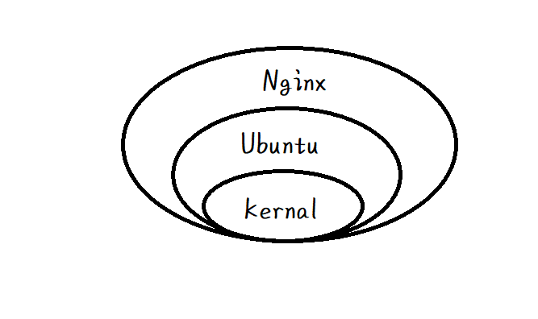

# Docker

> Docker是一个开源的引擎，可以轻松的为任何应用创建一个轻量级的、可移植的、自给自足的容器。开发者在笔记本上编译测试通过的容器可以批量地在生产环境中部署，包括VMs（虚拟机）、 bare metal、OpenStack 集群和其他的基础应用平台。 

<!-- more -->

## 1. Docker 三要素

docker 三要素：镜像，容器，仓库

1. 镜像（Image）

Docker镜像（Image）就是一个只读的模板，镜像可以用来创建Docker容器，一个镜像可以创建很多容器。

2. 容器（Container）

* 容器是使用镜像创建的运行实例。  
* docker利用容器独立运行一个或一组应用。
* 它可以被启动，停止，删除，每个容器都是相互隔离，保证安全的平台。
* 可以把容器看作一个建议的Linux系统

> 镜像可以看作面向对象中的类，容器可以看作类的实例，每个实例都是独立的，拥有类的所有属性和方法，一个类可以实例化多个实例。

3. 仓库（Repository）

集中存放镜像的地方，类比 GitHub，有公开仓库和私有仓库，最大的公开仓库是 Docker Hub,国内有阿里云，网易云等公开仓库。

## 2. Docker的安装

### 2.1 安装 Docker CE

Ubuntu 18.04.3下：

```shell
# step 1: 安装必要的一些系统工具
sudo apt-get update
sudo apt-get -y install apt-transport-https ca-certificates curl software-properties-common

# step 2: 安装GPG证书
curl -fsSL http://mirrors.aliyun.com/docker-ce/linux/ubuntu/gpg | sudo apt-key add -

# step 3: 检查验证密钥是否添加成功
sudo apt-key fingerprint 0EBFCD88
# 如果成功，则显示类似下面：
# pub   rsa4096 2017-02-22 [SCEA]
#      9DC8 5822 9FC7 DD38 854A  E2D8 8D81 803C 0EBF CD88
# uid           [ unknown] Docker Release (CE deb) <docker@docker.com>
# sub   rsa4096 2017-02-22 [S]

# Step 4: 写入软件源信息
sudo add-apt-repository "deb [arch=amd64] http://mirrors.aliyun.com/docker-ce/linux/ubuntu $(lsb_release -cs) stable"

# Step 4: 更新并安装 Docker-CE
sudo apt-get -y update
sudo apt-get -y install docker-ce
```

### 2.2 阿里云镜像加速

先去申请一个加速器地址 [链接](https://cr.console.aliyun.com/cn-hangzhou/instances/mirrors)

然后在下面的 “镜像中心 -> 镜像加速器” 按指示添加，Ubuntu的是：

```shell
sudo mkdir -p /etc/docker
sudo tee /etc/docker/daemon.json <<-'EOF'
{
  "registry-mirrors": ["https://d7gtkri7.mirror.aliyuncs.com"]
}
EOF
sudo systemctl daemon-reload
sudo systemctl restart docker
```

最后使用`docker info`检查一下有没有生效

## 3. HelloWorld

执行 `docker run hello-world`

```txt
root:~# docker run hello-world

Unable to find image 'hello-world:latest' locally
latest: Pulling from library/hello-world
1b930d010525: Pull complete 
Digest: sha256:9572f7cdcee8591948c2963463447a53466950b3fc15a247fcad1917ca215a2f
Status: Downloaded newer image for hello-world:latest

Hello from Docker!
This message shows that your installation appears to be working correctly.

......

```

hello-world 是docker 官方为了方便测试docker是否安装成功提供的镜像，运行这个镜像，首先会在本地找，没找到就回去仓库下载


`hello-world:latest` 后面的latest 是标签名，不写默认的，需要下载其他版本的就该在冒号后面的。

## 4. 原理

* Docker是怎么运行的

Docker是一个 C-S 结构的系统， Docker的守护进程运行在主机上，然后通过 Socket 链接从客户端访问， 守护进程从客户端接受命令并管理运行在主机上的容器。

* 为什么docker比VM块

1. 更少的抽象层，不需要Hypervisor实现硬件虚拟化，运行在Docker上的程序直接使用物理机硬件资源，在CPU，内存利用率上有明显优势
2. Docker直接利用宿主机内核，因此，新建容器时，不需要像VM那样从新加载OS内核。

## 5. 基本命令

* `docker version`： 查看版本号
* `docker info`: 查看docker相关信息
* `docker help`: 查看常用命令帮助

### 5.2 镜像命令

#### 5.2.1 docker images

* 作用：列出本地镜像模板
* 结果说明：
  * REPOSITORY：镜像仓库源
  * TAG：镜像标签
  * CREATED：创建时间
  * SIZE： 镜像大小
  * IMAGE ID: 镜像ID
* 常用参数：
  * -a: 列出本地所有镜像（含中间镜像层）
  * -q: 只显示镜像ID
  * --digests: 显示镜像说明摘要信息
  * --no-trunc: 显示镜像完整信息

#### 5.2.2 docker search 镜像名

作用： 从DockerHub 找某个镜像
参数：
  * -s 30: 列出star数大于30的镜像
  * --no-trunc: 完整信息
  * --automated:只列出自动构建类型的镜像

例：

```shell
docker search nginx
docker search -s 30 nginx
```

#### 5.2.3 docker pull

使用：

```shell
docker pull nginx
docker pull tomcat:3.2
```

* 作用： 拉取镜像

#### 5.2.4 docker rmi

* 作用：删除镜像
* 常用参数：
  * -f: 强制删除

* 使用：后面跟镜像id或唯一镜像名

```shell
docker rmi hello-world
docker rmi -f hello-world

# 删除多个
docker rmi -f hello-world nginx

# 删除全部
docker rmi -f $(docker images -qa)
```

#### 5.2.5 提交镜像

```shell
docker commit -m="提交的描述信息" -a="作者" 容器ID 要创建的目标镜像名:[标签名]
```

作用：提交容器副本，使之成为一个新的镜像

### 5.3 容器命令

> 容器由镜像创建

#### 5.3.1 新建并启动容器

```shell
docker run [OPTIONS] IMAGE [COMMAND] [ARG...]
```

OPTIONS:

* --name="new name": 为容器指定一个新名字
* -d: 后台运行容器，并返回容器ID（启动守护式容器）
* -i: 以交互模式运行容器
* -t: 为容器重新分配一个伪输入终端，通常与 `-i`配合使用
* -P: 随机端口映射
* -p：指定端口映射，有一下四种格式
  1. `ip:hostPort:containerPort`
  2. `ip::containerPort`
  3. `hostPort:containerPort`
  4. `containerPort`
  * hostPort是对外暴露的端口，containerPort是容器内应用端口

  如：

  ```shell
  docker run -it -p 8888:8080 tomcat
  ```

docker容器后台运行，就必须有一个前台进程，所以如果我们以后台运行的方式启动centos，这个容器启动后就会立即自杀。

#### 5.3.2 列出所有运行的容器

```shell
docker ps
```

OPTIONS:

* -a: 列出当前所有正在运行的容器和历史上运行过的容器
* -l: 显示最近创建的容器
* -n: 显示最近创建的n个容器
* -q: 静默模式，只显示容器编号
* --no-trunc: 不截断输出

#### 5.3.3 退出容器

* `exit`: 容器停止并退出
* `ctrl+P+Q`:容器不停止退出

重新进入：

* `docker attach 容器ID`: 进入交互界面
* `docker exec -t 容器ID 操作`：直接去容器中执行操作，返回执行后的结果（不进入交互界面）

eg.

```shell
docker exec -t ls /etc
# 以终端的形式进入
docker exec -it 容器ID /bin/bash
```

#### 5.3.4 启动容器

```shell
docker start 容器ID或容器名
```

#### 5.3.5 重启容器

```shell
docker restart 容器ID或容器名
```

#### 5.3.6 停止容器

```shell
# 温和关闭
docker stop 容器ID或容器名

# 强制停止
docker kill 容器ID或容器名
```

#### 5.3.7 删除已停止的容器

OPTIONS:
  * -f: 强制删除

```shell
docker rm 容器ID

# 删除所有容器
docker rm -f $(docker ps -a -q)
# 或
docker ps -aq | xargs docker rm -f
```

#### 5.3.8 查看日志

```shell
docker logs [-f] [-t] [--tail] 容器ID
```
OPTIONS:
  * -t: 加入时间戳
  * -f: 跟随最新的日志打印
  * --tail 数字 ： 显示最后多少条

#### 5.3.9 查看容器内进行的进程

```shell
docker top 容器ID
```

#### 5.3.10 查看容器内部细节

```shell
docker inspect 容器ID
```

以json形式展现

#### 5.3.11 从容器内拷贝数据到主机

```shell
docker cpoy 容器ID: 容器内路径 主机路径
```

## 6. Docker 镜像

### 6.1 是什么

镜像是一种轻量级，可执行的独立软件包， 用来打包软件运行环境和基于运行环境开发的软件，它包含运行某个软件所需的所有内容，包括代码，运行时，库，环境变量，和配置文件。

#### 6.1.1 UnionFS(联合文件系统)

UnionFS 是一种分层， 轻量级并且高性能的文件系统，**它支持对文件系统的修改作为一次提交来一层层叠加**，同时可以把不同目录挂载在同一虚拟文件系统下，UnionFS是Docker镜像的基础，镜像可以通过分层来进行继承，基于基础镜像，可以制作成各种具体的应用镜像。

特性：一次同时加载多个文件系统，但从外面看起来，只能看到一个文件系统，联合加载会把各层文件系统叠加起来，这样最终的文件系统会包含所有底层的文件和目录。

#### 6.1.2 Docker镜像加载原理

Docker 的镜像实际上是由一层一层的文件系统组成，这种文件系统实际上就是UnionsFS,他主要包括bootfs和rootfs.

* bootfs:boot file system, 包含bootloader(boot加载器)和kernal（内核）,bootloader主要是引导加载kernel,Linux刚启动时会加载bootfs，在Docker镜像的最底层就是bootfs,当boot加载完成后，整个内核就在内存中了，这时候内存使用权就会有bootfs交给内核，系统会卸载bootfs.
* rootfs: 各种OS的发行版，如Ububtu，Centos等。

Docker的镜像其实可以看做一个精简的OS，他之所以小，是因为他只需要包含很小的rootfs就行了，而bootfs各个发行版都是一样的，可以直接公用用物理机的。 

#### 6.1.3 分层的镜像

UnionFS 一次可以加载多个文件系统，但从外面看只是一个文件系统，比如一个Nginx镜像，从外部看只是一个Nginx，但其实包含了运行Nginx的完整的环境。



这就是为什么镜像一般比平时包大。

为什么采用分层镜像？————共享资源

* 多个镜像都是更具相同的base镜像构建而来，那么宿主机只需要在磁盘保存一份base镜像，同时内存中也只需要加载一份base镜像，就可以为所有容器服务了，而且镜像的每一层都可以被共享，这也是为什么一开始装某些镜像时耗时较长，之后便快好多，如果需要的依赖已经存在了，就会公用。

> 镜像都是只读的，只能操作最上面的镜像层。
