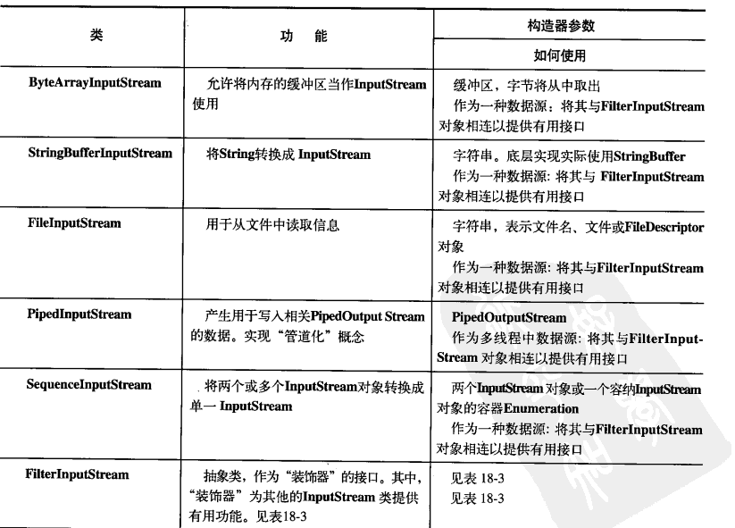
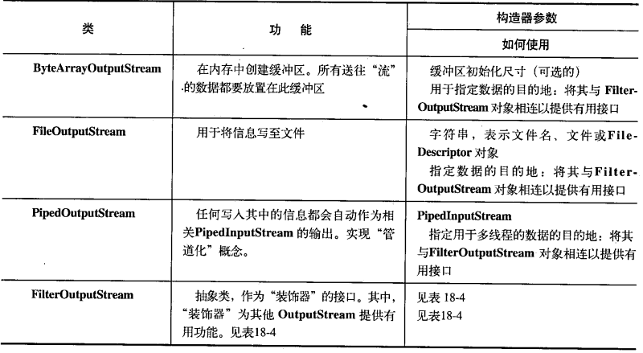
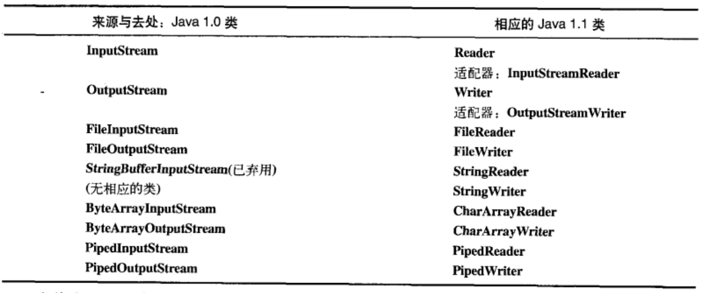

# Java IO系统

## File类

用来处理文件目录，既可以代表一个特定文件的名称，也可以代表一组文件的名称，如果代表的是一个文件组，可以调用`File.list()`方法返回一个字符数组。

`list()`不传递任何参数时返回该目录下所有文件或文件名的字符数组（不会递归遍历目录里面的内容【只返回第一层】）如果想要过滤返回结果，可以传递给它一个`FilenameFilter`对象，该接口只有一个方法accept, 接收一个代表某个特定文件所在目录的File对象 dir 和一个包含了文件名的String name, list会对dir中的每个文件执行accept ,如果accept结果为true, 就把这个name加入list的结果中。

```java
@FunctionalInterface
public interface FilenameFilter {
    boolean accept(File dir, String name);
}
```

```java
public String[] list(FilenameFilter filter) {
    // 策略模式，根据filter是否为null，具有不同的策略
    String names[] = list();
    if ((names == null) || (filter == null)) {
        return names;
    }
    // 内部使用了ArrayList
    List<String> v = new ArrayList<>();
    for (int i = 0 ; i < names.length ; i++) {
        if (filter.accept(this, names[i])) {
            v.add(names[i]);
        }
    }
    return v.toArray(new String[v.size()]);
    }
```

例：

```java
package Note.iosystem;

import java.io.File;
import java.io.FilenameFilter;
import java.util.regex.Pattern;

class DirFilter implements FilenameFilter {
    private Pattern pattern;
    DirFilter (String regex){
        pattern = Pattern.compile(regex);
    }
    @Override
    public boolean accept(File dir, String name) {
        return pattern.matcher(name).matches();
    }
}

public class DirList {
    public static void main(String[] args) {
        File file = new File("./src/Note/iosystem");
        String filter = ".*\\.java";
        String [] filenames = file.list(new DirFilter(filter));
        assert filenames != null;
        for (String filename:filenames
             ) {
            System.out.println(filename);
        }
    }
}
```

使用匿名内部类使得代码更加简洁

```java
package Note.iosystem;

import java.io.File;
import java.io.FilenameFilter;
import java.util.regex.Pattern;

public class DirList2 {
    public static void main(String[] args) {
        File file = new File("./src/Note/iosystem");
        String filter = ".*\\.java";
        String [] filenames = file.list(new FilenameFilter() {
            private Pattern pattern  = Pattern.compile(filter);
            @Override
            public boolean accept(File dir, String name) {
                return pattern.matcher(name).matches();
            }
        });
        assert filenames != null;
        for (String filename:filenames
        ) {
            System.out.println(filename);
        }
    }
}

```

### 其他常用方法

#### 1. 构造方法

> File(String pathname) 通过将给定的路径名字符串转换为抽象路径名来创建新的 File实例。  通过将给定的路径名字符串转换为抽象路径名来创建新的File实例。 如果给定的字符串是空字符串，则结果是空的抽象路径名。

```java
public static void main(String[] args) {
        // Java 中一个 “\” 表示转义开始
        File file = new File("E:\\桌面文件\\JAVA\\src\\demo.txt");
    }
```


> File(String parent, String child) 从父路径名字符串和子路径名字符串创建新的 File实例。 

```java
File file1 = new File("E:\\桌面文件\\JAVA\\src", "demo.txt");
```

第一个参数传入父级路径字符串，第二个参数传入相对父级路径的子路径名


> File(File parent, String child) 从父抽象路径名和子路径名字符串创建新的 File实例。 

```java
File file2 = new File("E:\\桌面文件\\JAVA\\src");
File file3 = new File(file2, "demo.txt");
```

File(URI uri) 通过将给定的 file: URI转换为抽象路径名来创建新的 File实例。 

#### 2 成员方法

##### 2.1 创建

| 成员方法                         | 功能                       | 参数介绍 | 返回值介绍                                   | 异常          | 备注                          |
| -------------------------------- | -------------------------- | -------- | -------------------------------------------- | ------------- | ----------------------------- |
| `public boolean createNewFile()` | 创建文件，如果存在就不创建 | ——       | 创建成功返回true,文件存在或创建失败返回false | `IOException` | 路径不存在抛出IOException异常 |
| `public boolean mkdir()`         | 创建文件夹                 | 无       | 返回是否创建成功                             | `IOException` | 父路径不存在返回false         |
| `public boolean mkdirs()`        | 创建多级目录               | 无       | 返回是否成功                                 | `IOException` | 路径不存在就创建              |

##### 2.2 删除

| 成员方法                  | 功能             | 参数介绍 | 返回值介绍       | 异常 | 备注                                                   |
| ------------------------- | ---------------- | -------- | ---------------- | ---- | ------------------------------------------------------ |
| `public boolean delete()` | 删除文件或文件夹 | 无       | 返回是否删除成功 |      | 1. 文件不存在返回false 2. 删除文件夹时只能删除空文件夹 |

##### 2.3 重命名或移动

| 成员方法                             | 功能       | 参数介绍                        | 返回值介绍         | 异常                                 | 备注 |
| ------------------------------------ | ---------- | ------------------------------- | ------------------ | ------------------------------------ | ---- |
| `public boolean renameTo(File dest)` | 重命名文件 | dest:重命名文件的新的抽象路径名 | 返回是否重命名成功 | 可以使用这个方法实现移动（剪贴）功能 |      |

##### 2.4 判断

| 成员方法                       | 功能                   | 参数介绍 | 返回值介绍     | 异常 | 备注                                                         |
| ------------------------------ | ---------------------- | -------- | -------------- | ---- | ------------------------------------------------------------ |
| `public boolean isDirectory()` | 判断是否是目录         | 无       | 返回是否是目录 |      | 只有是目录且目录存在时返回true                               |
| `public boolean isFile()`      | 判断是否是文件         | 无       | 返回是否是文件 |      |                                                              |
| `public boolean isHidden()`    | 判断是否是隐藏文件     | 无       | ··             |      | UNIX中，以`.`开头的是隐藏文件，而window中，特殊标记过的是隐藏文件 |
| `public boolean exists()`      | 判断文件或目录是否存在 | 无       | 返回是否存在   |      |                                                              |
| `public boolean canWrite()`    | 判断文件是否可写       | 无       | 返回是否可写   |      |                                                              |
| `public boolean canRead()`     | 判断文件是否可读       | 无       | 返回是否可读   |      |                                                              |
| `public boolean isAbsolute()`  | 判断路径是否是绝对路径 | 无       |                |      | 在UNIX系统上，如果前缀为"/" ，路径名是绝对的。 在Windows系统上，前面是盘符或`///`为绝对路径 |

##### 2.5 获取功能
| 成员方法                                           | 功能                               |                           参数介绍                           |         返回值介绍          |    异常     | 备注                                                   |
| -------------------------------------------------- | ---------------------------------- | :----------------------------------------------------------: | :-------------------------: | :---------: | ------------------------------------------------------ |
| `public String getName()`                          | 返回文件或目录名称                 |                              无                              |           String            |             | 这个方法只是对路径字符串的分割操作，不检查路径是否存在 |
| `public String getParent()`                        | 返回文件或文件夹父路径名字符串     |                              无                              |           String            |             | 也只是字符串的分割操作，不检查路径或文件是否真实存在   |
| `public File getParentFile()`                      | 返回文件或文件夹的父路径的File对象 |                              无                              |            File             |             | 内部调用的是getParent()方法                            |
| `public String getPath()`                          | 返回文件路径                       |                              无                              |           String            |             |                                                        |
| `public String getAbsolutePath()`                  | 返回绝对路径                       |                              无                              |           String            |             | 同样不关心文件是否存在                                 |
| `public File getAbsoluteFile()`                    | 返回绝对形式的File对象             |                              无                              |            File             |             |                                                        |
| `public String getCanonicalPath()`                 | 返回文件规范路径名字符串           |                              无                              |           String            | IOException | 先转换成绝对路径，然后删除`.`,`..`等冗余名称等。。     |
| `public File getCanonicalFile()`                   | 返回文件规范路径名的File对象       |                                                              |                             | IOException |                                                        |
| `public long lastModified()`                       | 返回文件上次修改时间               |                              无                              |     Long 返回一个时间戳     |             | 如果文件不存在返回0                                    |
| `public long length()`                             | 返回文件长度                       |                              无                              | Long 文件长度，以字节为单位 |             | 文件不存在返回0                                        |
| `public String[] list([FilenameFilter filter])`    | 返回该目录下所有文件和目录的数组   | 可以传入一个FilenameFilter filter，表示列出满足过滤器的文件或目录名 |                             |             |                                                        |
| `public File[] listFiles([FilenameFilter filter])` | 类似于上面                         |                                                              |                             |             |                                                        |


## 流总览

流对象代表任何有能力产出数据的源对象或任何有能力消费数据的目标对象，Java中IO类分为输入和输出两部分，对应输入流和输出流任何继承自`InputStream`或`Reader`的类都包含基本方法`read()`用来读字节或字节数组（字符）,任何继承自`OutputStream`或`Writer`的类都包含基本方法`write()`用来写字节或字节数组。


> 输入输出是相对于当前程序而言的

### InputStream和OutputStream

Java1.0中，所有输入相关的类都从`InputStream`继承而来，所有输出相关的类都从`OutputStream`继承而来，也就是字节流。

#### InputStream

InputStream用来表示从不同输入源产生输入的类，这些输入源包括：

1. 字节数组
2. String对象
3. 文件
4. 管道
5. 一个由其他种类的流组成的序列，我们可以把它们合并到同一个流里
6. 其他数据源，如Interest连接等

每种数据源都对应一个具体的InputStream的子类



#### OutputStream

他的子类决定了输出要去往的目标，包括：

1. 字节数组
2. 管道
3. 文件



### Reader 和 Writer

Java1.1 中加入了 Reader 和 Writer类，来提供兼容Unicode和面向字符的IO功能，对于数据的来源和去向，字节流中有的字符流差不多都有对应的。

> 因此，最明智的做法是尽量尝试使用Reader和Writer，一旦编译无法通过，我们会发现不得不使用面向字节的类库。
>
> ——《Java编程思想》



## 常用流

### 文件流

FileInputStream，FileOutputStream，FileReader, FileWriter

```java
package Note.iosystem;

import java.io.FileInputStream;
import java.io.FileOutputStream;
import java.io.IOException;

public class CopyFile {

    private String sourcePath, targetPath;
    CopyFile (String source, String target) {
        sourcePath = source;
        targetPath = target;
    }

    public void copy() throws IOException {
        FileInputStream fis = new FileInputStream(this.sourcePath);
        // 构造器第二个参数append传递true表示开启追加写模式
        FileOutputStream fos = new FileOutputStream(this.targetPath, true);
        byte [] bytes = new byte[1024];
        int readResult = 0;
        while(readResult >= 0) {
            // read方法传递一个长度为n的字节数组，每次读取n位， 返回实际读取的位数，读到
            // 文件结束符返回 -1
            readResult  = fis.read(bytes);
            if(readResult > 0) {
                // write方法可以传递一个偏移量和长度，表示写比特数组的0位开始，
                // 长度为readResult的数据
                fos.write(bytes, 0, readResult);
            }
        }
        // 记得要关闭流对象
        fis.close();
        fos.close();
    }

    public static void main(String[] args) throws IOException {
        CopyFile copyFile = new CopyFile("E:\\桌面文件\\媒体\\生而为人.m4a",
                "E:\\桌面文件\\生而为人.m4a");
        copyFile.copy();
    }

}

```

```java
package Note.iosystem;

import java.io.FileNotFoundException;
import java.io.FileReader;
import java.io.FileWriter;
import java.io.IOException;

public class CopyFileByChar {
    private String sourcePath, targetPath;
    CopyFileByChar (String source, String target) {
        sourcePath = source;
        targetPath = target;
    }

    public void copy() throws IOException {
        FileReader fr = new FileReader(this.sourcePath);
        FileWriter fw = new FileWriter(this.targetPath, true);
        int readResult = 0;
        char [] chars = new char[1024];
        while(readResult >= 0) {
            readResult = fr.read(chars);
            if(readResult > 0){
                fw.write(chars, 0, readResult);
            }

        }
        fr.close();
        fw.close();
    }

    public static void main(String[] args) throws IOException {
        CopyFileByChar copyFileByChar = new CopyFileByChar("./src/Note/iosystem/DirList.java",
                "./src/Note/iosystem/DirListCopyByChar.txt");
        copyFileByChar.copy();
    }
}

```

### 缓冲流

BufferedReader, BufferedWriter, BufferedInputStream, BufferedOutputStream

```java
package Note.iosystem;

import java.io.*;

public class BufferDemo {
    private String from, to;
    public BufferDemo(String from, String to) {
        this.from = from;
        this.to = to;
    }

    public void copy() throws IOException {
        BufferedReader bfr = new BufferedReader(new FileReader(this.from));
//        char [] chars = new char[1024];
//        bfr.read(chars);
        BufferedWriter bfw = new BufferedWriter(new FileWriter(this.to));
        String line = bfr.readLine();
        while (line != null) {
            bfw.write(line);
            bfw.newLine();
            line = bfr.readLine();
        }
        bfr.close();
        bfw.close();
    }

    public static void main(String[] args) throws IOException {
        BufferDemo bd = new BufferDemo("./src/Note/iosystem/DirList.java",
                "./src/Note/iosystem/DirListCopyByChar.txt");
        bd.copy();
    }
}

```

### 转化流

InputStreamReader, OutputStreamWriter 允许设置编码方式，将字节流转换为字符流

```java
package Note.iosystem;

import java.io.*;

public class ConversionStream {
    public static void main(String[] args) throws IOException {
        String filePath = "./src/Note/iosystem/DirList.java";
        String filePathGBK = "./src/Note/iosystem/DirListGBK.java";
        InputStreamReader isr = new InputStreamReader(new FileInputStream(filePath));
        OutputStreamWriter osw = new OutputStreamWriter(new FileOutputStream(filePathGBK), "GBK");
        char [] chars = new char[1024];
        int result = isr.read(chars);
        while (result >= 0) {
            osw.write(chars);
            result = isr.read(chars);
        }
        isr.close();
        osw.close();
    }
}
```


### 序列化流

1. 想要将一个对象序列化，必须实现Serializable接口（他是一个标记接口）

2. 反序列化时，对象对应的class文件必须存在，否则抛出ClassNotFoundException

3. 类实现Serializable接口后，Java文件编译成class文件时，会添加一个作为唯一标识的serialVersionUID,这个序列号在序列化时会写入序列化文件，用来在反序列化时判断class文件是否一致， 如果在序列化之后修改了类的定义但没有重新序列化对象，在反序列化时就会抛出InvalidClassException异常，因为修改类定义会重新生产序列号。

   * 可以给定一个确定的序列化来解决这个问题,必须是static final long 的：

     ```java
         private final static long serialVersionUID = 1L;
     ```

4. 用static修饰的属性值不会被序列化（静态属性优先加载），除此之外如果不想序列化某个属性的值，可以使用transient修饰

```java
package Note.iosystem.serialization;

import java.io.Serializable;

public class Person implements Serializable {
    private String name;
    private transient int age;

    @Override
    public String toString() {
        return "Person{" +
                "name='" + name + '\'' +
                ", age=" + age +
                '}';
    }

    public Person(String n, int a) {
        this.age = a;
        this.name = n;
    }
}

```

```java
package Note.iosystem.serialization;

import java.io.*;

public class ObjectOSDemo {
    public static void main(String[] args) throws IOException, ClassNotFoundException {
        String outputPath = "./src/Note/iosystem/objectOutput";
        Person person = new Person("zhangSan", 17);
        ObjectOutputStream oos = new ObjectOutputStream(new FileOutputStream(outputPath));
        oos.writeObject(person);
        oos.close();

        ObjectInputStream ois = new ObjectInputStream(new FileInputStream(outputPath));
        Person p = (Person) ois.readObject();
        System.out.println(p);
        ois.close();
    }
}

```

### 标准IO

System.out, System.err，（前俩个都是PrintStream）System.in

都是字节流


标准IO重定向：

* setIn(InputStream)
* setOut(PrintStream)
* setErr(PrintStream)


```java
package Note.iosystem;

import java.io.*;

public class StandardIO {
    public static void main(String[] args) throws IOException {
        BufferedReader bfr = new BufferedReader(new InputStreamReader(System.in));
        String result = bfr.readLine();

        while (result != null && result.length() > 0) {
            System.setOut(new PrintStream(new FileOutputStream("./src/Note/iosystem/standard.txt", true)));
            System.out.println(result);
            result = bfr.readLine();
        }
    }
}
```

## 新IO

JDK1.4在java.nio.*中引入新的IO类，通过使用**通道**和**缓冲器**的结构来提高IO速度，通道类似于煤矿，缓冲器类似于矿车，程序员只需要与缓冲器交互，并将缓冲器放到通道上，通道要么从缓冲器拿到数据，要么把数据交给缓冲器。唯一直接能与通道交互的缓冲器是**ByteBuffer**,旧的IO类种，FileInputStream, FileOutputStrea,,RandomAccessFile被改造过，可以用来产生通道。

读：

```java
package Note.iosystem.nioDemo;

import java.io.FileInputStream;
import java.io.IOException;
import java.nio.ByteBuffer;
import java.nio.channels.FileChannel;

public class GetChannel {
    public static void main(String[] args) throws IOException {
        String filePath = "./src/Note/iosystem/standard.txt";
        // 创建通道
        FileChannel channel = new FileInputStream(filePath).getChannel();
        // 创建一个缓冲器并为其分配一个新的字节缓冲区
        ByteBuffer buffer = ByteBuffer.allocate(1024);
        channel.read(buffer);
        buffer.flip();
        while(buffer.hasRemaining()) {
            System.out.println(buffer.get());
        }
    }
}
```

