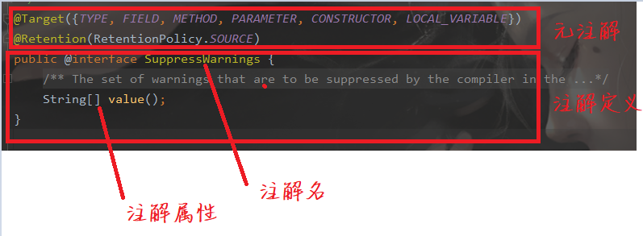

# Java注解

也叫元数据，用来给类，方法或属性添加一个“标记”


## 内置注解

1. ```java
   // 标注该方法是重写父类的方法
   @Override
   ```

2. ```java
   // 标注过期弃用的方法，使用这种方法编译器会发出警告
   @Deprecated
   ```

3. ```Java
   // 让编译器忽略有此标记的方法或类的警告
   @SuppressWarnings("all")
   ```

## 自定义标注



### 注解定义

定义注解的格式：

```java
public @interface 注解名 {
    // 注解属性
}
```

### 注解属性

也叫注解元素，类似于接口中方法的定义，只能包含一下类型，否则编译时就会报错

1. 基本数据类型
2. class
3. String
4. Annotation
5. enum
6. 以上数据类型的数组

```java
package Note.annotation;

enum EnumDemo {
    MAX,
    MIN
}

public @interface AnnDemo {
    int age();
    String name();
    Check check();
    EnumDemo e();
    Class c();
    
    int [] ages();
    String [] names();
    EnumDemo [] ENUMS();
    Class [] classes();
    Check [] checks();
}
```

#### 元素默认值

使用 `default value`设置默认值

```java
public @interface AnnDemo {
    int age() default 18;
}
```


### 元注解

元注解是注解的注解，目的是方便注解的开发。

1. ```java
   // 标注注解作用的位置
   @Targer
   ```

   ```java
   @Documented
   @Retention(RetentionPolicy.RUNTIME)
   @Target(ElementType.ANNOTATION_TYPE)
   public @interface Target {
       ElementType[] value();
   }
   ```
   
   ```java
   public enum ElementType {
       TYPE, // 作用于类，接口，Enum
       FIELD,  // 域声明
       METHOD,  // 作用于方法
       PARAMETER, // 参数声明
       CONSTRUCTOR, // 构造器声明
       LOCAL_VARIABLE,  // 作用于局部变量
       ANNOTATION_TYPE,
       PACKAGE,  // 作用于包
       TYPE_PARAMETER,
       TYPE_USE
   }
   
   ```
   
2. ```java
   //标注在什么级别保存该注解信息
   @Retention
   ```

   ```java
   @Documented
   @Retention(RetentionPolicy.RUNTIME)
   @Target(ElementType.ANNOTATION_TYPE)
   public @interface Retention {
       /**
        * Returns the retention policy.
        * @return the retention policy
        */
       RetentionPolicy value();
   }
   
   public enum RetentionPolicy {
       SOURCE, // 源码级别，将被编译器丢弃
       CLASS,  // 注解在class文件中可用，但会被VM丢弃
       RUNTIME  // 在VM中也保留，因此可以使用反射读取注解信息，一般用这个
   }
   
   ```

   

3. ```java
   // 在DOC文档中保留注解
   @Documented
   ```

4. ```java
   // 子类继承父类注解
   @Inherited
   ```

### 注解的本质

写一个简单的注解，javap反编译

```java
package Note.annotation;

import java.lang.annotation.*;

@Target(ElementType.METHOD)
@Retention(RetentionPolicy.RUNTIME)
public @interface Check {
}

```

```java
// 反编译的结果
Compiled from "Check.java"
public interface Note.annotation.Check extends java.lang.annotation.Annotation {
}

```

注解其实是一个继承自`java.lang.annotation.Annotation`的接口，

### 注解的使用

如果注解定义了元素，并且没给定默认值，需要在使用注解时给明确的值，格式为`key = value`

```java
class Demo2 {

    @AnnDemo(name="liSi", check = @Check, e=EnumDemo.MAX, c=Demo.class, ages = {12, 13}, names = {"1", "2", })
    public void func(){
        System.out.println("hello world");
    }
}
```

如果只定义了一个元素，**并且名字叫value**，使用时可以不指定key

#### 解析注解

步骤：

1. 获取被注解装饰的类，方法，字段的class对象
2. 调用class.getAnnotation(Class)方法获取注解对象

```java
package Note.annotation;

@AnnDemo(name="liSi")
public class Demo2 {


    public static void main(String[] args) throws NoSuchMethodException {
        Class<Demo2> demo2Class = Demo2.class;
        AnnDemo annotation = demo2Class.getAnnotation(AnnDemo.class);
        String name = annotation.name();
        System.out.println(name);
    }
}
```

注解本事是一个接口，解析注解时，会在内存中生成一个实现了注解接口的子类对象，大致如：

```java
public class xxx implements AnnDemo {
    public int age() {
        return 18;
    }
    
    public String name() {
        return "lisi"
    }
}
```

所以我们才能调用他的像name这样的方法。

### 简单的测试框架

```java
package Note.annotation;

        import java.lang.annotation.*;

@Target(ElementType.METHOD)
@Retention(RetentionPolicy.RUNTIME)
public @interface Check {
}

```


```java
package Note.annotation;

import 上课.interfacedemo.D;

import java.io.*;
import java.lang.reflect.InvocationTargetException;
import java.lang.reflect.Method;
import java.text.SimpleDateFormat;
import java.util.Date;

public class MyCheck {

    public static void main(String[] args) throws IOException {
        Demo demo = new Demo();
        int errorNum = 0;
        Class<? extends Demo> aClass = demo.getClass();
        Method[] methods = aClass.getMethods();
        FileWriter fileWriter = new FileWriter("./src/Note/annotation/error.txt", true);
        fileWriter.write("\n" +aClass.getName() + "的测试结果 【" +
                new SimpleDateFormat("yyyy-MM-dd HH:mm:ss").format(new Date()) +" 】 \n");
        fileWriter.write("======================================================================\n");
        for (Method m:methods
             ) {
            if(m.isAnnotationPresent(Check.class)) {
                try {
                    m.invoke(demo);
                } catch (Exception e) {
                    errorNum ++;
                    fileWriter.write(m.getName() + " 发生异常 " + "异常类型为：" + e.getCause().getClass().getSimpleName() + "\n");
                    fileWriter.write("异常原因为：" + e.getCause().getMessage() + "\n");
                    fileWriter.write("----------------------------------------------------------------------------------- \n");
                }
            }
        }
        fileWriter.write("======================================================================\n" +
                "测试结束，共发现" + errorNum + "个异常");
        fileWriter.close();
    }
}

```


```java
package Note.annotation;

@SuppressWarnings("all")
public class Demo {
    @Check
    public void func1() {
        String s = null;
        s.toLowerCase();
    }

    @Check
    public void func2() {
        System.out.println("111");
    }

    @Check
    public void func3() {
        System.out.println(3/0);
    }

    @Check
    public void func4() {
        System.out.println(3 + "2");
    }
}

```


```txt

Note.annotation.Demo的测试结果 【2020-03-31 22:46:29 】 
======================================================================
func1 发生异常 异常类型为：NullPointerException
异常原因为：null
----------------------------------------------------------------------------------- 
func3 发生异常 异常类型为：ArithmeticException
异常原因为：/ by zero
----------------------------------------------------------------------------------- 
======================================================================
测试结束，共发现2个异常
```

