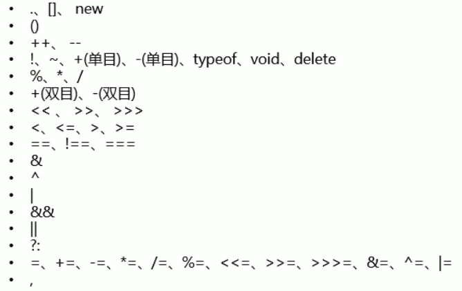

# JS运算符

## 一元运算符

* `+ -`,正负号，对非数值类型做正负操作会先转换成数值型，可以用`+`快速进行类型转换 

## 逻辑运算符

* 且 `&&`，从左到右看，一旦返现值为false的表达式立刻返回false，全真为真
* 或 `||`，从左到右，一旦发现值为true的表达式立刻返回true，全假为假

如果逻辑运算符链接的不是布尔类型，会先转换为布尔类型，运算后返回**原来的值**，如`1&&2`返回2,`1||2`返回1

## 赋值运算符

* 将赋值符右侧的值赋值给左侧变量
* +=，-=，*=，/=

## 关系运算符

比较大小关系，关系成立返回true，不成立返回false,非数值型比较会先转换成数值再比较，但如果两边都是字符串，比较的是unicode编码顺序，中文没意义（康熙词典顺序），两个字符串类型的数字比较会造成不可预计的结果

* `>,<,>=,<=`

## 相等运算符

* `==`和`!=`:非数值型会转换为数值，判断是否相等，`"123"==123`
* `===`和`!==`:全等和不全等，不会转换，类型不相等也不相等

## 三元运算符（条件运算符）

```js
条件表达式 ? 语句1 : 语句2;
```

条件表达式成立执行前面的语句，否则执行后面的语句

```js
// 找出三个数中的最大值
var a=10;
var b=20;
var c=30;
var max = a>b?a>c?:a:c:b>c?b:c;
// var max = a>b?(a>c?:a:c):(b>c?b:c);
```

## 逗号运算符

同时声明多个变量并赋值

## 运算符优先级

