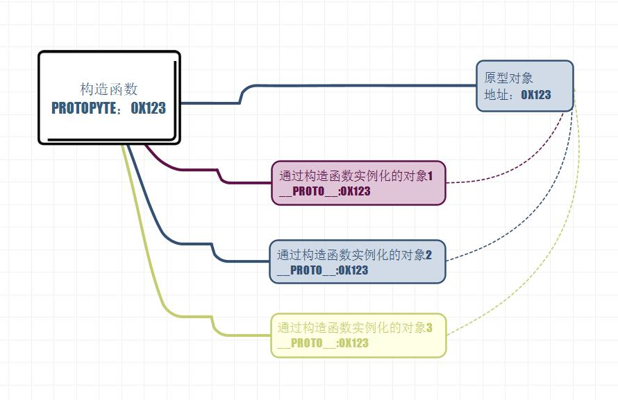

# 原型对象

在构造函数中，同一类相同的方法可以直接写在构造函数里，但这样每实例化一个对象都会产生一个新的该方法，但其实这个方法都是一样的，这样会浪费大量空间，另外，可以将相同的方法写在构造函数外，这样虽然解决了空间浪费问题，但在全局作用域设置变量污染了命名空间，也不安全。这时可以将相同的属性和方法放在原型对象中。

----

* 在JS中，我们所创建的每一个函数，解析器都会为他添加一个prototype属性，这个属性对应一个对象，就是原型对象
* 对于普通函数来说，prototype属性没有任何作用，只有当函数以构造函数的形式调用时，他所创建的对象都会有一个隐藏属性指向原型对象，可以使用`__proto__`访问

```js
function fun(){
  console.log(this);
};

var sun1 = new fun();
console.log(fun.prototype)
console.log(sun1.__proto__)

// 返回 true，说明由fun实例化来的fun1中的__proto__指向fun的原型对象
console.log(fun.prototype == sun1.__proto__)
```



当我们访问一个对象的属性或方法时，会现在自身找，找不到就去原型中找，找不到就去原型的原型中找，直到找到Object，Object是所有对象的原型

```js
function Car(){
  this.type = "car";
  this.print = print;
}

Car.prototype.print = function(){
  console.log(this.name +" : " + this.parse);
}
```

* 可以使用`hasownproperty()`检查自身是否有某个属性