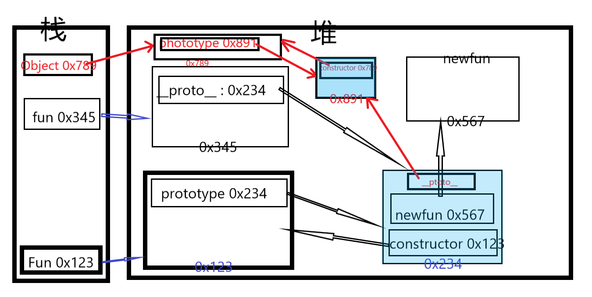
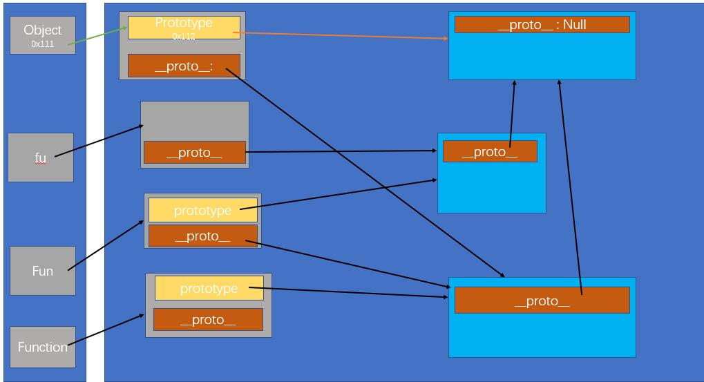

# 原型与原型链

## 原型

* 每一个函数都有一个属性：prototype,默认指向object空对象，就是原型对象,原型对象有一个constructor属性，指向函数对象
* 每一个实例化对象都有一个属性 __proto__ ,默认指向构造函数的原型对象（是构造函数原型对象的一个引用）

```js
 var Fun = function(){
    // console.log("构造函数")
 }

console.log(Fun.prototype.constructor === Fun) // true

 var fu = new Fun()

 console.log(fu.__proto__ === Fun.prototype) //true

 Fun.prototype.newfun = function(){
     console.log("新方法")
 }

 fu.newfun()
```



## 原型链

* 所有函数都是Function的实例，包括Function()自己和Object(),也就是所有函数都有一个__proto__属性，指向Function的显式原型（Function.prototype）
* Object是所有对象的构造函数，寻找对象的属性或方法时，最终会找到Object,Object的隐式原型是Null，如果在Object中还没找到对应的属性或方法，就会为underfind

```js
console.log(Function.prototype)
console.log(Fun instanceof Function) //true
console.log(Object instanceof Function) //true
console.log(Function instanceof Object) // true
console.log(Function instanceof Function) //true

console.log(Object.prototype === Fun.prototype.__proto__) // true
console.log(Object.prototype.__proto__) // null

console.log(Function.prototype === Object.__proto__) // true
console.log(Function.__proto__ === Function.prototype) // true
console.log(Function.prototype.__proto__ === Object.prototype) // true
```



## 总结

* 原型与原型链
  * 原型
    * 显式原型与隐式原型
      * 每一个构造函数都会有一个prototype属性，指向一个Object空对象，就是显式原型
      * 每一个实例化对象都有一个__proto__属性，指向其构造函数的显式原型的值
  * 原型链：查找对象的属性和方法
    * 所有函数都是Function的实例，包括Function自己和Object()`Function.__proto__ === Function.prototype`
    * 所有对象都是由Object实例化而来，
      * 所有对象在寻找某个属性或方法时，最终会找到Object中
      * Object.__proto__ = null
    * Object instanceof Function 为true，而反过来Function instanceof Object 也为true，他们互相是对方的构造函数
