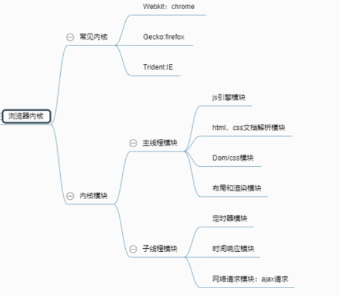

# JS 线程机制与事件机制

首先，JS是但线程的，但它允许多线程，多线程的实现依赖 Web Wokers对象，Worker对象有两个常用的属性，postMessage用来在线程间发送消息，onmessage绑定接受消息的属性

## 浏览器内核

像定时器之类的看似是多线程的，但其实不是，定时器和事件响应（图片写错了）都是基于浏览器内核的，涉及到一个事件循环模型

### 事件循环模型

在事件循环模型中，有一个执行栈，所有的JS代码都在执行栈中被执行，还有一个回调队列，回调函数会根据事件轮询机制依次压入回调队列，再从队列中依次出队进入执行栈执行，以计时器为例，计时器所“计的时”有时是不准确的，这并不是应为计时器本身不准确，当我们计算计时器每次执行的时间时，发现会比我们预设的多一些，如果在代码中执行大量复杂运算时，比如递归函数，大量循环等，计时器每次被调用的时间会大大大于预设时间，这是应为事件轮询机制的原因，时间轮询机制会按照代码顺序依次把回调函数加入回调队列，队首事件执行完毕才会出队再执行下一个回调函数，虽然内核计时器模块每隔设定时间会把新的计时器回调函数压入回调队列，但如果队列中有其他的回调函数没执行完，新的就会阻塞在队列中，造成时间不准确。