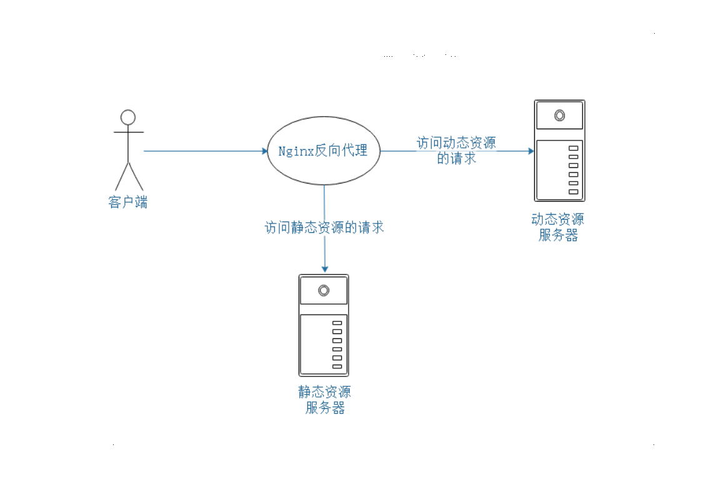

# Nginx

## 1. nginx简介

1. 什么是nginx：

一个高性能的HTTP和反向代理web服务器，同时提供了IMAP/POP能服务

2. 特点：

高性能，高并发（5000个并发），小巧，支持热部署，可以左到7*24小时运行


## 2. 重要概念

### 2.1 反向代理

#### 2.1.1 正向代理

正向代理是位于客户端和目标服务器之间的一个代理服务器，客户端首先**自己选择**要请求代理服务器，代理服务器接受到客户端请求后转发到目标服务器，目标服务器响应代理服务器的请求后，代理服务器再把响应转发给客户端，整个过程，客户端需要自己配置代理服务器，如果代理服务器不公布客户端的话，客户端对目标服务器就是隐藏的。


用途：

1. 为在防火墙内的局域网客户端提供Internet访问
2. 使用缓冲特性减少网络使用率

#### 2.1.2 反向代理

反向代理同样在客户端与目标服务器之间，只不过反向代理不需要客户端自己去配置，客户端本事并感知不到代理的存在，客户端直接发请求给代理服务器，再由代理服务器把请求转发给目标服务器，这样就对客户端隐藏了真实的服务器地址。


对于客户端来说，反向代理服务器就是目标服务器

用途：

1. 出于安全考虑隐藏真实服务器地址，将防火墙后面的服务器提供给internet用户访问
2. 用于负载均衡等

### 2.2 负载均衡

> 负载均衡（Load Balance），意思是将负载（工作任务，访问请求）进行平衡、分摊到多个操作单元（服务器，组件）上进行执行。是解决高性能，单点故障（高可用），扩展性（水平伸缩）的终极解决方案。

也就是把本来到一个服务器的请求分摊到多个服务器上，以减轻单个服务器的压力，提高响应速度的一种办法


### 2.3 动静分离

把动态页面和静态页面交给不同服务器解析的技术



## 3. 安装，命令，配置文件

### 3.1 安装

> 当然可以使用docker一键安装

1. 下载依赖

```txt
pcre
openssl
zlib
nginx
```

都从官网下载最新的版本，然后解压，编译，安装就可以，也可以直接下载

```shell
apt-get install libpcre3 libpcre3-dev
apt-get install openssl
apt-get install zlib1g zlib1g-dev
```

解压 nginx包

```shell
tar -zxvf nginx-1.17.8.tar.gz 
cd nginx-1.17.8.tar.gz 
./configure
```

检查没有错误就编译安装，如果有错误多半是依赖没够，或者依赖版本不对，比如

```txt
/configure: error: the HTTP gzip module requires the zlib library.
You can either disable the module by using --without-http_gzip_module
option, or install the zlib library into the system, or build the zlib library
statically from the source with nginx by using --with-zlib=<path> option.
```

就是zlib 版本太低，从官网下最新的编译安装，重新检查就没问题了

```shell
# 编译安装
make && make install
```

Nginx安装后在`/usr/local/`下面就会有一个nginx文件夹，里面有个`sbin`目录，里面的`nginx`就是启动nginx的脚本。

执行

```shell
/usr/local/nginx/sbin/nginx 
```

就会启动nginx服务。

```shell
root@iZ2ze84p7jmyrzgyid8emvZ:/usr/local/nginx/sbin# ps aux |grep nginx
root     21432  0.0  0.0  16916   380 ?        Ss   14:19   0:00 nginx: master process /usr/local/nginx/sbin/nginx
nobody   21433  0.0  0.1  17352  2244 ?        S    14:19   0:00 nginx: worker process
root     21444  0.0  0.0  14224   920 pts/0    S+   14:22   0:00 grep --color=auto nginx

```

然后在我们本地访问服务器IP也能看到**Welcome to nginx!**

如果进程有了，但远程访问不到，可能是防火墙阻止了80端口（Nginx默认监听80端口）

```shell
# centos7:

# 查看开放的端口
firewall-cmd --list-all
# 添加开放规则
sudo firewall-cmd --add-port=80/tcp --permanent
# 重启防火墙
firewall-cmd -reload
```

### 3.2 常用命令

```shell
# 查看版本号
nginx -v

# 停止nginx
nginx -s stop

# 启动nginx
nginx

# 重新加载nginx(配置文件)
nginx -s reload
```

### 3.3 配置文件

> 位于 `nginx/config/nginx.conf`

```conf
################ 全局块 ################

#user  nobody;
worker_processes  1; # 并发处理的值，值越大，处理并发量越多

#error_log  logs/error.log;
#error_log  logs/error.log  notice;
#error_log  logs/error.log  info;

#pid        logs/nginx.pid;

################# events块 ##############

events {
    worker_connections  1024; # 支持的最大连接数
}

################## HTTP 块 ###############

# ****************** http 全局块 ***********

http {
    include       mime.types;
    default_type  application/octet-stream;

    #log_format  main  '$remote_addr - $remote_user [$time_local] "$request" '
    #                  '$status $body_bytes_sent "$http_referer" '
    #                  '"$http_user_agent" "$http_x_forwarded_for"';

    #access_log  logs/access.log  main;

    sendfile        on;
    #tcp_nopush     on;

    #keepalive_timeout  0;
    keepalive_timeout  65;

    #gzip  on;

# ******************* server 块 **************

    server {

# ------------------- 全局server块 -------------

        listen       80;
        server_name  localhost;

        #charset koi8-r;

        #access_log  logs/host.access.log  main;

# -------------------- location 块 --------------- 

        location / {
            root   html;
            index  index.html index.htm;
        }

        #error_page  404              /404.html;

        # redirect server error pages to the static page /50x.html
        #
        error_page   500 502 503 504  /50x.html;
        location = /50x.html {
            root   html;
        }

        # proxy the PHP scripts to Apache listening on 127.0.0.1:80
        #
        #location ~ \.php$ {
        #    proxy_pass   http://127.0.0.1;
        #}

        # pass the PHP scripts to FastCGI server listening on 127.0.0.1:9000
        #
        #location ~ \.php$ {
        #    root           html;
        #    fastcgi_pass   127.0.0.1:9000;
        #    fastcgi_index  index.php;
        #    fastcgi_param  SCRIPT_FILENAME  /scripts$fastcgi_script_name;
        #    include        fastcgi_params;
        #}

        # deny access to .htaccess files, if Apache's document root
        # concurs with nginx's one
        #
        #location ~ /\.ht {
        #    deny  all;
        #}
    }

}

```

有三部分组成：

1. 全局块：设置一些影响nginx整体运行的配置指令
2. events块：主要影响nginx与用户的网络链接
3. http块：配置最频繁的部分，代理，缓存，日志以及第三方模块配置都在这，包含http全局快和server块
  1. http全局块：文件引入，MIME-TYPE 定义，日志自定义，连接超时时间，单链接请求数上限等。。
  2. server块：与虚拟主机有关，可以有多个，每个server块相当于一个虚拟主机，在用户看来，虚拟主机和独立的硬件主机是一样的。
    * 全局server块
    * location块

## 4. 配置示例

### 4.1. 反向代理

既然是反向代理，就是访问一个服务器地址（proxy），这个服务器把请求转发给另一个服务器（目标服务器），再把目标服务器的响应转发给客户端的过程；  


目标就是访问阿里云的35.106.168.39时得到来自华为云139.9.114.134的响应（139.9.114.134:80 是apathe的服务）

配置文件

```conf
server {
    listen       80;
    server_name  localhost;

    #charset koi8-r;

    #access_log  logs/host.access.log  main;

    location / {
        root   html;
        proxy_pass http://139.9.114.134;
        index  index.html index.htm;
    }
```

仅仅只需要在location块中加上`proxy_pass http://139.9.114.134;`就可以了，整个server块配置的意思就是监听本地80端口，把所有发到该端口的请求转发给`proxy_pass`指向的**URL**（这里是URL，不是IP:端口）

> 如果云服务器上只有80端口起作用，别的端口可以被监听，但外网无法访问，那多半是防火墙问题，我按网上的办法用`ufw`添加了访问规则也不行，最后去云服务器控制面板添加了规则才生效。

#### 根据不同路径转发

```conf
# 可以有多个 server
server {
    listen       8000;
    server_name  localhost;

    location ~ /Blog/ {
        proxy_pass http://139.9.114.134;
    }

    location ~ /Baidu/ {
        proxy_pass http://www.baidu.com;
    }
}
```

这样如果我们访问的URI是`35.106.168.39/Blog/index.html`就会转发到`http://139.9.114.134`,如果访问的是`35.106.168.39/Baidu/index.html`就会转发到百度

#### 参数

* listen： 监听的端口号
* server_name：虚拟主机，端口，localhost，正则
* location: 用于匹配URL，可用正则

1. `=` ：用于不含正则表达式的 uri 前，要求请求字符串与 uri 严格匹配，如果匹配成功，就停止继续向下搜索并立即处理该请求。

2. `~`：用于表示 uri 包含正则表达式，并且区分大小写。

3. `~*`：用于表示 uri 包含正则表达式，并且不区分大小写。

4. `^~`：用于不含正则表达式的 uri 前，要求 Nginx 服务器找到标识 uri 和请求字符串匹配度最高的 location 后，立即使用此 location 处理请求，而不再使用 location 块中的正则 uri 和请求字符串做匹配。

　　注意：如果 uri 包含正则表达式，则必须要有 ~ 或者 ~* 标识。

### 4.2. 负载均衡

#### 4.2.1 配置

```conf

http {
    include       mime.types;
    default_type  application/octet-stream;
    sendfile        on;
    keepalive_timeout  65;
    
	upstream blogserver {
        server 39.106.168.39:8025;
        server 139.9.117.134:8024;
}

    server {
        listen       8001;
        server_name  localhost;

        location / {
            proxy_pass http://blogserver;
        }    
    }
}

```

#### 4.2.2 分配策略

1. 轮询（默认）：每个请求按时间顺序逐一分配到不同服务器，如果某个服务器宕机，就自动剔除  
2. weight（权重策略）， 在服务后面加上权重weight，权重越高，分配到的几率越大
```conf
upstream myserver {
    server 192.168.6.8:8001 weight 10;
    server 192.168.6.9:8002 weight 5;
}
```
3. ip_hash: 每个请求按照访问IP的hash结果分配，每个访客固定一个后端服务器，这样可以解决session问题

```conf
upstream myserver {
    ip_hash;
    server 192.168.6.8:8001;
    server 192.168.6.9:8002;
}
```
4. fair(第三方方式)：按后端服务器的响应时间分配，响应时间短的优先分配
```conf
upstream myserver {
    server 192.168.6.8:8001;
    server 192.168.6.9:8002;
    fair;
}
```

### 4.3. 动静分离

## nginx配置高可用集群

## nginx原理