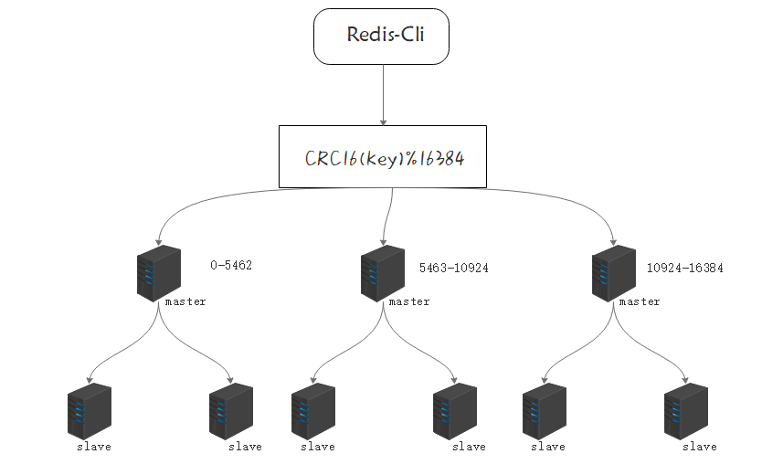

# Redis集群

为什么需要集群

* 提高可用性。有了哨兵后，可以实现部分高可用，但故障转移需要较长的时间，这段时间里Redis服务对外表现为崩溃状态，会造成大量数据丢失，使用集群可以减少丢失的数据的数量【不可能做到100%高可用】
* 减轻服务器的压力。在单机主从模式下，写操作由master一人提供，并且master和slave需要储存所有数据，如果数据量特别大，会导致服务器内存溢出，服务效率也会大幅降低，集群模式下数据按key的Hash结果分别存在不同的节点，可以减轻服务器储存压力。

<!-- more -->

## 什么是集群



* 槽：在Redis集群中，数据存储以槽为单位，总共有16384个槽，这16384个槽会被分配给不同的master，并不是平均分配，也不一定是连续的，比如master1可能分配到500个槽，这500个槽的编号有可能是0~100，700~1100；具体给给个master分配多少个槽可以自己设定

### 集群中数据如何存储

假如现在要执行`set name zhangsan`把name存入Redis，在集群模式下，会先通过CRC16算法将key转换为数字，然后对16384取余，就可以求出这个key应该放在哪个槽中，如某个key通过CRC16转换后的值为6688，$6688\% 16384 = 6688$ 那这个key就会被放在6688号槽中，这个槽在第二个master，所以只有第二个master会存储这个数据。

## 搭建集群

### 配置文件

与集群相关的常用配置

1. 启动集群模式的开关

   ```conf
   cluster-enabled yes
   ```

2. 判断故障的超时时间,响应时间超过这个配置，认为该节点故障

   ```
   cluster-node-timeout 15000
   ```

3. 将此项配置为no后，如果发现负责某个槽的master故障并且没有slave做故障转移时，集群其他节点仍可用

   ```
   cluster-require-full-coverage yes
   ```

   

### 搭建集群

先将Redis服务都启动了，然后

### 快速扩容

### 缩容


