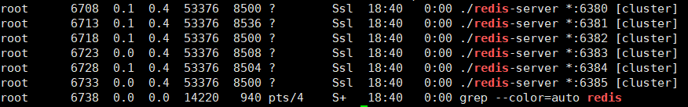
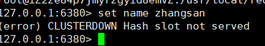
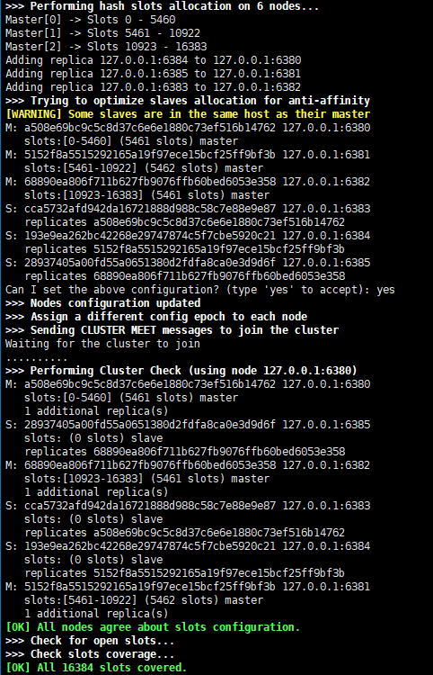
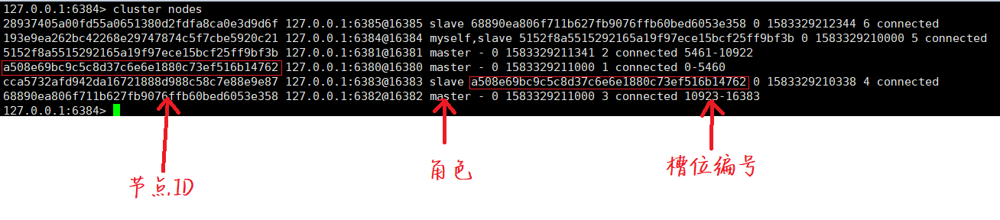
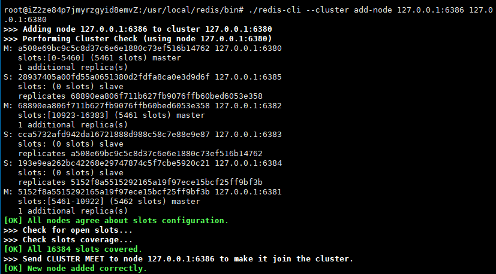
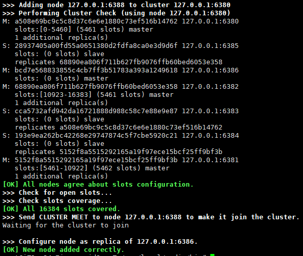
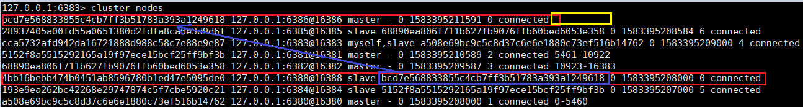

# Redis集群

为什么需要集群

* 提高可用性。有了哨兵后，可以实现部分高可用，但故障转移需要较长的时间，这段时间里Redis服务对外表现为崩溃状态，会造成大量数据丢失，使用集群可以减少丢失的数据的数量【不可能做到100%高可用】
* 减轻服务器的压力。在单机主从模式下，写操作由master一人提供，并且master和slave需要储存所有数据，如果数据量特别大，会导致服务器内存溢出，服务效率也会大幅降低，集群模式下数据按key的Hash结果分别存在不同的节点，可以减轻服务器储存压力。

<!-- more -->

## 什么是集群


* 槽：在Redis集群中，数据存储以槽为单位，总共有16384个槽，这16384个槽会被分配给不同的master，并不是平均分配，也不一定是连续的，比如master1可能分配到500个槽，这500个槽的编号有可能是0~100，700~1100；具体给给个master分配多少个槽可以自己设定

### 集群中数据如何存储

假如现在要执行`set name zhangsan`把name存入Redis，在集群模式下，会先通过CRC16算法将key转换为数字，然后对16384取余，就可以求出这个key应该放在哪个槽中，如某个key通过CRC16转换后的值为6688，$6688\% 16384 = 6688$ 那这个key就会被放在6688号槽中，这个槽在第二个master，所以只有第二个master会存储这个数据。

## 搭建集群

### 配置文件

与集群相关的常用配置

1. 启动集群模式的开关

   ```conf
   cluster-enabled yes
   ```

2. 判断故障的超时时间,响应时间超过这个配置，认为该节点故障

   ```
   cluster-node-timeout 15000
   ```

3. 将此项配置为no后，如果发现负责某个槽的master故障并且没有slave做故障转移时，集群其他节点仍可用

   ```
   cluster-require-full-coverage yes
   ```

   

### 搭建集群

先将Redis服务都启动，当`cluster-enabled`配置为yes时，查看进程的时候就会发现进程是以`[cluster]`形式启动的



这时由于还没有分配槽，redis服务是不能使用的。



使用cluster工具可以自动构建集群

```
Cluster Manager Commands:
  create         host1:port1 ... hostN:portN
                 --cluster-replicas <arg>
```

这个命令会一次性指配槽位和分配主从,参数作用是：
* `host1:port1`按顺序列出集群中主机的IP和端口
* ` --cluster-replicas`: 主从配置比例，如1表示一个主机带一个从机，2表示1个主机带两个从机
* 槽位和主从的分配
  * 槽位默认平均分配
  * 根据主从配置比例，前面的是主机，后面的是从机，如主从比例为1时，前三个（6380， 6381， 6382）是主机，后三个（6383，6384，6385）是从机主从关系一一对应

例：

```
./redis-cli --cluster create 127.0.0.1:6380 127.0.0.1:6381 127.0.0.1:6382 127.0.0.1:6383 127.0.0.1:6384 127.0.0.1:6385 --cluster-replicas 1
```

结果：



在客户端使用下面的命令可以查看节点信息：

```
cluster nodes
```



> 登录客户端时，如果不使用`-c`参数，那由于所操作的key也许不对应这个节点，可能会导致和上面一样操作失败，如果使用`-c`参数，客户端就会以集群方式登录，如果key不对应这个节点，会自动转移节点。
>
> `-c`是redis-cli专有的功能，如果使用Java等方式登录redis，key的CRC16结果如果与该节点槽位不匹配，会抛出异常。

### 容错能力

1. 主节点挂了

   集群不依赖哨兵，但有和哨兵相同的功能，当master挂了后，也会选举出新的slave作为master

2. 整个节点挂了

   如果master挂了，并且没有slave来担当新master，那就说这个节点整个挂了，这时候本应该要存储或存储在这个节点的槽位中的数据就会丢失，但相对于主从复制的模式，如果集群中有$n$个节点，那某个数据属于这个故障节点的概率就是$\frac{1}{n}$,数据丢失的概率是主从复制模式的$\frac{1}{n}$倍，这就是为什么集群只能做到$99.9\%$的容错的原因。

### 快速扩容

扩容就是快速往已存在的集群里加入新的节点，使用的命令事`add-node`

```
  add-node   new_host:new_port existing_host:existing_port
                 --cluster-slave
                 --cluster-master-id <arg>
```

* `new_host:new_port`: 要新加入的节点的id合端口
* `existing_host:existing_port`: 已存在的节点id合端口（任意一个都行）
* `--cluster-slave`: 如果节点要以slave的形式加入，需要指定这个合下一项
* `--cluster-master-id`: 指定slave的master，master_id通过`cluster nodes`在客户端查看

例：

* 以master形式加入（默认）

  ```
   ./redis-cli --cluster add-node 127.0.0.1:6386 127.0.0.1:6380
  ```

  

* 以slave方式加入

  ```
  ./redis-cli --cluster add-node 127.0.0.1:6388 127.0.0.1:6380 --cluster-slave --cluster-master-id bcd7e568833855c4cb7ff3b51783a393a1249618
  ```

  

> 新节点添加后，不会自动分配槽位
>
> 


### 缩容


