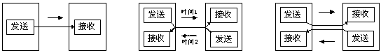

### 1.数据链路的作用
  数据链路，是指OSI参考模型中的数据链路层，有时也指以太网，无线局域网等通信手段  
  数据链路层的协议定义了通过通信媒介互联的设备之间传输的规范。  
  众所周知，计算机以二进制 0 1 来表示信息，然而，实际的通信媒介之间处理的却是电压的高低，光的闪灭，电波的强弱等信号，物理层的责任是把这些信号与二进制的 0 1 进行转换，而数据链路层处理的数据也不是单纯的 0 1 序列，而是把他们集合为一个叫 “帧” 的块，然后再进行传输。
  * 数据链路的段：数据链路的段是指一个被分割的网络，根据使用者不同，其含义也不同
  * 网络拓扑：网络的连接和构成形态，包括总线型，环线型，环形，星型，网状型，混合型
### 2. 数据链路相关技术
#### 2.1 MAC地址
1. 作用：识别数据链路中互联的节点
2. 使用规范：在以太网或FDDI中，根据IEEE802.3的规范使用MAC地址，其他诸如LAN（局域网）蓝牙等设备中也是使用相同规格的MAC地址。
3. MAC地址结构：MAC地址长48比特，结构如图所示
   
   |1|2|3~24|25~48|
   |-|-|----|-----|
   |  | |厂商识别码(OUI)|厂商内识别码|

   第一位：0（单播地址）/1（多播地址）
   第二位：0（全局地址）/1（本地地址）
   第3~24位：厂商识别码，有IEEE管理并保证各厂家之间不重复
   第25~48位：厂商内识别码，由厂商管理并保证各产品间不重复
**注意：** MAC地址并不是一定唯一的，比如，可以在微机板上自己设定MAC地址，或者启动虚拟机时，MAC地址由虚拟软件自己设定

#### 2.2 共享介质型网络
从通信介质的使用方法上看，网络可以分为共享介质型和非共享介质型两种  
1. 定义：共享介质型网络是由多个设备共享一个通信介质的一种网络，如早期的以太网和FDDI等 ，多采用半双工通信方式
2. 介质访问控制方式：争用方式，令牌传递方式
##### 2.2.1 争用方式(CSMA)
争用方式是指争夺获取数据传输的权力  这种方法通常令网络中的各个站采用先到先得的方法，占用信道发送数据，如果多个站同时发送帧，则会发生冲突现象，因此会导致网络拥堵与性能下降。  

后来，采用了改良CSMA的一种方式：CSMA/CD ，CSMA/CD要求每个站提前检查冲突，一旦发生冲突，尽快释放信道，具体工作原理如下：
  * 如果载波信道上没有数据流动，则任何站都可以发送数据
  * 检查是否会发生冲突，一旦发生冲突，发送一个阻塞报文后停止发送数据，同时，立即释放载波信道。
  * 随机延时一段时间，再重新争用载波信道
  
##### 2.2.2 令牌传递方式
令牌传递方式是沿着令牌环发送一种叫做“令牌”的特殊报文，只有获得令牌的站才能发送数据  

特点：不会有冲突，每个站有平等的获得令牌的机会

#### 2.3 非共享介质网络
非共享介质网络是指不共享介质，是对介质采取专用的一种传输控制方式。  
在这种方式下，网络中的每个站直连交换机，有交换机负责转发数据帧，发送端与接收端不共享通信介质，因此，多采用全双工通信方式。
* 优点：不会发生冲突，无需CSMA/CD机制即可实现更高效的通信，还可以更具交换机的高级特性构建VLAN等
* 缺点： 交换机一旦发生故障，与之相连的所有计算机间就无法通信。

* 单工，半双工与全双工通信
  1.单工数据传输只支持数据在一个方向上传输；在同一时间只有一方能接受或发送信息，不能实现双向通信，举例：电视，广播。
  2.半双工数据传输允许数据在两个方向上传输,但是,在某一时刻,只允许数据在一个方向上传输,它实际上是一种切换方向的单工通信；在同一时间只可以有一方接受或发送信息，可以实现双向通信。举例：对讲机。
  3.全双工数据通信允许数据同时在两个方向上传输,因此,全双工通信是两个单工通信方式的结合,它要求发送设备和接收设备都有独立的接收和发送能力；在同一时间可以同时接受和发送信息，实现双向通信，举例：电话通信。
  
#### 2.4 根据MAC地址转发
* 以太网交换机
* 转发表
  以太网交换机就是持有多个端口的网桥，它们根据数据链路层中的每个帧的目标MAC地址，决定从那个网络接口发送数据，这时所参考的用以记录发送接口的表叫做转发表。
* 自学过程
  转发表的内容不需要使用者手工在终端或交换机上设置，而是可以自动生成，数据链路层的每个通过点在接到包时，会从中将源MAC地址和曾经接受由该地址发送的数据包的接口作为对应关系记录到转发表中，这一过程叫做自学过程
  
  由于MAC地址没有层次性，设备数量增加时，转发表也会随之变大，检索转发表所用的时间也越来越长，当连接多个终端时，有必要将网络分成多个数据链路，采用类似于网络层的IP地址一样对地址进行分层管理。
#### 2.5 环路检测技术
通过网桥连接网络时，一旦出现环路，在最坏的情况下，数据帧会在回路中被一次次转发，最终导致网络瘫痪。解决办法有两个，生成树和源路由法
##### 2.5.1 生成树方法
由IEEE802.1D定义，每个网桥必须在1~10s内交换BPDU包，从而判断哪些端口使用，哪些端口不用，以消除环路，一旦发生故障，则自动切换通信线路，利用那些没有被使用的端口继续进行传输。

例如，以某一个网桥为根构造生成树，根据权重确定优先使用哪些端口
##### 2.5.2 源路由法
由IBM提出，以解决令牌环网络问题，该方式可以判断发送数据的源地址是通过那个网桥实现传输的，并将帧写入RIF，网桥则根据这个RIF信息发送帧给目标地址，因此，即便网桥中出现了环路，数据帧也不会被反复转发，这种机制中，发送端必须具备源路由功能。
#### 2.6 VLAN
>来源：百度百科
>VLAN（Virtual Local Area Network）的中文名为"虚拟局域网"。
虚拟局域网（VLAN）是一组逻辑上的设备和用户，这些设备和用户并不受物理位置的限制，可以根据功能、部门及应用等因素将它们组织起来，相互之间的通信就好像它们在同一个网段中一样，由此得名虚拟局域网。VLAN是一种比较新的技术，工作在OSI参考模型的第2层和第3层，一个VLAN就是一个广播域，VLAN之间的通信是通过第3层的路由器来完成的。与传统的局域网技术相比较，VLAN技术更加灵活，它具有以下优点： 网络设备的移动、添加和修改的管理开销减少；可以控制广播活动；可提高网络的安全性。
在计算机网络中，一个二层网络可以被划分为多个不同的广播域，一个广播域对应了一个特定的用户组，默认情况下这些不同的广播域是相互隔离的。不同的广播域之间想要通信，需要通过一个或多个路由器。这样的一个广播域就称为VLAN。