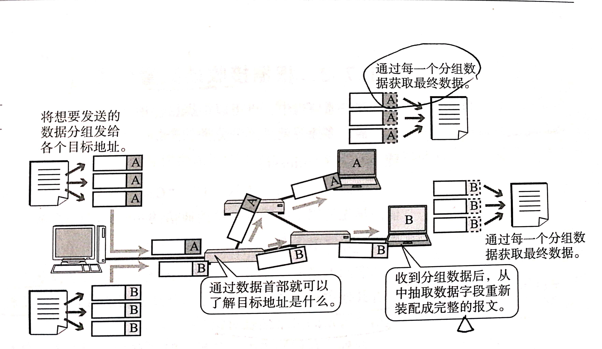
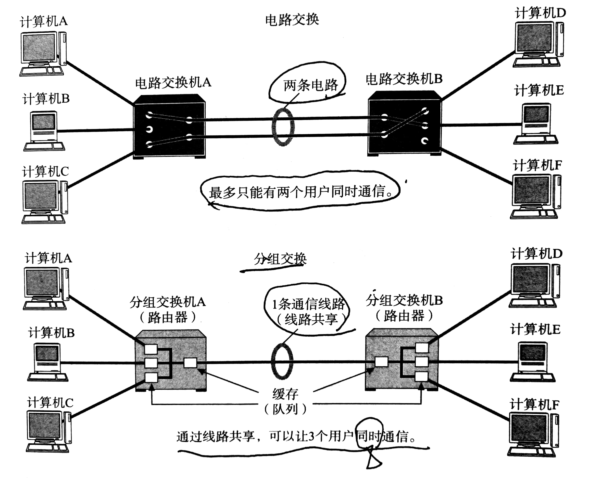
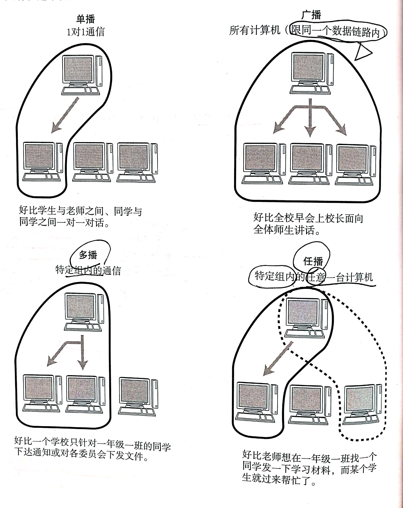

网络与通信中可以根据其数据发送方法进行多种分类
<!--more-->
#### 1.面向有连接型与面向无连接型
面向无连接型包括以太网，IP，UDP等协议，面向有连接型包括ATM，帧中继，TCP等协议  
##### 1.1 面向有连接型
面向有连接型在通讯传输之前，会先打开一个连接，连接被关闭时无法发送数据，在这种情况下，发送端的数据不一定要分组发送
##### 1.2 面向无连接型
面向无连接型不要求建立和断开连接，发送端可在任何时候自由发送数据，反之，接收端也不知道自己会在何时收到何地的信息，因此需要时常确认是否收到数据
#### 2.电路交换与分组交换
目前，网络通信方式大致分为两种，即电路交换和分组交换，电路交换较分组交换更加古老，主要用在电话网中。
##### 2.1 电路交换

在电路交换中，交换机只要负责数据的中转处理，计算机首先被连接到交换机上，交换机 与交换机之间又有众多的通信线路连接，因此，计算机之间发送数据时，需要通过交换机与目标主机建立通信电路，连接电路的过程称为建立连接，建立好连接后，用户可以一直使用这条电路，直到电路被断开，但是，每两台计算机都用一条线路连接显然是不肯能的，一条线路往往连接多个计算机，由于在传输数据时，一台计算机的收发信息会独占整个电路，其他计算机只能等待这台计算机发送结束后再发送，且无法预测某一个计算机的收发从何时开始结束，当并发用户数超过交换机间通信线路数，通信就无法实现。
##### 2.2 分组交换
为了解决电路交换的问题，人们发明了分组交换，他是把连接到通信电路的计算机所要发送的数据分成多个数据包，按照一定的顺序排列后再发送，由于在数据包首部写入了发送端和接收端地址，可以明确区分目的地。

* 过程：
  1. 发送端将数据分组发送给路由器
  2. 路由器收到分组数据后，缓存到自己的缓冲区（队列）
  3. 路由器将数据转发给目标计算机（先进先出）
* 注意：
  1. 在分组交换中，计算机与路由器之间，路由器与路由器之间通常只有一条通信线路，这是一条共享线路
  2. 电路交换中，计算机之间传输速度不变
  3. 分组交换中，速度会根据网络拥堵情况改变
  4. 分组交换中，路由器缓冲饱和或溢出时，会发生数据丢失，无法发送的情况
##### 2.3 电路交换与分组交换的特点

#### 3. 根据接收端数量分类
在网络通信中，根据目标地址的个数及其后续行为可分为单播，广播，多播，任播等
* 单播：一对一的通信，如固定电话
* 广播：从一台主机发送给与之相连的所有主机，如电视播放
* 多播：类似广播，也是讲消息发送给多个主机，只不过可以限定接收端，例如电视会议
* 任播：任播通信从目标主机群中选择一台最符合网络条件的主机作为目标主机发送消息，通常被选中的那台主机会返回一个单播信号，随后，发送端主机会只与这台主机进行通信，例如DNS根域名解析服务器。

