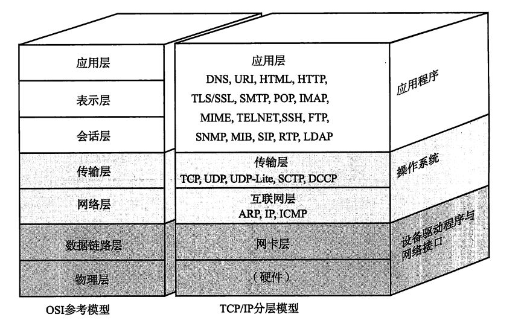
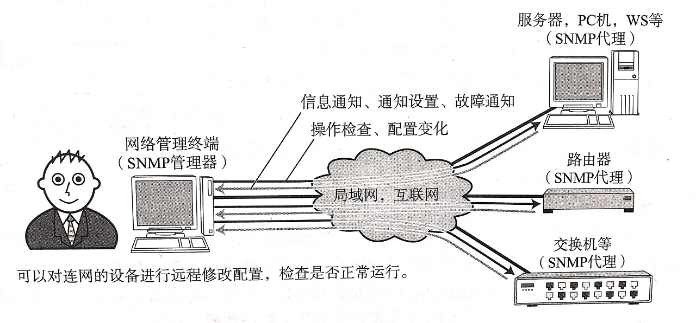
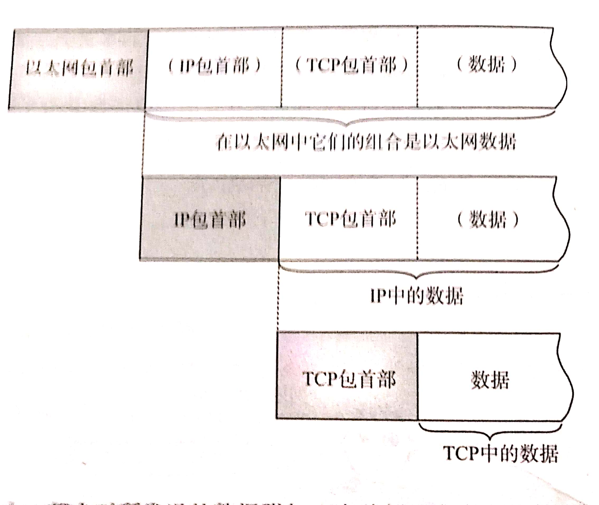
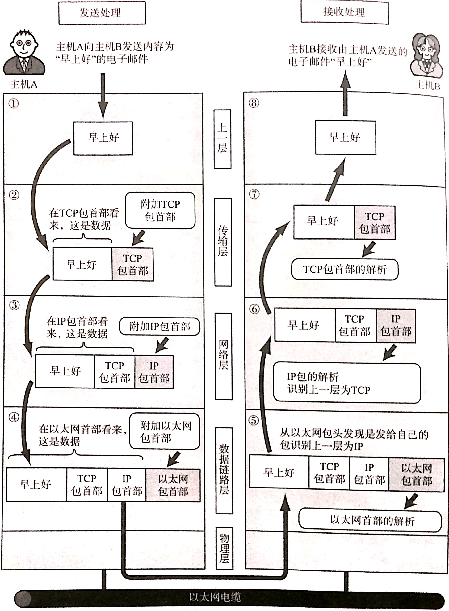
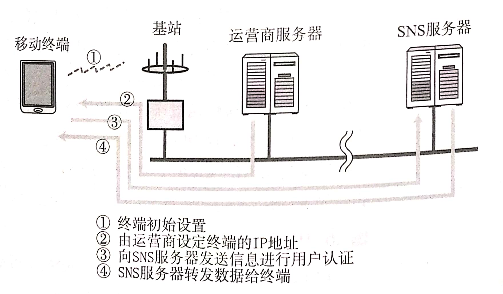

TCP/IP协议分层模型在一定角度上也参考了OSI模型，但OSI参考模型更加注重与“通信协议必要的功能是什么”，而TCP/IP则更强调“在计算机上实现协议应该开发哪种程序”
<!--more-->
#### 1.TCP/IP协议分层模型

##### 1.1  硬件（物理层）
TCP/IP的最底层是负责数据传输的硬件，相当于以太网或电话线等物理层的设备，他的内容一直无法统一定义，因为只要人们在物理层面上使用的传输媒介不同，网络的带宽，安全性，可靠性，延迟都会有所不同，而在这些方面又没有一个指定的指标，总之，TCP/IP是在网络互联的设备之间能够通信的前提下才被提出来的协议。
##### 1.2 网络接口层（数据链路层）
> 网络接口层利用以太网中的数据链路层进行通信，因此属于接口层。也就是说，把它当做让NIC起作用的“驱动程序”也无妨。驱动程序是在操作系统与硬件之间起桥梁作用的软件。计算机的外围附加设备或扩展卡，不是直接插到电脑上或电脑的扩展槽上就能马上使用的，还需要有相应驱动程序的支持。例如换了一个新的NIC网卡，不仅需要硬件，还需要软件才能真正投人使用。因此，人们常常还需要在操作系统的基础上安装些驱动软件以便使用这些附加硬件。

##### 1.3 互联网层
互联网层使用IP协议，它相当于OSI模型中的网络层，IP协议基于IP地址转发分包数据。  
TCP/IP分层中的互联网层与传输层的功能通常由操作系统提供，尤其是路由器，他必须实现通过互联网转发分组数据包的功能。  
此外，连接互联网的所有主机跟路由器必须都实现IP的功能。
* IP：
  IP是跨越网络传输数据包，使得整个互联网都能收到数据的协议
* ICMP
  如果IP数据包在传输过程中发生异常而无法到达目标地址时，需要给发送端返回一个错误信息，ICMP就是为此制定的，它也用来诊断网络健康状况。
* ARP
  用来从数据包的IP地址中解析出MAC地址

##### 1.4 传输层
传输层最主要的功能就是让应用程序之间实现通信，计算机内部通常在同一时间运行着多个程序，识别应用程序通过端口号完成。
* TCP
  TCP是一种面向**有连接**的传输层协议，他可以保证两端通信主机之间的通信可达，TCP可以处理传输过程中的丢包，传输顺序错乱等异常情况，此外，它还可以有效利用带宽，缓解网络拥堵。
  然而为了建立和断开连接，它有时至少需要七次收包和发包，会造成网络流量的浪费，并且TCP协议中规定了各种各样复杂的规范，因此不利于在视频会议等场合使用。
* UDP
  UDP是一种面向**有连接**的传输层协议，他不关心接收端是否真的收到了传过去的数据，反正盘就得了，要想检测接收端是否收到分组数据包，或者对端是否连接到网络，需要在应用程序中完成。  
  UDP常用于分组数据较少，或多播广播通信以及视频通信等媒体领域。

##### 1.5 应用层
TCP/IP的分层中，把OSI参考模型的会话层，表示层，应用层的功能都集中在应用程序中实现，TCP/IP应用的架构绝大多数属于客户端，服务的模型，在这种通信模式下，提供服务的程序会被预先部署到主机上，等待任何时刻客户可能发出的请求。  
客户端可以随时发送请求给服务端，有时服务端可能会有处理异常，超出负载等情况，这时客户端可以在稍等片刻后重新发出请求，如果整个服务器或服务器容器宕掉，就只能等充分恢复后才能处理客户端请求。 
* WWW：万维网，WWW是互联网如此普及的一个重要推力，用户在Web浏览器上借助鼠标键盘就可以自由冲浪，浏览器与服务端之间通信所用的协议是HTTP协议，所传输数据的主要格式是HTML，WWW中的HTTP属于OSI应用层的协议，而HTML属于表示层的协议。
* 电子邮件（E-Mail）：发送电子邮件所用到的协议叫做SMTP，最初只能发送文本格式的电子邮件，但后来有MIME协议（用来定义邮件数据格式的一种规范）拓展后，就可以发送各种各样的媒体信息了。
* 文件传输（FTP）：文件传输所用的协议叫做FTP协议，在FTP中进行文件传输时会建立两个TCP连接，分别是发出传输请求时所要用到的控制连接和传输数据时所要用到的数据连接。
* 远程登录（TELNET和SSH）：远程登录是指登陆到远程计算机上，使那台计算机得以运行的一种功能，TCP/IP中远程登录常用TELNET和SSH两种协议，也有其他的协议诸如BSD UNIX系中rlogin的r命令协议以及 X Window System 中的 X 协议。
* 网络管理（SNMP）
 
 在TCP/IP进行网络管理时，采用SNMP协议，使用SNMP管理的主机网桥，路由器等叫做SNMP代理(Agent)，而进行管理的那一段叫做管理器(Manager)，SNMP正是这个Agent和Manager所要用到的协议。  
 在SNMP的代理端，保存着网络接口的信息，通信数据量，异常数据量以及设备温度等信息，这些信息可以通过MIB（一种可透过网络的结构遍量）访问，因此， 在TCP/IP的网络管理中，SNMP属于应用协议，MIB属于表示层协议。  
 一个网络范围越大，结构越复杂，就越需要对其进行有效的管理，而SNMP可以让管理员及时检查网络拥堵情况，及时发现故障，也可以为以后扩大网络收集必要信息。

#### 2. TCP/IP分层模型通信示例

##### 2.1 数据包首部

每个分层中，都会对所要发送的数据附加一个首部，在这个首部中，包含了该层必要的信息，如要发送的目标地址以及协议相关信息等等，通常，为协议提供的信息为首部，所要发送的内容为数据，在下一层的角度看，从上一分层收到的包全部被认为是本层的数据.  
>**包，帧，数据报，段，消息**
都是用来表述数据的单位，包是全能性术语，帧用来表示数据链路层中包的单位，数据报是 IP 和 UDP 等网络层以上的分层中包的单位，段表示TCP数据流中的信息，消息是应用协议中数据的单位。

##### 2.2 发送数据包
以发送邮件为例，一封电子邮件从发送到接收到会经历哪些步骤呢
###### 2.2.1 应用程序处理
启动电子邮件应用程序填好一系列收件人，主题，内容后点击发送，就可以开始TCP/IP通信了。  
应用在发送邮件的那一刻建立TCP连接，从而利用这个TCP连接发送数据，他首先将应用数据发送给下一层TCP，在做实际的转发处理。
###### 2.2.2 TCP模块处理
TCP根据应用的指示，负责建立连接，发送数据和断开连接，TCP提供将应用层发来的数据安全传送到对端的可靠传输。  
TCP模块处理时会在应用层发来的数据前面加一个TCP首部，这个首部中包括源端口号和目标端口号，以及效验和，随后将附加了TCP首部的包发送给IP。
###### 2.2.3 IP模块处理
IP将TCP传过来的TCP首部和TCP数据整合起来作为自己的数据，并在TCP首部的前端附加上自己的IP首部，IP首部中包含发送端IP地址和接收端IP地址。   
IP包生成后，参考路由控制表决定接受此IP包的路由或主机，随后，IP包会被发送给连接这些路由器或主机接口的驱动程序，实现真正发送数据。
###### 2.2.4 网络接口（以太网驱动）的处理
从IP传过来的数据经过以太网驱动加上以太网首部并发送，通过物理层传输给接收端，以太网首部中包括发送端MAC地址，接收端MAC地址，以及标志以太网类型的以太网数据协议。

##### 2.3 经过数据链路的包
分组数据包流动时，从前往后依次被附加了以太网包首部，IP包首部，TCP（UDP）包首部，以及应用自己的包首部和数据，而包的尾部则追加了以太网包尾。  
每个包首部至少包含两个信息，一个是发送端和接收端地址（以太网用MAC地址，IP用IP地址，TCP/UDP用端口号），另一个是上一层的协议类型。  

##### 2.4 数据包接受处理
从上图可以看出，数据包接受处理与数据包发送处理是一个互逆的过程。发送是在依次加包，接受就是依次解包。
###### 2.4.1 网络接口（以太网驱动）的处理
主机收到以太网包后，从以太网包中找到MAC地址，并判断是否是发给自己的包，如果不是就丢弃。如果是就查找以太网包中的类型域以此来判断传输过来的数据类型，比如是IP包，就传给处理IP的子程序，如果不能识别协议类型，就丢弃数据。
###### 2.4.2 IP模块处理
IP模块收到IP包时，会做相同的处理，先判断是不是给自己的包，在判断数据类型，如果是TCP，就把IP包之后的数据传给TCP处理，如果是UDP，就传给UDP处理。  
对于有路由器的情况，接收端地址往往不是自己的地址，此时，需要借助路由控制表，在调查要送达的主机和路由器后再转发数据。
###### 2.4.3 TCP模块处理
TCP模块中，首先会计算效验和，判断数据是否被破坏，然后检查是否在按照顺序接收数据，最后检查端口号，确定具体的应用程序  
数据接受完毕后，接收端会发送一个 “确认回执” 给发送端，如果这个回执未能到达发送端，那么发送端就会认为数据未达到接收端而一直发送。
###### 2.4.4 应用程序处理
接收端应用程序收到最终数据后，会解析数据编码，实现邮件发送。
##### 2.5 SNS中的通信示例
>SNS (Social Network Service)， 中文叫社交网络，是一种即时共享,即时发布消息给圈内特定联系人的一种服务。如前面电子邮件中通信过程的描述一样,也可以分析用移动终端发送或接收SNS消息的过程。首先，由于移动电话、智能手机、平板电脑等在进行分组数据的通信,因此在它们装入电池开机的那一刻,已经由通信运营商设定了具体的IP地址.启动移动电话中的应用程序时，会连接指定的服务器，经过用户名、密码验证以后服务器上积累的信息就会发送到手机终端上，并由该终端显示具体内容。
>
>类似地，通过SNS轻轻一点就能够运行各种工具，发送文本动画等，迅都基于互联网的TCP/IP应用，因此，在排查这此应用的问题时,TCP/IP的知识是必不可少的。

