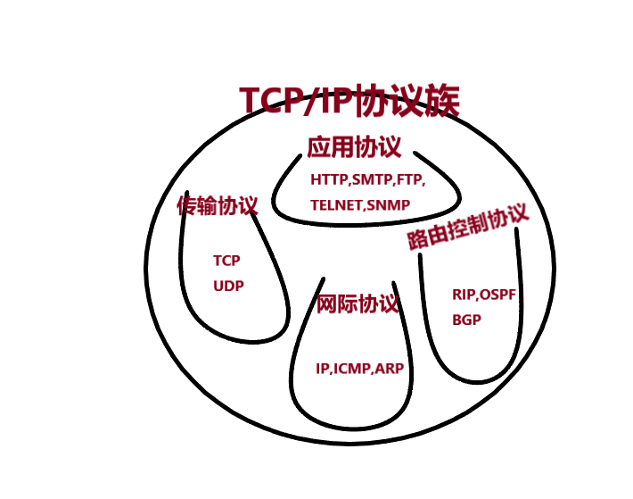
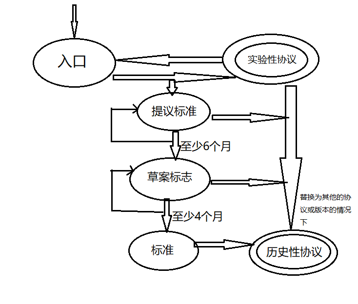
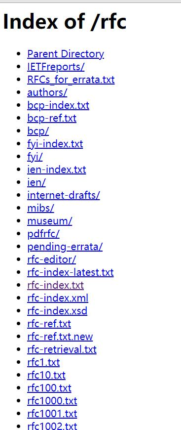

###　1.TCP/IP的出现
TCP/IP协议的出现，首先源于20世纪60年代的军用技术，以美国国防部为中心的组织希望在通信过程中，即便中心节点受到敌方攻击，也可以通过迂回线路实现最终通信，为此，诞生了分组交换技术。为了验证分组交换技术的实用性，研究人员搭建了一套网络，最初只连接了美国西海岸的大学和研究所的四个节点，之后，越来越多的用户加入其中，使之发展成了一个庞大的计算机网络，该网络被称为**ARPANET**,他是全球互联网的鼻祖，他充分证明了基于分组交换技术的通信方法的可行性。   
20世纪70年代，ARPANET的一个研究机构研发出了TCP/IP，到1982年，TCP/IP的具体规范被最终确定，1983年，TCP/IP成为ARPANET的唯一指定协议。  再后来，ARPANET中的大学开始使用ＢＳＤ　ＵＮＩＸ系统，UNIX的普及，同时 SUN公司开始向普通用户提高TCP/IP的产品，ＵＮＩＸ工作站以及ＴＣＰ／ＩＰ构建网络的飞速发展，促进了互联网的诞生
### 2.TCP/IP的标准化
之前说过，ISO制定的OSI协议没有被广泛使用，但TCP/IP协议却成为主流，究其原因，就是由于在TCP/IP协议标准化的过程中制定了其他协议所没有的要求
#### 2.1 TCP/IP协议的具体含义
TCP/IP协议并不是单纯的TCP或IP两种协议，他是利用IP进行通信时所必须用到的协议群的统称，具体来说，IP或ICMP，TCP或UDP，TELNET或FTP，以及HTTP都属于TCP/IP协议的范畴，他们与TCP或IP的关系紧密，是互联网必不可少的一部分，TCP/IP泛指这些协议，所以有时也叫网际协议族。

#### 2.2 TCP/IP标准化精髓
TCP/IP标准化过程中的两大特点：**开放性**，**实用性**  
#### 2.3 TCP/IP规范——RFC
RFC，Request For Comment,字面意思就是意见征求表，TCP/IP协议由IETF制定，那些需要标准化的协议，被人们列入RFC文档并在互联网上公布，RFC不仅记录了协议规范内容，还包含了协议的实现和运用的相关信息，以及实验方面的信息。 
> RFC文档通过编号组织每个协议的标准化请求。例如IP协议的规范由RFC279制定，TCP协议的规范由RFC793号文档决定。RFC的编码是既定的，一旦成为某RFC的内容， 就不能再对其进行随意修改。 若要扩展已有某个协议规范的内容，一定要有一个全新编号的RFC文档对其进行记录。若要修改已有某个协议规范内容，则需要重新发行一个新的RFC文档，同时，老的那份RFC作废。新的RFC文档会明确规定是扩展了哪个已有的RFC以及要作麦哪个已有RFC。此时， 有人提出每当对RFC进行修改时都要产生新的RFC编号太麻烦。为此，人们采用STD (Standardy)方式管理编号，STD用来记载哪个编号制定哪个协议。因此，同一个协议的规范内容钾便发生了变化也不会导致SID编号发生变化，
> 
>今后， 即使协议规范的内容改变也不会改变STD编号，但是有可能导致某个STD下的RFC编号视情况有所增减.  
>
>此外，为了向互联网用户和管理者提供更有益的信息。与STD 类似，PYI(For Your nomafon)也开始标注编号组织。FYI为了人们方便检索，也在其每个编号里涵盖了所涉及的RFC编号。即使更新内容， 编号也不会发生变化。
>
>STD1记录着所有要求协议标准化的RFC状态。到2012 年1月为止，STD1相当于RFC5000 (很多情况下会采用比较容易记忆的编号)

#### 2.4 TCP/IP标准化流程

#### 2.5 RFC的获取方法

[https://www.rfc-editor.org/rfc/](http://rfc-editor.org/rfc/)

[ftp://ftp.rfc-editor.org/in-notes/](ftp://ftp.rfc-editor.org/in-notes/)

```
如何获取STD或FYI以及ID

      STD、FYI、 ID (I-D: Intemet Draft) 号可以从以下网站获取。关于它们的概览也分别记录在std-index. txt、 fyi-index. txt 等文件中。因此可以先从这些网站搜索对应的编号。

STD 获取网址

      http: //www. rfc editor.org/in-notes/std/
      
FYI获取网址

      http: //www. rfc-editor. org/in-notes/ fyi /
      
ID获取网址

      http: //www. rfc-editor. org/internet -drafts/
      
JPNIC的fp服务器中的目录:。STD获取网址

      ftp: //ftp.nic.ad. jp/rfc/std/
      
PYI获取网址

      ftp: //ftp.nic. ad. jp/rfc/fyi/

ID获取网址

      ftp: //ftp. nic. ad. jp/ internet-drafts/
```
### 3.互联网
互联网一词家喻户晓，那什么是互联网呢
#### 3.1 定义
互联网是由 ARPANET 发展而来，互联全世界的计算机网络，
#### 3.2 互联网与TCP/IP的关系
互联网进行通信时，需要相应的网络协议，TCP/IP原本就是为使用互联网而开发设计的协议族，因此，互联网的协议就是TCP/IP，TCP/IP就是互联网的协议
#### 3.3 互联网的结构
互联网由骨干网和末端网组成，每个网络之间根据NOC连接，如果网络运行商不同，网络连接方式和使用方法也不同，连接这种异构网络需要IX的支持，总之，互联网就是由众多异构型网络通过IX连接而成的巨型网络。
* NOC：网络操作中心
* IX：网络交换中心
#### 3.4 ISP与区域网
ISP：网络服务提供商，连接互联网需要向ISP或区域网提出申请，公司企业申请入网只需要联系ISP签约即可，不同ISP所提供的互联网接入服务的项目也不同，
区域网：是指在特点区域内，由团体或志愿者运营的网络，