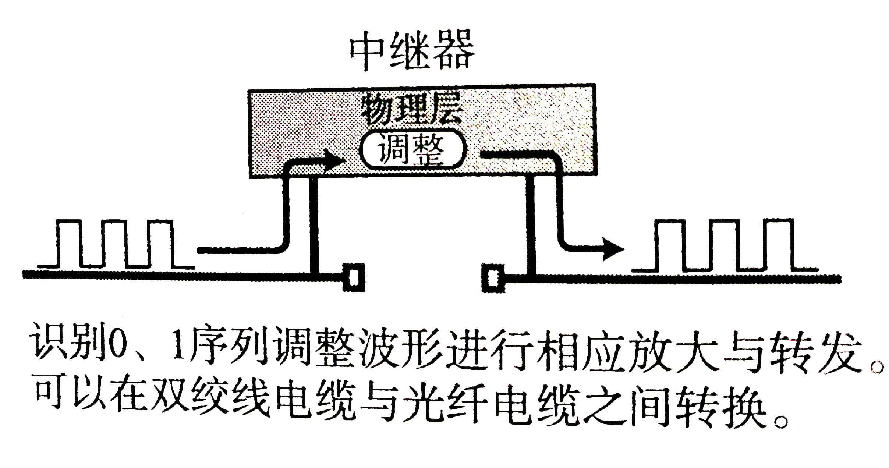
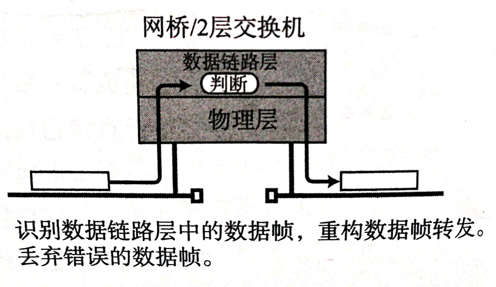
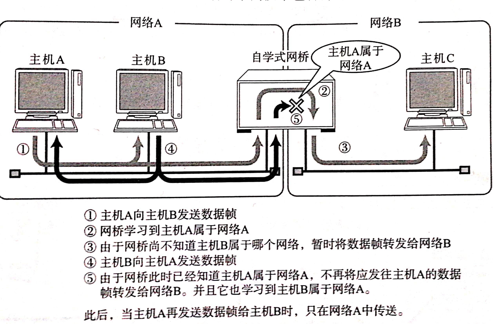
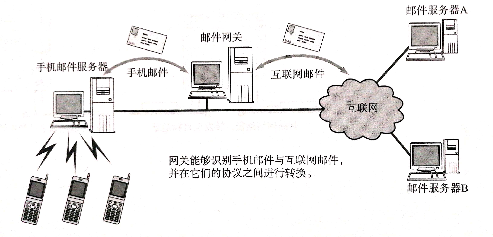
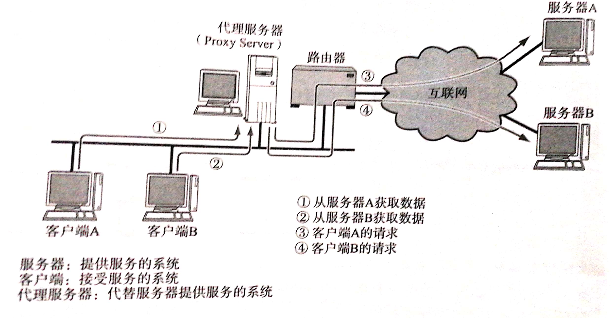

#### 1.地址
通信传输中，发送端和接收端可以看作通信主体，他们可以由一个称为“地址”的信息标志出来，在网络通信中，每一层协议所使用的协议都不尽相同，例如，在TCP/IP中，使用MAC地址，IP地址，端口号等信息作为地址标志，而在应用层中，电子邮件地址也可以作为通信地址,地址具有唯一性，层次性的特点。
<!--more-->
##### 1.1地址的唯一性
地址的唯一性很好理解，地址要能够发挥作用，必须保证一个主体对应一个地址，但是在多播，广播，任播通信中，一个发送端对应多个接收端，这时多个接收端可以看作一个整体对应唯一的地址
##### 1.2地址的层次性
由于地址的唯一性，地址总数会越来越多，如何在众多地址中高效的找出目标地址就是地址的层次性要解决的问题，层次性在许多地方都有应用，例如学号，车牌，电话号等等，以学号为例，比如一个学号由入学年份，院系，班级，ID构成，要查找17070650的信息，只需要在17年入学的，07院06班中查找50号即可，可大大提高效率。
* **注意：** MAC地址和IP地址在标志一个通信主体时虽然都具有唯一性，但只有IP地址具有层次性
* **MAC：** MAC地址是由设备的制造厂商针对每块网卡进行分别指定，人们可以通过制造商识别号，制造商内部产品编号，以及产品通用编号确保地址的唯一性，但是由于每个网卡不确定被用在了哪个产品上，所以尽管制造商号，产品编号看似有层次，但对找寻地址没有什么帮助，正英如此，虽然MAC地址是最终的通信地址，但在实际寻址过程中，IP地址是必不可少的。
* **IP地址：** IP地址有主机号和网络号两部分组成，若主机号不同，网络号相同，则说明他们处于同一网段，通常，同一网段的主机都属于同一部门和集团组织，因此，寻址比较方便。
* 网络传输中，每个节点会根据分组数据的节点信息，来判断报文应该由哪个网卡发送出去，为此，每个地址会参考一个发出地址列表，MAC所参考的叫地址转发表，地址转发表根据自学自动生成，IP寻址所参考的叫路由控制表，路由控制表由路由控制协议自动生成。MAC地址转发表中记录的是真实的MAC地址，而路由表中记录的IP地址则是集中了之后的网络号与子网掩码
#### 2.网络的构成要素

|设备|作用|
|----|----|
|网卡|使计算机联网的设备|
|中继器|从物理层上延长网络的设备|
|网桥/二层交换机|从数据链路层上延长网络的设备|
|路由器/三层交换机|通过网络层转发分组数据的设备|
|4-7层交换机|处理传输层以上网络传输的设备|
|网关|转换协议的设备|

##### 2.1 通信媒介与数据链路
1. 计算机网络：计算机与计算机相连而组成的网络
2. 数据链路：相互直连的设备之间进行通信所涉及的协议及其网络

|数据链路名|以太网|无线|ATM|FDDI|帧中继|ISDN|
|----|-----------|---|----|---|-----|----|
|通信媒介|同轴，双绞线，光纤电缆|电磁波|双绞线，光纤|双绞线光纤|双绞线，光纤|双绞线，光纤|
|传输速率|根据媒介不同，10Mbps~100Gbps|几个Mbps|25Mbps,155Mbps,622Mbps|64k~1.5Mbps|64k~1.5Mbps|
|用途|LAN|LAN~WAN|LAN~WAN|LAN~WAN|WAN|WAN|

* 传输速率：两个设备间数据流动的物理速度，单位每秒比特数（bps）各种传输介质中，传输速率是恒定的（应为光和电流的速度恒定）
* 吞吐量：主机之间实际传输速率，单位bps，吞吐量不仅衡量带宽，还衡量CPU处理能力，网络拥堵情况，报文中数据字段的占有份额等信息
##### 2.2 网卡
网卡，全称网络接口卡，也称网络适配器，LAN卡，现在几乎所有计算机都有“内置LAN端口”的参数，说明出场设置中就具备了以太网1000BASE-T或100BASE-TX端口，可以接入以太网，没有配置NIC的计算机要想接入以太网，需要一个外置拓展槽来插入NIC
##### 2.3 中继器
中继器是在物理层上延长网络的设备，他是把由电缆传递过来的电信号或光信号通过调整波形和放大后传递给另一个电缆，一般情况下，中继器两端连接的是相同的介质，但有的中继器也可以实现不同信号的转换，这种转换只是0 1比特流之间的替换，不负责判断错误，同时，也不能在不同传输速率的媒介之间转发（需要网桥或路由器之类的设备）
* 有的中继器提供多端口服务，这样的中继器叫做集线器

##### 2.4 网桥/二层交换机
网桥是数据链路层上连接两个网络的设备，他能够识别数据链路层中的数据帧，并将这些数据帧临时储存于内存，并重新生成信号作为一个全新的数据帧转发给相连的另一网段，由于能够存储这些数据帧，网桥能够连接两个传输速率完全不同的数据链路，并且不限制连接网段的个数。  

>数据链路的数据帧中有一个数据位叫做FCS,用以校验数据是否正确送达目的地。 网桥通过检查这个域中的值,将那些损坏的数据丢弃,从而避免发送给其他的网段。 此外, 网桥还能通过地址自学机制和过滤功能控制网络流量。
这里所说的地址是指 MAC地址、硬件地址,物理地址以及适配器地址,也就是网络上针对NIC分配的具体地址。 如图所示, 主机A与主机B之间进行通信时, 只针对主机A发送数据帧即可。 网桥会根据地址自学机制来判断是否需要转发数据帧。
这类功能是OSI参考模型的第2层(数据链路层)所具有的功能。为此,有时也把网桥称作2层交换机 (L2 交换机)。
有些网桥能够判断是否将数据报文转发给相邻的网段, 这种网桥被称作自学式网桥。 这类网桥会记住曾经通过自己转发的所有数据帧的MAC地址, 并保存到自己里的内存表中。 由此,可以判断哪个网段中包含持有哪类 MAC地址的设备。

##### 2.5 路由器
路由器是在网络层上连接两个网络，并对分支报文转发的设备，网桥是根据物理地址（MAC）进行处理，而路由器是根据IP地址进行处理的，路由器可以连接两个不同的数据链路，还具有分担网络符合，某些路由器还具有网络安全的功能。
##### 2.6 4-7层交换机
4-7层交换机负责处理从传输层到应用层的数据。
>例如，对于并发访问量非常大的一个企业级Web站点，使用一台服务器不足以满足前端的访问需求，这时通常会架设多台服务器来分担。这些服务器前端访问的人口地址通常只有一个(企业为了使用者的方便，只会向最终用户开放-个统一的访问URL)。 为了能通过同一个URL将前端访问分发到后台多个服务器上，可以在这些服务器的前端加一个负载均衡器。这种负载均衡器就是4-7层交换机的一种
>
>此外，实际通信当中，人们希望在网络比较拥堵的时候，优先处理像语音这放缓处理像邮件或数据转发等稍有延迟也并无大碍的通信请求。这种处理被称为带宽控制，也是4-7层交换机的重要功能之一。
>
>除此之外，4~7层交换机的应用场景还有很多。例如广域网加速器、特殊应用访问加速以及防火墙(可以防止互联网上的非法访问)等。

##### 2.7 网关
网关是负责将从传输层到应用层的数据进行转换和转发的设备，他与4-7层交换机一样是处理传输层及以上的数据，但网关不仅转发数据，还负责对数据进行转换，他通常会使用一个表示层或应用层网关，在两个不能够直接通信的协议之间进行翻译，最终实现两者之间的通信。
>一个非常典型的例子就是互联网邮件与手机邮件之间的转换服务。手机邮件有时可能会与互联网邮件互不兼容，这是由于它们在表示层和应用层中的”电子邮件协议”互不相同所导致的。
>
>那么，为什么连到互联网的电脑与手机之间能够互发电子邮件呢?如图所示，互联网与手机之间设置了一道网关。网关负责读取完各种不同的协议后，对它们逐进行合理的转换，再将相应的数据转发出去。这样一来即使应用的是不同电子邮件的协议，计算机与手机之间也能互相发送邮件。

此外，在使用WWW时，为了控制流量或者为了出于安全考虑，会使用代理服务器，他也是网关的一种，称为应用网关，有了代理服务器，客户端与服务器之间无需再网络层上建立联系，而是从传输层到应用层对数据和访问进行各种控制和处理，防火墙就是一款通过网关通信，针对不同应用提高安全性的产品。

