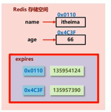
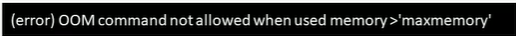

# 删除策略

那些有效期到了的数据，Redis并不是真的一到期立刻就把它删了，因为删除数据相比于其他客户端命令并不那么重要，这些数据会暂留在内存中，最终根据Redis的删除策略删除

<!-- more-->

好的删除策略应该是尽量寻找内存占用和CPU占用之间的平衡点，而不是单纯确保过期数据被删除，顾此失彼会造成Redis整体性能的下降，引起服务器宕机或内存泄露。

Redis 有三种删除策略：

* 定时删除
* 惰性删除
* 定期删除

## 时效性数据的存储结构



对于时效性的数据，Redis在存储时，会以Hash的方式在expires中存储这些数据的地址和过期时间，那么在进行删除时，redis只会操作expires，把已经过期的时间戳对于的地址的内容删除。


## 定时删除

* 创建一个定时器，当定时器的时间到expires中的过期时间时，这个key就会被立即删除

  * 优点：过期数据会被尽快删除，节约内存
  * 缺点：一旦到定时器的时间，CPU必须立刻执行删除，CPU压力大，影响吞吐率，是一种拿处理器性能换存储空间的做法【时间换空间】

## 惰性删除

下次访问时才真正删除，所有的获取数据的操作都需要经过`expirelNeeded()`函数，该函数就是检查数据有没有过期，过期就删除，没过期才返回

* 优点：节约CPU性能
* 缺点：内存占用量大，拿存储空间换CPU性能【空间换时间】

## 定期删除

这是一种比较折中的方案。Redis启动服务器初始化时，会先读取配置`server.hz`的值，这个值默认为10。Redis 每秒钟执行`server.hz`次`serverCron()`， `serveCron()`会调用`databasesCron()`来对Redis的每一个数据库进行轮询，在对单个数据库轮询时，又会调用`activeExpireCycle()`,`activeExpireCycle()`会对当前数据库的expires中随机挑选W个Key进行检测，如果Key超时了，就删除，如果删除的Key的数量 $> W*25\%$ 就循环该过程【继续从这个数据库中随机选W个Key检查】否则就去检查下一个库的expires

* `activeExpireCycle()`每次只执行$\frac{250ms}{serve.hz}$,如果检测过程中这个时间到期了，他也会停止检测，并把当前正在检测的数据库索引记录在`current_db`中，下一次轮询时，就从上次停下的库开始，保证每个库被轮询的几率是相同的。

> W 的取值取决于配置文件中ACTIVE_EXPIRE_CYCLE_LOOKUPS_PER_LOOP的值

特点：

1. CPU性能占用设有峰值，检测额度可自定义设置
2. 内存压力不是很大，长时间占用内存的过期数据会被持续清理

# 逐出算法

当新数据进入Redis中时，内存不足怎么办？

* 当Redis存储数据时，会先调用`freeMemoryIfNeeded()`检查内存是否充足，如果内存不满足储存新数据所需要的最小内存，Redis会临时删除一批数据为当前指令清理储存空间，清理储存空间的策略叫**逐出算法**

* 逐出算法并不能100%清理出足够的空间，如果是这种情况，他会反复执行，当对所有数据尝试完毕后，如果剩余内存还达不到要求，就会报错

  


## 逐出算法相关配置

* 最大可使用内存

  ```
  maxmemory
  ```

  配置占用物理内存的比率，默认为0表示不受限制，生产环境通常设置为50%以上，根据需求设定

* 每次选取待删除数据的个数

  ```
  maxmemory-samples
  ```

  选取要删除的数据时并不会全库扫描，因为这样会导致严重的性能消耗，降低读写性能；因此Redis采用随机获取数据的方式作为待检测删除的数据

* 删除策略

  ```
  maxmemory-policy
  ```

  配置选出来后因该删除什么样的数据？【有8种逐出策略】

## 逐出策略

### 1. 针对易丢失数据

易丢失数据也就是设置了过期时间的数据，反正你迟早要过期，那早过期晚过期只是时间问题，有四种具体策略

1. volatile-lru：挑选最近最少未使用的淘汰
2. volatile-lfu：挑选最近使用最少的淘汰
3. volatile-ttl：挑选最将要过期的数据淘汰
4. volatile-random：随机淘汰

### 2. 针对全库数据

不针对易丢失数据，而是看全部数据库里谁更应该被删除，有三种具体策略

1. allkeys-lru：最近最少未使用
2. allkeys-lfu: 最近使用最少
3. allkeys-random：随机淘汰

### 3. 放弃数据逐出

禁用逐出策略【Redis 4.0默认的方式】，这样容易引起OOM


> LRU 和 LFU
>
> * LRU可以用在诸如微博的场景，一条微博在某一段时间可能非常火爆，他的使用次数就会非常高，如果这种场景下由于这条微博的使用次数可能是最高的，基于LFU他就永远不会被淘汰，但事实是过了那段时间后，这条微博就几乎没人访问了，使用LRU由于最近一直未使用，就会被删除
>
> * LFU可以用在博客等场景，一篇好的博客不会像微博那样，如果一篇博客的访问次数很多，那它大概率会在以后也经常被访问，使用LFU可以淘汰最近使用很少的“水文”


