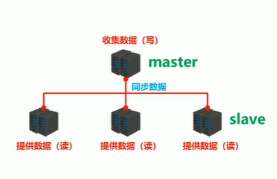
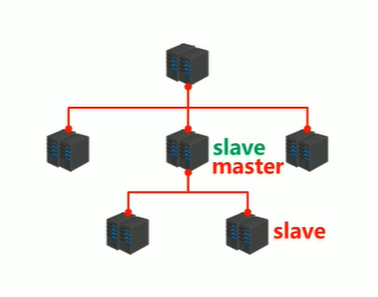
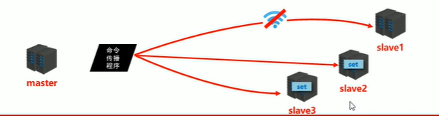

# Redis主从复制

为了避免单点Redis服务器故障，准备多台服务器，互相连通，将数据复制多个副本保存在不同的服务器上，连接在一起，并保证数据是同步的，即使有其中一台服务器宕机，其他服务器依然可以继续提供服务，实现Redis的**高可用**，同时实现数据**冗余备份**。

<!-- more -->

互联网“三高”架构

* 高并发
* 高性能
* 高可用：可用性目标99.999%，即每年服务器宕机时长低于315秒


单机Redis的风险和问题

* 机器故障（硬盘故障，系统崩溃）造成数据丢失
* 容量瓶颈：

## 主从复制

为了解决单机Redis的这些问题，提出主从复制的概念，首先有一个master负责写，然后master中的数据及时有效的复制到slave中，slave只负责读。这是一个一对多的结构；将master的数据复制到slave的过程就叫“主从复制”



> * master 主节点，提供数据方
>   * 与master连接的客户端叫主客户端
> * slave 从节点， 接收数据方
>   * 与slave连接的客户端叫从客户端

> ## 高可用集群
>
> 1. 如果slave突然宕机，那其他的slave就可以替代
>
> 2. 如果master宕机，就会从slave中选举出一个master
>
> 3. 如果master压力过大，可以在某个slave下追加slave，当前slave就可以作为下一层slave的master
>
>    
>
> 4. 为了提高master的可用性，可以使用哨兵让多台服务器做master
>
>    
>
>    

主从复制的作用

* 实现读写分离：提高服务器读写能力
* 负载均衡：slave分担master的负载
* 故障恢复：master出故障时，会选举出新master
* 数据冗余：数据热备份
* 高可用的基础：基于主从复制，构建哨兵模式与集群，实现Redis高可用方案

## 主从复制的工作流程

### 1. 建立连接阶段

建立slave到master的连接，使master能够识别slave，并保存slave的端口号

* slave向master发送 `slaveof masierIP masterPort`指令，master接受到指令后会给slave一个响应，说明要连接的`masterIP` 和 `masterPort`是正确的，然后slave保存master的`IP`和`port`,建立一个master和slave的socket，slave会周期性的`ping`master，如果master在线，就会对slave的ping响应（`pong`）,如果master设有密码，slave和master还需要一个验证授权的过程，最后，slave向master发送`replconf listening-port <port>`master保存slave端口
* 大致流程
  1. slave 向 master 发送 `slaveof`指令
  2. master 响应指令
  3. slave 保存 master IP 和 port
  4. 建立socket
  5. 周期性ping和pong
  6. 认证与授权
  7. master保存slave的port

具体命令：

* 方式一：客户端发送指令

  ```powershell
  slaveof <masterip> <masterport>
  ```

* 方式二：启动服务器时设置参数

  ```
  ./redis-server --slaveof <masterip> <masterport>
  ```

* 方式三：使用配置文件

  ```conf
  slaveof <masterip> <masterport>
  ```

master 有密码的情况：

* 怎么让master有密码

  ```conf
  # master配置文件中配置
  requirepass <password>
  ```

* slave如果使用客户端发送命令的方式连接master

  ```
  auth <password>
  ```

* slave通过配置文件连接master

  ```
  masterauth <password>
  ```

### 2. 数据同步阶段

步骤：

1. **请求同步数据**

  数据同步阶段是由slave发起的，slave向master发送`psync2`请求同步数据

2. **master创建RDB文件**

  * 数据的同步还是依靠RDB持久化来实现的，master接受到slave的同步请求后，执行`gbsave`生成RDB文件。
  * 由于master需要腾出精力来响应slave的同步请求，为了保证不丢失客户端的请求，会创建一个复制缓冲区，在master响应slave期间，master的客户端请求会被保存到复制缓冲区

3. **master将RDB文件通过socket传给slave**

4. **slave根据RDB文件恢复数据**

  为了保证数据一致，slave接收到master的RDB文件后，会清空自己的所有数据，然后根据RDB文件恢复数据。

5. **请求部分同步数据**

  slave恢复结束后，会发送命令告知master，但这时master命令缓冲区中的数据还没有同步到slave，所以等slave第一次恢复完后，master会把复制缓冲区中的命令以AOF的方式给slave

6. **恢复部分同步数据**

  slave接受到master发来的AOF后，先会执行`bgrewriteaof`来进行一次重写，以加快恢复过程，回复完成后，master和slave的数据就同步了，数据同步阶段结束

#### 全量复制和部分复制

上面的步骤中，前四步所进行的就是全量复制，在这个阶段，使用的是RDB，同步的是master中之前所有的数据。

第五步和第六步所执行的就是**部分复制**，这个阶段使用的是AOF，同步的内容是master命令缓冲区中的命令  

#### 注意

1. 数据同步应该避开流量高峰期，避免造成master阻塞

2. 复制缓冲区设定应该合理，过小会导致数据溢出，如果进行部分复制时发现数据已经丢失，就必须重新进行全量复制，导致slave陷入死循环，复制缓冲区大小默认1MB,可以通过下面的配置修改

   ```
   repl-backlog-size 1mb
   ```

3. master单机占用内存不应该过大，建议使用50%~70%的内存，留下30%~50%用于执行bgsave命令和创建复制缓冲区

4. 为了避免slave在数据同步期间服务器响应阻塞或数据不同步，建议关闭此期间的对外服务

   ```
   slave-servr-stale-data yes|no
   ```

5. 数据同步阶段，master也会给slave发送消息，这时master可以理解为slave的一个客户端，如ping

6. 多个slave同时与master进行数据同步，会导致master发送的RDB或AOF文件过多，对带宽造成巨大冲击，如果master带宽不足，数据同步需要适量错峰

7. 当slave过多时，建议调整拓扑结构，如将一对多结构调整为树状结构，让中间节点分担根master的负载，但这样会导致顶层master和底层的slave间数据延时增加，数据一致性变差，应综合考虑业务对数据一致性的要求和服务器实际能力谨慎选择。

### 3.命令传播阶段

实时保持master和slave的同步

#### 命令传播阶段的部分复制

如果在命令传播阶段出现断网的情况：

* 闪断闪联：影响不大
* 长时间网络中断：全量复制
* 短时间网络中断：部分复制

部分复制的三个核心要素：

* 服务器的运行ID（run id）
* master的复制积压缓冲区
* 主从服务器的复制偏移量

##### 服务器运行ID

* 概念：run id 是每一台服务器每次运行的身份识别码，一台服务器多次运行可以生成多个run id
* 组成：40位随机十六进制字符
* 作用：run id 被用于在服务期间进行传输时识别身份，如果想两次操作都对同一台服务器进行，必须每次操作携带对应的run id ，用于对方识别
* 实现方式：run id 在每台服务器启动时自动生成，master首次与slave连接时，会将自己的run id 发送给slave，slave保存此ID，通过`info Server`可以查看节点run id

##### 复制缓冲区和偏移量

slave和master连接后，master通过`命令传播程序`向slave分发数据



这时如果slave 1发生网络故障，就无法与master同步数据，为了解决这个问题，master除了会将命令发送给slave之外，还会把命令放入复制缓冲区，复制缓冲区是一个队列，由偏移量和字符值组成，master和slave分别保存偏移量，如果slave某一次没有正确同步到master的数据，那下一次同步时他们俩的偏移量就会不一样，master就会给这个slave重新同步上一次的数据

> 复制缓冲区
>
> 组成：
>
> * 偏移量
> * 字符值
>
> 
>
> master接受到的指令会像AOF那样拆分，然后按字符存放在缓冲区队列中，传输过程中，为了记下传输到哪个字符了，每个字符都会有一个偏移量offset
>
> 如果Redis开启了AOF，那复制缓冲区一开始就有，如果没有开启，那Redis作为master时，复制缓冲区就会被开辟

### 4. 主从复制工作流程总结

假设master上原本就有一些数据，当slave连接上master之后，要同步master的数据（这些数据包括master原有的和同步期间master新增的），就给master发送`psync2`命令，`psync`命令格式是：

```shell
psync2 <runid> <offset>
```

由于是第一次连接master，slave并不知道runid和offset，所以就发送`psync2 ? -1`，master接受到这条命令后，就认为这个slave是要进行全量复制，就使用`+FULLRESYNC runid offset`把runid和offset发送给slave，并且调用`gbsave`持久化当前数据，生成RDB文件发给slave，并把新接受到的master客户端命令保存到复制缓冲区，slave收到`+FULLRESYNC runid offset`就保存runid和offset，清空自己原有的数据并通过RDB文件同步master的数据，同步结束后，会再像master发起**部分复制请求** 具体是向master发送命令`psync2 runid offset` master接受到这个请求后，先会判断runid是否正确，如果runid错误，就认为slave实在请求全量复制，如果正确，就会检查offset，如果offset超过了复制缓冲区中最新的数据的偏移量，就认为offset有误，也会进行全量复制，如果offset和缓冲区中最新数据的偏移量一致，就说明主从数据是一致的，就会忽略这次请求，最后如果offset小于缓冲区中最新的数据【salve由于网络故障没有正确同步master的数据也属于这种情况】，就说明slave缺少缓冲区中的部分数据，就发送`+CONTINUE offset`给slave，并把缓冲区中从slave请求的偏移量开始的命令以AOF的格式发给slave，slave接收到`+CONTINUE`指令后，先对master发来的AOF执行`bgrewriteaof`重写，再以追加的方式恢复数据

## 心跳机制

在进入信息传播阶段，master和slave之间的信息维护就通过“心跳包”维护，以此来保持双方在线

对于slave来说，它每隔1s向master发送`REPLCONF ACK <offset>`一方面向master汇报自己最新的偏移量，如果小于master的偏移量，master就把少的数据传给slave，另一方面也可以以此判断master是否在线

对于master来说，它只需要确定slave还在线就行，所以它每隔10s【可以通过`repl-ping-slave-period`设置】向slave发送`PING`来确认slave是否在线，我们可以使用`INFO replication`来查看slave最后一次连接的时间间隔，lag项维持在0或1视为正常。

当slave多数掉线或延时过高时，master为了保障数据稳定性，将停止数据写入，可以配置最小slave连接数和最大延时

```
min-slaves-to-write 2
min-slaves-max-lag 8
```

slave的数量和延时都由`REPLCONF ACK`命令确认

## 常见问题

### 频繁的全量复制

全量复制的开销非常大，不恰当的配置可能导致频繁的全量复制，最终导致服务器性能下降甚至宕机，可能导致屏藩的全量复制的原因有很多，Redis内部也对此做了优化，比如使用`shutdown save`关闭master时，master会将runid和offset一起持久化到RDB文件，这样重启后runid不变，slave连接后就不用全量复制了。

除此之外，如果复制缓冲区过小，网络环境不佳，slave不提供服务，后来的命令就会“挤出”队首的命令，造成slave的offset越界，重复执行全量复制；这时可以修改复制缓冲区大小

```
repl-backlog-size
```

> 复制缓冲区大小建议：
>
> 1. 测算从master到slave重连平均时长second
> 2. 获取master平均每秒产生写命令的数据总量write_size_per_second
> 3. 最优复制缓冲区空间 = 2 * second * write_size_per_second

### 频繁的网络中断

如果slave接受到慢查询指令，就会花费大量时间去执行这条慢查询，而master每隔1s会调用replicationCron()判断slave是否超时，造成master各种资源被严重占用，我们可以设置合理的超时时间，确认是否释放slave

```
repl-timeout
```

* 默认60s，一旦响应时间超过这里设定的值，slave就会被释放

如果master发送ping指令较低，而master设定的超时时间又过短，这时如果ping指令在网络中丢包，就会导致slave和master连接断开，可以适当提高ping指令发送的频率

```
repl-ping-slave-period
```

* repl-timeout至少应该是ping指令频度的5-10被，否则slave很容易被判断超时

### 数据不同步

如果主从间网络环境不好，就会导致数据不同步，对于数据一致性要求高的业务，建议主从服务器部署在同一个机房，尽量优化服务器间网络环境，或者对于一致性要求高而数量不是特别大的的数据，可以不使用主从复制。

  