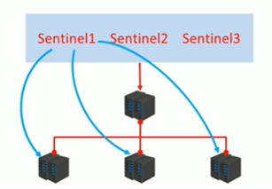
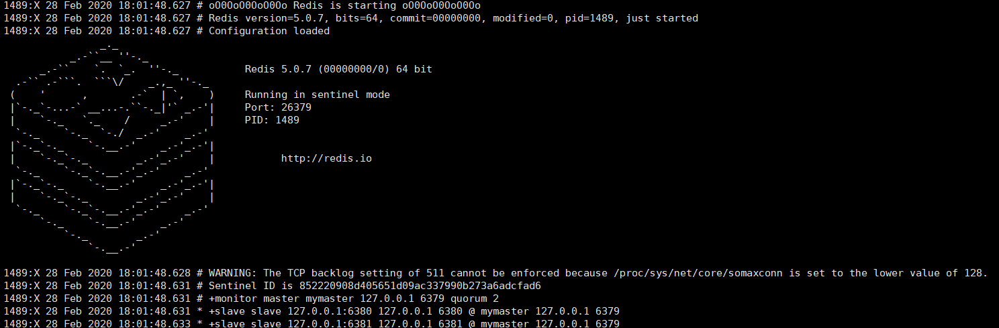
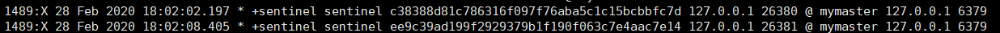
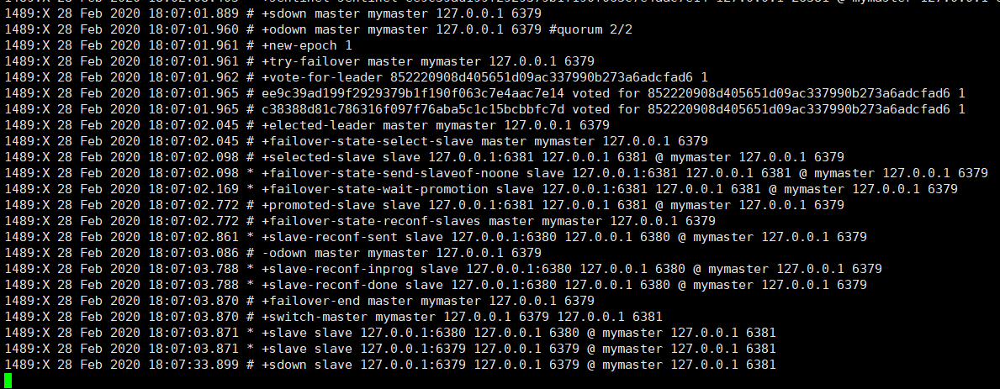
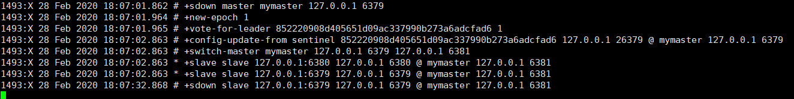
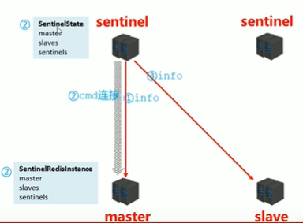
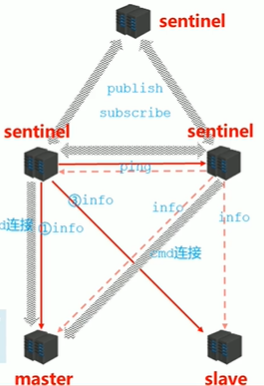
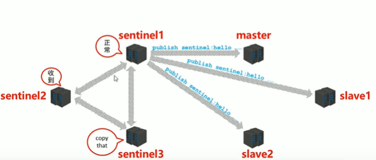
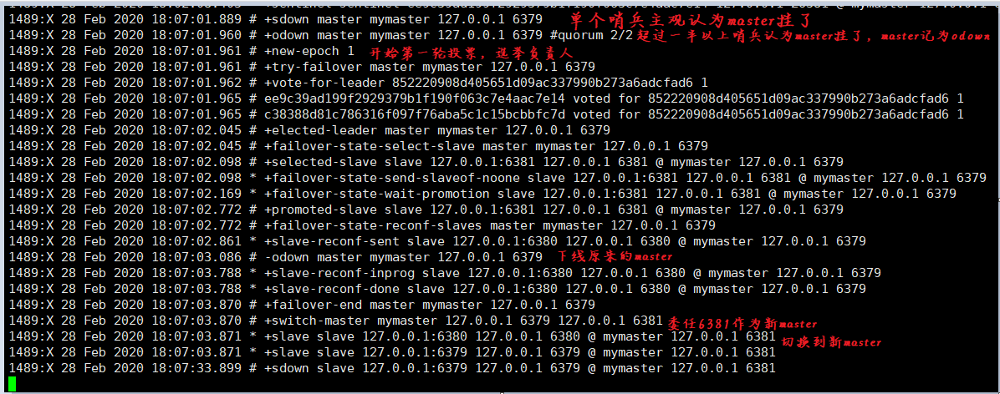

# 哨兵模式

哨兵是一台特殊的Redis服务器，它不对外提供数据服务，用来监控主从模式下的各个节点。

<!-- more -->

如果slave宕机，哨兵就会把这个服务断开，如果master宕机，哨兵会投票选出新的master，并通知其他slave连接这个新的master



哨兵的作用：

* 监控
* 提醒
* 自动故障转移

> 哨兵的数量一般设置为单数，最少应该是三个

## 配置哨兵

> 哨兵的配置文件：sentinel.conf

```conf
# 哨兵端口
port 26379
# 数据文件保存的目录
dir /tmp
# 监听的master服务器，最后的2表示要确认master挂了需要几个哨兵，默认配置哨兵数量的一半加一，也就是如果有一半以上哨兵认为master挂了就说master挂了
sentinel monitor mymaster 127.0.0.1 6379 2
# 哨兵会按时向master发生心跳包确认master是否在线，如果master在一段时间内不响应或响应错误，该哨兵就单方认为master挂了，下面配置就是指定哨兵等待master的最长响应时间，单位ms，默认30s
sentinel down-after-milliseconds mymaster 30000
# 哨兵选举出新master后，salve需要和新master进行同步，该配置指出最多允许多少个slave同时与新master同步，配置越大，同步时间越短，服务器压力越大
sentinel parallel-syncs mymaster 1
# slave与新master同步时的最长时间，超过该时间，认为同步失败
sentinel failover-timeout mymaster 180000
# 如果master需要密码认证，需要在配置中指出
sentinel auth-pass mymaster 123456789
```

> 哨兵一旦启动后，配置文件就会被修改，主要是写入自己和其他哨兵的信息
>
> ```conf
> port 26379
> dir "/tmp"
> sentinel myid 1922f6c29e26e49dc101e31c78ff08ed1470dacb
> sentinel deny-scripts-reconfig yes
> sentinel monitor mymaster 127.0.0.1 6381 2
> sentinel auth-pass mymaster 123456789
> sentinel config-epoch mymaster 1
> # Generated by CONFIG REWRITE
> protected-mode no
> sentinel leader-epoch mymaster 1
> sentinel known-replica mymaster 127.0.0.1 6380
> sentinel known-replica mymaster 127.0.0.1 6379
> sentinel known-sentinel mymaster 127.0.0.1 26380 c97cdc682363025f6e5e02a385d25b767f2bff43
> sentinel known-sentinel mymaster 127.0.0.1 26381 a6b35ef9ac93ee5b5ccf1d9933d3f9341f506b5c
> sentinel current-epoch 1
> 
> ```

### 启动哨兵

```shell
redis-sentinel sentinel.conf
```

**启动哨兵前，应该先启动主从服务**



哨兵启动后，会先读出master的所有slave，当有别的哨兵启动后，其他哨兵也会检测到，并且将其他哨兵的信息加入到自己的配置文件



直接将master杀死后，等到配置的时间一到，哨兵认为master已死，并选举出新的master





这里选举出了6381作为新的master，6379恢复后，被哨兵检测到，并且自动作为新master的slave


## 哨兵的原理

哨兵的作用：

* 监控
* 通知
* 故障转移


### 监控阶段

1. 哨兵连接master，并发送info指令，得到master的相关信息，包括slave等

2. 哨兵和master之间建立CMD连接

3. 哨兵建立SentinelState，保存master，slave，sentinel等信息，同时master端建立SentinelRedisInstance，同样保存master，slaves，sentinels等信息。

4. 哨兵通过从master处得到的slaves信息连接slave

   

5. 下一个哨兵连接master时，发现master的SentinelRedisInstance中的sentinels里有东西，说明有哨兵连接了这个master，这个新哨兵同样与master建立CMD连接，将master的信息保存到自己的SentinelState中

6. 由于发现有哨兵连过master，新连接的哨兵会与前面的哨兵建立发布订阅，对称双方的信息，为了确保对方在线，哨兵间会互发ping命令

   

当第三个哨兵加入后，它会加入这个发布订阅



### 通知阶段

通知的原理很简单，sentinel1会向master或slave定时发送hello包，收到master或slave的响应后，sentinel1会通过发布订阅同步所有sentinel的信息




### 故障转移阶段

故障转移阶段要做的事情有四件：

1. 发现故障
2. 竞选负责人
3. 竞选新的master
4. 切换master

#### 发现故障

某个sentinel向master发送hello包，如果对方master无响应，等到设定的down-after-milliseconds时间到达后，该sentinel就认为该master挂了，这个master被标记为主观下线`SDOWN`，然后第一个发现master挂了的这个sentinel通过发布订阅告知其他sentinel这个消息，这时，其他sentinel都会去向master发送hello包，来判断master是否真的下线了，如果其他sentinel也发现master下线了，同样也会发布订阅给其他sentinel，主观认为master下线的sentinel一旦超过`sentinel monitor`中最后配置的数量【一般是一半加一】，master就被认定为客观下线（ODOWN），接下来，Redis就会在所有sentinel中推举出一个负责人去处理这个故障。

#### 竞选负责人

竞选负责人选取投票方式，每个sentinel即作为选举者，也作为被选举者，每个哨兵有一票，一旦master被认定为odown，所有sentinel都向频道发布包括【要处理的服务的ip，端口，自己的runid，以及竞选次数】的消息，选举时，某个sentinel先收到谁的消息，就会把票投给谁，最终得票多的哨兵就被作为负责人，负责人会主持选出新的master，并通知其他slave切换到新master。

#### 竞选新master

新的master由其他活着的slave担当，负责人会不停的给slave发送hello包，剔除掉死亡的和响应时间过长的slave，然后负责人会挑选出最近与原master连接的slave作为新master，如果有多个slave最近连接master，就会选出runid小的最为master，然后通知slave切换master

#### 切换master

选举出新的master后，负责人会修改master和slave的配置文件中的`slaveof <masterip> <masterport>`，包括已经挂掉的原master的，以此通知slave切换到新master，即使原master重新上线，也只能作为新master的slave

