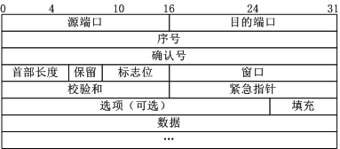

<!--961032830987546d0e6d54829fc886f6-->

目录(Catalo)

* [知己知彼](#知己知彼)
  * [URL](#URL)
  * [HTTP与HTTPS](#HTTP与HTTPS)
    * [HTTPS的工作流程](#HTTPS的工作流程)
      * [三次握手与四次挥手](#三次握手与四次挥手)
      * [SSL/TLS](#SSL/TLS)
  * [关于开发者模式](#关于开发者模式)

<!--a46263f7a69f33f39fc26f907cdb773a-->
# 知己知彼

> “知己知彼，百战不殆； 不知彼而知己，一胜一负；不知彼，不知己，每战必殆。”    ————《孙子·谋攻篇》

## URL

URL，统一资源定位器，就是网址而已。。。

```url
https://www.google.com/search?q=%E7%9F%A5%E5%B7%B1%E7%9F%A5%E5%BD%BC&oq=%E7%9F%A5%E5%B7%B1%E7%9F%A5%E5%BD%BC&aqs=chrome..69i57.6574j0j1&sourceid=chrome&ie=UTF-8
```

一个标准url由四部分组成，分别是协议，域名，目录，参数

* 协议：请求该url所使用的网络协议，除了常见的https,还有http,ftp等
* 域名：域名是对IP地址的映射，因为IP地址记不住。如:www.google.com
* 目录：是该网页在服务器中的相对路径，一般是根目录，就没有目录这个环节
* 参数：客户端发起的GET请求的参数，一般在`?`后面,如：q=%E7%9F%A5%E5%B7%B1%E7%9F%A5%E5%BD%BC&oq=%E7%9F%A5%E5%B7%B1%E7%9F%A5%E5%BD%BC&aqs=chrome..69i57.6574j0j1&sourceid=chrome&ie=UTF-8

## HTTP与HTTPS

HTTPS是为了修缮HTTP传输不安全产生的，使用HTTP协议时，客户端与服务端通过明文传输数据，不安全，HTTPS在HTTP的上层增加了一个安全套接字层（SSL），HTTP默认使用80端口，HTTPS默认使用443端口。

### HTTPS的工作流程

1. TCP 三次同步握手
2. 客户端验证服务器数字证书
3. DH 算法协商对称加密算法的密钥、hash 算法的密钥
4. SSL 安全加密隧道协商完成
5. 网页以加密的方式传输，用协商的对称加密算法和密钥加密，保证数据机密性；用协商的hash算法进行数据完整性保护，保证数据不被篡改。
6. 四次挥手

#### 三次握手与四次挥手

TCP包



* 序号：seq
* 确认序号：Ack，只有标志位中的ACK为1时，该字段才有效（Ack和ACK不一样），Ack=seq+1
* 标志位：有六个 URG,ACK,PSH,RST,SYN,FIN，其中SYN为1是发起一个新链接

其他具体作用不说了，自己谷歌，

三次握手

* 第一次：客户端向服务器发送TCP请求包，把其中标志位的SYN置为1，代表请求建立新链接，并随机产生一个J作为序号seq的值，发送完后，客户端进入SYN_SENT状态等待服务端的响应
* 第二次：服务端收到客户端的TCP请求包后，检查其SYN字段，得出客户端请求与自己建立链接，就将自己的SYN和ACK字段置为1，Ack=seq+1=J+1，并产生一个随机K作为seq的值，发送完毕后进入SYN_RCVD状态，等待客户端回应
* 第三次：收到服务端回应后，检查Ack是不是J+1，ACK是不是1，如果是，就把自己的ACK置为1，Ack=seq+1=K+1发送给服务端，服务器检查Ack是不是K+1，ACK是不是1，如果是，客户端与服务端进入ESTABLISHED状态，建立通信线路，开始通信。

四次挥手

标志位中的FIN字段用来控制链接的断开

* 第一次：客户端产生一个随机的J作为FIN的值，发送给服务器，进入FIN_WAIT_1状态
* 第二次：服务器收到请求断开链接的消息后，发送ACK=1，Ack=J+1的TCP包给客户端，客户端收到后判断Ack是否为自己的FIN+1，服务端进入CLOSE_WAIT状态
* 第三次：服务端发送FIN=K给客户端
* 第四次：客户端收到FIN后，进入TIME_WAIT状态，接着发送一个ACK给服务端，确认Ack=seq+1，服务端进入CLOSED状态，完成四次挥手。

#### SSL/TLS

HTTPS就是建立在SSL/TLS之上的HTTP，在使用HTTPS访问一个网页时，服务端会配备一套证书（就是一对公钥和私钥），客户端会检查服务端证书是否有效，有效的话利用该证书加密一个随机生成的key，并把这个key发送给服务端，服务端接收到加密后的key后用私钥解密，再用解密后的key加密传输数据，客户端再利用key解密报文。

HTTP不安全，但响应速度快，HTTPS安全，但由于涉及加密解密等，响应速度慢。

## 关于开发者模式

[看着儿-》](https://segmentfault.com/a/1190000000683599)