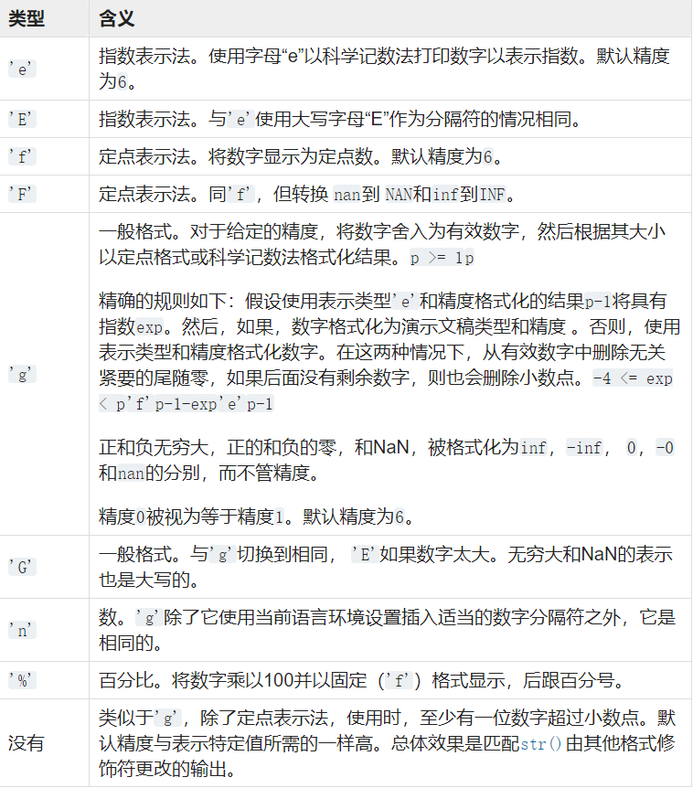
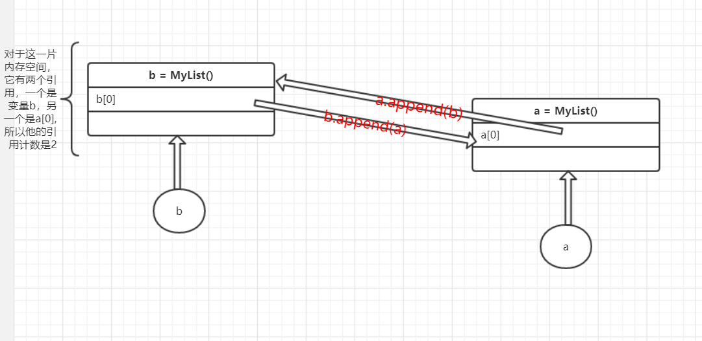
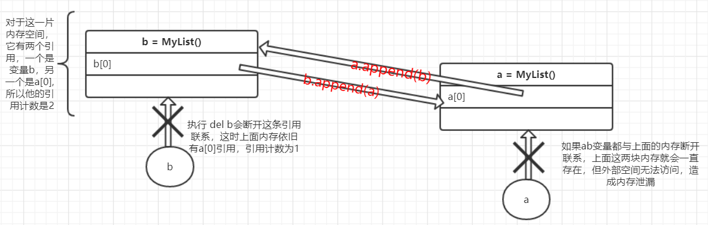

<!--961032830987546d0e6d54829fc886f6-->

目录(Catalo)

- [python 重要知识点总结](#python-%e9%87%8d%e8%a6%81%e7%9f%a5%e8%af%86%e7%82%b9%e6%80%bb%e7%bb%93)
  - [DAY 1. 函数的参数传递](#day-1-%e5%87%bd%e6%95%b0%e7%9a%84%e5%8f%82%e6%95%b0%e4%bc%a0%e9%80%92)
    - [1.1 总结](#11-%e6%80%bb%e7%bb%93)
  - [DAY 2. 元类](#day-2-%e5%85%83%e7%b1%bb)
    - [2.1 元类是什么](#21-%e5%85%83%e7%b1%bb%e6%98%af%e4%bb%80%e4%b9%88)
    - [2.2 创建类的另一种方法](#22-%e5%88%9b%e5%bb%ba%e7%b1%bb%e7%9a%84%e5%8f%a6%e4%b8%80%e7%a7%8d%e6%96%b9%e6%b3%95)
      - [通过type创建类](#%e9%80%9a%e8%bf%87type%e5%88%9b%e5%bb%ba%e7%b1%bb)
    - [2.3 MetaClass](#23-metaclass)
    - [2.4 总结](#24-%e6%80%bb%e7%bb%93)
  - [DAY 3. 静态方法和类方法](#day-3-%e9%9d%99%e6%80%81%e6%96%b9%e6%b3%95%e5%92%8c%e7%b1%bb%e6%96%b9%e6%b3%95)
    - [3.1 总结](#31-%e6%80%bb%e7%bb%93)
  - [DAY 4. 类变量（属性）和实例变量（属性）](#day-4-%e7%b1%bb%e5%8f%98%e9%87%8f%e5%b1%9e%e6%80%a7%e5%92%8c%e5%ae%9e%e4%be%8b%e5%8f%98%e9%87%8f%e5%b1%9e%e6%80%a7)
    - [4.1 总结](#41-%e6%80%bb%e7%bb%93)
  - [DAY 5. python自省](#day-5-python%e8%87%aa%e7%9c%81)
    - [5.1 python实现自省的办法](#51-python%e5%ae%9e%e7%8e%b0%e8%87%aa%e7%9c%81%e7%9a%84%e5%8a%9e%e6%b3%95)
      - [5.1.1 help()](#511-help)
      - [5.1.2 dir()](#512-dir)
      - [5.1.3 hasattr()，getattr(),setattr()](#513-hasattrgetattrsetattr)
      - [5.1.4 isinstance()，issubclass()](#514-isinstanceissubclass)
      - [5.1.5 id()和callable()](#515-id%e5%92%8ccallable)
      - [5.1.6 type()](#516-type)
    - [5.2 总结](#52-%e6%80%bb%e7%bb%93)
  - [DAY 6. 生成式,迭代器，生成器](#day-6-%e7%94%9f%e6%88%90%e5%bc%8f%e8%bf%ad%e4%bb%a3%e5%99%a8%e7%94%9f%e6%88%90%e5%99%a8)
    - [6.1 生成式](#61-%e7%94%9f%e6%88%90%e5%bc%8f)
      - [6.1.1 列表生成式](#611-%e5%88%97%e8%a1%a8%e7%94%9f%e6%88%90%e5%bc%8f)
      - [6.1.2 字典生成式](#612-%e5%ad%97%e5%85%b8%e7%94%9f%e6%88%90%e5%bc%8f)
      - [6.1.3 集合生成式](#613-%e9%9b%86%e5%90%88%e7%94%9f%e6%88%90%e5%bc%8f)
    - [6.2 生成器](#62-%e7%94%9f%e6%88%90%e5%99%a8)
    - [6.3 迭代器](#63-%e8%bf%ad%e4%bb%a3%e5%99%a8)
      - [6.3.1 可迭代对象](#631-%e5%8f%af%e8%bf%ad%e4%bb%a3%e5%af%b9%e8%b1%a1)
      - [6.3.2 迭代器](#632-%e8%bf%ad%e4%bb%a3%e5%99%a8)
    - [6.4 总结](#64-%e6%80%bb%e7%bb%93)
  - [DAY 7. 格式化字符串](#day-7-%e6%a0%bc%e5%bc%8f%e5%8c%96%e5%ad%97%e7%ac%a6%e4%b8%b2)
    - [7.1 %格式化字符串](#71-%e6%a0%bc%e5%bc%8f%e5%8c%96%e5%ad%97%e7%ac%a6%e4%b8%b2)
    - [7.2 format()](#72-format)
    - [7.3 f-string](#73-f-string)
      - [7.3.2 格式规范迷你语言](#732-%e6%a0%bc%e5%bc%8f%e8%a7%84%e8%8c%83%e8%bf%b7%e4%bd%a0%e8%af%ad%e8%a8%80)
        - [(1) 对齐 align](#1-%e5%af%b9%e9%bd%90-align)
        - [(2) sign](#2-sign)
        - [(3) #选项](#3-%e9%80%89%e9%a1%b9)
        - [(4) ,选项](#4-%e9%80%89%e9%a1%b9)
        - [(5) width](#5-width)
        - [(6) .precision](#6-precision)
        - [(7) type](#7-type)
    - [7.4 总结](#74-%e6%80%bb%e7%bb%93)
  - [DAY 8. *args和**kwargs](#day-8-args%e5%92%8ckwargs)
  - [DAY 9. 闭包和装饰器](#day-9-%e9%97%ad%e5%8c%85%e5%92%8c%e8%a3%85%e9%a5%b0%e5%99%a8)
    - [9.1 闭包](#91-%e9%97%ad%e5%8c%85)
      - [闭包的作用](#%e9%97%ad%e5%8c%85%e7%9a%84%e4%bd%9c%e7%94%a8)
    - [9.2 装饰器](#92-%e8%a3%85%e9%a5%b0%e5%99%a8)
      - [9.2.1 装饰器带参数](#921-%e8%a3%85%e9%a5%b0%e5%99%a8%e5%b8%a6%e5%8f%82%e6%95%b0)
      - [9.2.2 被修饰函数带参数](#922-%e8%a2%ab%e4%bf%ae%e9%a5%b0%e5%87%bd%e6%95%b0%e5%b8%a6%e5%8f%82%e6%95%b0)
      - [9.2.3 例](#923-%e4%be%8b)
    - [9.3 总结](#93-%e6%80%bb%e7%bb%93)
  - [DAY 10. 鸭子类型](#day-10-%e9%b8%ad%e5%ad%90%e7%b1%bb%e5%9e%8b)
  - [前十天总结](#%e5%89%8d%e5%8d%81%e5%a4%a9%e6%80%bb%e7%bb%93)
  - [DAY 11. python 重载](#day-11-python-%e9%87%8d%e8%bd%bd)
    - [11.2 单分派泛型函数](#112-%e5%8d%95%e5%88%86%e6%b4%be%e6%b3%9b%e5%9e%8b%e5%87%bd%e6%95%b0)
    - [11.3 总结](#113-%e6%80%bb%e7%bb%93)
  - [DAY 12. python新式类和旧式类](#day-12-python%e6%96%b0%e5%bc%8f%e7%b1%bb%e5%92%8c%e6%97%a7%e5%bc%8f%e7%b1%bb)
    - [12.1 新式类和旧式类的区别](#121-%e6%96%b0%e5%bc%8f%e7%b1%bb%e5%92%8c%e6%97%a7%e5%bc%8f%e7%b1%bb%e7%9a%84%e5%8c%ba%e5%88%ab)
    - [12.2 总结](#122-%e6%80%bb%e7%bb%93)
  - [DAY 13. 单例设计](#day-13-%e5%8d%95%e4%be%8b%e8%ae%be%e8%ae%a1)
    - [13.1 什么是单例设计](#131-%e4%bb%80%e4%b9%88%e6%98%af%e5%8d%95%e4%be%8b%e8%ae%be%e8%ae%a1)
    - [13.2 实现单例设计的方法](#132-%e5%ae%9e%e7%8e%b0%e5%8d%95%e4%be%8b%e8%ae%be%e8%ae%a1%e7%9a%84%e6%96%b9%e6%b3%95)
      - [13.2.1 重写__new__()](#1321-%e9%87%8d%e5%86%99new)
      - [13.2.2 使用装饰器](#1322-%e4%bd%bf%e7%94%a8%e8%a3%85%e9%a5%b0%e5%99%a8)
      - [13.2.3 使用模块](#1323-%e4%bd%bf%e7%94%a8%e6%a8%a1%e5%9d%97)
      - [13.2.4 共享属性](#1324-%e5%85%b1%e4%ba%ab%e5%b1%9e%e6%80%a7)
    - [13.3 总结](#133-%e6%80%bb%e7%bb%93)
  - [DAY 14. python多线程](#day-14-python%e5%a4%9a%e7%ba%bf%e7%a8%8b)
    - [14.1 计算机多任务的实现](#141-%e8%ae%a1%e7%ae%97%e6%9c%ba%e5%a4%9a%e4%bb%bb%e5%8a%a1%e7%9a%84%e5%ae%9e%e7%8e%b0)
    - [14.2 python多线程](#142-python%e5%a4%9a%e7%ba%bf%e7%a8%8b)
      - [14.2.1 线程间共享全局变量](#1421-%e7%ba%bf%e7%a8%8b%e9%97%b4%e5%85%b1%e4%ba%ab%e5%85%a8%e5%b1%80%e5%8f%98%e9%87%8f)
      - [14.2.2 多线程实现UDP通信](#1422-%e5%a4%9a%e7%ba%bf%e7%a8%8b%e5%ae%9e%e7%8e%b0udp%e9%80%9a%e4%bf%a1)
      - [14.2.3 守护线程](#1423-%e5%ae%88%e6%8a%a4%e7%ba%bf%e7%a8%8b)
      - [14.2.4 练习](#1424-%e7%bb%83%e4%b9%a0)
    - [14.3 总结](#143-%e6%80%bb%e7%bb%93)
  - [DAY 15. python多进程](#day-15-python%e5%a4%9a%e8%bf%9b%e7%a8%8b)
    - [15.1 进程与程序](#151-%e8%bf%9b%e7%a8%8b%e4%b8%8e%e7%a8%8b%e5%ba%8f)
    - [15.2 python进程的创建](#152-python%e8%bf%9b%e7%a8%8b%e7%9a%84%e5%88%9b%e5%bb%ba)
    - [15.3 僵尸进程和孤儿进程](#153-%e5%83%b5%e5%b0%b8%e8%bf%9b%e7%a8%8b%e5%92%8c%e5%ad%a4%e5%84%bf%e8%bf%9b%e7%a8%8b)
    - [15.4 进程并行Pool](#154-%e8%bf%9b%e7%a8%8b%e5%b9%b6%e8%a1%8cpool)
    - [15.5 守护进程](#155-%e5%ae%88%e6%8a%a4%e8%bf%9b%e7%a8%8b)
    - [15.5 进程同步Lock](#155-%e8%bf%9b%e7%a8%8b%e5%90%8c%e6%ad%a5lock)
    - [15.6 进程间通信](#156-%e8%bf%9b%e7%a8%8b%e9%97%b4%e9%80%9a%e4%bf%a1)
    - [15.7 总结](#157-%e6%80%bb%e7%bb%93)
  - [DAY 16. python协程](#day-16-python%e5%8d%8f%e7%a8%8b)
    - [16.1 复习 可迭代对象，迭代器，生成器](#161-%e5%a4%8d%e4%b9%a0-%e5%8f%af%e8%bf%ad%e4%bb%a3%e5%af%b9%e8%b1%a1%e8%bf%ad%e4%bb%a3%e5%99%a8%e7%94%9f%e6%88%90%e5%99%a8)
    - [16.2 yield实现协程](#162-yield%e5%ae%9e%e7%8e%b0%e5%8d%8f%e7%a8%8b)
    - [16.3 greenlet实现协程](#163-greenlet%e5%ae%9e%e7%8e%b0%e5%8d%8f%e7%a8%8b)
    - [16.4 gevent实现协程](#164-gevent%e5%ae%9e%e7%8e%b0%e5%8d%8f%e7%a8%8b)
    - [16.5 总结](#165-%e6%80%bb%e7%bb%93)
  - [DAY 17. GIL](#day-17-gil)
    - [17.1 什么是GIL，GIL产生的原因](#171-%e4%bb%80%e4%b9%88%e6%98%afgilgil%e4%ba%a7%e7%94%9f%e7%9a%84%e5%8e%9f%e5%9b%a0)
    - [17.2 GIL对python线程的影响](#172-gil%e5%af%b9python%e7%ba%bf%e7%a8%8b%e7%9a%84%e5%bd%b1%e5%93%8d)
    - [17.3 解决GIL的办法](#173-%e8%a7%a3%e5%86%b3gil%e7%9a%84%e5%8a%9e%e6%b3%95)
  - [python多任务总结](#python%e5%a4%9a%e4%bb%bb%e5%8a%a1%e6%80%bb%e7%bb%93)
  - [DAY 18. python垃圾回收机制](#day-18-python%e5%9e%83%e5%9c%be%e5%9b%9e%e6%94%b6%e6%9c%ba%e5%88%b6)
    - [18.1 引用计数（Reference Counting）](#181-%e5%bc%95%e7%94%a8%e8%ae%a1%e6%95%b0reference-counting)
    - [18.2 标记清除（Mark-Sweep）](#182-%e6%a0%87%e8%ae%b0%e6%b8%85%e9%99%a4mark-sweep)
    - [18.3 分代回收](#183-%e5%88%86%e4%bb%a3%e5%9b%9e%e6%94%b6)
    - [18.4 总结](#184-%e6%80%bb%e7%bb%93)
  - [DAY 19. lambda表达式](#day-19-lambda%e8%a1%a8%e8%be%be%e5%bc%8f)
  - [总结（二）](#%e6%80%bb%e7%bb%93%e4%ba%8c)
  - [DAY 20. python拷贝](#day-20-python%e6%8b%b7%e8%b4%9d)
  - [DAY 21. OS和sys](#day-21-os%e5%92%8csys)
  - [DAY 21. python设计模式](#day-21-python%e8%ae%be%e8%ae%a1%e6%a8%a1%e5%bc%8f)

<!--a46263f7a69f33f39fc26f907cdb773a-->
# python 重要知识点总结

[Toc]

## DAY 1. 函数的参数传递

函数参数传递有两种方式，传值和传引用，传值只是把变量的值复制一份给了实参，函数内部的操作不会改变函数外部变量的值，而传引用传递的是外部变量的地址，函数内部直接操作函数外部变量的储存空间，在调用函数之后，函数外部变量的值一般会改变

```python
def Demo(a):
    a = a + 1
    print(id(a))

if __name__ == '__main__':
    a = 3
    print(id(a)) # 140705335465056
    Demo(a) # 140705335465088
    print(id(a)) # 140705335465056
```

看到变量a在函数调用前后地址值没有改变，证明在传递数值时传递的是变量的值，字符等类型也一样，然后尝试列表，元组

```python
def Demo(a):
    a.append(3)
    print(id(a))

if __name__ == '__main__':
    s = [1,2]
    print("value = " + str(s) + "address = " + str(id(s)))  # value = [1, 2]address = 1574898786888
    Demo(s)  # value = [1, 2, 3]address = 1574898786888
    print("value = " + str(s) + "address = " + str(id(s)))  # value = [1, 2, 3]address = 1574898786888
```

函数调用前后地址值一致，证明传递的是引用，并且函数执行以后a的值也发生了改变，说明`a.append()`是在s的内存中操作的

如果传递的是元组，应为元组不可修改，所以三次输出的都是同一块地址，但其实以元组为参数传递时传递的是值。

还有一种情况

```python
def Demo(a):
    a[0].append(3)
    print("value = " + str(a) + "address = " + str(id(a)))

if __name__ == '__main__':
    a = ([1,2], 2)
    print("value = " + str(a) + "address = " + str(id(a)))  # value = ([1, 2], 2)address = 2616967970056
    Demo(a)  # value = ([1, 2, 3], 2)address = 2616967970056
    print("value = " + str(a) + "address = " + str(id(a)))  # value = ([1, 2, 3], 2)address = 2616967970056
```

如果元组中的元素是列表，在调用函数前后，函数外部的a也发生了变化，根据刚开始说的，这感觉是在传引用，但其实不是，对于函数外部的a来说，他的第0个元素始终是`<class 'list'>`,至于列表中元素有没有发生变化，元组并不关心，元组判断元素有没有改变判断的是元素的地址有没有改变，而调用append()函数时，传递的是可变元素列表，地址值不会发生改变，这也就是为什么元组不可变，但如果元组中的数据是可变类型的话该数据就可变的原因

### 1.1 总结

python有两种数据类型，可变和不可变数据，对于可变数据类型，诸如列表，字典，集合在函数传参时**传引用**，对于不可变数据类型，如数值，字符，元组，在函数传参时**传值**，但更准确的来说，python函数传参时使用**传对象引用**的方式，如果函数收到的是一个可变对象（比如字典或者列表）的引用，就能修改对象的原始值－－相当于通过“传引用”来传递对象。如果函数收到的是一个不可变对象（比如数字、字符或者元组）的引用，就不能直接修改原始对象－－相当于通过“传值'来传递对象。

最后还是要注意像元组中数据是可变类型的情况

[参考链接1](https://github.com/taizilongxu/interview_python#1-python%E7%9A%84%E5%87%BD%E6%95%B0%E5%8F%82%E6%95%B0%E4%BC%A0%E9%80%92)
[参考链接2](https://www.cnblogs.com/loleina/p/5276918.html)

## DAY 2. 元类

### 2.1 元类是什么

众所周知，对象由类实例化而来，类是对象的模板，而python一切皆对象，类也是对象，它由元类（type）创建，所以**元类是类的类**，是类的模板

### 2.2 创建类的另一种方法

一般情况下，我们使用class关键字申明一个类，就像

```python
class Demo:
    def __init__(self,name,age):
        self.name = name
        self.age = age
    
    def output(self):
        print("name is " + str(self.name) + " age is " + str(self.age))

if __name__ == '__main__':
    demo = Demo("Bob",18)
    demo.output()
```

python 中所有的类都是通过type创建的，所以当我们使用type()函数查看类的类型时会显式`<class type>`

```python
>>> class Demo:
	pass

>>> type(Demo)
<class 'type'>
>>> demo = Demo()
>>> type(demo)
<class '__main__.Demo'>
```

> 通过类实例化出来的对象的类型是`<class 类名>`，这样也更加验证了所有类都是由元类type实例化而来

#### 通过type创建类

可以看一下type的文档，type可以传入三个参数，object_or_name, bases, dict,当只有一个参数是object时，返回该对象的类型，就是最常使用的这种情况，当传入name, bases, dict参数时，会返回一个类，name是类名，bases是基类元组，dict是类中属性和方法的字典

```python
class type(object):
    """
    type(object_or_name, bases, dict)
    type(object) -> the object's type
    type(name, bases, dict) -> a new type
    """
```

我们使用type重写一下上面的Demo类

```python
# 模拟__init__()
def __init__(self,name,age):
    self.name = name
    self.age = age

def output(self):
    print("name is " + str(self.name) + " age is " + str(self.age))


class_name = 'Demo'
class_bases = (object,)
class_dict = {
    '__init__':__init__,
    'output': output,
}

# type(name, bases, dict) -> a new type
Demo = type(class_name,class_bases,class_dict)
demo = Demo('Bob',18)
demo.output()  # name is Bob age is 18
```

实际上，每次用class定义类时，执行的都是type()方法

### 2.3 MetaClass

既然所有类都是由type创建的，那我们就可以控制类的创建行为，这就需要使用元类metaclass

* 元类用来创建类，实质上也是一个类，继承自type
* `__new__`是真正的构造函数，用来分配内存空间`__new__(cls: type, name: str, bases: Tuple[type, ...], namespace: Dict[str, Any]) -> type`

```python
def add(self, value):
    print('add one value')
    self.append(value)


class ListMetaclass(type):
    def __new__(mcs, name, bases, namespace):
        namespace['add'] = add
        return type.__new__(mcs, name, bases, namespace)


class MyList(list, metaclass=ListMetaclass):
    pass


li = MyList()
li.add(1)
print(li)
```

在用class定义类时，括号中可以指定metaclass，指定后会创建`__metaclass__`,python在创建类的时候，会先检查有没有`__metaclass__`,如果有，就会以此方法创建对象，没有就会逐级向上查找父类中有没有该，如果找到当前package中还没有找到，就会使用默认的type创建(调用`metaclass.__new__()`)

>值得注意的是，如果我们在做类的定义时，在class声明处传入关键字metaclass=ListMetaclass，那么如果传入的这个metaclass有__call__函数，这个__call__函数将会覆盖掉MyList class的__new__函数。这是为什么呢？请大家回想一下，当我们实例化MyList的时候，用的语句是L1=MyList()，而我们知道，__call__函数的作用是能让类实例化后的对象能够像函数一样被调用。也就是说MyList是ListMetaclass实例化后的对象，而MyList()调用的就是ListMetaclass的__call__函数。另外，值得一提的是，如果class声明处，我们是让MyList继承ListMetaclass，那么ListMetaclass的__call__函数将不会覆盖掉MyList的__new__函数。

元类在一般情景下很少用到，但在像ORM中还是会有应用的，ORM（对象关系映射），ORM看这位大佬的文章[谈谈Python中元类Metaclass(二)：ORM实践](https://www.cnblogs.com/ArsenalfanInECNU/p/9100874.html)

### 2.4 总结

* 通过class定义的类其实是通过type()创建的
* type(object_or_name, bases, dict)
* 如果想要控制类的创建行为，需要在创建类时指定metaclass,一旦指定了metaclass，就会在class上添加`__metaclass__`，创建类时会找`__metaclass__`指向的类，并用这个类创建类，如果找不到，就会调用默认的type()

参考文章

[Python中的元类(metaclass)](https://github.com/taizilongxu/interview_python#2-python%E4%B8%AD%E7%9A%84%E5%85%83%E7%B1%BBmetaclass)
[谈谈Python中元类Metaclass(一)：什么是元类](https://www.cnblogs.com/ArsenalfanInECNU/p/9036407.html)
[Python之元类](https://www.cnblogs.com/tootooman/p/9225626.html)

## DAY 3. 静态方法和类方法

有四种方法，实例方法，类方法，静态方法，属性方法

* 实例方法

实例方法的第一个参数是`self`，他会指向类的实例化对象，只能被对象调用，如

```python
class Demo:

    def instanceMethod(self):
        print("this is a instance method")

if __name__ == "__main__":
    demo = Demo()
    demo.instanceMethod()

```

用点调用时不需要传入对象参数，python会把调用实例方法的对象作为实例方法的第一个参数传入，等价于

```python
if __name__ == '__main__':
    demo = Demo()
    Demo.instanceMethod(demo)
```

* 类方法

使用装饰器`@classmethod`。第一个参数必须是当前类对象，该参数名一般约定为“cls”，可以使用类（例如C.f（））或实例（例如C（）。f（））调用类方法。 除了类之外，该实例被忽略。 如果为派生类调用类方法，则派生类对象将作为隐含的第一个参数传递。

```python
class Demo:

    @classmethod
    def classMethod(self):
        print("this is a class method")

if __name__ == "__main__":
    demo = Demo()
    Demo.classMethod()
    demo.classMethod()
```

同样是语法糖，用点调用时会自动把调用类方法的类或对象作为第一个参数传入

* 静态方法

用 @staticmethod 装饰的不带 self 参数的方法叫做静态方法，静态方法不会接收隐式的第一个参数，类似于c++中的静态方法，只是占用了类的命名空间，与类没有联系，了一使用类名或对象名调用

* 属性方法

用来将一个方法变成静态属性，使用修饰器`@property`

```python
class C:
    def __init__(self):
        self._x = None

    @property
    def x(self):
        """I'm the 'x' property."""
        return self._x

    @x.setter
    def x(self, value):
        self._x = value

    @x.deleter
    def x(self):
        del self._x
```

TODO : 有点难改天专门学

### 3.1 总结

|方法|修饰器|调用|使用场景（个人理解）|
|----|-----|----|------------------|
|实例方法|/|只能被对象调用|大多数场景|
|类方法|@classmethod|能被对象或类调用|只操作类属性|
|静态方法|@staticmethod|能被对象或类调用|不操作类中的属性和方法|
|属性方法|@property|按静态属性的方法调用（不加括号）|TODO|

参考文章
[GitHub 关于python的面试题](https://github.com/taizilongxu/interview_python#3-staticmethod%E5%92%8Cclassmethod)

[Python静态方法、类方法、属性方法](https://baijiahao.baidu.com/s?id=1628397032035477047&wfr=spider&for=pc)

[Python面向对象静态方法，类方法，属性方法](https://www.cnblogs.com/revo/p/7381101.html)

[Python 实例方法、类方法、静态方法的区别与作用](https://www.cnblogs.com/wcwnina/p/8644892.html)

[python 文档 staticmethod](https://docs.python.org/3.7/library/functions.html#staticmethod)

[python 文档 classmethod](https://docs.python.org/3.7/library/functions.html#classmethod)

## DAY 4. 类变量（属性）和实例变量（属性）

* 类变量：在所有类的实例之间都可以共享的变量，类变量在所有对象间只保留一份
  * 在类体中定义
  * 类的所有实例对象都可以访问类变量
  * 类变量只能由类修改，实例对象只有读权限
  * **使用`对象名.类变量名 = new value`不是在使用对象修改类属性，而是给对象添加了一个新属性**

```python
class Demo:
    # 类变量
    classVar = 0
    def __init__(self):
        self.instanceVar = 1

if __name__ == '__main__':
    demo1 = Demo()
    demo2 = Demo()
    # 类的所有实例对象都可以访问类变量
    print(demo1.classVar)  # 0
    print(demo2.classVar)  # 0
    # 由类修改类变量
    Demo.classVar = 2
    print(demo1.classVar)  # 2
    print(demo2.classVar)  # 2
    # 注意，这样不是在修改类变量，而是给实例对象添加了一个属性
    demo1.classVar = 2
    print(demo1.classVar)  # 2
```

* 实例变量：实例化对象时，每个对象都会有自己的实例变量，各实例变量之间不影响
  * 在构造函数中定义
  * 实例变量由实例对象修改，类修改实例变量没意义
  * 每个实例对象有一份实例变量

```python
class Demo:
    # 类变量
    classVar = 0
    def __init__(self):
        # 实例变量
        self.instanceVar = 1

if __name__ == '__main__':
    print(demo1.instanceVar)  # 1
    print(demo2.instanceVar)  # 1
    # 各实例对象间的实例变量互相不影响
    demo1.instanceVar = 2
    print(demo1.instanceVar)  # 2
    print(demo2.instanceVar)  # 1
    # 用类修改实例变量没意义
    Demo.instanceVar = 2
    print(demo1.instanceVar)  # 2
    print(demo2.instanceVar)  # 1

```

### 4.1 总结

|变量（属性）|定义|读取|修改|内存|
|-----------|----|----|---|----|
|类变量|在类体中定义|`className.classVar`和`objectName.classVar`|`className.classVar = new value`|只保留一份|
|实例变量|在构造函数中定义|`objectName.instanceVar`|`objectName.instanceVar = new value`|每个实例对象保存一份，各对象间互不影响|

> **注意：**使用`objectName.classVar = new value`是给对象添加了一个新属性

参考文章：
[GitHub 关于python的面试题](https://github.com/taizilongxu/interview_python#4-%E7%B1%BB%E5%8F%98%E9%87%8F%E5%92%8C%E5%AE%9E%E4%BE%8B%E5%8F%98%E9%87%8F)

[python（类和对象之类属性和类变量）](https://blog.csdn.net/huo_1214/article/details/79233636)

[图解Python 【第五篇】：面向对象-类-初级基础篇](https://www.cnblogs.com/geekmao/p/7562667.html)

## DAY 5. python自省

>In computing, type introspection is the ability of a program to examine the type or properties of an object at runtime. Some programming languages possess this capability.
>在计算机科学中，内省是指计算机程序在运行时（Run time）检查对象（Object）类型的一种能力，通常也可以称作运行时类型检查

这是维基百科对自省（内省）的解释,通俗来说，自省就是在程序运行过程中，能够知道对象的类型的一种能力，大部分语言都有这种能力（都有办法在运行过程中知道对象的类型），如c++，Java等

当然自省不仅仅只针对对象的类型，如python自省还能知道对象的属性，还有一些其他的理解

>在日常生活中，自省（introspection）是一种自我检查行为。
>
>在计算机编程中，自省是指这种能力：检查某些事物以确定它是什么、它知道什么以及它能做什么。自省向程序员提供了极大的灵活性和控制力。
>
>说的更简单直白一点：自省就是面向对象的语言所写的程序在运行时，能够知道对象的类型。简单一句就是，运行时能够获知对象的类型。

例如c++自省(来自维基百科)

C ++通过运行时类型信息（RTTI）typeid和dynamic_cast关键字支持类型内省。 dynamic_cast表达式可用于确定特定对象是否属于特定派生类。 例如：

```cpp
Person* p = dynamic_cast<Person *>(obj);
if (p != nullptr) {
  p->walk();
}
```

typeid运算符检索std :: type_info对象，该对象描述对象的派生类型：

```cpp
if (typeid(Person) == typeid(*obj)) {
  serialize_person( obj );
}

```

php自省(来自维基百科)

在php中，可以使用instanceof运算符判断一个PHP变量是否属于某一类的实例

```php
if ($obj instanceof Person) {
    // Do whatever you want
}
```

Java自省(来自维基百科)

Java中类型自省的最简单示例是instanceof运算符。 instanceof运算符确定特定对象是属于特定类（或该类的子类，还是实现该接口的类）。 例如：

```java
if (obj instanceof Person) {
    Person p = (Person)obj;
    p.walk();
}
```

### 5.1 python实现自省的办法

python实现自省有很多方法，常用的有 help(),dir(),type(),hasattr()，getattr(),setattr(),isinstance(),issubclass(),id(),callable()

#### 5.1.1 help()

help() 函数用于查看函数或模块用途的详细说明。主要在IDE环境下是用，接受任何拥有函数或者方法的对象，打印出对象所有的函数和文档字符串

如可以直接打印出os模块的帮助文档

```python
import os
help(os)
# Help on module os:
#
# NAME
#     os - OS routines for NT or Posix depending on what system we're on.
#
# DESCRIPTION
# 后面的省略了
```

也可以是我们自定义的类，函数，或模块

```python
class Demo:
    """
    this is a Demo
    """
    classVar = 0

    def __init__(self):
        self.var1 = 1

    def output(self):
        print(self.var1)

if __name__ == '__main__':
    help(Demo)
```

运行之后会打印出这个类的完整信息

```txt
Help on class Demo in module __main__:

class Demo(builtins.object)
 |  this is a Demo
 |  
 |  Methods defined here:
 |  
 |  __init__(self)
 |      Initialize self.  See help(type(self)) for accurate signature.
 |  
 |  output(self)
 |  
 |  ----------------------------------------------------------------------
 |  Data descriptors defined here:
 |  
 |  __dict__
 |      dictionary for instance variables (if defined)
 |  
 |  __weakref__
 |      list of weak references to the object (if defined)
 |  
 |  ----------------------------------------------------------------------
 |  Data and other attributes defined here:
 |  
 |  classVar = 0
```

实例对象会打印出类的信息

函数会打印出帮助文档，没有文档会打印none

```python
 def demoMethods(a):
        """
        这是一个示例函数
        :param a: 示例形参
        :return: None
        """
        print(a)
    help(demoMethods)
# Help on function demoMethods in module __main__:

# demoMethods(a)
#     这是一个示例函数
#     :param a: 示例形参
#     :return: None
```

更详细的请看这篇文章

[Python-自省机制](https://www.cnblogs.com/mitnick/p/8525849.html)

#### 5.1.2 dir()

>dir() 函数不带参数时，返回当前范围内的变量、方法和定义的类型列表；带参数时，返回参数的属性、方法列表。如果参数包含方法__dir__()，该方法将被调用。如果参数不包含__dir__()，该方法将最大限度地收集参数信息。

```python console
dir()
['__builtins__', '__doc__', '__file__', '__loader__', '__name__', '__package__', '__spec__', 'sys']
dir([])
['__add__', '__class__', '__contains__', '__delattr__', '__delitem__', '__dir__', '__doc__', '__eq__', '__format__', '__ge__', '__getattribute__', '__getitem__', '__gt__', '__hash__', '__iadd__', '__imul__', '__init__', '__init_subclass__', '__iter__', '__le__', '__len__', '__lt__', '__mul__', '__ne__', '__new__', '__reduce__', '__reduce_ex__', '__repr__', '__reversed__', '__rmul__', '__setattr__', '__setitem__', '__sizeof__', '__str__', '__subclasshook__', 'append', 'clear', 'copy', 'count', 'extend', 'index', 'insert', 'pop', 'remove', 'reverse', 'sort']

```

#### 5.1.3 hasattr()，getattr(),setattr()

```python
class Demo:
    def __init__(self):
        self.var1 = 0
        self.var2 = 1

if __name__ == '__main__':
    demo = Demo()
    if hasattr(demo,'var1'):
        setattr(demo,'var1',2)
    print(getattr(demo,'var1','not find'))  # 2
    print(getattr(demo,'var11','not find'))  # not find
```

* hasattr()

```python
def hasattr(*args, **kwargs): # real signature unknown
    """
    Return whether the object has an attribute with the given name.
    返回对象是否具有给定名称的属性。

    This is done by calling getattr(obj, name) and catching AttributeError.
    这是通过调用getattr(obj，name)并捕获AttributeError来完成的.
    """
    pass
```

* setattr()

```py
def setattr(x, y, v): # real signature unknown; restored from __doc__
    """
    Sets the named attribute on the given object to the specified value.
    将给定对象的命名属性设置为指定值。

    setattr(x, 'y', v) is equivalent to ``x.y = v''
    setattr(x，‘y’，v)等价于“x.y=v”
    """
    pass
```

* getattr()

```py
def getattr(object, name, default=None): # known special case of getattr
    """
    getattr(object, name[, default]) -> value

    Get a named attribute from an object; getattr(x, 'y') is equivalent to x.y.
    When a default argument is given, it is returned when the attribute doesn't
    exist; without it, an exception is raised in that case.
    从对象中获取指定名称的属性；getattr(x，‘y’)等同于X.Y。
    如果给定了默认参数，则未找到该属性时将返回该参数。
    如果未指定，则会引发异常。
    """
    pass
```

#### 5.1.4 isinstance()，issubclass()

```python console
>>> help(isinstance)
Help on built-in function isinstance in module builtins:

isinstance(obj, class_or_tuple, /)
    Return whether an object is an instance of a class or of a subclass thereof.
    返回对象是类的实例还是其子类的实例。
    A tuple, as in ``isinstance(x, (A, B, ...))``, may be given as the target to
    check against. This is equivalent to ``isinstance(x, A) or isinstance(x, B)
    or ...`` etc.
```

instance类似于type(),只不过type() 不会认为子类是一种父类类型，不考虑继承关系。isinstance() 会认为子类是一种父类类型，考虑继承关系。

```python console
>>> class A:
	pass

>>> a = A()
>>> isinstance(a,type)
False
>>> class B(A):
	pass

>>> b=B()
>>> isinstance(b,A)
True
>>> isinstance(int,type)
True
>>> isinstance(A,type)
True
>>> isinstance(b,type)
False
>>> isinstance(True,int)
True
```

可以看出类是type的子类型，也验证了前天的元类，而布尔是int的子类

而issubclass()则是用来判断一个类是不是另一个类的子类,传入的两个参数都是类名

```console
>>> issubclass(B,A)
True
```

#### 5.1.5 id()和callable()

* id(): 用于获取对象的内存地址
* callable()：判断对象是否可以被调用。

#### 5.1.6 type()

这个函数在元类中写过了，当传入一个参数时会返回对象的类型，这也是python自省中比较常用的方法

### 5.2 总结

* 什么是自省

简单来说就是在程序运行过程中能知道对象类型（还有属性等）的能力

* python实现自省的方法

|方法|作用|
|----|----|
|help()|查看函数或模块用途的详细说明|
|dir()|返回对象所有属性|
|type()|查看对象类型|
|hasattr()|查看对象是否有特定属性|
|getattr()|得到对象的特定属性|
|seetattr()|设置对象的特定属性|
|isinstance()|判断一个对象是否是一个已知的类型|
|issubclass()|判断一个类是不是另一个类的子类|
|id()|返回地址值|
|callable()|判断对象是否可调用|

参考文章

[python面试题](https://github.com/taizilongxu/interview_python#5-python%E8%87%AA%E7%9C%81)

[wikipedia Type introspection](https://en.wikipedia.org/wiki/Type_introspection#Examples)

[Python自省（反射）指南【转】](https://yq.aliyun.com/articles/391304?spm=a2c4e.11155472.0.0.e32e17127BcBOe)

在这篇文章中说
>在笔者，也就是我的概念里，自省和反射是一回事，当然其实我并不十分确定一定以及肯定...

但是我在维基百科看见了这句话
>Introspection should not be confused with reflection, which goes a step further and is the ability for a program to manipulate the values, meta-data, properties and/or functions of an object at runtime.

也就是说自省和反射不是同一回事，自省是获取对象类型的能力，而反射是操纵对象的值，元数据，属性和/或函数的能力

[Python常用的自省函数](https://blog.csdn.net/Lucymiq/article/details/80415951)

[Python-自省机制](https://www.cnblogs.com/mitnick/p/8525849.html)

[Python自省](https://www.jianshu.com/p/5166427002a8)

[菜鸟教程](https://www.runoob.com/python/python-tutorial.html)

## DAY 6. 生成式,迭代器，生成器

### 6.1 生成式

#### 6.1.1 列表生成式

```python
list = [index for index in range(10)]
```

#### 6.1.2 字典生成式

```python
dict = {
    'zhangsan': 10,
    'lisi': 12,
    'wangwu': 18
}
# 实现键值互换
dict = {k:v for v,k in dict.items() if k >= 12}
```

#### 6.1.3 集合生成式

```python
# 100以内的质数
set = {i for i in range(100) if i % 2 != 0}
```

### 6.2 生成器

生成式会创建一个列表（字典或集合），但无论是字典，列表还是集合，都不能保存一个无限长的序列，比如说全体自然数，当然我们一般不会用到这种序列，但哪怕是万位的序列，保存为列表或集合也是很占用空间的，加上一般情况下我们对一个序列的操作是一次性的，根本不需要保存，那有没有一种办法只有我们需要时才给我们数据，我们不需要时程序只保留“算法”呢？这就用到了生成器

创建生成器有两种办法，一种是类似于推导式，把列表推导式的中括号改为小括号就行，会返回一个生成器对象，可以使用next()或for循环遍历

```py
t = (i for i in range(100) if i % 2 == 0)
for i in t:
    print(i)
```

举个栗子，斐波那契数列，每一项是前两项之和

一般情况

```py
feibo = [1, 1]
for i in range(2,10000):
    feibo.append(feibo[i - 1] + feibo[i - 2])
print(feibo)
```

我们要做的只是要打印出来而已，没必要保存这么大的数组，这时我们可以用生成器

```python
def feb(f, s, max):
    i = 0
    while i < max:
        f, s = s, f + s
        i += 1
        yield s

for i in feb(1, 1, 100):
    print(i)
```

生成器长得和函数一样，只不过return 变成了yield ，每当运行到yield后，程序就会阻塞，只有在调用该生成器的next()方法时才会从上次暂停的地方继续

```py
def Demo():
    print(1)
    yield 1
    print(2)
    yield 2
    print(3)
    yield 3

demo = Demo()
next(demo)
next(demo)
next(demo)
next(demo)

# 1
# 2
# 3
# Traceback (most recent call last):
#   File "E:/xxxx/DAY6_1.py", line 45, in <module>
#     next(demo)
# StopIteration
```

当超出生成器范围时会抛出StopIteration异常，我们一般也不会使用next,for就是捕捉StopIteration异常遍历生成器的

```py
for i in Demo():
    i

# 等价于

while(True):
    try:
        next(demo)
    except StopIteration:
        break
```

### 6.3 迭代器

#### 6.3.1 可迭代对象

可以直接作用于for循环的对象统称为可迭代对象：Iterable，主要有两类，列表，元组，字典，集合等数据类型和生成器，可以使用isinstance()判断一个对象是否是Iterable对象。

#### 6.3.2 迭代器

可以被next()函数调用并不断返回下一个值的对象称为迭代器：Iterator。可以使用isinstance()判断一个对象是否是Iterator对象

生成器都是Iterator对象，但list、dict、str虽然是Iterable，却不是Iterator。把list、dict、str等Iterable变成Iterator可以使用iter()函数

>你可能会问，为什么list、dict、str等数据类型不是Iterator？
>
>这是因为Python的Iterator对象表示的是一个数据流，Iterator对象可以被next()函数调用并不断返回下一个数据，直到没有数据时抛出StopIteration错误。可以把这个数据流看做是一个有序序列，但我们却不能提前知道序列的长度，只能不断通过next()函数实现按需计算下一个数据，所以Iterator的计算是惰性的，只有在需要返回下一个数据时它才会计算。
>
>Iterator甚至可以表示一个无限大的数据流，例如全体自然数。而使用list是永远不可能存储全体自然数的。

### 6.4 总结

* 生成式

|生成式|语法|
|---|---|
|列表生成式|`L = [i for i in range(100) if i % 2 ==0]`|
|字典生成式|`k:v for k, v in dict.items() if k < 10`|
|集合生成式|`S = {i for i in range(100) if i % 2 ==0}`|

* 生成器

创建：
生成式方式和生成器函数
读取：
next()或for

* 迭代器

|可迭代对象|能被for直接作用的对象|
|------------|---|
|迭代器|能用next()执行的可迭代对象|

参考文章：

[GitHub python面试题](https://github.com/taizilongxu/interview_python#6-%E5%AD%97%E5%85%B8%E6%8E%A8%E5%AF%BC%E5%BC%8F)

[廖雪峰的官方网站](https://www.liaoxuefeng.com/wiki/1016959663602400/1017323698112640)

[python 生成器和迭代器有这篇就够了](https://www.cnblogs.com/wj-1314/p/8490822.html)

## DAY 7. 格式化字符串

到目前为止，我所知道的，python格式化字符串有三种方法，第一是早期就有的%，其次是2.5之后的format(),还有就是3.6添加的f字符串调试

### 7.1 %格式化字符串

%格式化字符串是python最早的，也是能兼容所有版本的一种字符串格式化方法，在一些python早期的库中，建议使用%格式化方式，他会把字符串中的格式化符按顺序后面参数替换，格式是

```py
"xxxxxx %s xxxxxx" % (value1, value2)
```

* 其中 `%s`就是格式化符，意思是把后面的值格式化为字符类型，类似的格式化符还有`%d`,`%f`等，具体参考文章[Python字符串格式化](https://www.cnblogs.com/vitrox/p/4504899.html)
* 后面的`value1`,`value2`就是要格式化的值，不论是字符还是数值，都会被格式化为格式化符对应的类型
* 当然可以不用以元组的形式传值，你可以直接写这样：`"xxxxx %s" % value`，不过不建议这样写，一是应为这样只能传递一个参数，二是如果value是元组或列表等类型，这样会触发TypeErrer
* 如果只传一个参数，并且很确定参数类型不会触发异常，可以使用上面的写法，否则，我建议你提供一个单元素元组，就像`"xxxx %s " % (value,)`

```py
value1 = (7, 8)
value2 = [9, 0]
print("DAY %s 格式化字符串 %s " % (value1,value2))
value3 = 1
s = "xxxix %s" % value3  # 不推荐
print(s)
s1 = "xxxx %s " % value1
print(s1)  # TypeError: not all arguments converted during string formatting
```

### 7.2 format()

%虽然强大，但用起来难免有些麻烦，代码也不是特别美观，因此，在python 2.5 之后，提供了更加优雅的`str.format()`方法。

```py
    def format(self, *args, **kwargs): # known special case of str.format
        """
        S.format(*args, **kwargs) -> str

        Return a formatted version of S, using substitutions from args and kwargs.
        The substitutions are identified by braces ('{' and '}').
        """
        pass
```

* format()的常用用法

```py
# 使用名称占位符
s2 = "xxxx {age} xxxx {name}".format(age=18, name="hangman")
print(s2)  # xxxx 18 xxxx hangman

# 使用序号占位符，为空默认从左到右01234.。。
s3 = "xxxx {1} xxx{0}".format(value1,value2)
print(s3)  # xxxx [9, 0] xxx(7, 8)

# 也可以混合使用
s4 = "xxxx {} XXX {name} xxx {}".format(value2,value1,name="s4")
print(s4)  # xxxx [9, 0] XXX s4 xxx (7, 8)
```

### 7.3 f-string

f-string是2015年python 3.6 根据PEP 498新添加的一种字符串格式化方法，f-string实际上是在运行时计算的表达式，而不是常量值。在Python源代码中，f-string是一个文字字符串，前缀为'f'，其中包含大括号内的表达式。表达式会将大括号中的内容替换为其值。例如

```py
import datetime
name = "zings"
age = 17
date = datetime.date(2019,7,18)
print(f'my name is {name}, this year is {date:%Y},Next year, I\'m {age+1}')  # my name is zings, this year is 2019,Next year, I'm 18
```

#### 7.3.2 格式规范迷你语言

“格式规范”用于格式字符串中包含的替换字段中，以定义各个值的显示方式

标准格式说明符的一般形式是：

```py
format_spec     ::=  [[fill]align][sign][#][0][width][grouping_option][.precision][type]
fill            ::=  <any character>
align           ::=  "<" | ">" | "=" | "^"
sign            ::=  "+" | "-" | " "
width           ::=  digit+
grouping_option ::=  "_" | ","
precision       ::=  digit+
type            ::=  "b" | "c" | "d" | "e" | "E" | "f" | "F" | "g" | "G" | "n" | "o" | "s" | "x" | "X" | "%"
```

##### (1) 对齐 align

|align（对齐方式）|作用|
|------|---|
|`<`|左对齐（字符串默认对齐方式）|
|`>`|右对齐（数值默认对齐方式）|
|`=`|填充时强制在正负号与数字之间进行填充，只支持对数字的填充|
|`^`|居中|

* 除非定义了最小字段宽度，否则字段宽度将始终与填充它的数据大小相同，因此在这种情况下，对齐选项没有意义。
* 如果指定了align值，则可以在其前面加上可以是任何字符的填充字符，如果省略则默认为空格。 无法使用文字大括号（“{”或“}”）作为格式化字符串文字中的填充字符或使用str.format（）方法。 但是，可以插入带有嵌套替换字段的大括号。

```python
print(f'{name:^18}')  # |      zings     |
```

##### (2) sign

sign只对数字起作用

|sign|作用|
|-----|---|
|`+`|强制对数字使用正负号|
|`-`|仅对负数使用前导负号(默认)|
|`空格`|对正数使用一个' '作前导，负数仍以'-'为前导|

```py
print(f'{money:+}')  # +19999999877
```

##### (3) #选项

>'＃'选项使“替代形式”用于转换。 对于不同类型，替代形式的定义不同。 此选项仅对integer，float，complex和Decimal类型有效。 对于整数，当使用二进制，八进制或十六进制输出时，此选项将前缀“0b”，“0o”或“0x”添加到输出值。 对于浮点数，复数和十进制，替换形式会导致转换结果始终包含小数点字符，即使后面没有数字也是如此。 通常，只有在跟随数字的情况下，这些转换的结果中才会出现小数点字符。 此外，对于“g”和“G”转换，不会从结果中删除尾随零。

##### (4) ,选项

','被用来对数字整数部分进行千分位分隔

|描述符|作用|
|------|----|
|,|使用,作为千位分隔符|
|_|使用_作为千位分隔符|

>
* `,` 仅适用于浮点数、复数与十进制整数：对于浮点数和复数，, 只分隔小数点前的数位。
* `_` 适用于浮点数、复数与二、八、十、十六进制整数：对于浮点数和复数，_ 只分隔小数点前的数位；对于二、八、十六进制整数，固定从低位到高位每隔四位插入一个 _（十进制整数是每隔三位插入一个 _）。

```py
print(f'{money:,}')  # 19,999,999,877
```

##### (5) width

width是定义最小字段宽度的十进制整数。 如果未指定，则字段宽度将由内容确定。

当然，format还有很多彪悍的特性，还可以看这位大佬的文章：[Python字符串格式化](https://www.cnblogs.com/vitrox/p/4504899.html)

##### (6) .precision

.precision对于数字对象，用来指定数字的小数位数，如果有小数；对于非数字对象，用来指定最终返回的格式化字符的最大长度，即格式化完成后，以这个precision参数对结果进行截取

##### (7) type



**注意：**格式规范迷你语言对format一样适用（本来就是format的）

### 7.4 总结

python最先的格式化字符串方法是%，但他的致命缺点是支持的类型有限，只支持int,str,double,其他所有类型只能转换为这几个类型，还有如果传递的是元组，那么必须还要传入一个单值元组，为此，添加了str.format（）以解决％-formatting中的一些问题，特别是，它使用普通函数调用语法（并因此支持多个参数），并且可以通过__format __（）方法在被转换为字符串的对象上进行扩展。但str.format（）又存在代码冗余的问题，例如

```py
v = 6*8
print("the value is {}".format(v))
```

而使用f-string只需要

```py
print(f'the value is{6*8}')
```

F字符串提供了一种简洁易读的方式，可以在字符串中包含Python表达式的值。包括lambda表达式（要放在括号里）

参考文章

[PEP 498](https://www.python.org/dev/peps/pep-0498/)

[python doc](https://docs.python.org/3/library/string.html#string.Formatter)

[Python字符串格式化](https://www.cnblogs.com/vitrox/p/4504899.html)

[Python格式化字符串f-string概览](https://blog.csdn.net/sunxb10/article/details/81036693)

[GitHub python 面试题](https://github.com/taizilongxu/interview_python#8-%E5%AD%97%E7%AC%A6%E4%B8%B2%E6%A0%BC%E5%BC%8F%E5%8C%96%E5%92%8Cformat)

## DAY 8. *args和**kwargs

`*args`：多值元组，`**kwargs`多值字典，他们是python函数传参时两个特殊的参数，args和kwargs并不是强制的，但习惯使用这两个，如果在函数参数列表中声明了`*args`，则允许传递任意多的参数，多余的参数会被以元组的形式赋给args变量，而`**kwargs`允许你使用没有定义的变量名，会把显式传递的参数打包成字典

```py
def output(*args, **kwargs):
    print(args)
    print(kwargs)

output('zhangsan', 'lisi', 5, 6,a=1,b=2,c=3)

# ('zhangsan', 'lisi', 5, 6)
# {'a': 1, 'b': 2, 'c': 3}
```

如果函数还有别的参数，传递参数时会从左到右依次对照赋值，所以请务必把`*args`和`**kwargs`放在函数参数列表的最后，否则会抛出TypeError异常，并且`*args`必须放在`**kwargs`前面，正确的参数顺序应该是

```py
def fun(arg, *args, **kwargs):
    pass
```

在调用函数时也可以使用`*`和`**`

```py
def put(a, b, c):
    print(f'a={a},b={b},c={c}')

put(*mylist)  # a=aardvark,b=baboon,c=cat

s = {'a': 1, 'b': 2, 'c': 3}
put(**s)  # a=1,b=2,c=3
```

之所以能实现这样的功能，原理是序列解包，下面简单介绍序列解包

```py
>>> s = "ABCDE"
>>> a,b,c,d,e = s
>>> a,c
('A', 'C')

>>> t = (1,2,3,4,5)
>>> a1,b1,c1,d1,e1 = t
>>> a1,c1
(1, 3)
```

上面就是用到了序列解包，左右两端的元素个数必须相等，否则会抛出ValueError异常

```py
>>> a2,b2 = s
Traceback (most recent call last):
  File "<pyshell#6>", line 1, in <module>
    a2,b2 = s
ValueError: too many values to unpack (expected 2)
```

但总不能所有序列都一一对应把，如果序列有很多位或不确定有多少位时使用序列解包就显得很不方便了，这时候就可以使用`*`和了

```py
>>> a3,*a4 = s
>>> a3,a4
('A', ['B', 'C', 'D', 'E'])
```

```py
>>> while s:
        f,*s = s
        print(f,s)

A ['B', 'C', 'D', 'E']
B ['C', 'D', 'E']
C ['D', 'E']
D ['E']
E []
```

参考文章：

[详解Python序列解包（4）](https://cloud.tencent.com/developer/article/1098734)

[stack overflow](https://stackoverflow.com/questions/3394835/use-of-args-and-kwargs)

[从一个例子看Python3.x中序列解包](https://blog.csdn.net/Jerry_1126/article/details/78510847)

[GitHub python面试题](https://github.com/taizilongxu/interview_python#10-args-and-kwargs)

## DAY 9. 闭包和装饰器

### 9.1 闭包

> 闭包就是内部函数对外部函数作用域内变量的引用

可以看出

* 闭包是针对函数的，还有两个函数，内部函数和外部函数
* 闭包是为了让内部函数引用外部函数作用域内的变量的

我们先写两个函数

```py
def fun1():
    print("我是fun1")

    def fun2():
        print("我是fun2")
```

这样fun2就作为fun1的内部函数，此时在函数外部是无法调用Fun2的，因为

1. fun2实际上相当于fun1的一个属性(方法)，作用域是fun1的块作用域，全局作用域中无法找到，
2. 函数内属性的生命周期是在函数运行期间，在fun1中只是定义了fun2，并没有调用它

为了让fun2跳出fun1的生命周期，我们需要返回fun2，这样在外部获取到的fun1的返回值就是fun2，这样调用fun1的返回值就是调用了fun2,如：

```py
def fun1():
    print("我是fun1")
    def fun2():
        print("我是fun2")
    return fun2

var = fun1()
var()
# 我是fun1
# 我是fun2
```

当然，这还不是一个闭包，闭包是引用了自由变量的函数，所谓自由变量可以理解为局部变量，如果fun2调用了fun1中的变量，那么fun2就是一个闭包了。如

```py
def fun1(var1):
    def fun2():
        print(f"var1 = {var1}")
    return fun2

var = fun1(1)
var()  # var1 = 1
```

#### 闭包的作用

闭包私有化了变量，实现了数据的封装，类似于面向对象

```py
def fun1(obj):
    def fun2():
        obj[0] += 1
        print(obj)
    return fun2


if __name__ == '__main__':
    mylist = [i for i in range(5)]
    var = fun1(mylist)
    var()
    var()
    var()
    # [1, 1, 2, 3, 4]
    # [2, 1, 2, 3, 4]
    # [3, 1, 2, 3, 4]
```

### 9.2 装饰器

闭包在python中有一个重要的用途就是装饰器，装饰器接受被装饰的函数作为参数并执行一次调用，装饰器的本质还是一个闭包

```py
def func1(func):
    def func2():
        print("func2")
        return func()
    return func2


@func1
def Demo():
    print("Demo")


if __name__ == '__main__':
    Demo()
    # func2
    # Demo
```

* 首先，`@func1`是一颗语法糖，等价于`func1(Demo)()`
* 外部函数必须能接收一个参数，也只能接受一个参数，如果有多个参数，必须再套一个函数，因为在使用`@`语法糖时，会自动把被修饰函数作为参数传递给装饰器
* 内部函数必须返回被装饰函数的调用

运行流程：

1. 把被修饰函数作为参数传递给装饰器,这时函数返回的是闭包函数func2
2. 隐式地调用func2,相当于`func2()`，执行函数体，输出func2,这时函数返回值是`func()`,返回的直接是被修饰函数的调用，相当于直接执行被修饰函数，输出Demo

相当于：

```py
def func1(func):
    def func2():
        print("func2")
        return func()
    return func2


# @func1
def Demo():
    print("Demo")


if __name__ == '__main__':
    # s = Demo()
    # 先把被修饰函数作为参数传递给修饰器，这里的s就是func2
    s = func1(Demo)
    # 调用闭包函数
    s()
    print(s)

    # func2
    # Demo
    # <function func1.<locals>.func2 at 0x00000117F163AD90>

```

#### 9.2.1 装饰器带参数

```py
def func1(num):
    def func2(func):
        def func3():
            if num >10:
                print("大于10")
            else:
                print("小于10")
            return func()
        return func3
    return func2


@func1(num=12)
def Demo():
    print("Demo")


if __name__ == '__main__':
    Demo()b
```

执行流程

1. 将装饰器的参数传递给第一层函数，并返回第二层函数func2
2. 将被修饰函数作为参数传递给第二层函数func2,隐式调用func2，返回闭包函数
3. 执行闭包函数，并返回被修饰函数的调用（执行被修饰函数）

#### 9.2.2 被修饰函数带参数

如果被修饰函数带有参数，需要把参数传递给内层闭包函数,返回被修饰函数的调用时记得加参数

```py
def func1(func):
    def func2(arg):
        arg += 1
        # 记得加参数
        return func(arg)
    return func2

@func1
def Demo(arg):
    print(arg)

if __name__ == '__main__':
    Demo(11)  # 12
```

#### 9.2.3 例

1. 求斐波那契数列任意一项的值

```py
import time

def code_time(func):
    '''
    修饰器，用来打印函数运行时间
    :param func: 被修饰函数
    :return: func
    '''
    start_time = time.time()
    def closer(*args,**kwargs):
        result = func(*args,**kwargs)
        codeTime = time.time() - start_time
        print(f"This code runs at:{codeTime}")
        return result
    return closer

def _Fibonacci(n):
    if n <= 1:
        return 1
    else:
        return _Fibonacci(n-1) + _Fibonacci(n-2)

@code_time
def Fibonacci(n):
    return _Fibonacci(n)


if __name__ == '__main__':
    var = Fibonacci(40)
    print(var)
    # This code runs at:61.738335609436035
    # 165580141
```

发现代码效率非常低，输出第四十个值需要一分多钟，这是应为每计算一个值，需要计算前两个值，这里有很多重复的，如

```txt
            10
            |
    |-----------------|
    9                 8
|--------|       |--------|
8        7       7        6

7，8被重复计算多次
```

所以需要把已经计算过的储存起来，计算之前先判断有没有计算过，没计算过再计算，修改程序为：

```py
import time

def code_time(func):
    '''
    修饰器，用来打印函数运行时间
    :param func:
    :return:
    '''
    start_time = time.time()
    def closer(*args,**kwargs):
        result = func(*args,**kwargs)
        codeTime = time.time() - start_time
        print(f"This code runs at:{codeTime}")
        return result
    return closer
resultList = {0:1,1:1}
def _Fibonacci(n):
    if n <= 1:
        return 1
    else:
        if n-1 in resultList:
            a = resultList[n-1]
        else:
            a = _Fibonacci(n-1)
            resultList[n-1] = a
        if n-2 in resultList:
            b = resultList[n-2]
        else:
            b = _Fibonacci(n-2)
            resultList[n-2] = b
        return a + b

@code_time
def Fibonacci(n):
    return _Fibonacci(n)


if __name__ == '__main__':
    var = Fibonacci(40)
    print(var)

    # This code runs at:0.0
    # 165580141
```

速度快了很多，但重复的代码是不能忍受的，使用修饰器重新一下：

```py
import time


def code_time(func):
    start_time = time.time()

    def closer(*args, **kwargs):
        result = func(*args, **kwargs)
        codeTime = time.time() - start_time
        print(f"This code runs at:{codeTime}")
        return result

    return closer


def modify(func):
    catch = {0: 1, 1: 1}

    def closer(*args):
        if args not in catch:
            catch[args] = func(*args)
        return catch[args]
    return closer


@modify
def _Fibonacci(n):
    if n <= 1:
        return 1
    else:
        return _Fibonacci(n - 1) + _Fibonacci(n - 2)


@code_time
def Fibonacci(n):
    return _Fibonacci(n)


if __name__ == '__main__':
    var = Fibonacci(40)
    print(var)

```

有20节楼梯，一次可以走1，2，3，4级，总共有多少种走法

```py
from my_python_package import code_time


def Modify(c = None):
    if c == None:
        c = {}
    def modify(func):
        catch = c
        def closer(*args):
            if args[0] not in catch:
                catch[args[0]] = func(*args)
            return catch[args[0]]
        return closer
    return modify

@Modify()
def _Stairs(num, steps):
    count = 0
    if num == 0:
        count = 1
    elif num > 0:
        for step in steps:
            count += _Stairs(num-step,steps)
    return count

@code_time
def Stairs(num,steps):
   count = _Stairs(num,steps)
   return count

if __name__ == '__main__':
    num = 20
    steps = [step for step in range(1,5)]
    count = Stairs(num, steps)
    print(count)

    # Stairs runs at: 0.0 s
    # 283953
```

### 9.3 总结

* 闭包：内部函数调用了外部函数作用域内的变量
  * 针对函数
  * 要有自由变量（私有变量）
  * 要点：内部函数要跳出外部函数的生命周期，需要外部函数把他return出来

* 装饰器：
  * 基础：闭包
  * 作用：不修改原来代码的基础上拓展原函数功能
  * 用处：修改API功能，AOP编程
  * 要点：@语法糖，函数执行顺序

* 参考链接

[Python高级编程技巧（进阶）(已完结)](https://www.bilibili.com/video/av56768464/?p=38&t=447)

[Python的闭包与装饰器](https://www.bilibili.com/video/av18586448?t=1917)

## DAY 10. 鸭子类型

这个概念来源于美国印第安纳州的诗人詹姆斯·惠特科姆·莱利（James Whitcomb Riley,1849-1916）的诗句：”When I see a bird that walks like a duck and swims like a duck and quacks like a duck, I call that bird a duck.”

> 当我看到一只像鸭子一样走路，像鸭子一样游泳，像鸭子一样嘎嘎叫的鸟，我就叫它鸭子。

鸭子类型在动态编译语言如python，go中经常使用，意思是程序只关心对象行为而不关心对象类型，如

```py
class Duck:
    def __init__(self, name):
        self._name = name

    def call(self):
        print("gua gua gua")

class Frog:
    def __init__(self, name):
        self._name = name

    def call(self):
        print("gua gua gua")

def quack(duck):
    duck.call()

if __name__ == '__main__':
    duck = Duck('Duck')
    frog = Frog('Frog')
    quack(duck)
    quack(frog)
```

虽然duck和frog不是同一个类型，但他们都有相同的方法call，那就可以把他们“当作同一种类型——鸭子类型”

## 前十天总结

* 函数的参数传递
  * 可变类型传引用，不可变类型传值
* 元类
  * 元类是所有类的类，所有类由元类实例化而来
  * 创建类的两种方法
    * class关键字，底层调用type()函数
    * type函数，接受三个参数，类名，基类元组，属性方法的字典
  * MetaClass
    * 如果在使用class关键字声明类的时候指定metaclass，则会根据指定的类实例化新类，自定义的MetaClass继承自type，需要重写`__new__(mcs,name,base,namespace)`方法，与type的变量和用法一致
    * 用来控制类的创建行为
* 静态方法和类方法
  * 静态方法
    * 使用修饰器`@staticmethod`修饰
    * 不操作类中的属性和方法
    * 不会传递隐式参数
    * 只占用类的命名空间，与类无太大联系
    * 可以被类或对象调用
  * 实例方法
    * 第一个参数默认是self，指向实例对象，只能被实例对象调用
    * `.`语法糖，会把调用方法的对象作为第一个参数self传递
  * 类方法
    * 使用修饰器`@classmethod`修饰
    * 第一个参数为`cls`
    * 多用来操作类属性
    * 可以被类或方法调用
    * 类方法修改示例属性无效
    * `.`语法糖，无论使用类名调用还是使用对象名调用，都会把类作为第一个参数传递
* 类变量和实例变量
  * 类变量
    * 在所有示例之间共享
    * 只保留一份
    * 在类体中定义
    * 只能通过类修改，实例对象修改无效
  * 实例变量
    * 各示例对象保留自己的实例变量，互不影响
    * 为实例对象添加实例变量`对象名.实例变量名 = value`,不要和用对象修改类属性混淆
    * 类修改某个对象的实例属性无效
    * 在构造函数中定义
* python自省
  * 在运行过程中能知道对象类型的能力
  * help():获取对象详细说明
  * dir():获取对象所有属性和方法
  * type(object):只传递一个参数时返回对象的类型
  * hasattr():判断对象有没有特点属性，调用getattr()捕获异常实现
  * getattr(object,name,default):获取对象特定属性，object为对象，name为特定属性,default为找不到时返回值，不指定default找不到抛出AttributeError
  * setattr(x,y,v):给对象添加一个属性，等价于x.y=v
  * isinstance(object,class):判断一个对象是不是某个类的实例，考虑继承
  * issubclass(class1,class2):判断一个类是不是另一个类的子类
  * id()：返回地址值
  * callable():判断是否可调用
* 生成式,迭代器，生成器
  * 列表生成式`mylist = [i for i in range(10) if i % 2 != 0]`
  * 字典生成式`mydict = {K:V for k,v in dict.items() if v > 10}`
  * 集合生成式`myset = {i for i in range(10) if i % 2 == 0}`
  * 生成器：类似函数，可迭代，return变为yield
  * 迭代器：可以被next()函数调用并不断返回下一个值的对象，表示数据流，没有数据时抛出StopIteration异常
  * 可迭代对象：可直接作用于for循环的对象
  * 生成器都是迭代器，list，dir等只是可迭代对象，不是迭代器
* 格式化字符串的三种方法
  * %
  * format()
  * f-string
  * 格式规范迷你语言
* `*args`和`**kwargs`
  * `*args`：多值元组
  * `**kwargs`：多值字典
  * 序列解包
* 闭包和装饰器
  * 闭包：内部函数使用了外部函数作用域内的参数
  * 装饰器
    * 本质：闭包
    * 参数：外层函数必须接受被修饰函数作为参数，也只能接受一个参数
    * 返回值：外层函数返回闭包函数，闭包函数返回被修饰函数的调用
    * 装饰器带参数：在原来装饰器基础上外加一层函数，接受装饰器参数，返回外层函数
    * 被修饰函数带参数：参数传递给闭包函数
    * `@`语法糖：自动传递被修饰函数，隐式函数调用
    * 修饰器函数的执行顺序：注意隐式的调用
* 鸭子类型
  * 只关心对象的行为而不关心对象类型

## DAY 11. python 重载

函数重载是指允许定义参数数量或类型不同的同名函数，程序在运行时会根据所传递的参数类型选择应该调用的函数
，但在默认情况下，python是不支持函数重载的，定义同名函数会发生覆盖

```py
def foo(a:int):
    print(f'int {a}')

def foo(b:list):
    print(f'list{b}')

foo(3)
foo([i for i in range(3)])

# list3
# list[0, 1, 2]
```

至于不支持的原因，我想大概是没必要，首先，只在两种情况下可能发生函数重载，一是参数类型不同，二是参数个数不同，对于第一种情况，鸭子类型的存在使得函数不在乎参数类型而只关心参数的行为，所以你可以传递任何类型的参数，对于第二种情况，缺省参数的使用使得可以传递任意多个参数，因此函数的重载在python中就显得很鸡肋了，但如果非要实现函数重载，可以使用3.4中增加的转发机制即单分派泛型函数（single-dispatch generic function）来实现重载

### 11.2 单分派泛型函数

* 泛型函数 generic function ：由多个函数组成的函数，可以根据不同的参数类型决定调用那个函数
* 单分派，single-dispatch：一种泛型函数分派形式，其中实现是根据单个参数的类型选择的。

所以，单分派泛型函数就是根据函数的第一个参数类型决定使用哪个函数的泛型函数

将一个函数声明为泛型函数可以使用修饰器`@singledispatch`,需要从`functools`模块导入，singledispatch有两个常用方法，register和dispatch

```py
from functools import singledispatch

@singledispatch
def Foo(arg,*args):
    print(arg)
```

这样就实现了一个泛型函数，他的分派发生在第一个参数类型上，如果想要基于此实现重载，需要使用他的register方法，

```py
from functools import singledispatch

@singledispatch
def Foo(arg,*args):
    print(arg)

# 使用了类型注释
@Foo.register
def _1(arg:int,*args):
    print(f'int - {arg}')

# 没有使用类型注释，显式传递给修饰器
@Foo.register(list)
def _2(arg,*args):
    print(f'list - {arg}')

if __name__ == '__main__':
    Foo(3)  # int - 3
    Foo([i for i in range(10)])  # list - [0, 1, 2, 3, 4, 5, 6, 7, 8, 9]
```

对于使用了类型注释的变量，singledispatch会自动推断第一个参数的类型，如上面int的那个，对于没有使用类型注释的变量，可以显式传递类型给singledispatch，如下面list的那个

register属性还可以以函数的形式调用，这可以用在lambdas表达式上，如

```py
>>> def nothing(arg, verbose=False):
...     print("Nothing.")
...
>>> fun.register(type(None), nothing)
```

如果没有实现针对特定类型的注册，那么就会使用被@singledispatch修饰的函数

```py
Foo("string")  # string
```

要检查泛型函数将为给定类型选择哪个实现，请使用dispatch()属性

```py
print(Foo.dispatch(int))  # <function _1 at 0x000001D7C2724B70>
print(Foo.dispatch(list))  # <function _2 at 0x000001D7C2792E18>
print(Foo.dispatch(str))  # <function Foo at 0x000001FB456FC268>
```

要访问所有已注册的实现，请使用只读的registry属性

### 11.3 总结

python默认不支持重载，但可以使用单分派泛型函数实现，声明泛型函数需要使用修饰器@singledispatch，它有三个属性，register用来注册针对特定类型的“重载函数”,这里必须指明针对的是哪一个特定的类型，可以给第一个参数类型注释，也可以给register传入一个显式类型，否则会抛出TypeError异常;dispatch属性用来查看特定的类型将要选择的函数;registry用来访问所有已注册的实现。

参考链接：

[functools.singledispatch](https://docs.python.org/3.7/library/functools.html#functools.singledispatch)

[single dispatch](https://docs.python.org/3.7/glossary.html#term-single-dispatch)

[generic function](https://docs.python.org/3.7/glossary.html#term-generic-function)

[python中的重载](https://blog.csdn.net/qq_37049781/article/details/83959365)

[为什么 Python 不支持函数重载？其他函数大部分都支持的？](https://www.zhihu.com/question/20053359)

## DAY 12. python新式类和旧式类

继承自object基类的类叫做新式类，否则叫做旧式类，python3中的类默认是新式类，之前版本默认是旧式类

```python
root@kail:~# python
python 2.7.15 (default,Jul 28 2018,11:29:29)
[GCC 8.1.0] on linux2
Type "help", "copyright", "credits" or "license" for more information.
>>> class A():
...     pass
...
>>> a=A()
>>> dir(a)
['__doc__','__module__']
```

如上，在python2中定义一个类，不继承任何基类，内建属性只有两个，这就是旧式类，如果想要创建一个新式类，需要显式的继承object基类，如：

```python
root@kail:~# python
python 2.7.15 (default,Jul 28 2018,11:29:29)
[GCC 8.1.0] on linux2
Type "help", "copyright", "credits" or "license" for more information.
>>> class A(object):
...     pass
...
>>> dir(A)
['__class__', '__delattr__', '__dict__', '__dir__', '__doc__', '__eq__', '__format__', '__ge__', '__getattribute__', '__gt__', '__hash__', '__init__', '__init_subclass__', '__le__', '__lt__', '__module__', '__ne__', '__new__', '__reduce__', '__reduce_ex__', '__repr__', '__setattr__', '__sizeof__', '__str__', '__subclasshook__', '__weakref__']
```

新式类默认有很多属性，都是从object基类中继承过来的，而在python3中所有类默认继承object基类

```py
Python 3.7.0 (v3.7.0:1bf9cc5093, Jun 27 2018, 04:59:51) [MSC v.1914 64 bit (AMD64)] on win32
Type "copyright", "credits" or "license()" for more information.
>>> class A:
        pass
>>> dir(A)
['__class__', '__delattr__', '__dict__', '__dir__', '__doc__', '__eq__', '__format__', '__ge__', '__getattribute__', '__gt__', '__hash__', '__init__', '__init_subclass__', '__le__', '__lt__', '__module__', '__ne__', '__new__', '__reduce__', '__reduce_ex__', '__repr__', '__setattr__', '__sizeof__', '__str__', '__subclasshook__', '__weakref__']
>>>
```

每个属性的具体用法参见[Python——特殊属性与方法](https://www.cnblogs.com/Security-Darren/p/4604942.html)

### 12.1 新式类和旧式类的区别

1. 根本区别：新式类继承自object基类,旧式类不继承任何基类
2. MRO不同：新式类和经典类的方法解析顺序（MRO）不同，经典类使用DFS，新式类使用C3算法

python 2.7

```py
class A():
    name = 'A'
    age = 12

class B():
    name = 'B'

class C():
    name = 'C'

class D(A,B):
    name = 'D'

class E(A,C):
    name = 'E'
    age = 13

class F(D,E):
    pass

print F.name  # D
print F.age  # 12
```

上面的继承关系是：

```mermaid
    graph TD
        A,age=12 ==> D
        B ==> D
        A ==> E,age=13
        C ==> E,age=13
        D ==> F
        E,age=13 ==> F
```

显然在age的继承上，2.7使用了DFS，我们再看3.7

python 3.7

```py
class A():
    name = 'A'
    age = 12

class B():
    name = 'B'

class C():
    name = 'C'

class D(A,B):
    name = 'D'

class E(A,C):
    name = 'E'
    age = 13

class F(D,E):
    pass

print(F.name)  # D
print(F.age)  # 13
```

显然3.7没有使用DFS，而是在每一次寻找入度为零的节点，加入mro列表后删除这条边，再次寻找，以上面的代码为例，第一个入读为0的节点就是F，所以mro表的第一项就是F，删除F及相连的边，入度为0的就是DE，按照书写代码的顺序第二项为D，第三项为E，依次，最终所有新式类继承自object，所以最后一项就是object,继承顺序就是按mro列表的顺序来的，可以使用mro()查看mro列表

```py
print(F.mro())
# [<class '__main__.F'>, <class '__main__.D'>, <class '__main__.E'>, <class '__main__.A'>, <class '__main__.B'>, <class '__main__.C'>, <class 'object'>]
```

也就是说，C3是先在水平方向上查找，再往上查找

### 12.2 总结

||基类|MRO|备注|
|-|---|---|----|
|经典类|None|DFS|python2默认经典类|
|新式类|object|C3|python3默认新式类|

我尝试在python3中通过重写type元类写出经典类，但发现这样写出的类似乎不是真的经典类，只是默认属性和经典类差不多，MRO行为依旧和新式类一样，可能是我代码有问题，请各位大佬赐教

```py
class Type(type):
    __bases__ = ()
    __base__ = None
    __mro__ = (None,)


Foo1 = Type('Foo1',() ,{})
Foo2 = Type('Foo2', (), {})
Foo3 = Type('Foo3', (), {})
Foo4 = Type('Foo4', (Foo1, Foo2), {})
Foo5 = Type('Foo5', (Foo1, Foo3), {})
Foo6 = Type('Foo6', (Foo4, Foo5), {})

if __name__ == '__main__':
    
    # base 为空时会多出两个属性，第一个与类描述有关，第二个与弱拷贝有关
    print(dir(Foo1))  # ['__dict__', '__doc__', '__module__', '__weakref__']
    print(dir(Foo2))  # ['__dict__', '__doc__', '__module__', '__weakref__']
    print(dir(Foo3))  # ['__dict__', '__doc__', '__module__', '__weakref__']
    
    # base 不为空时，默认属性表现的和经典类一样
    print(dir(Foo4))  # ['__doc__', '__module__']
    print(dir(Foo5))  # ['__doc__', '__module__']
    print(dir(Foo6))  # ['__doc__', '__module__']
    
    # 假如定义的是经典类，这里应该不能调用mro方法，但这里调用了，说明本身就不对，并且mro列表最后是object，进一步说明这还是一个新式类
    print(Foo1.mro())  # [<class '__main__.Foo1'>, <class 'object'>]
    print(Foo2.mro())  # [<class '__main__.Foo1'>, <class 'object'>]
    print(Foo3.mro())  # [<class '__main__.Foo1'>, <class 'object'>]
    print(Foo4.mro())  # [<class '__main__.Foo4'>, <class '__main__.Foo1'>, <class '__main__.Foo2'>, <class 'object'>]
    print(Foo5.mro())  # [<class '__main__.Foo5'>, <class '__main__.Foo1'>, <class '__main__.Foo3'>, <class 'object'>]
    
    # 清楚的看到MRO使用的是C3算法
    print(Foo6.mro())  # [<class '__main__.Foo6'>, <class '__main__.Foo4'>, <class '__main__.Foo5'>, <class '__main__.Foo1'>, <class '__main__.Foo2'>, <class '__main__.Foo3'>, <class 'object'>]
    
    # TODO: 如何在python3中定义经典类，还是根本不能定义，抛砖引玉，请赐教

```

## DAY 13. 单例设计

### 13.1 什么是单例设计

一个类每次实例化返回的都是同一个对象，这种设计模式叫做单例设计，这个类叫做单例类

### 13.2 实现单例设计的方法

#### 13.2.1 重写__new__()

```py
class Foo:
    def __new__(cls,*args, **kwargs):
        # 如果是第一次实例化，返回一个新对象
        if not hasattr(cls, '_object'):
            cls._object = super().__new__(cls)
        return cls._object

    def __init__(self, name):
            self.name = name

    def Print(self):
        print(f'The name of this object is: {self.name}')

if __name__ == '__main__':
    foo1 = Foo('foo1')
    foo2 = Foo('foo2')
    foo3 = Foo('foo3')
    foo1.Print()  # The name of this object is: foo3
    foo2.Print()  # The name of this object is: foo3
    foo3.Print()  # The name of this object is: foo3

```

#### 13.2.2 使用装饰器

```py
def singleton(cls):
    singleton_dict = {}
    def close(*args, **kwargs):
        # 利用字典的setdefault()方法，如果第一次实例化就加入字典，以后每次都返回这个对象
        return singleton_dict.setdefault('obj',cls(*args, **kwargs))
    return close

@singleton
class MyClass:
    pass

if __name__ == '__main__':
    foo1 = MyClass()
    foo2 = MyClass()
    print(foo1)  # <__main__.MyClass object at 0x000001DF618C8940>
    print(foo2)  # <__main__.MyClass object at 0x000001DF618C8940>
```

#### 13.2.3 使用模块

用import导入的模块就是天然的单例模式，如果想要实现一个单例类，不妨把它作为一个独立的模块,使用时导入由他实例化出来的对象

```py
# mysingleton.py
class My_Singleton(object):
    def foo(self):
        pass

my_singleton = My_Singleton()

# to use
from mysingleton import my_singleton

my_singleton.foo()
```

#### 13.2.4 共享属性

共享属性是指所有由“单例类”实例化出来的对象都共享“同一份属性”，也就是所有对象的`__dict__`都指向同一个字典，但这样严格来说并不算真的单例模式，因为这样还是有多个实例对象，但其行为确实和单例模式一样

```py
class Foo:
    _mydict = {}
    def __new__(cls, *args, **kwargs):
        ob = super().__new__(cls)
        ob.__dict__ = cls._mydict
        return ob

if __name__ == '__main__':
    foo1 = Foo()
    foo2 = Foo()
    foo1.name = 'foo1'
    print(foo2.name)  # foo1
    # foo1 和 foo2 并不是同一个对象，只不过他们的方法和属性公用同一块内存
    print(foo1)  # <__main__.Foo object at 0x0000023ADA4A8A90>
    print(foo2)  # <__main__.Foo object at 0x0000023ADA4A8AC8>
```

### 13.3 总结

* 什么是单例模式
  * 单例，即单个实例，一个类在实例化的过程中始终返回同一个实例
* 实现单例模式的四种方法
  * 重写`__new__(cls)`方法，该方法是一个类方法，用来为实例开辟内存空间，返回值是实例化对象，通过重写该方法，可以使每次实例化都返回同一个对象
  * 修饰器方法：与之前修饰器那一节的斐波那契数列类似，判断字典中有没有对象，有的话就直接返回，没有才实例化
  * 模块：这是最简单的方法，直接导入实例化对象
  * 共享属性：通过把所有对象的`__dict__`指向同一块内存空间来实现，虽然不是“一个实例”，但其行为与“一个实例”一样

## DAY 14. python多线程

### 14.1 计算机多任务的实现

* 什么是线程  
  线程是计算机处理事务的最小单位，比如每打开一个网页就是一个独立的线程
* CPU单核与多核架构  
  CPU核心数是指CPU在物理上存在几个运算核心，计算机执行每一个线程都要占用一个核心，多核CPU意味着可以同时运行多个线程
* 并行与并发的概念  
  因为计算机核数有限，所以我们看到的多任务并不是真的多任务，是操作系统调度的结果，具体就是在快速切换线程，每个都执行很短的时间，这样在人的感觉上就是多个任务同时执行了，类似于电影，快速切换帧，视觉上造成了动画的错觉。
  * 并发：像上面所说的 “时间片轮转” 也就是假的多线程，就叫做并发
  * 并行：如果你的电脑是四核，而你只运行四个线程，那这四个线程就是并行运行的，并行就是真的多线程，但一般都是并发

### 14.2 python多线程

python多线程的实现都依靠threading模块

* 创建线程

```py
import threading
import time

def Foo1():
    for i in range(5):
        print('********* 01 *********')
        time.sleep(1)


def Foo2():
    for i in range(5):
        print('******** 02 **********')
        time.sleep(1)


def main():

    # 使用threading模块中的Thread类实例化出来一个对象，但这仅仅只是普通的实例化，并没有创建线程，自然也没有运行线程
    t1 = threading.Thread(target=Foo1)
    t2 = threading.Thread(target=Foo2)

    # 只有调用对象的start方法才会真正创建线程，并运行
    # start方法会自动调用一个run方法，来实现运行线程
    t1.start()
    t2.start()

if __name__ == '__main__':
    main()
```

也可以使用继承Thread类的方法，不过一定要实现run方法

```py
import threading

class Foo:
    def __init__(self):
        pass

    def One(self):
       pass

    def Two(self):
        pass

class MyThread(threading.Thread):
    def __init__(self,foo:object):
        super().__init__()
        self.foo = foo

    def run(self):
        self.foo.One()
        self.foo.Two()

def main(obj:object):
    t = MyThread(obj)
    t.start()

if __name__ == '__main__':
    foo = Foo()
    main(foo)

```

#### 14.2.1 线程间共享全局变量

两个线程之间可以共享全局变量实现线程间通信，但操作系统执行线程的顺序是不确定的，这会造成资源竞争的问题，解决资源竞争首先需要在算法层面尽量避免（银行家算法），其次可以使用互斥锁来解决

```py
import threading
import time

NUM = 0
# 互斥锁
lock = threading.Lock()

def Foo1(num: int):
    global NUM
    for i in range(num):
        lock.acquire()
        NUM += 1
        lock.release()
    print(f'Foo1:{NUM}')

def Foo2(num: int):
    global NUM
    for i in range(num):
        lock.acquire()
        NUM += 1
        lock.release()
    print(f'Foo2:{NUM}')

def main():
    t1 = threading.Thread(target=Foo1,args=(1000000,))
    t2 = threading.Thread(target=Foo2,args=(1000000,))
    t1.start()
    time.sleep(0.1)
    t2.start()


if __name__ == '__main__':
    main()
    time.sleep(2)
    print(NUM)

```

python threading模块中提供两个锁，Lock和RLock，作用都是为了解决资源竞争，但RLock是多重锁，也就是在锁里面上锁，上锁和解锁必须成对出现

除此之外还有条件变量Condition，也可以理解成一个锁，当满足一定条件后该线程等待,里面有下面几种常用方法

* acquire():获得线程锁
* release():释放线程锁
* wait(): 线程等待（挂起），程序会阻塞在这，直到notify或notify_all把他唤醒，在wait之前线程必须获得锁，不然会抛出RuntimeError
* notify(n=1): 通知正在等待的线程执行,最多执行n个，不会主动释放锁，调用之前必须获得锁，否则抛出RuntimeError异常
* notify_all():唤醒所有线程

```py
# 生产者消费者模型
import threading
Product = []


class Producer(threading.Thread):
    """生产者，当生产的产品大于10时，生产者等待"""
    def __init__(self, condition):
        super().__init__()
        self._condition = condition

    @staticmethod
    def Production():
        Product.append('product')
        print(f'生产者：{len(Product)}')

    def run(self):
        self._condition.acquire()
        while True:
            if len(Product) == 5:
                self._condition.notify()
                self._condition.wait()
            self.Production()


class Consumers(threading.Thread):
    """消费者，当产品数小于5时，消费者等待"""
    def __init__(self, condition):
        super().__init__()
        self._condition = condition

    @staticmethod
    def Consumption():
        Product.pop(0)
        print(f'消费者:{len(Product)}')

    def run(self):
        self._condition.acquire()
        while True:
            if len(Product) == 1:
                self._condition.notify()
                self._condition.wait()
            self.Consumption()

if __name__ == '__main__':
    condition = threading.Condition()
    producer = Producer(condition)
    consumer = Consumers(condition)
    producer.start()
    consumer.start()


```

#### 14.2.2 多线程实现UDP通信

```py
import socket
import threading


def Send(udp_socket, receive_addr):
    while True:
        info = str(input('请输入：')).encode()
        udp_socket.sendto(info, receive_addr)

def Receive(udp_socket):
    while True:
        data, addr = udp_socket.recvfrom(1024)
        print(f'接收到来自 {addr[0]}({addr[1]}) 的消息： {data.decode()}')


def main():
    # 建立套接字
    udp_socket = socket.socket(socket.AF_INET, socket.SOCK_DGRAM)
    udp_socket.bind(('', 1231))
    # 接收端套接字
    receive_addr = ('192.168.1.8', 5000)
    t1 = threading.Thread(target=Send, args=(udp_socket, receive_addr))
    t2 = threading.Thread(target=Receive,args=(udp_socket, ))
    t1.start()
    t2.start()

if __name__ == '__main__':
    main()
```

#### 14.2.3 守护线程

1. join():作用是阻塞**主线程**，如果主线程比子线程结束的早，可以通过join阻塞主线程来等待该子线程运行，可以传入一个timeout参数，意思是主线程最多等timeout时间，时间一到，主线程结束，对于没有传递timeout参数的情况，主线程会一致阻塞到该子线程结束，对于一个程序中有多个线程调用join的情况，主线程会等待运行时间最长的那个线程结束，如果传递了timeout，主线程等待时间是所有timeout之和
2. daemon/setDaemon():用来设置守护进程，True是守护进程，默认为False

#### 14.2.4 练习

这是来自[力扣](https://leetcode-cn.com/problems/print-in-order/)上的一道题目,题目描述:

我们提供了一个类：

```java
public class Foo {
  public void one() { print("one"); }
  public void two() { print("two"); }
  public void three() { print("three"); }
}
```

三个不同的线程将会共用一个 Foo 实例。

线程 A 将会调用 one() 方法
线程 B 将会调用 two() 方法
线程 C 将会调用 three() 方法
请设计修改程序，以确保 two() 方法在 one() 方法之后被执行，three() 方法在 two() 方法之后被执行。

```py
import threading


def One():
    print('one', end='')


def Two():
    print('two', end='')


def Three():
    print('three', end='')


class Foo():

    def __init__(self):
        self.cd = threading.Condition()
        self.NUM = 0

    def first(self,PrintFirst:callable):
        # with语法糖
        with self.cd:
            while self.NUM != 0:
                self.cd.wait()
            PrintFirst()
            self.NUM += 1
            self.cd.notify_all()

    def Second(self,PrintSecond:callable):
        self.cd.acquire()
        while self.NUM != 1:
            self.cd.wait()
        PrintSecond()
        self.NUM += 1
        self.cd.notify_all()
        self.cd.release()

    def Third(self,PrintThird:callable):
        self.cd.acquire()
        while self.NUM != 2:
            self.cd.wait()
        PrintThird()
        self.NUM += 1
        self.cd.notify_all()
        self.cd.release()

if __name__ == '__main__':
    foo = Foo()
    callablelist = [foo.first, foo.Second, foo.Third]
    callablelistargs = [One, Two, Three]
    order = [2, 1, 3]
    A = threading.Thread(target=callablelist[order[0]-1], args=(callablelistargs[order[0]-1],))
    B = threading.Thread(target=callablelist[order[1]-1], args=(callablelistargs[order[1]-1],))
    C = threading.Thread(target=callablelist[order[2]-1], args=(callablelistargs[order[2]-1],))
    A.start()
    B.start()
    C.start()

```

### 14.3 总结

* 单核CPU多任务的实质：时间片轮转
* 什么是线程：计算机处理任务的最小调度单元
* python实现多线程：依赖threading模块
* 创建线程
  * 调用threading模块Thread类的实例化对象的start()方法
  * 继承Thread类，实现run()方法
* 线程间通信：共享全局变量
  * 问题：存在资源竞争
* 解决资源竞争的办法：
  * 从代码设计上：银行家算法
  * 程序上：使用互斥锁（Lock，RLock）或条件变量Condition
* 条件变量Condition
  * acquire
  * wait
  * notify/notify_all
  * release
* 查看线程：enumerate()
* 守护线程：SetDeamon(),传入True为守护线程，否则不是，守护线程会在主线程结束时直接结束。
* join():用来阻塞主线程，可以传入一个timeout参数，它是所有子线程执行时间之和，如果设置了守护进程（只要设置了），outtime时间结束后，主线程终止，未完成的子进程也会被杀死，对于没有设置守护线程的，主线程会阻塞一段时间（timeout累加之和），时间到后，主线程结束，子线程继续，直到子线程执行完毕

## DAY 15. python多进程

### 15.1 进程与程序

程序是计算机存储中一个可执行二进制文件，是静态的，没有占用计算机资源，进程是程序执行后产生的，是可以调用计算机资源的。

### 15.2 python进程的创建

python创建与管理进程依赖multiprocessing模块，创建进程的方法与创建线程的方法类似，都是使用模块中的Process类，可以显式的实例化该类并调用start()方法来创建，也可以继承改类实现run()方法，并调用改类实例对象的start()方法来实现。

* Process类中的属性和方法
  * name: str  ：进程名
  * daemon: bool  ： 是否为守护进程
  * pid: Optional[int]  ：进程pid（唯一标识）
  * exitcode: Optional[int]  ： 与进程运行有关，进程正在运行他的值是None，要是进程被某个信号结束，便为那个信号
  * authkey: bytes  ： 一个自动生成的32位字符串，与通信安全有关
  * sentinel: int  ： 哨兵，与定时发送消息有关
  * start(): 创建线程，内部调用run()方法实现启动线程
  * run()：启动线程
  * terminate()：强制终止线程，不做清理，如果该进程还有子进程，子进程会变成孤儿进程，如果有锁未释放，会导致死锁
  * is_alive():判断进程是否活着
  * join():阻塞主进程等待该进程结束
在3.7之后又加入了两个方法：
* kill():杀死进程
* close():关闭进程池

### 15.3 僵尸进程和孤儿进程

僵尸进程  

* 产生原因：子进程结束后需要父进程调用wait()或waitpid()来释放子进程站有的资源，如果父进程一直或长时间未调用，这部分资源就会被白白占用，比如pid，pid是进程的唯一标识，但他是有限的，如果子进程结束而他的pid长时间没被释放，就会造成pid的浪费，这就是僵尸进程，僵尸进程是有害的，比如僵尸进程过多就会造成pid不足而无法创建新进程
* 解决办法：杀死父进程，使僵尸进程变成孤儿进程，有init进程收养，或者使用signal(SIGCHLD, SIG_IGN)处理僵尸进程，父进程在接收到子进程退出的信号后，直接将其忽略掉，类似于父进程先退出。

孤儿进程  

* 产生原因：如果父进程比子进程先死，那子进程的资源也无法释放而成为孤儿进程
* 解决办法：孤儿进程会由init进程收养，init进程是操作系统内核启动后产生的第一个进程，pid=1，由0号进程idle创建，所以孤儿进程是无害的。

### 15.4 进程并行Pool

 Pool类可以提供指定数量的进程供用户调用，当有新的请求提交到Pool中时，如果池还没有满，就会创建一个新的进程来执行请求。如果池满，请求就会告知先等待，直到池中有进程结束，才会创建新的进程来执行这些请求。 

 属性：

* processes:要创建的最大进程数，省略默认为GPU核数
* initializer：每个进程启动时都默认执行的可调用对象
* initargs：传入给initializer的参数
* maxtasksperchild：允许创建的最大子进程数
  
方法：

* apply()：阻塞式添加一个进程给进程池，类似于可迭代对象的apply()方法，阻塞式会阻塞进程池，直到正在执行的进程结束，造成程序串行，不推荐使用
* apply_async():向进程池中非阻塞的加入一个进程，进程会按系统调度执行
* map():与python中的map类似，将函数作用于列表的每一项（阻塞式）
* map_async():非阻塞式map()
* starmap和starmap_async: 像`map（）`方法一样，但`iterable`的元素应该是也可以迭代，并将作为参数解压缩。于是`func`和（a，b）变为func（a，b）。
* close():关闭进程池，阻止进程加入
* teminate():直接结束未完成的进程，不再处理进程
* join(): 阻塞主进程，必须关闭进程池（在close 或terminate之后运行）

### 15.5 守护进程

一个进程被设置为守护进程时，会随着主进程结束而立即结束，守护进程不能再创建子进程

### 15.5 进程同步Lock

进程同步中Lock，RLock, Condition的用法与threading中的用法一样，但使用进程锁会使并发变为串行，牺牲程序效率，推荐使用队列。

### 15.6 进程间通信

创建进程时，资源会复制一份，所以进程间通信不能像线程那样共享全局变量

Queue(队列)：  

* 一种先进后出的数据结构
* 方法：
  * put():入队
  * get():出队
  * empty():判断队列为空
  * full():判断队列满
  * close():关闭队列

Pipe(管道)：参考 [GitHub](https://github.com/520MianXiangDuiXiang520/Note/blob/master/python/python%E8%BF%9B%E9%98%B6/%E7%BA%BF%E7%A8%8B%E4%B8%8E%E8%BF%9B%E7%A8%8B/%E5%A4%9A%E8%BF%9B%E7%A8%8B.md#2%E7%AE%A1%E9%81%93)

### 15.7 总结

* 线程和进程：
  * 进程是线程的容器
  * 线程是资源**调度**的最小单元
  * 进程是资源**分配**的最小单元
* 程序和进程：
  * 程序是一个二进制文件，是静态的，不占用计算机资源
  * 进程是程序执行的产物，是一堆资源的总称

## DAY 16. python协程

### 16.1 复习 可迭代对象，迭代器，生成器

* 可迭代对象：内部实现`__iter__`的对象，是collections模块Iterable类的子对象，由isinstance()判断，`__iter__()`方法返回一个迭代器。
* 迭代器：实现了`__next__()`方法的可迭代对象，是clolections模块Iterator类的子对象，由isinstance()判断，`__next__()`方法用来返回下一个迭代对象，外部使用next()函数调用该方法。
* 生成器：有两种实现方法，生成器表达式和yield，函数中一旦出现yield，该函数就会成为一个生成器，yield会使函数暂停到此处，生成器可以使用next()或send()启动

```py
def Febo(n):
    n0 = 0
    n1 = 1
    for i in range(n):
        n0, n1 = n1, n0 + n1
        # 代码运行到这，先执行yield，暂停，等到下一次调用next或send时，会把yield n1运行的结果赋值给sum，如果使用next，则无法传递这个结果，输出None，使用send就可以传递这个参数
        sum = yield n1
        print("------------", sum)
    # 这个返回值可以在生成器迭代完成后捕获异常得到
    return sum

if __name__ == '__main__':
    f = Febo(100)
    # 必须先调用依次next,不能直接上来就调用send,会抛出TypeError
    print(next(f))
    print(f.send(12))
    print(f.send(12))
    print(f.send(12))
    print(f.send(12))

# 1
# ------------ 12
# 2
# ------------ 12
# 3
# ------------ 12
# 5
# ------------ 12
8
```

### 16.2 yield实现协程

```py
def Foo():
    while True:
        print('foo', end='')
        yield

def Bar():
    while True:
        print('bar', end='')
        yield

if __name__ == '__main__':
    foo = Foo()
    bar = Bar()
    for i in range(10):
        next(foo)
        next(bar)

# foobarfoobarfoobarfoobarfoobarfoobarfoobarfoobarfoobarfoobar
```

### 16.3 greenlet实现协程

greenlet是对yield的进一步分装，需要下载，但他在内存管理等方面存在一定不足

```py
from greenlet import greenlet

def Foo(n):
    for i in range(n):
        print('foo', end='')
        g2.switch(n)

def Bar(n):
    for i in range(n):
        print('bar', end='')
        g1.switch(n)


if __name__ == "__main__":
    n = 5
    g1 = greenlet(Foo)
    g2 = greenlet(Bar)
    g1.switch(n)
    g1 = g2 = None
```

### 16.4 gevent实现协程

geventz是对greenlet的更进一步分装，实现了自动切换协程，但程序遇到sleep，阻塞等耗时时，他会切换到别的协程，节约了程序运行事件，同样需要下载。

### 16.5 总结

## DAY 17. GIL

### 17.1 什么是GIL，GIL产生的原因

GIL（Global Interpreter Lock）全局解释器锁，是计算机程序设计语言解释器用于同步线程的工具，使得在同一进程内任何时刻仅有一个线程在执行。所以，GIL并不是python语言的问题，它是cpython解释器的历史遗留问题，而Jpython解释器就不存在GIL。

### 17.2 GIL对python线程的影响

GIL的存在使得使用Cpython解释器的python代码在同一时刻只能运行一个线程，通过在不同线程间的切换实现并发，这就导致python多线程在处理计算密集型任务时不能充分利用多核CPU的优势，不同线程间的切换反而会消耗部分资源，拉低程序效率，但并不是说python多线程因此就变得鸡肋，它在处理I/O密集型任务时可以充分利用系统等待的时间去处理别的任务。因此，如果使用Cpython解释器，对于计算密集型任务，多任务务必使用多进程，I/O密集任务如网络请求，读写等可以使用多线程或协程。

### 17.3 解决GIL的办法

GIL是Cpython的问题，因此要解决GIL，只能更换Jpython解释器或直接使用别的语言，而python是直接可以调用C函数的，因此可以使用C来编写线程函数

## python多任务总结

|名称|线程|进程|协程|
|----|----|----|---|
|定义|资源调度的最小单位|资源分配的最小单位|--|
|依赖库|threading|multiprocessing|greenlet，gevent|
|资源消耗|中等|最多|最少|
|使用场景|I/O密集型任务|CPU计算密集型任务|I/O密集型任务|
|优点|  |充分利用多核CPU计算优势|以最少的资源消耗完成多任务|
|不足|GIL的存在在处理计算密集型任务时乏力|进程间切换耗费大量资源||
|其他|

## DAY 18. python垃圾回收机制

python GC主要有三种方式

* [引用计数](#181-%e5%bc%95%e7%94%a8%e8%ae%a1%e6%95%b0reference-counting)
* [标记清除](#182-%e6%a0%87%e8%ae%b0%e6%b8%85%e9%99%a4mark-sweep)
* [分代回收](#183-%e5%88%86%e4%bb%a3%e5%9b%9e%e6%94%b6)

其中，以引用计数为主。

### 18.1 引用计数（Reference Counting）

《寻梦环游记》中说，人一生会经历两次死亡，一次是肉体死的时候，另一次是最后一个记得你的人也忘了你时，当一个人没有人记得的时候，才算真的死亡。垃圾回收也是这样，当最后一个对象的引用死亡时，这个对象就会变成垃圾对象。

引用计数的原理是在每次创建对象时都添加一个计数器，每当有引用指向这个对象时，该计数器就会加1，当引用结束计数器就会减1，当计数器为0时，该对象就会被回收。

python 中所有对象所共有的数据成员由一个叫做pyobject的结构体来保存

```h
typedef struct _object {

     /* 宏，仅仅在Debag模式下才不为空 */
    _PyObject_HEAD_EXTRA

    /* 定义了一个 Py_ssize_t 类型的 ob_refcnt 用来计数 */
    Py_ssize_t ob_refcnt;

    /* 类型 */
    struct _typeobject *ob_type;
} PyObject;
```

里面的ob_refcnt就是垃圾回收用到的计数器，而Py_ssize_t是整数

pyobject中保存的是python对象中共有的数据成员，所以python创建的每一个对象都会有该属性。

在python中可以使用`from sys import getrefcount`来查看引用计数的值,但一般这个值会比期望的ob_refcnt高，应为它会包含临时应用以作为getrefcount的参数

以下情况ob_refcnt加一

* 创建对象
* 引用对象
* 作为参数传递到函数中
* 作为成员存储在容器中

```py
from sys import getrefcount

foo: int = 1
print(getrefcount(foo))  # 91 应为包含临时引用，所以会比预期的高很多

bar: int = foo
print(getrefcount(foo))  # 92 增加了一个foo的引用，所以计数加一

List = []
List.append(foo)
print(getrefcount(foo))  # 93 作为成员存储在容器中,计数加一

def Foo(*agrs):
    print(getrefcount(foo))  # 95 作为参数传递给了函数计数加一，实参与形参的赋值使计数加一
Foo(foo)
print(getrefcount(foo))  # 函数生命周期结束，计数减2
```

以下情况，计数减一：

* 当该对象的别名被显式销毁时
* 该对象的别名被赋予新值时
* 离开作用域时
* 从容器中删除时

```py
del bar
print(getrefcount(foo))  # 92 对象的别名被显式销毁

List.pop()
print(getrefcount(foo))  # 91 从容器中删除

foo2: int = foo
foo2 = 2
print(getrefcount(foo))  # 91 别名被赋予新值
```

当计数被减为0时，该对象就会被回收

```py
class MyList(list):
    def __del__(self):
        print('该对象被回收')


s = MyList()
s = []  # s是MyList实例对象唯一的引用，s指向别的对象，MyList的这个实例对象就会被立刻回收
print('end')
# 该对象被回收
# end
```

优点：

* 实现简单
* 内存回收及时，只要没有引用立刻回收
* 高效对象有确定生命周期
  
缺点：

* 维护计数器占用资源
* 无法解决循环引用问题

```py
# 循环引用
class MyList(list):
    def __del__(self):
        print('该对象被回收')


if __name__ == '__main__':
    a = MyList()
    b = MyList()
    a.append(b)
    b.append(a)
    del a
    del b

    print('程序结束')

# 程序结束
# 该对象被回收
# 该对象被回收
```

a和b相互引用，造成a，b的计数始终大于0，这样就无法使用引用计数的方法处理垃圾，针对这种情况，python使用另外一种GC机制——标记清除来回收垃圾。

### 18.2 标记清除（Mark-Sweep）

标记清除就是为解决循环引用产生的，应为它造成的内存开销较大，所以在不会产生循环引用的对象上是不会使用的。

* 哪写对象会产生循环引用？  
只有能“引用”别的对象，才会产生循环引用，那些int,string等是不会产生的，只有“容器”，类似list,dict，class之类才可能产生，也只有这类对象才可能使用标记清除机制。

过程：

* 去环
* 计数为0的加入生存组，不为零的加入死亡组
* 生存组中的元素作为root，root的可达节点从死亡组中提出
* 回收死亡组中的对象

原理：

```py
from sys import getrefcount


class MyList(list):
    def __del__(self):
        print('该对象被回收')

a = MyList()
b = MyList()
a.append(b)
b.append(a)
print(f'a的引用计数{getrefcount(a)}')
print(f'b的引用计数{getrefcount(b)}')
del a
print(f'del a的引用计数{getrefcount(b[0])}')

c = MyList()
d = MyList()
c.append(d)
d.append(c)
print(f'c的引用计数{getrefcount(c)}')
print(f'd的引用计数{getrefcount(d)}')
del c
del d

print('end')
```

这是一开始a,b 的情况



他们的计数都是2，cd也一样，使用del语句会断开变量ab与MyList()内存之间的联系



这个时候就该标记清除上场了，由于a还存在，而a中引用了b，cd相互引用但都通过del显式清除了，所以经过标记清除，ab会被保留，cd会被清除。  
标记清除的第一步是“标记”，通过两个容器来实现————生存容器和死亡容器，python首先会检测循环引用，这时会将所有对象的计数复制一个副本以避免破坏真实的引用计数值，然后检查链表中每个相互引用的对象，把这些对象的计数都减一，这一步叫做去环。  
上面ab，cd都相互引用，经过del之后，a的计数依旧是2，bcd的计数是1，去环以后a的计数是1，bcd计数为0。  

经过去环以后，将所有计数为0的值（bcd）加入死亡容器，不为0的（a）加入生存容器，这时还不能直接清除死亡容器中的对象，需要二审，先遍历生存容器中的对象，把每一个生存容器中的值作为root object，根据该对象的引用关系建立有向图，可达节点就标记为活动对象，不可达节点就为非活动对象（就是查看生存容器中是否引用了死亡容器中的对象，如果有，就把这个对象从死亡容器解救到生存容器）。  
这里a引用了死亡容器中的b，所以b会被解救。  

最后，死亡容器中的对象会被清除。

* 什么时候进行标记清除
  
标记清除并不像引用计数那样是实时的，而是等待占用内存到达GC阈值的时候才会触发

### 18.3 分代回收

上面说了标记回收通过生存和死亡两个容器来实现，但这只是为了方便理解说的，在真实情况下，标记清除是依赖分代回收计数完成的。  

首先，我们在python中创建的每一个对象都会被收纳进一个链表中，python称其为零代（Generation Zero）经过检测循环引用，会按照规则减去有循环引用的节点的计数值，这时候部分节点的计数值大于0，也有部分节点计数值等于0，大于0的节点会被放入二代，等于0的节点经过“白障算法（write barrier）”就是上面说的二审，通过的就会放在零代，不通过的就会被清除释放。一段时间后，使用同样的算法遍历一代链表，计数大于0的放入二代链表，等于0的进行白障算法检测，通过留在一代，否则释放，python中只有这三代链表，根据 **“弱代假说”**（新生的对象存活时间比较短，年老的对象存活时间一般较长）python GC 会将主要精力放在零代上，而触发回收则是根据GC阈值决定的，GC阈值是被分配对象的计数值与被释放对象的计数值之间的差异，一旦这个差异超过阈值，就会触发零代算法，回收垃圾把剩余对象放在一代，一代也类似，但随着代数增加，阈值会提高（弱代假说），也就是零代的垃圾回收最频繁，一代次之，二代最少。


### 18.4 总结

1. GC的工作：
   * 为新创建的对象分配内存
   * 识别垃圾对象
   * 回收垃圾对象的内存
2. 什么是垃圾：
   * 没有对象引用
   * 只相互引用，孤岛
3. python GC机制：
   python GC机制由三部分组成：引用计数，标记清除，分代回收，其中引用计数为主。
   * 引用计数：python所有对象的共同属性由pyobject结构体保存，该结构体中有一个int类型的成员ob_refcnt用来实现引用计数。计数为0时对象为垃圾对象，回收内存。
     * 计数加一的情况：创建对象，对象作为函数参数传递，对象作为成员保存到容器中，对象增加了一个引用
     * 计数减一的情况：通过del显式删除对象，引用指向None或别的对象，从容器中弹出，跳出作用域如函数生命结束
     * 优点：实现简单，实时回收内存
     * 缺点：无法解决循环引用问题，开销大
   * 标记清除和分代回收：是为了解决引用计数无法回收相互引用的问题
     * 作用对象：只作用于可能产生相互引用的“容器对象”如list，dict，class
     * 处理过程：创建对象->加入零代链表->到达阈值->检测循环引用->循环引用的节点计数减少->计数大于0的加入一代链表，小于零的->白障->在一代链表中有他的引用->不清理，保留，没有引用，清理释放内存。
     * 弱代假说：新生的对象一般存活时间较短，年老对象存活时间较长

## DAY 19. lambda表达式

lambda 函数也就是其他语言中所谓的匿名函数，如果一个函数函数体很短，也不会被重复用到，可以将这个函数声明为lambda函数，格式是

```py
var = lambda 参数: 表达式
```

## 总结（二）

1. python重载
   1. python默认不支持函数重载。
   2. python重载可以使用单分派泛型函数实现，先使用functool模块中的`singledispath`装饰器声明一个泛型函数，再用使用其`register`装饰器为泛型函数注册函数重载，类型可以使用类型注释，也可以在`register`装饰器上显式传递类型。
2. 新式类和旧式类
   1. 继承自object基类的类叫做新式类，否则叫做旧式类
   2. python 2 与 python 3的差别：2中使用class声明一个新式类必须显式继承object，否则为旧式类，3中不用显式继承，默认为新式类，要在3中声明旧式类需要重写type类
   3. 差别：新式类继承自object，拥有object类的众多方法和属性，在类的多重继承时的方法解析顺序MRO上，新式类使用DFS，新式类使用C3算法，python3默认C3算法。
3. 单例设计
   1. 一般情况下，每次实例化一个类，都会得到不同的对象，他们占有不同的内存空间，但可以使用单例模式让每次实例化都返回同一个对象
   2. 单例实现的四种办法：重写`__new__(self):`,使用装饰器，共享属性（`__dict__指向同一块地址`），使用模块
4. python多任务
   1. 线程：计算机资源调度的最小单位，python依靠threading模块实现，但由于GIL全局解释器锁的存在在处理CPU密集型任务时力不从心
   2. 进程：计算机资源分配的最小单位，python依赖multiprocessing模块完成，进程间通信一般使用管道，但进程间切换较消耗资源
   3. 协程：微线程，python依赖yaild生成器完成，封装他的有gevent，greenlet等库，切换消耗资源最小
5. python GC
   1. python GC以引用计数为主，标记清除和分代回收为辅。
   2. 引用计数：python一切对象由pyobject结构体创建，该结构体保存了python对象共同的一些特征，其中就有一个计数，每当对象创建，怎加引用，作为参数传递给函数等时，该计数会加一，而当对象跳出作用域，引用被删除等时，计数会减一，计数为0时就会被回收，但如果存在循环引用的情况，计数始终大于一，就需要标记清除和分代回收来回收这些对象了。
   3. 标记清除，分代回收：为了解决循环引用的问题，python将所有可能产生循环应用的容器对象都放在一个双向链表上（零代），将这些对象的计数复制一个副本，然后检测循环引用，有循环引用的就将计数减一，计数依旧不为零的就会被放入另一个链表（一代），然后会进行白障检测，避免还有存活的对象引用这些即将被回收的对象确认没人引用它后，这些对象就会被回收，然后对一代使用同样算法，通过的对象会被放在二代链表，应为弱代假说，零代，一代，二代触发垃圾回收的阈值是不一样的，零代最频繁换，二代最不频繁。
6. lambda表达式
   1. 语法：`var = lambda x, y:x + y`
   2. PEP8不推荐使用lambda,而使用def

## DAY 20. python拷贝

| |引用|浅拷贝|深拷贝|
|-|----|-----|------|
|方法|`a = b`|`a = copy.copy(b)`|`a = copy.deepcopy(b)`|
|内存|a,b占用一块内存空间|容器新开辟一块内存空间，但容器内的元素空间不变|完全复制一个新的容器，包括内部元素|
|对象|所有对象都可引用|只针对容器对象|只针对容器对象，且元组中只包含原子对象不能深拷贝|

```py
import copy

a = ['a', [i for i in range(5)]]

# 引用
quote_a = a
print(id(a))  # 51195656
print(id(quote_a))  # 51195656

print(id(a[0]), id(a[1]))  # 49298528 51195616
print(id(quote_a[0]), id(quote_a[1]))  # 49298528 51195616

quote_a[1].append(6)
print(a)  # ['a', [0, 1, 2, 3, 4, 6]]


# 浅拷贝
copy_a = copy.copy(a)
print(id(a))  # 51195656
print(id(copy_a))  # 51237352

print(id(a[0]), id(a[1]))  # 49298528 51195616
print(id(copy_a[0]), id(copy_a[1]))  # 49298528 51195616

copy_a[1].append(7)
print(a)  # ['a', [0, 1, 2, 3, 4, 6, 7]]


# 深拷贝
deepcopy_a = copy.deepcopy(a)
print(id(a))  # 51195656
print(id(deepcopy_a))  # 51261648

print(id(a[0]), id(a[1]))  # 49298528 51195616
print(id(deepcopy_a[0]), id(deepcopy_a[1]))  # 49298528 51237992

deepcopy_a.append(7)
print(a)  # ['a', [0, 1, 2, 3, 4, 6, 7]]

# 元组中全部是原子对象
t = tuple(i for i in range(10))
deepcopy_p = copy.deepcopy(t)
print(id(t))  # 62247752
print(id(deepcopy_p))  # 62247752


# 为了节约内存，对于完全相同的原子对象，python会把他们指向同一块内存空间
s = "ss"
s2 = "ss"
print(id(s))  # 58542144
print(id(s2))  # 58542144

l = [i for i in range(10)]
l2 = [i for i in range(10)]
print(id(l))  # 57389904
print(id(l2))  # 59167328

# 元组中只包含原子对象，元组会被当作原子对象
p1 = [(1, 2), (3, 4)]
p2 = [(3, 4), (1, 2)]
print(id(p1[0]), id(p2[1]))  # 8499968 8499968
print(id(p1[1]), id(p2[0]))  # 47696312 47696312

# 集合只包含原子对象的情况: 同列表

s = {i for i in range(10)}
s2 = {i for i in range(10)}
print(id(s), id(s2))  # 55475776 55475656

```

## DAY 21. OS和sys

os：提供与操作系统交互的一些接口
sys：提供与编译器交互的一些接口

## DAY 21. python设计模式
