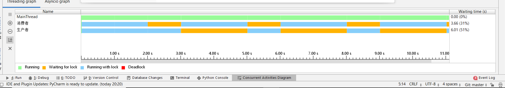

# 多线程

线程和进程：进程是线程的容器，进程不能自己运行，必须依赖线程，所以一个进程至少得拥有一个线程

其实对于单核处理器来说，并不存在真正的多线程或多进程，只是处理器在几个线程中迅速来回切换会给人造成这样的错觉。。。

## 线程创建与管理

python 多线程一般使用threading标准库，其中，

* Thread类用来创建和管理线程，其中target参数接受一个执行多线程的函数，arge元组用来传递函数参数，name可以指定线程名，不指定有默认值。
* start():执行多线程
* join()：如果主进程结束，子进程还未结束，可以使用join()设置等待。
* daemon：设置守护进程

```python
import threading
import time

def demo():
    print('%s 线程开始'% threading.current_thread().name)
    n=0
    while n<4:
        n+=1
        print('%s 线程运行 》》》 %s' % (threading.current_thread().name,n))
        time.sleep(1)
    print('%s 线程结束'% threading.current_thread().name)

print('%s 线程开始'%threading.current_thread().name)
t=threading.Thread(target=demo,name='N01')
t.start()
t.join()
print('%s 线程结束' % threading.current_thread().name)

# 运行结果
# MainThread 线程开始
# N01 线程开始
# N01 线程运行 》》》 1
# N01 线程运行 》》》 2
# N01 线程运行 》》》 3
# N01 线程运行 》》》 4
# N01 线程结束
# MainThread 线程结束
```

* join方法：join是为了实现线程同步的，主线程有时在很短时间就结束了，但子线程还在运行，join可以在主线程运行结束后使主线程进入阻塞状态，直到子线程结束，join可以传入一个timeout参数，它是所有子线程执行时间之和，对于守护进程，outtime时间结束后未完成的子进程会被杀死，对于非守护进程，时间结束主进程终止，子进程继续。
* daemon/setDaemon():用来设置守护进程，True是守护进程，默认为False，如果设置了守护线程，而没有使用任何jion方法，主线程结束子线程会被立刻杀死。

```python
import threading
import time

def demo():
    time.sleep(2)
    print("this is thread---- %s" %threading.current_thread().name)

if __name__ == '__main__':
    start_time=time.time()
    threads=[]
    for t in range(5):
        t1=threading.Thread(target=demo)
        threads.append(t1)
    # 守护进程，当子进程设置为守护进程时，主进程结束，不管子进程有没有执行完毕，直接杀死子进程
    # 如果子进程不是守护模式，主进程结束后直接退出，子进程结束后才退出
    # 用setDaemon和daemon都可以设置守护进程
    # t1.setDaemon(True)
    for t1 in threads:
        t1.daemon=True

    for t1 in threads:
        t1.start()
    # 使用join使主线程在任务结束之后处在阻塞状态,等待子线程任务结束之后再退出
    for t1 in threads:
        # timeout是给每一个线程一个timeout,主线程总的timeout就是所有子线程timeout之和
        # 如果在timeout时间内子线程没有运行结束就会被杀死
        t1.join(0.4)
    print('主进程结束，用时：%lf ' %(time.time()-start_time))

# 运行结果：
# this is thread---- Thread-1
# this is thread---- Thread-5this is thread---- Thread-4

# this is thread---- Thread-3this is thread---- Thread-2
# 主进程结束，用时：2.002643
```

在上面，outtime为0.4，有五个进程，所以总的timeout应该是2s，主进程运行时间特别短，所以基本子进程都可以运行完

运行结果其实和预想的有挺大区别，回车的位置明显不对，这是由于python在输出时会先输出前面的字符串，再输出后面`end`的值，其实就是分了两步，而如果第一步刚运行完，失去时间片，就会导致先输出线程1的一部分，再输出线程2的一部分，再输出线程1的后半部分，这可以用后面的Lock等解决。

Lock/RLock

上面出现的输出问题叫做“线程不安全”可以使用线程锁来解决。
首先实例化一个Lock对象，在线程函数执行前，“抢占”该锁，执行完成后，“释放”该锁，只有拿到该锁，才能执行下面的代码，lock有两种状态，locked和unlocked，如果处在locked状态，则阻塞当前线程并等待其他线程释放锁后使用release()方法把状态修改为unlocked并立即返回，如果锁处在unlocked状态，则调用acquire()方法将其状态转换为locked并立即返回，也就是自己占有了锁，获得🔒用完后要立即释放，否则别的线程只能一直等待。

```python
import threading
import time

class Mythread(threading.Thread):
    def __init__(self):
        threading.Thread.__init__(self)
    def run(self):
        time.sleep(0.5)
        global x,lock
        # 得到 锁,并把🔒的状态置为locked,其他线程阻塞在此,等待🔒被释放 ,只有拿到🔒才能执行后面的代码
        lock.acquire()
        try:
            x+=3
            print(x)
        finally:
            # 释放🔒
            lock.release()

lock=threading.RLock()

t1=[]
for t in range(30):
    s=Mythread()
    t1.append(s)
x=0
for t in t1:
    t.start()

# 运行结果
# 3
# 6
# 9
# 12
# 15

```

condition类：condition类也是为了实现进程同步的，叫做条件变量，是用来解决一些互斥锁解决不了的问题的，比如在某些触发，可以用来实现线程间通信。除了互斥锁的release和acquire方法外，还有wait,notify,notify_all方法

* wait():会阻塞当前线程，并将当前线程移到condition等待池等待通知，只有得到锁才能使用该方法
* notify():选择一个线程唤醒，只能用这个方法唤醒wait，只有得到锁才能使用
* notify_all():唤醒池中所有线程，只有得到锁才能使用

```python
# condition类

# 生产者与消费者，生产者在列表尾部添加元素，直到列表长度达到20，生产者等待，消费者从列表首部删除元素，直到列表为空，消费者等待

import threading
import time
import random

# 定义生产者线程类

class Producer(threading.Thread):
    """生产者线程类,负责在全局列表的尾部添加元素,如果列表长20,就调用wait让该线程等待"""
    def __init__(self,name):
        threading.Thread.__init__(self,name=name)

    def run(self):
        global x,con
        while True:
            con.acquire()
            if len(x)==20:
                # wait 将当前进程放入condition等待池,等待被唤醒,wait必须要得到锁才能使用
                con.wait()
                print("队列已满,生产者等待...")
            else:
                s=random.randint(10,10000)
                x.append(s)
                print('当前列表(生产者):', end='')
                print(x)
                time.sleep(1)
                # 用来唤醒进程,wait只能用notify唤醒
                con.notify()
            # 释放锁
            con.release()

class Consumer(threading.Thread):
    """消费者线程类,如果列表为空,消费者等待,否则弹出栈顶元素"""
    def __init__(self,name):
        threading.Thread.__init__(self,name=name)

    def run(self):
        global x,con
        while True:
            con.acquire()
            if not x:
                con.wait()
                print("消费者等待...")
            else:
                x.pop(0)
                print('当前列表(消费者):', end='')
                print(x)
                time.sleep(2)
                con.notify()
            con.release()

if __name__ == '__main__':
    con=threading.Condition()
    x=[]
    pro=Producer('生产者')
    cons=Consumer('消费者')
    cons.start()
    pro.start()

    pro.join()
    cons.join()

# 运行结果：
# 当前列表(生产者):[5194]
# 当前列表(生产者):[5194, 1398]
# 当前列表(生产者):[5194, 1398, 6653]
# 当前列表(生产者):[5194, 1398, 6653, 4288]
# 当前列表(生产者):[5194, 1398, 6653, 4288, 5264]
# 当前列表(生产者):[5194, 1398, 6653, 4288, 5264, 5536]
# 当前列表(生产者):[5194, 1398, 6653, 4288, 5264, 5536, 4584]
# 消费者等待...
# 当前列表(消费者):[1398, 6653, 4288, 5264, 5536, 4584]
# 当前列表(生产者):[1398, 6653, 4288, 5264, 5536, 4584, 7379]
# 当前列表(生产者):[1398, 6653, 4288, 5264, 5536, 4584, 7379, 4936]
# 当前列表(生产者):[1398, 6653, 4288, 5264, 5536, 4584, 7379, 4936, 3511]
# 当前列表(生产者):[1398, 6653, 4288, 5264, 5536, 4584, 7379, 4936, 3511, 5477]
# 当前列表(生产者):[1398, 6653, 4288, 5264, 5536, 4584, 7379, 4936, 3511, 5477, 8503]
# 当前列表(生产者):[1398, 6653, 4288, 5264, 5536, 4584, 7379, 4936, 3511, 5477, 8503, 6871]
# 当前列表(生产者):[1398, 6653, 4288, 5264, 5536, 4584, 7379, 4936, 3511, 5477, 8503, 6871, 2862]
# 当前列表(生产者):[1398, 6653, 4288, 5264, 5536, 4584, 7379, 4936, 3511, 5477, 8503, 6871, 2862, 5011]
# 当前列表(生产者):[1398, 6653, 4288, 5264, 5536, 4584, 7379, 4936, 3511, 5477, 8503, 6871, 2862, 5011, 4116]
# 当前列表(生产者):[1398, 6653, 4288, 5264, 5536, 4584, 7379, 4936, 3511, 5477, 8503, 6871, 2862, 5011, 4116, 8368]
# 当前列表(生产者):[1398, 6653, 4288, 5264, 5536, 4584, 7379, 4936, 3511, 5477, 8503, 6871, 2862, 5011, 4116, 8368, 6870]
# 当前列表(生产者):[1398, 6653, 4288, 5264, 5536, 4584, 7379, 4936, 3511, 5477, 8503, 6871, 2862, 5011, 4116, 8368, 6870, 4607]
# 当前列表(生产者):[1398, 6653, 4288, 5264, 5536, 4584, 7379, 4936, 3511, 5477, 8503, 6871, 2862, 5011, 4116, 8368, 6870, 4607, 3639]
# 当前列表(生产者):[1398, 6653, 4288, 5264, 5536, 4584, 7379, 4936, 3511, 5477, 8503, 6871, 2862, 5011, 4116, 8368, 6870, 4607, 3639, 7906]
# 当前列表(消费者):[6653, 4288, 5264, 5536, 4584, 7379, 4936, 3511, 5477, 8503, 6871, 2862, 5011, 4116, 8368, 6870, 4607, 3639, 7906]
# 当前列表(消费者):[4288, 5264, 5536, 4584, 7379, 4936, 3511, 5477, 8503, 6871, 2862, 5011, 4116, 8368, 6870, 4607, 3639, 7906]
# 当前列表(消费者):[5264, 5536, 4584, 7379, 4936, 3511, 5477, 8503, 6871, 2862, 5011, 4116, 8368, 6870, 4607, 3639, 7906]
# 当前列表(消费者):[5536, 4584, 7379, 4936, 3511, 5477, 8503, 6871, 2862, 5011, 4116, 8368, 6870, 4607, 3639, 7906]
# 当前列表(消费者):[4584, 7379, 4936, 3511, 5477, 8503, 6871, 2862, 5011, 4116, 8368, 6870, 4607, 3639, 7906]


```

