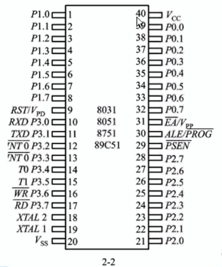
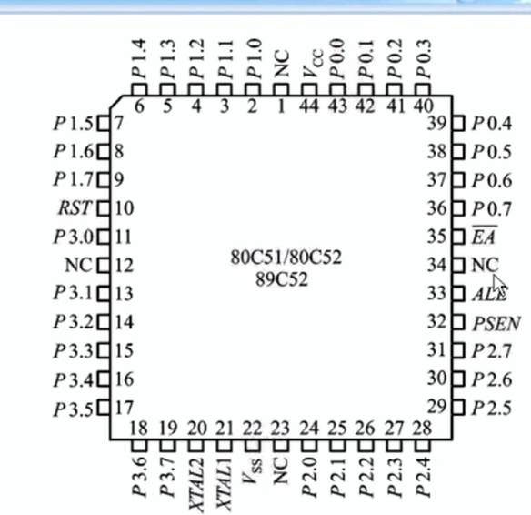
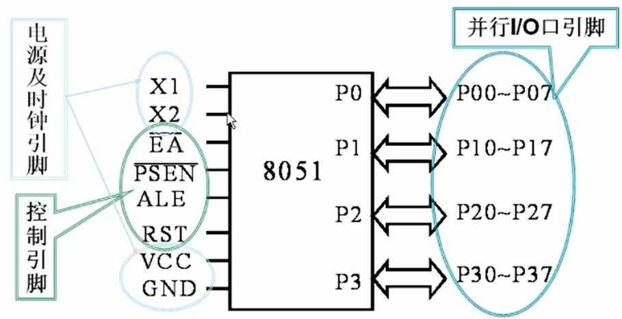

## MCS-51 单片机的硬件结构

## 1. 功能部件

### 1.1 微处理器(CPU)

内部为一个8位CPU，具有字操作和位操作

### 1.2  数据存储器

片内为128字节（52子系列为256个字节）

### 1.3 程序存储器（ROM/EPROM）

* 8031： 无次部件
* 8051：4KROM
* 8751：4KEPROM
* 89C51/89C52/89C55: 4k/8k/20k闪存

### 1.4 I/O口

* P0,P1,P2,P3:四个并行的8位口线
* P0,P2常作为数据存储器使用
* P0口的分时复用：可以即作为数据总线也可以作为地址总线

### 1.5 串行口

全双工的异步串行口，发送接收同时进行

### 1.6 定时/计数器

2个16位，

* 产生精确控制的定时
* 作为计数器
* 作为串行口的波特率发生器

### 1.7  中断系统

中断优先机

### 1.8 特殊功能寄存器SFR（重点）

对片内各功能部件进行管理，控制，监视。实质上是一些控制寄存器和状态寄存器，共有**21**个，是一个具有特殊功能的RAM区

## 2. 引脚

1. 40只3引脚，双列直插封装（DIP）

2. 方型分装（有四只脚无用）

### 2.1 引脚逻辑图

1. 电源引脚：
   * Vcc：40脚，+5V电源
   * Vss：20脚，接地
2. 时钟引脚：
   * XTAL1：19脚接外部晶体的一端，采用外接晶体振荡器时，应该接地
   * XTAL2: 18脚，接外部晶体另一端
3. RST/VPD(9脚)：复位与备用电源【高电平复位，平时低电平】
4. ALE/PROG*(30脚)
   * 第一功能ALE：地址锁存允许控制端，P0作为分时复用口，如果ALE出现下降沿信号，就是地址信号
   * 第二功能PROG*：编程脉冲输入端
5. PSEN*（29脚）：读外部程序存储器的候选信号，可以驱动8个LS型TTL负载
6. EA*/VPP（第31脚）：内外程序存储器选择控制
   * EA*=1：访问片内程序存储器
   * EA*=0：之访问外部程序存储器

