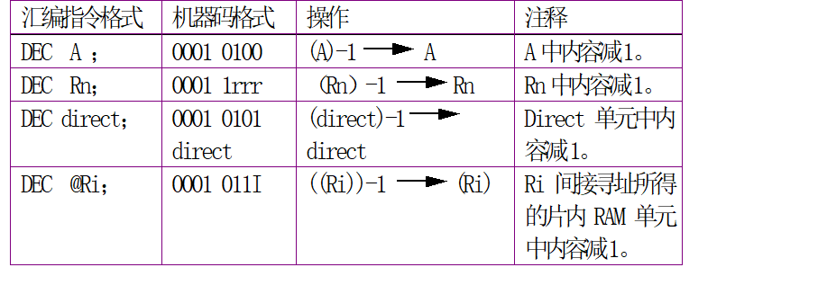
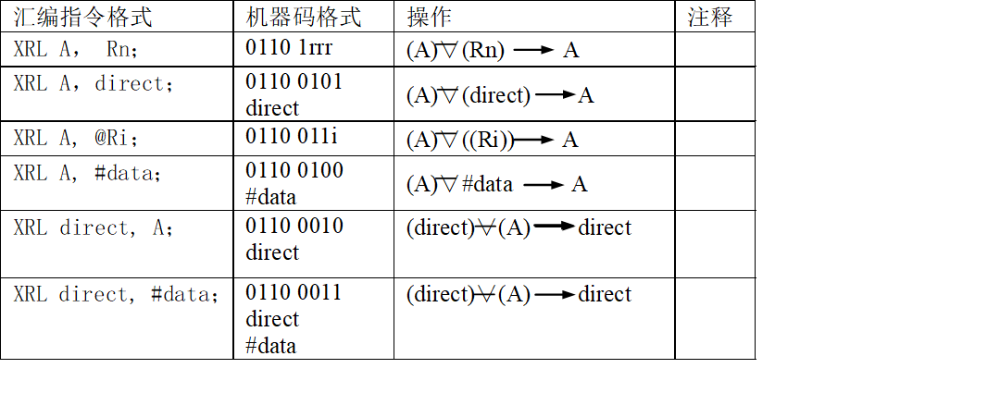

# 指令系统

## 分类

1. 数据传递与交换
2. 算术运算
3. 逻辑运算
4. 程序转移
5. 布尔处理操作（位操作指令）


## 汇编语言的指令格式

* 操作码：指明执行什么性值和类型的操作
* 操作数：指明操作数本身或者操作数所在的地址以及结果保存的地址

格式：


```
<标号> 操作符 目标操作数,源操作数<; 注释>
```

## 指令描述符号

$R_n$: 当前选中的寄存器区中的8个工作寄存器R0～R7（n=0～7）。它在片内数据存储器中的地址由PSW中RS1和RS0确定。

$R_i$ : 当前选中的寄存器区中的2个工作寄存器R0、R1（i=0，1）

direct: 8位的片内RAM单元（包括SFR）的地址

#data8: 8位常数

#data16: 指令中的16位常数

addr16: 16位目的地址

rel: 8位补码形式的8位地址偏移量，在`-128~127`之间

DPTR： 数据指针，用作16位地址寄存器

A: 累加器

B: 专用寄存器，用于乘除指令

C: 进位标志或进位位，或布尔处理机中的累加器

bit： 内部RAM或专用寄存器中的直接寻址地址

@：简址寄存器或基址寄存器前缀

`/`: 位操作数的前缀，表示对该位操作数取反，如/bit。

`*`: 片内RAM的直接地址或寄存器

`(*)`: 由`*`寻址的单元中的内容


## 指令系统的寻址方式

寻找指令中操作数或操作数所在地址的方法

1. 立即寻址

   指令中直接给出操作数的寻址方式。在这种寻址方式中，紧跟在操作码之后的操作数称为立即数。立即数可以为一个字节，也可以是两个字节，并要用符号“＃”来标识。由于立即数是一个常数，所以只能作为源操作数。立即数表示方法：#data8，#data16。

2. 直接寻址

   指令中直接给出操作数地址的寻址方式。指令操作码之后的字节存放的是操作数的地址，操作数本身存放在该地址的存储单元中。

3. 寄存器寻址

   操作数存放在寄存器中，指令中直接给出该寄存器名称的寻址方式。

   * 寻址范围
     * 4组通用工作寄存Rn（R0~R7）共32个工作寄存器
     * 特殊功能寄存器，例如A【写成Acc是直接寻址】、B 【只有乘除指令是寄存器寻址】以及数据指针寄存器DPTR等。

4. 寄存器间接寻址

   寄存器中的内容为地址，该地址的内容为操作数的寻址方式称为寄存器间接寻址 。

   * 寻址范围
     * 访问内部RAM低128个单元，其通用形式为@Ri
     * 对外部RAM的64K字节的间接寻址
     * 片外数据存储器的低256字节

5. 变址寻址

   此种寻址方式又称为基址寄存器加变址寄存器间接寻址。在89C51中以程序计数器PC或数据指针DPTR作为基址寄存器，以累加器A作为变址寄存器。基址寄存器的内容与变址寄存器的内容之和作为操作数地址。主要用于查表操作。

   * **只能访问程序存储器，访问范围位64k**

6. 相对寻址

   相对寻址是以程序计数器PC的当前值为基准，加上指令中给出的相对偏移量 rel 形成目标地址的寻址方式 。该类寻址方式**主要用于跳转指令**。

7. 位寻址

   位寻址对位地址中的内容作位操作的寻址。位寻址实际是一种直接寻址方式，由指令给出直接位地址。与直接寻址不同之处在与位寻址给出的是位地址，而不是字节地址。


## MCS-51指令系统

MCS-51指令系统由111条指令组成。其中，单字节指令49条，双字节指令45条，三字节指令17条。

从指令执行时间看，单周期指令64条，双周期45条，只有乘、除指令为4个周期。

### 传输类指令（28条）


#### 以累加器A为目的操作数的指令(4条)


| 指令格式    | 操作         | 注释 |
| ----------- | ------------ | ---- |
| MOV A $R_n$ | ($R_n$) -> A |      |
|             |              |      |
|             |              |      |
|             |              |      |


#### 以寄存器Rn为目的操作数的指令（3条）


> 注意：
>
> 1、源操作数有寄存器寻址、直接寻址、和立即寻址
>
> 2、89C51指令系统中没有“**MOV Rn，Rn**”传送指令。
>
> 3、89C51指令系统中没有“**MOV Rn，@Ri**”传送指令

#### 以直接地址为目的操作数的指令（5条）


> 注意：
>
> 1、源操作数有寄存器、直接地址、寄存器间接寻址、和立即数寻址。
>
> 2、MOV direct,direct 指令在译成机器指令时，源地址在前，目的地址在后，
>
> 例如：
>
> MOV 0A0H，90H
>
> 机器码为：8590A0

#### 以间接地址为目的操作数的指令（3条）


> 说明：
>
> 1、源操作数为累加器A、直接地址、和立即数。
>
> 2、源操作数不能为工作寄存器Rn，也不可以再使用间接寻址方式,即@Ri。

#### 16位数据传输指令（1条）


> 这条指令的功能是把16位常数送入DPTR。
>
> DPTR由DPH和DPL组成。

#### 查表指令（2条）


#### 累加器A与片外RAM传输指令（4条）


#### 栈操作（2条）


* 只能直接寻址

#### 交换指令（4条）

1. 目标交换指令

   

   > 将第二操作数所指定的工作寄存器Rn(R0~R7),
   >
   > 直接寻址和间接寻址的单元内容与累加器A中内容互换。
   >
   > 注：目的操作数只能为寄存器A

2. 半字节交换指令

   

   > 这条指令为低半字节交换指令。该指令将累加器A的低4位与R0或R1所指出的片内RAM单元的低4位数据相互交换，各自的高4位不变，
   >
   > 注：源操作数只能间接寻址

### 运算类指令

#### 加法指令（8条）

##### 不带进位的加法指令（4条）


##### 带进位的加法指令（4条）


#### 减法指令（带借位）（4条）


#### 乘法指令（1条）


#### 除法指令（1条）


> 该指令执行后，CY和OV均被清0。	若原（B）=00H，则结果无法确定，用OV=1表示，CY仍为0。

#### 加一指令（5条）


> 该组指令的操作不影响PSW。若原单元内容为FFH，加1后溢出为00H，也不影响PSW标志。

#### 减一指令（4条）



> 除DEC A影响奇偶标志位外，其余指令不对PSW产生影响。不存在DEC DPTR

#### 十进制调整指令（1条）


> （1）这条指令跟在ADD或ADDC指令后, 
> （2）两个加数必须是BCD码。
> （3）只能对累加器A中的结果进行调整。
> 必须注意，本指令不能简单地把累加器A的16进制数变换成BCD码，也不能用于十进制减法的调整。

### 逻辑操作指令（25条）

#### 1. 简单操作指令（2）

1. 累加器A 清零


2. 累加器取反

   

#### 2. 移位指令（4）

1. 累加器A循环左移指令

   

2. 累加器A循环右移指令 

   

3. 累加器A连同进位位循环左移指令

   

4. 累加器A连同进位位循环右移指令

   

#### 3. 累加器半字节交换指令 


#### 4. 逻辑“与”（6）


> 注意：
>
> 1、 这组指令中前四条指令是将累加器A的内容和源操作数所指出的内容按位进行逻辑“与”，结果存放在A中。
>
> 2、后两条指令是将直接地址单元中的内容和源操作数所指出的单元的内容按位进行逻辑“与”，结果存入直接地址单元中。
>
> 3、目的操作数只能是累加器A和直接地址
>
> 4、目的操作数是直接地址，源操作数只能是累加器A和立即数

#### 5. 逻辑“或”（6条）


#### 6. 逻辑“异或”（6条）



### 程序控制类指令

#### 无条件转移指令（4条）

无条件指令是指，当程序执行到该指令时，程序无条件转移到指令所提供的地址处执行。无条件转移指令有短转移、长转移、相对转移、和间接转移（散转指令）。

##### 短转指令


这条指令提供了11位地址，可在2K范围内无条件转移到由a10-a0所指出的地址单元中。
指令只提供低11位地址，高5位为原PC11-15位值，因此，转移的目标地址必须在AJMP指令后面指令的第一个字节开始的同一2K字节范围内。

##### 长转移


指令提供16位目标地址，将指令的第二、第三字节地址码分别装入PC的高8位和低8位中，程序无条件转向指定的目标地址去执行。
由于直接提供16位目标地址，所以程序可转向64K程序存储器地址空间的任何单元。

##### 相对转移（短转移）指令


指令的操作数是相对地址，rel是一个带符号的偏移字节数,其范围为-128～+127（00H～7FH对应表示0～+127，80H～FFH对应表示-128～-1），

负数表示反向转移，正数表示正向转移。该指令为二字节，执行时先将PC内容加2，再加相对地址，就得到了转目标地址。

> 256字节

##### 间接转移（散转指令）


该指令的转移地址由数据指针DPTR的16位数和累加器A的8位数作无符号数相加形成，并直接送入。指令执行过程对DPTR、A和标志位均无影响。这条指令可代替众多的判别跳转指令，具有散转功能。

#### 空操作


 这是一条单字节指令，除PC加1外，不影响其它寄存器和标志位。“NOP”指令常用于产生一个机器周期的延迟

#### 条件转移（8条）

##### 1. 判0转移指令


JZ和JNZ指令分别对累加器A的内容为全零和不为零进行检测并转移，当不满足各自的条件时，

程序继续往下执行，当各自的条件满足时，则程序转向指定的目标地址。其目标地址是以下一条指令第一个字节的地址为基础加上指令的第二个字节中的相对偏移量。相对偏移量为一个带符号的8位数，偏移范围为-128—+127字节。

本指令不改变累加器A内容和影响任何标志位。

##### 2. 比较转移指令(4条)


目标操作数减去原操作数，影响标志

> 1、它的功能是对指定的目的字节和源字节进行比较，若它们的值不相等，则转移。转移的目标地址为PC的当前值（PC）=PC+3 ， PC再加指令的第三字节带符号的8位偏移量（rel）。
>
> 2、若目的字节内的数大于源字节内的数，则清0进位标志位Cy；若目的字节数小于源字节数，则置位进位标志位Cy；若二值相等，则往下执行。
>
> 3、本指令执行后不影响任何操作数

