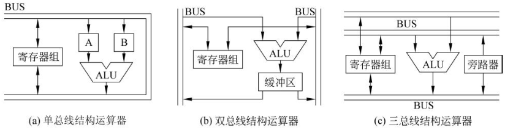

# 微处理器概述

微处理器（CPU）是计算机系统的核心部件，控制和协调这整个计算机系统的工作，主要功能有：

组成部分：

* 运算器
* 控制器
* 寄存器组

## 概述

### 运算器

组成：

* 算逻运算单元ALU
* 通用或专用寄存器
* 总线

根据内部总线数量不同，运算器可分为：

### 控制器

作用：控制程序执行（系统的指挥中心），基本功能是：

1. 指令控制
2. 时序控制
3. 操作控制

组成：

1. 程序计数器PC
2. 指令寄存器IR
3. 指令译码器ID
4. 时序控制部件
5. 微操作控制部件
   * 一组微操作叫微指令

结构：

## 8088/8086微处理器

v