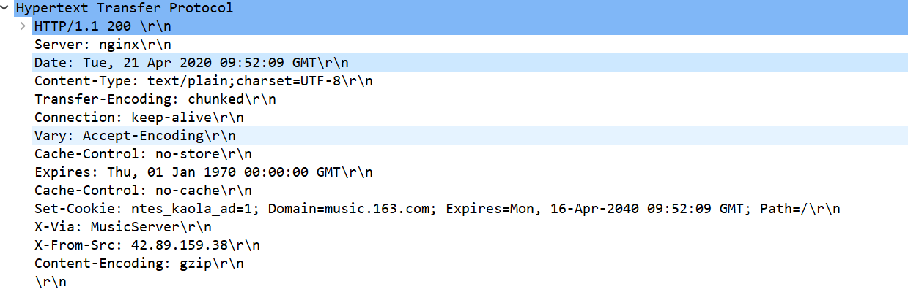

# 计算机网络问题总结

## OSI七层模型和TCP/IP 五层模型


### 常见协议

网际层：

1. **ARP**： 地址解析协议，根据IP地址获取物理地址
   * ARP缓存：A要获取某个IP对应的MAC地址B时，先从ARP缓存中找，找不到向局域网中所有主机发生ARP请求包，其他主机收到ARP包后于自己的MAC地址做对比，如果找的不是自己，就丢弃这个包，否则B将A的IP和Mac地址更新到自己的缓存中，同时向A发送自己的MAC地址。
   * ARP欺骗：
2. **ICMP**： Internet控制报文协议， ping就是基于这个协议

传输层：**TCP**， **UDP**

应用层： **HTTP**， **FTP**，**DNS**

## HTTP协议

超文本传输协议

### HTTP报头




### 状态码

| 状态码  | 作用                                                         |
| ------- | ------------------------------------------------------------ |
| 1xx     | 信息性状态码，表示接受的信息正在处理                         |
| 2xx     | 正常响应                                                     |
| 3xx     | 重定向                                                       |
| **301** | Moved Permanently 永久重定向                                 |
| **302** | Found 暂时重定向，请求的资源被暂时的移动到了由[`Location`](https://developer.mozilla.org/zh-CN/docs/Web/HTTP/Headers/Location) 头部指定的 URL 上。 |
| 4xx     | 客户端异常                                                   |
| **404** | Not Found 访问的资源不存在                                   |
| **401** | Unauthorized 缺乏用户凭证                                    |
| **403** | Forbidden 拒绝授权访问                                       |
| 5xx     | 服务端异常                                                   |
| **500** | 服务器异常                                                   |
| **502** | 错误的网关                                                   |


### HTTP和HTTPS的区别

Http: 超文本传输协议

Https: 基于安全套接字的超文本传输协议

区别：

1. HTTP使用明文进行数据传输，HTTPS基于SSL(安全套接字协议)对数据进行加密传输
2. 使用HTTPS需要向CA机构申请证书
3. HTTP默认80端口， HTTPS默认443端口
4. 建立HTTPS连接需要首先协商安全等级，建立会话密钥，耗时和功耗比HTTP多。
5. HTTPS不是绝对安全的

HTTPS建立连接的过程：

1. 客户端浏览器通过URL请求与服务器建立HTTPS连接
2. 服务器将自己的证书(包含公钥)发送给浏览器，浏览器检查证书是否正确,
3. 浏览器产生一个随机的会话密钥,并用公钥对会话密钥进行加密后发送给服务器
4. 服务器使用自己的私钥解密出会话密钥,
5. 双方使用会话密钥握手建立连接


### HTTP请求方式

```txt
GET POST PUT DELETE HEAD OPTIONS TRACE CONNECT
```

> 1. `OPTIONS`: 返回服务器针对特定资源所支持的HTTP请求方法，也可以利用向web服务器发送‘*’的请求来测试服务器的功能性
>
> 2. `HEAD`: 向服务器索与GET请求相一致的响应，只不过响应体将不会被返回。这一方法可以再不必传输整个响应内容的情况下，就可以获取包含在响应小消息头中的元信息。
>
> 3. `GET`: 向特定的资源发出请求。注意：GET方法不应当被用于产生“副作用”的操作中，例如在Web Application中，其中一个原因是GET可能会被网络蜘蛛等随意访问。Loadrunner中对应get请求函数：web_link和web_url
>
> 4. `POST`: 向指定资源提交数据进行处理请求（例如提交表单或者上传文件）。数据被包含在请求体中。POST请求可能会导致新的资源的建立和/或已有资源的修改。 Loadrunner中对应POST请求函数：web_submit_data,web_submit_form
>
> 5. `PUT`: 向指定资源位置上传其最新内容
>
> 6. `DELETE`: 请求服务器删除Request-URL所标识的资源
>
> 7. `TRACE`: 回显服务器收到的请求，主要用于测试或诊断
>
> 8. `CONNECT`: HTTP/1.1协议中预留给能够将连接改为管道方式的代理服务器。
>
> https://www.cnblogs.com/weibanggang/p/9454581.html

#### GET和POST的区别

[99%的人都理解错了HTTP中GET与POST的区别](https://mp.weixin.qq.com/s?__biz=MzI3NzIzMzg3Mw==&mid=100000054&idx=1&sn=71f6c214f3833d9ca20b9f7dcd9d33e4#rd)

* 诸如能被收藏,回退,历史纪录之类的

* GET参数在URL后面(不适合敏感数据),POST数据在请求体中

* GET请求在URL中传送的参数是有长度限制的，而POST么有。

  > （大多数）浏览器通常都会限制url长度在2K个字节，而（大多数）服务器最多处理64K大小的url。

* 原帖说POST发两次包,抓包并没有发现这个事情,查资料发现确实存在先发头,再发请求体的情况[HTTP POST请求发送两个TCP包？](https://blog.csdn.net/zerooffdate/article/details/78962818?depth_1-utm_source=distribute.pc_relevant.none-task-blog-BlogCommendFromBaidu-1&utm_source=distribute.pc_relevant.none-task-blog-BlogCommendFromBaidu-1)

### 长连接和短连接

* 短连接: 建立连接 -> 传输数据 -> 断开连接
* 长连接: 建立连接 -> 传输数据 -> 维持连接(心跳包) -> 发送数据 -> .... -> 断开连接
  * `Connection:keep-alive`

使用场景

* 短连接: Web服务
* 长连接: 点对点会话, 频繁通信

## TCP三次握手和四次挥手

[TCP三次握手和四次挥手](https://baijiahao.baidu.com/s?id=1654225744653405133&wfr=spider&for=pc)

## TCP和UDP的区别

## 输入URL到页面渲染发生了什么

1. 解析协议，域名，端口 
2. DNS解析得到域名对应的IP
3. 封装成HTTP/HTTPS请求报文
4. TCP三次握手建立连接
5. 网际层使用ARP协议解析出IP对应的MAC地址
6. 链路层和物理层传输数据
7. 服务端逐层解包到HTTP／HTTPS，解析出客户端请求
8. 服务端封装响应包（状态码等）发送给客户端
9. 客户端浏览器根据响应的HTML，CSS, 等渲染页面(构建DOM树，构建渲染树，布局渲染树，绘制渲染树)
10. 客户端主动断开连接
11. 四次挥手

### Cookie和session的区别

## 其他

1. 2.tcp三次握手

   1）tcp怎么保证可靠性

   2）tcp要是传输的顺序不对怎么处理

