> TCP和UDP的区别

* TCP面向连接，可靠
* UDP面向无连接，不可靠，快

> 三次握手，四次挥手

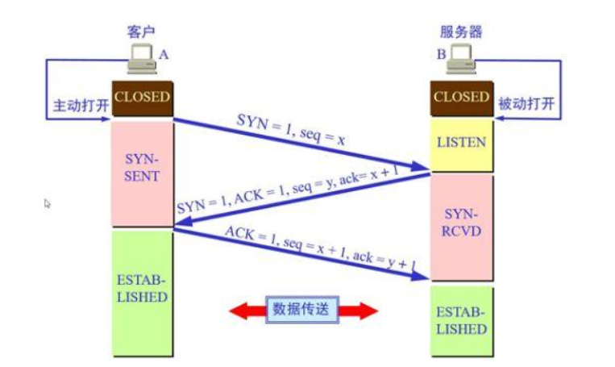

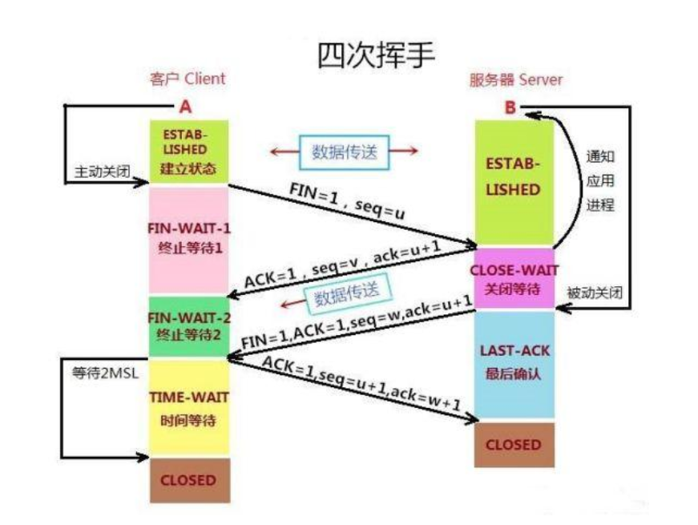

> 滑动窗口

[滑动窗口](https://baijiahao.baidu.com/s?id=1650553452294041970&wfr=spider&for=pc)

> 打开浏览器，输入网址到页面响应经历了哪些过程

* 域名解析
* DNS解析
* 封装HTTP包
* TCP三次握手建立连接
* 发送请求
* 服务端接受到返回响应
* 渲染

> Java垃圾回收

> Java中Hashmap与Hashtable的区别

* HashMap 线程不安全
* HashTable弃用了， 线程安全，syn直接锁，改用ConHashMap

> LinkedList和ArrayList的区别

* LinkedList使用双链表，ArrayList使用数组
* ArrayList适合随机读

> cookie和session

* cookie保存在客户端，session保存在服务器
* session比cookie更安全
* session更占服务器内存
* cookie有大小限制（4K）且同一站点一般只能有20个cookie，session存在服务器，没限制
* cookie可以设置过期时间，session一般关了浏览器就销毁

[cookie和session](https://www.cnblogs.com/l199616j/p/11195667.html)

> 数据库事务和隔离级别

* 事务：一组操作，要么都执行，要么都不执行
  * 事务的特征：原子性，一致性，隔离性，持久性
  * 并发事务带来的问题：脏读，幻读，不可重复读
  * 数据库隔离级别：
    * READ-UNCOMMITTED: 读取未提交，导致脏读，幻读，不可重复读
    * READ-COMMITTED: 读取已提交，导致幻读和不可重复读
    * REPEATABLE-READ: 可重复读：可能导致幻读
    * SERIALIZABLE： 可串行化：所有事务依次执行，可防止脏读幻读，不可重复读。

> 长连接，短连接

* 短连接传送完数据就会关闭连接
* 长连接发送完数据后会持续发送心跳包来维持连接
* 长连接适用于操作频繁的场景，如： **点对点通信**，**数据库连接**
* 短连接适用于向web网站的HTTP连接等场景（如果使用长连接会造成系统资源的巨大开销）

> 进程和线程的区别

* 进程是资源调度和分配的最小单位
* 线程属于进程，一个进程中可以有多个线程
* 各个进程间是独立的，但线程不一定
* 线程切换开销比进程小

> 进程状态

* 创建（NEW）
* 就绪（READY）
* 运行（RUNNING）
* 阻塞（WAITING）
* 结束（TERMINATED）
* 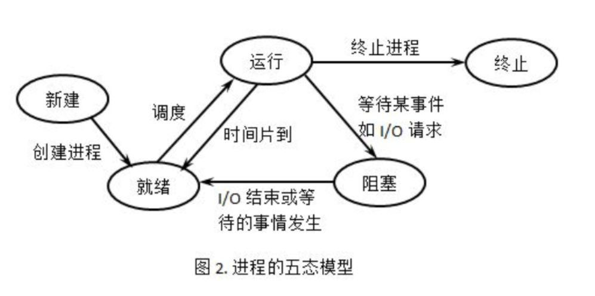

> 进程间通信方式

* 管道
* 信号量
* 消息队列
* 共享内存
* 套接字

> 线程间同步的方式

* 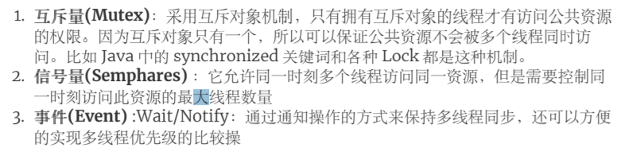

> 进程调度算法

* 先到先服务（FCFS）
* 短作业优先算法
* 时间片轮转算法
* 优先级调度
* 多级反馈队列

> GET和POST的区别

* get使用URL传参，POST在请求体中
* POST相比GET更加安全
* GET能被保存
* GET参数长度一般有限制

> CDN

* 内容分发网络

> 死锁的四个条件

* 互斥条件
* 不可剥夺条件
* 请求保持
* 循环等待

> 死锁产生的原因

* 竞争不可抢占资源不当
* 竞争可消耗资源不当
* 进程推进顺序不当

> DNS

* 在应用层,使用UDP

> python GIL

* Cpython 中,全局解释器锁,无法充分利用多核服务器优势

> *args 和 **kwargs

* 可变类型参数, `*args`是一个元组, `**kwargs`是一个字典

> 在函数里输入一个变量，这过程中内存发生了什么，哪些值会变化

* python函数传引用

> python 装饰器

* 装饰器带参数

* 函数带参数

* ```python
  import time
  
  def run_time(func):
      
      def _func(*args, **kwargs):
          start = time.time()
          result = func(*args, **kwargs)
          print(f"use {time.time() - start} s")
          return result
      return _func
  
  
  @run_time
  def test(a: int):
      time.sleep(2)
      print(a)
  
  
  if __name__ == "__main__":
      test(2)
  ```


> 讲一下TCP的流量控制

* [TCP流量控制和拥塞控制](https://blog.csdn.net/zgege/article/details/80445324)

* 窗口U最大65535(TCP头部窗口字段长度１６位)

* 窗口扩大因子M  实际窗口大小是U左移M位

* 慢开始机制

  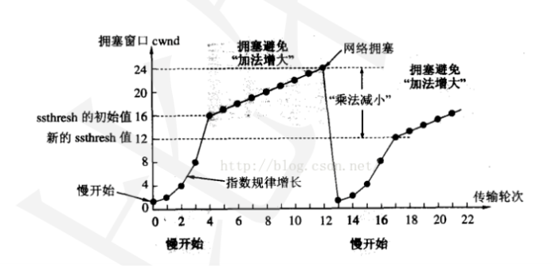

> Python内存里的堆和栈你知道吗，往这两个哪里存数据比较快

* 堆里面存放具体对象,栈里存放对象地址

> `__init__`

* 初始化

> 深拷贝和浅拷贝

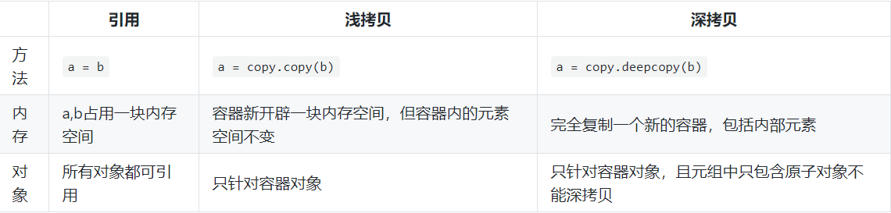

> python垃圾回收机制

* 引用计数
* 标记清除
* 分代回收

> Python的用户态和内核态的区别，平时运行代码比较多的是哪种

> HTTP请求头包含什么信息


* 请求方法, URL, 版本协议
* 头部字段: Host, Connection, UA

> HTTP状态码，301和302的区别

* 301 永久重定向, 302暂时重定向

> equals和==的区别

* Java `==`判断对象, `equals`判断值
* python `is`判断对象, `==`判断值

> 知道Junit 吗

> python内存管理

* pyObject: 双向链表,引用计数, 类型, 值
* pyVarObject: 双向链表,引用计数, 类型, 值, 数量

> Java的exception知道的有哪些

* 继承自`Throwable`
* 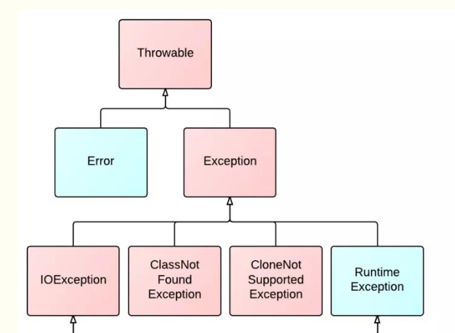

> 内存泄漏和内存溢出

* 内存泄漏: 垃圾占用内存,无法使用
* 内存溢出: 内存泄漏的结果,内存不够用了

> 数据库索引

* 原理: 优化后的B+ 树
* 创建索引的目的:
  * 提高检索速度
  * 创建唯一性索引, 保证数据唯一性
  * 加快表与表之间的连接
* 索引的缺点:
  * 占用额外的空间
  * 增加插入删除时的时间
* 创建索引的原则:
  * 频繁查询,不频繁修改的数据
  * 需要排序的字段
  * 重复值多的列不适宜用索引
  * 很大的字段不适合用索引
* 聚簇索引和非聚簇索引
  * 聚簇索引百的叶节点就是数据节点，而非聚簇索引的叶节点仍然是索引节点，并保留一度个链接指向对应数据块。
  * 聚簇索引适合排序
* 创建索引
  * 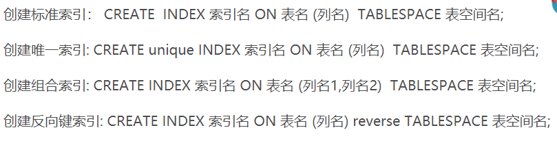

> B树， B+ 树

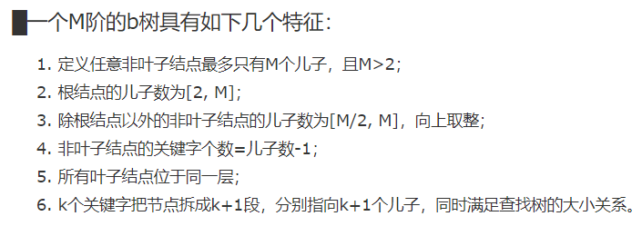

* B+ 树

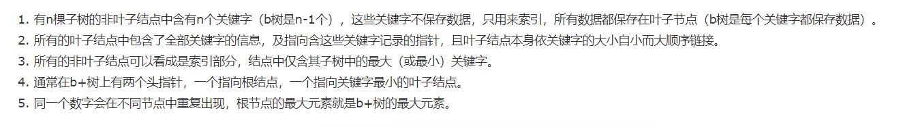


> 单例模式

* python
  * 重写`__new__`
  * 装饰器
  * 共享属性
  * 模块
* Java
  * 二重检查锁实现线程安全的单例

> 排序算法

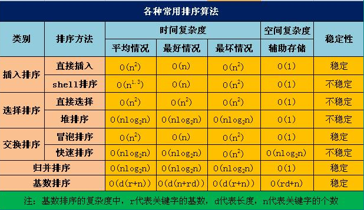

> 平衡二叉树

> LRU