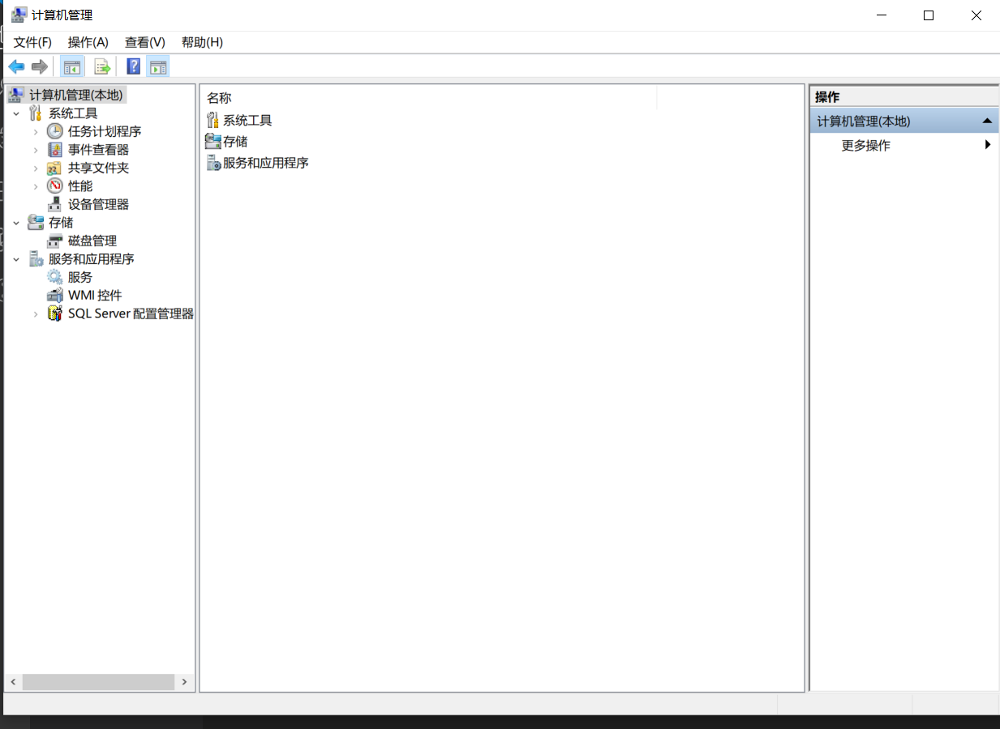
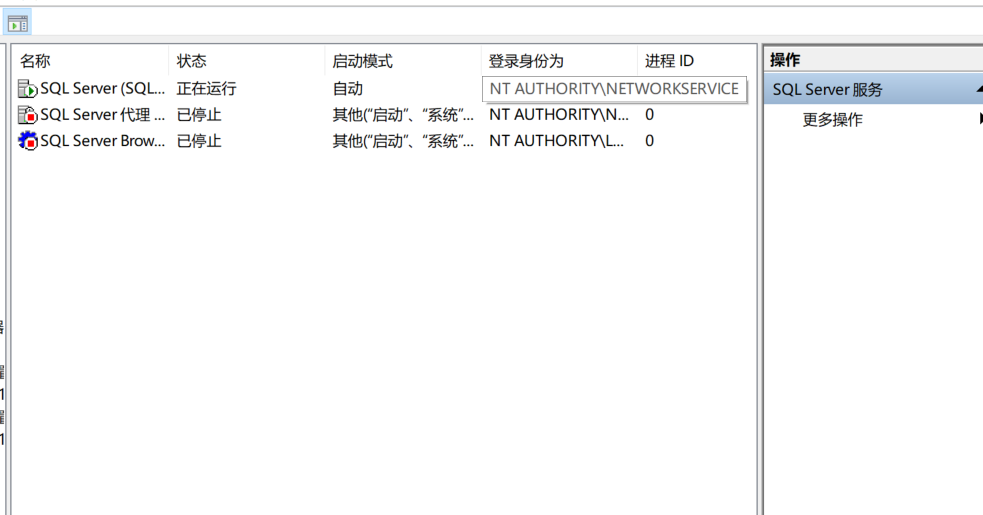
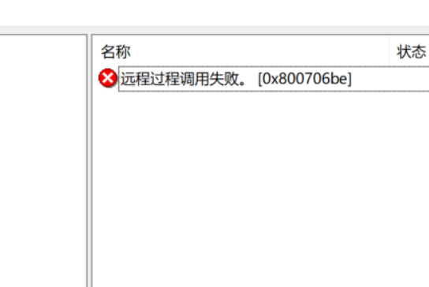
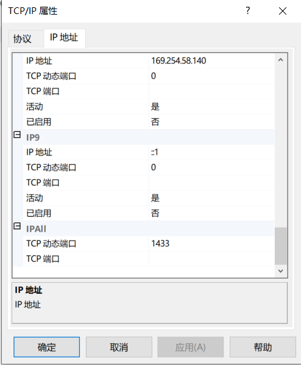
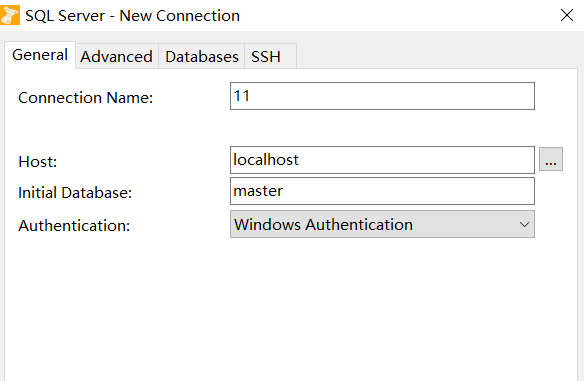
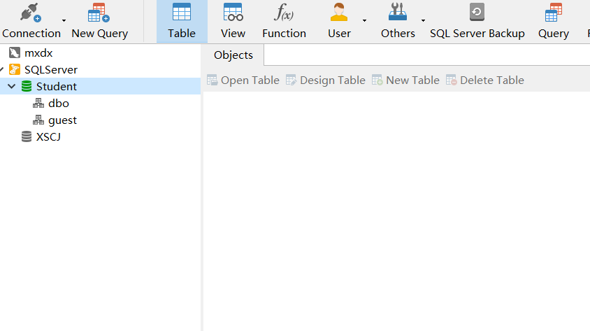

# Navicat Premium连接SQL Server

步骤：

1. 激活SQL Server 服务
2. 配置SQL Server网络配置
3. 连接SQL Server

## 激活SQLServer服务

直接搜索 **计算机管理** 点 **服务和应用程序**， 点 **SQL Server**配置管理器， 双击第一个**SQL Server服务**

不出意外的话，是这样的

如果出现这个 远程过程调用失败，那你一定是安装了Visual Studio，你需要卸载
**Microsoft SQL Server 2016 Express LocalDB**（控制面板->程序和功能）

最后：右键第一个，启动SQL Server服务

## 网络配置

双击第二个网络配置，再双击TCP/IP，点IP地址，拉到最下面，把TCP动态端口改为1433，确定，然后再右击TCP/IP，启用这个服务。

最后重启SQL Server服务

## 连接SQL Server

新建连接(Connection) -> SQL Server -> 随便起个名字 -> host设置为**localhost**或**127.0.0.1** -> 使用window验证连接 -> 测试连接 -> 如果测试通过，就ok了

这就好了！

