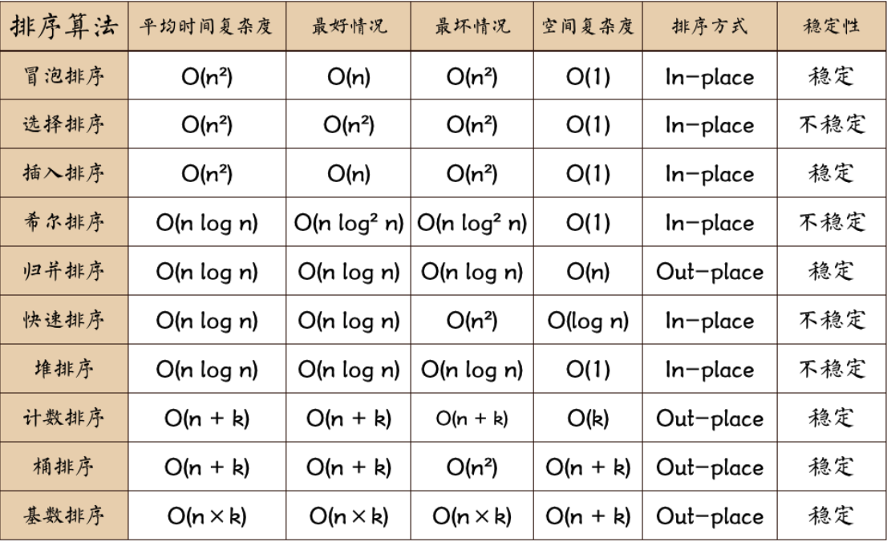

## 链表

## 排序算法



### 快速排序

原理： 找到一个中间值pivote，使得它左边的值都比他小，右边的值都比他大，然后对pivote两边的值分别递归进行快排

* 时间复杂度：$O(n \log{n})$
* 空间复杂度：$O(\log{n})$
* 不稳定

```python
class QuickSort:

    @staticmethod
    def get_pivot(nums: list, left: int, right: int):
        # 第一次选最左边的元素为pivote
        pivot = nums[left]
        while left < right:
            # 先从右往左看，如果发现right指向的值比pivote小，
            # 就停止往前寻找并把这个值赋值给left值的位置
            while nums[right] > pivot and left < right:
                right -= 1
            nums[left] = nums[right]
            # 右边停下后，从左往右看
            while nums[left] < pivot and left < right:
                left += 1
            nums[right] = nums[left]
        # 最后把pivote还给left指的位置
        nums[left] = pivot
        return left


    def quick_sort(self, nums: list, left: int, right: int):
        if left < right:
            pivot = self.get_pivot(nums, left, right)
            self.quick_sort(nums, left, pivot - 1)
            self.quick_sort(nums, pivot + 1, right)

    
    def run(self, nums: list):
        self.quick_sort(nums, 0, len(nums) - 1)
        print(nums)


if __name__ == '__main__':
    QuickSort().run([5, 9, 3, 4, 7, 1])

```

### 选择排序

每次从未排序的序列中找到最小的放在前面

### 插入排序

```txt
[5, 9, 3, 4, 7, 1]
[5, 9, 3, 4, 7, 1]
[5, 3, 9, 4, 7, 1]
[3, 5, 9, 4, 7, 1]
[3, 5, 4, 9, 7, 1]
[3, 4, 5, 9, 7, 1]
...
```

找到小的一直往前走

适用于大致有序的序列

### 希尔排序

改进的插入排序，先分组，对每个组进行插入排序，使得整个序列大致有序，最后再进行一次插入排序

### 归并排序

递归，将两个有序数列归并成一个有序数列


树

