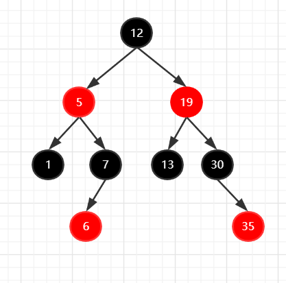
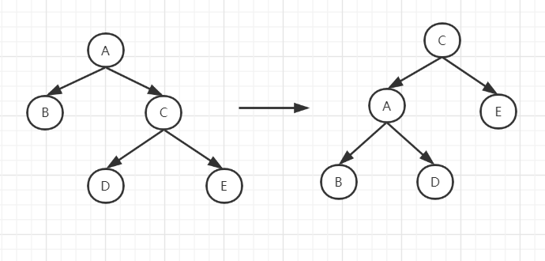
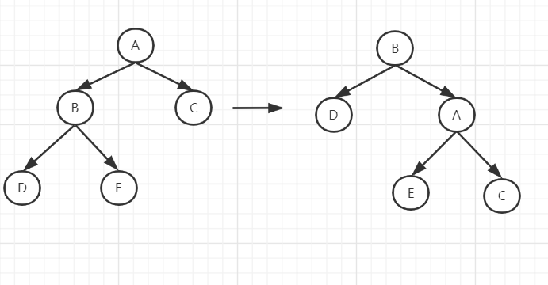
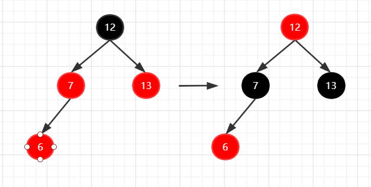
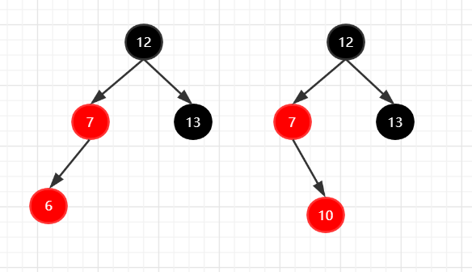
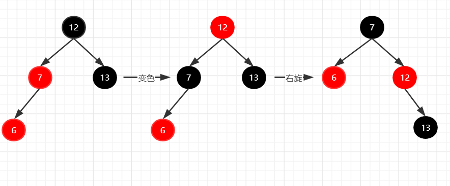
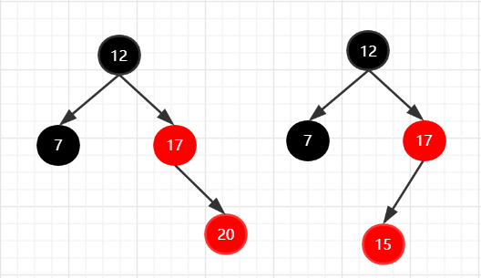
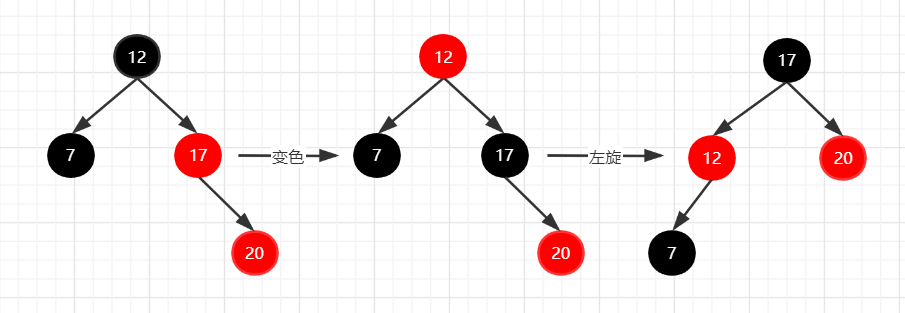
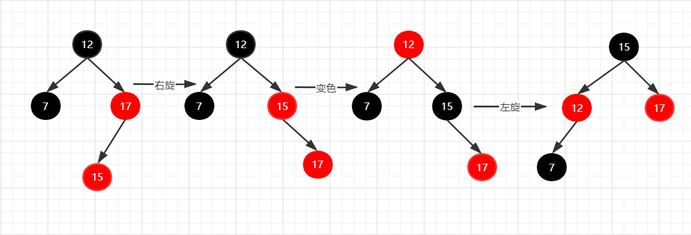

# 红黑树

红黑树实质上是一棵自平衡的二叉查找树，引入带颜色的节点也是为了方便在进行插入或删除操作时，如果破坏了二叉查找树的平衡性能通过一系列变换保持平衡。

## 红黑树的性质

1. 每个节点要么是红色，要么是黑色
2. 根节点必须是黑色
3. 两个红色节点不能相连
4. 从根节点出发到达任意叶子节点经过的黑色节点个数相同

## 红黑树的数据结构

红黑树实质上是一颗二叉查找树，左子树的值小于根节点的值，右子树的值大于根节点的值。



```java
public class RedBlackTree {
    private static int BLACK = 1;
    private static final int RED = 0;

    private static Node root;

    private static class Node {
        private int color = RED;
        private int data;
        private Node left;
        private Node right;
        private Node parent;

        Node(int data) {
            this.data = data;
        }
    }
}
```

## 红黑树的插入

插入的节点默认是红色的（要不然全是黑色节点它也满足红黑树的定义，不过就没意义了）；

由于红黑树是一颗二叉查找树，所以它的插入可以使用递归（先不考虑破坏红黑树的结构）

```java
    /**
     * 通过递归往红黑树中插入一个新节点
     * @param root 要插入的树的根节点
     * @param data 新节点的值
     */
    private void insert(Node root, int data) {
        if(root.data > data) {
            if(root.left == null) {
                Node node = new Node(data);
                root.left = node;
                node.parent = root;
            } else {
                insert(root.left, data);
            }
        }else {
            if(root.right == null) {
                Node node = new Node(data);
                root.right = node;
                node.parent = root;
            } else {
                insert(root.right, data);
            }
        }
    }
```

### 调整结构

新插入节点后，可能破坏红黑树的定义，虽然红黑树的定义有四条，前两条都是确定了的，不会因为新添加节点而被破坏，只需要关注第三条就可以了（满足前三条第四条就会自然满足）

```java
    /**
     * 判断插入新节点后红黑树结构是否需要变化
     * 根据红黑树的定义，两个红色节点不能连接
     * @param root 插入的新节点
     * @return 返回true表示插入新节点后破坏了红黑树的结构，
     *         需要通过旋转变色来纠正，否则不需要修改。
     */
    private boolean checkStruct(Node root) {
        return root.color == RED && root.parent.color == RED;
    }
```


所以只要新插入的节点的父节点是红色，就需要调整结构。调整结构的办法有三种：

#### 1. 变色

就是把红色变为黑色，黑色变为红色

#### 2. 左旋



以节点C为轴左旋的步骤：

1. 将C的父节点A沉下来，C升上去作为新的父节点
2. 将原来C的左子树挂到A的右子树上
3. 其他不变


```java
        /**
         * 左旋
         *   - 旋转前的右子节点变成旋转后的父节点
         *   - 旋转前的父节点（轴）变为旋转后父节点的左子节点
         *   - 旋转前轴的右子节点的右子节点旋转后变为轴的右子节点
         *   - 旋转前右子节点的左子树变成旋转后左子节点的右子树
         *   - 其他不变
         * @param node 以该节点为轴旋转
         */
        private static void leftSpin(Node node) {
            Node nextFather = node.right;
            nextFather.parent = node.parent;
            node.right = node.right.left;
            nextFather.left = node;
            connectParent(node, nextFather);
        }
```

#### 3. 右旋

右旋和左旋正好相反



以B为轴右旋的步骤：

1. 将B的父节点A沉下来，B升上去作为新的父节点
2. 将原来B的右子树接到新的A的左子树的位置


```java
        /**
         * 将变换后的树和它上面的节点连接
         * @param node 变换前的轴
         * @param nextFather 变换后的子树
         */
        private static void connectParent(Node node, Node nextFather) {
            // 如果变换的是根节点，就把root赋值成变换后的节点
            if(node.parent != null) {
                if(node.parent.data > node.data) {
                    node.parent.left = nextFather;
                } else {
                    node.parent.right = nextFather;
                }
            } else {
                RedBlackTree.root = nextFather;
            }
            node.parent = nextFather;
        }        

		/**
         * 右旋
         *   - 旋转前的左子节点变成旋转后的父节点
         *   - 旋转前左子节点的右子树变成旋转后右子节点的左子树
         * @param node 旋转轴。
         */
        private static void rightSpin(Node node) {
            Node nextFather = node.left;
            nextFather.parent = node.parent;
            node.left = node.left.right;
            nextFather.right = node;
            connectParent(node, nextFather);
        }
```


根据新插入节点位置的不同情况，节点调整有五种不同的方案：

### 1. 父节点和叔叔节点均为红色

如果新插入节点的父节点和叔叔节点都是红色，只需要将父节点和叔叔节点变为黑色，祖父节点变为红色即可。



如果祖父节点是根节点，祖父节点保持黑色。

```java
ONLY_CHANGE_COLOR {
            /**
             * 适用于：
             *   - 父节点和叔叔节点都为红色的情况；
             * 具体方法：
             *   - 把父节点和叔叔节点的颜色变为黑色，
             *   - 爷爷节点的颜色变为红色
             *   - 如果爷爷节点为根节点，爷爷节点颜色恢复黑色
             * @param node 当前新修改的节点
             */
            @Override
            public void way(Node node) {
                node.parent.parent.left.color = BLACK;
                node.parent.parent.right.color = BLACK;
                if(node.parent.parent.parent != null){
                    node.parent.parent.color = RED;
                }
            }
        },
```

### 2.  叔叔节点不存在或为黑色，父节点位于祖父节点的左子树



#### 2.1 当前节点位于左子树

调整办法：

1. 将父节点设置为黑色
2. 经祖父节点设置为红色
3. 对祖父节点进行右旋



```java
 RIGHT_SPIN_CHANGE_COLOR {
            /**
             * 适用于：
             *   - 无叔叔节点或叔叔节点为黑色
             *   - 父节点位于祖父节点的左子树
             *   - 新节点位于父节点左子树的情况
             * 具体方法：
             *   - 将当前节点的父节点设置为黑色
             *   - 将当前节点的祖父节点设置为红色
             *   - 对祖父节点进行右旋
             * @param node 当前节点
             */
            @Override
            public void way(Node node) {
                node.parent.color = BLACK;
                node.parent.parent.color = RED;
                Solution.rightSpin(node.parent.parent);
            }
        },
```

##### 2.2 当前节点位于右子树

如果当前节点位于右子树，需要先对它的父节点进行左旋得到2.1的情况，再按2.1进行变换


```java
        LEFT_SPIN_WITH_RIGHT_SPIN {
            /**
             * 适用于：
             *   - 无叔叔节点或叔叔节点为黑色
             *   - 父节点位于祖父节点的左子树
             *   - 新节点位于父节点右子树的情况
             * 具体方法：
             *   - 对当前节点的父节点进行左旋
             *   - 执行 RIGHT_SPIN_CHANGE_COLOR
             * @param node 当前节点
             */
            @Override
            public void way(Node node) {
                Solution.leftSpin(node.parent);
                RIGHT_SPIN_CHANGE_COLOR.way(node.left);
            }
        },
```

### 3.叔叔节点不存在或为黑色，父节点在祖父节点的右子树

与上面的情况正好相反



#### 3.1 当前节点位于父节点的右子树上

调整步骤：

1. 将父节点变为黑色
2. 将祖父节点变为红色
3. 对祖父节点左旋



```java
        LEFT_SPIN_CHANGE_COLOR {
            /**
             * 适用于：
             *   - 无叔叔节点或叔叔节点为黑色
             *   - 父节点位于祖父节点的右子树
             *   - 新节点位于父节点右子树的情况
             * 具体方法：
             *   - 将当前节点的父节点设置为黑色
             *   - 将当前节点的祖父节点设置为红色
             *   - 对祖父节点进行左旋
             * @param node 当前节点
             */
            @Override
            public void way(Node node) {
                node.parent.color = BLACK;
                node.parent.parent.color = RED;
                Solution.leftSpin(node.parent.parent);
            }
        },
```

#### 3.2 当前节点位于左子树

调整步骤：

1. 对当前节点的父节点进行右旋
2. 执行3.1的步骤



```java
        RIGHT_SPIN_LEFT_SPIN {
            /**
             * 适用于：
             *   - 无叔叔节点或叔叔节点为黑色
             *   - 父节点位于祖父节点的右子树
             *   - 新节点位于父节点左子树的情况
             * 具体方法：
             *   - 对当前节点的父节点进行右旋
             *   - 执行 LEFT_SPIN_CHANGE_COLOR
             * @param node 当前节点
             */
            @Override
            public void way(Node node) {
                Solution.rightSpin(node.parent);
                LEFT_SPIN_CHANGE_COLOR.way(node.right);
            }
        },
```

