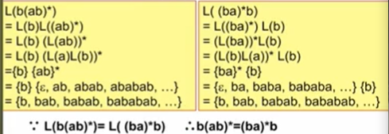

# 词法分析

## 1. 对于词法分析器的要求

### 1.1 词法分析器的功能哈输出形式

词法分析的任务：

* 从左到右逐个字符的对源程序进行扫描，产生一个个单词符号

对词法分析器的要求：

* 功能：输入源程序，输出单词符号

  * 单词符号的种类：基本字（保留字），标识符，常数，运算符，界符
  
* 输出的单词符号的形式：`(单词种别，单词自身的值)`
  
* 单词种别通常用整数编码表示
    * 若一个种别只有一个单词符号，那这个种别编码就代表该单词符号，可以不用给出值，如界符，运算符
    * 若一个种别有多个单词符号，则对于每个单词符号，给出种别编码和自身的值，如标识符，常数

  


### 1.2 词法分析器作为一个独立的子程序

词法分析是作为一个独立的阶段，而不是作为“一遍”

作为独立阶段的优点：

* 结构简洁，清晰，有条理
* 有利于集中注意力处理和分析词法分析的一些枝叶细节

词法分析器在编译器中的地位：


## 2. 词法分析器的设计

词法分析器的结构：


### 2.1 输入和预处理

预处理的工作：

* 剔除无用的空格，回车换行等编辑性字符
* 区分标号区，连接续行，给出末句符等

### 2.2 单词符号的识别：超前搜索

* 标识符识别
* 常数识别
* 算符和界符的识别

避免超前搜索：

* 所有基本字都作为保留字
* 基本字作为特殊标识符处理，使用保留字表
* 基本字，标识符，常数之间如果没有确定的运算符或界符分割，则必须使用一个空白符做间隔


### 2.3 状态转换图

状态转换图是一张有限方向图

* 节点代表状态，用圆圈表示
* 节点之间用箭弧连接，箭弧上的标记代表在射出的节点状态下可能出现的输入字符或字符类
* 一张状态转换图只能包含有限个状态，必须有一个初态一个终态（两个圆圈）

> 
>
> 上图表示在状态1下，如果输入X，则读入X，并转换到状态2
>
> 如果输入Y，则读入Y，并转换到状态3

状态转换图可以用来识别一定的字符串

* 如果存在一条从初态到某一终态的道路，且这条路上所有弧上的标记符连接成的字等于$\alpha$,则称$\alpha$为该状态转换图所接受

> 整常数的状态转换图
>
> ***表示退掉最后一个字符**
>
> 
>
> 

### 2.4 状态转换图的实现

每个状态都是一个代码段，用分支实现

```cpp
if(isLetter){
    while(isLetter() | isDigit()){
        Concat();
        GetChar();
    }
}
```


## 3. 正规表达式与有限自动机

讨论自动将状态转换图实现的方法

概念：

* 字母表 Σ：一个又穷的字符集
* 字符：Σ中的每一个元素称为一个字符
* 字：由Σ中的字符构成的又穷序列
* 空字 Σ：不包含任何字符的序列
* ${\Epsilon}^*$: Σ上所有字的全体，包括 Σ
* 连接（积）：U, V为${\Epsilon}^*$的子集，UV积的定义为$$UV = \{\alpha\beta \ | \ \alpha \in U \  \& \ \beta \in V\}$$
* V自身的n次积记为：$$V^n \  = \  VVV...V$$
* $$V^0 \  = \  \{\epsilon\}$$
* 闭包：$$V^* \ = \ V^0 \ \or \ V^1 \or \ V^3 \ ...$$
* 正规闭包：$V^+ \ = \ VV^*$

### 3.1 正规式与正规集

* 所有词法结构一般都可以用正规式描述

* 任何一个正规集必然可以用一个正规式表示

对于给定的字母表Σ

* Σ和$\phi$都是Σ省的正规式，他们所表示的正规集为$\{\epsilon\}$和$\Phi$

* 任何一个$a \in \Epsilon$, a是Σ上的正规式，他所表示的正规集为$\{a\}$

* 假设$e_1$，$e_2$都是Σ上的正规式，他们表示的正规集为$L(e_1)$和$L(e_2)$，则：

  * $(e_1|e_2)$为正规式，他所表示的正规集为$L(e_1) \or L(e_2)$
  * $e_1 · e_2$为正规式，他所表示的正规集为 $L(e_1)L(e_2)$
  * ${(e_1)}^*$为正规式，他所表示的正规集为${(L(e_1))}^*$

* > 仅由使用有限次上述三步骤而定义的表达式才是Σ上的正规式，仅由这些正规式表示的字集才是Σ上的正规集

* 若两个正规式所表示的正规集相同，则称这两个正规式等价
  $$
  b{(ab)}^* = {(ba)}^*b
  $$
  

对于正规式，下列等式成立

* 交换律

  $$e_1|e_2=e_2|e_1$$

  $$e_1e_2$$不一定等于$e_2e_1$

* 结合律

  $$e_1|(e_2|e_3) = (e_1|e_2)|e_3$$

  $$e_1(e_2e_3)=(e_1e_2)e_3$$

* 分配律

  $$e_1(e_2|e_3) = e_1e_2|e_1e_3$$

  $$(e_2|e_3)e_1=e_2e_1|e_3e_1$$

* $$e\epsilon = \epsilon e = e$$

### 3.2 确定有限自动机DFA

对状态图形式化，则可以有一下定义：

确定有限自动机M 是一个五元式
$$
M \ = \ (S, \Epsilon, f, S_0, F)
$$

* S: 有穷状态集
* Σ: 输入字母表（有穷）
* f：状态转换函数，为$S*\Epsilon → S$ 的单值部分映射，$f(s,a)=s^，$ 表示当现行状态为s，输入字符为a时，将状态转换到下一状态$s^，$， $s^，$称为s的一个后继状态
* $S_0 \in S$是一个唯一的初态
* $F \subseteq S$: 终态集，可为空


DFA 可以表示为状态转换图

* 如果DFA M含有m个状态和n个输入字符，则这个状态转换图含有m个状态节点，每个节点上最多有n个箭弧射出，每个箭弧上用Σ上的不同的输入字符来标记

对于${\Epsilon}^*$中的任何字$\alpha$,若存在一条从初态到某一终态的道路，且这条路上所有弧上的标记符（输入）连接成的字等于$\alpha$,则称$\alpha$为DFA M所识别（接收），DFA M所识别的字的全体记为$L(M)$

#### 练习

给出下列正规式对应的DFA

1. $1(0|1)^*101$

   

2. $1(1010^*|1(010^*1))^*0$

### 3.3 非确定有限自动机NFA

非确定有限自动机M 是一个五元式
$$
M \ = \ (S, \Epsilon, f, S_0, F)
$$

* S：有穷状态集
* Σ: 输入字母表（又穷）
* f: 状态转换函数，为$S * \Epsilon^*→2^S$的部分映射
* $S_0 \subseteq S$是一个非空的初态集
* $F \subseteq S$: 终态集，可为空

#### NFA和DFA

从状态转换图看NFA和DFA的区别：


* DFA只有一个初态，而NFA有多个初态
* DFA弧上的标记只能是字符或长度为1的字，NFA弧上的标记可以是任何一个字甚至是正规式
* 对DFA来说，从同状态射出的标签一定是不同的（后继状态唯一），而对NFA来说，同一字可能出现在同状态射出的多条弧上（后继状态不唯一）
* DFA是NFA的特例

对于${\Epsilon}^*$中的任何字$\alpha$,若存在一条从初态到某一终态的道路，且这条路上所有弧上的标记字连接成的字等于$\alpha$,（忽略那些标记为Σ的弧）则称$\alpha$为NFA M所识别（接收），NFA M所识别的字的全体记为$L(M)$

对于任何两个有限自动机$M$和$M^,$如果$L(M)=L(M^,)$则称$M$与$M^,$等价

> 1. 判定两个自动机等价性的算法是存在的
>
> 2. 对于每一个NFA M，存在一个DFA $M^,$，使得$L(M)=L(M^,)$
> 3. DFA与NFA描述能力相同

NFA转换为DFA：

1. 

2. 使用子集法将NFA确定化

   设`I`是状态集的一个子集，定义`I`的Σ-闭包（Σ-$closure(I)$）为：

   * 若$s \in I$, 则$s \in \epsilon$-$closure(I)$
   * 若$s \in I$， 则从s出发经过任意条Σ弧而能到达的任何状态$s^,$都属于Σ - $closure(I)$

   $\epsilon-closure(I)=I \or \{s^,|从某个s \in I 出发经过任意条 \epsilon弧能到达s^, \}$
   
   设a是Σ中的一个字符，定义：
   $$
   I_a \ = \ \epsilon ─ closure（J）
   $$
   其中，J为I中的某个状态出发经过一条a弧而到达的状态集合
   
   
   
   确定化过程：
   
   
   
    
   
   
   
   
   

### 3.4 正规文法与有限自动机的等价性

### 3.5 正规式与有限自动机的等价性

### 3.6 确定有限自动机的化简


## 4. 词法分析器的自动产生

### 4.1 语言LEX的一般描述

### 4.2 超前搜索

### 4.3 LEX的实现

