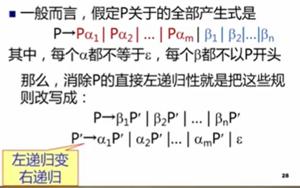
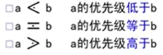
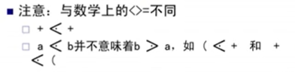
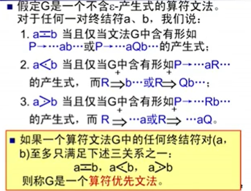
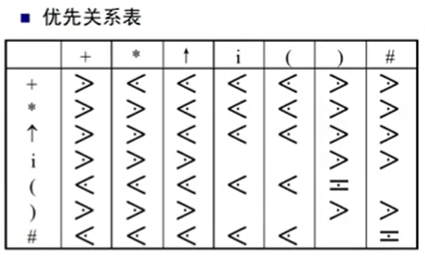
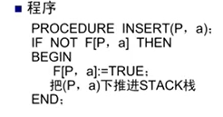
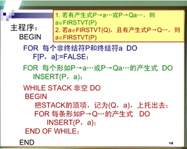

# 语法分析

## 1. 自上而下的语法分析

基本思想：

* 从文法的开始符号出发， 反复使用各种产生式，寻找“匹配的推导”

递归下降分析法

* 对每一语法变量（非终结符）构造一个响应的子程序，每个子程序识别一定的语法单位
* 通过子程序间的相互调用实现对输入串的识别

预测分析程序

* 非递归实现 
* 直接，简单

### 1.1 语法分析器的功能

任务：

* 分析一个文法的句子结构（判断一个串是不是文法描述的句子）

功能：

* 按照文法的产生式， 识别输入的符号串是不是一个句子

### 1.2 自上而下分析面临的问题

1. 回溯
2. 文法左递归问题

### 1.3 LL(1)分析法

#### 1.3.1 左递归的消除

##### 直接左递归的消除

直接消除见诸于表达式中的左递归：假定关于非终结符P的规则为：
$$
P → P \alpha \ | \ \beta
$$
其中 $\beta$ 不以P开头

可以把P通过等价变换写成非左递归形式(左递归改右递归)
$$
P → \beta P^{'} \\ 
p^{'} \rightarrow \alpha P^{'} | \  \varepsilon
$$

##### 间接左递归的消除

#### 1.3.2 消除回溯，提左因子

FIRST集合：
$$
FIRST(\alpha) = \{\alpha | \alpha {\Rightarrow}^* a..., a \in V_T  \}
$$
$\alpha$能够推出的任意串中排到第一的终结符的集合

FOLLOW集合：
$$
FOLLOW(A) = \{ a | S {\Rightarrow}^* ...Aa..., a \in V_T\}
$$
任何一个句型中，能跟在A后面的终结符的集合

#### 1.3.3 LL(1)分析条件

构造FIRST集合

### 1.4 递归下降分析程序构造

### 1.5 预测分析程序

#### 1.5.1 预测分析程序的工作过程

#### 1.5.2 预测分析表的构造

### 1.6 LL(1)分析中的错误处理

## 自下而上的语法分析

基本思想：

* 从输入串开始，逐步进行**规约**，直到文法的开始符号
* **规约**：根据文法的产生式规则，把产生式的右部替换为左部符号
* 从树的末端开始，构造语法树

算符优先分析法：

* 按照终结符的优先关系和结合性质进行语法分析
* 适合分析表达式

LR分析法

* 规范规约

### 自下而上存在的问题

采用 “**移进—归约**”思想进行自下而上分析：

* 基本思想：用一个寄存符号的栈，将输入符号一个一个移入栈中，当栈顶形成某个产生式的候选式时，就把栈顶的这一部分替换成（规约为）该产生式的左部符号
* 核心问题：识别可规约串

短语，直接短语， 句柄

* 以某非终结符为根的两代以上的子树的所有末端节点从左到右排列就是相对于该非终结符的一个短语
* 如果子树只有两代，则该短语就是直接短语
* 句柄：最左边的直接短语

用句柄对句子进行规约

* 规范归约：每一次规约都对句柄进行规约
* 规范句型：规范规约过程中得到的串

符号栈的使用：

* #作为栈底

例：
$$
考虑文法 G(E): \\
E \  \rightarrow \ T \ | \ T+F \\
T \  \rightarrow \ F \ | \ T*F \\
F \  \rightarrow \  (E) \ | \ i \\
输入串为：i_1*i_2+i_3, 分析过程如何？ \\

\\
$$

| 步骤 | 符号栈   | 输入串         | 动作       |
| ---- | -------- | -------------- | ---------- |
| 0    | #        | $i_1*i_2+i_3$# | 预备       |
| 1    | #$i_1$   | $*i_2+i_3$#    | PUSH       |
| 2    | #F       | $*i_2+i_3$#    | 归， 用F→i |
| 3    | #T       |  $*i_2+i_3$#    | 归， 用T→F |
| 4    | #T*      | $i_2+i_3$#     | PUSH       |
| 5   | #$T*i_2$ | $+i_3$#        | PUSH |
| 6   | #$T*F$ | $+i_3$# | 归， 用F→i |
| 7   | #$T$ | $+i_3$# | 归， 用T→T*F |
| 8 |#$E$|$+i_3$# | 归， 用E→T |
| 9   | #$E+$ | $i_3$# | PUSH |
| 10   | #$E+i_3$ | # | PUSH |
| 11   | #$E+F$|#|归， 用F→i|
| 12    | #$E+T$|#|归， 用T→F|
| 13     | #$E$| #   |归， 用E→E+T|

### 分析方法

#### 算符优先分析算法

定义算符之间的某种优先关系，借助这种关系寻找可规约串进行规约

三种优先关系：

* 

* 

##### 算符优先文法及优先表的构造

 

怎样构建优先关系表

* 构建FIRSTVT和LASTVT
  $$
  FIRSTVT(P) = \{ a| P \Rightarrow a..., 或 P \Rightarrow Qa..., a\in V_T, Q \in V_N \} \\
  $$
  从左往右看第一个碰到的终结符构成的集合
  $$
  LASTVT(P) = \{ a| P \Rightarrow a..., 或 P \Rightarrow aQ..., a\in V_T, Q \in V_N \} \\
  $$

​       P推出的串中，从左往右看最后碰见的终结符构成的集合

* 假定一个产生式的候选形为：
  $$
  ...aP...
  $$
  那么对任何$$b \in FIRSTVT(P)$$, 有$$a < b$$

* 假定一个产生式的候选形为：
  $$
  ...Pb...
  $$
  那么对任何$$a \in LASTVT(P)$$, 有$$a > b$$

构造FIRSTVT的算法

* 
* 

#### LR分析

