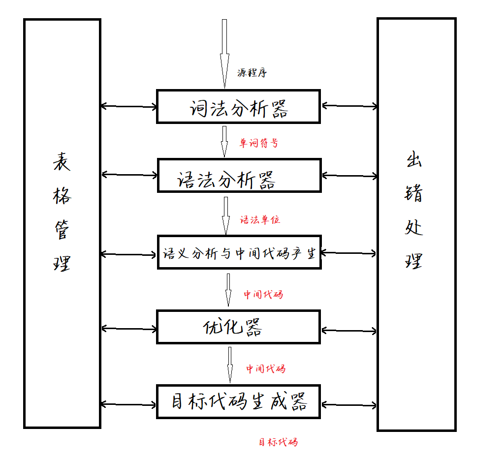

# 编译原理

设计和构造**编译程序**的原理和方法， 编译原理是研究语言的一门学课。

什么是编译程序

* 能够把某种语言的程序转换成另一种语言的**程序**，而后者与前者在逻辑上是等价的。如果源语言是高级语言，而目标语言是汇编等低级语言，这样的翻译程序叫“编译程序”，简称“编译器”，

## 1. 编译过程的概述：

* 从输入源程序到输出目标程序为止的过程
* 源程序是以文本文件的形式存在（程序是以字符串方式存在）
* 五个阶段
  1. 词法分析
  2. 语法分析
  3. 域以分析和中间代码生成
  4. 优化
  5. 目标代码生成

### 1.1 词法分析：

输入源程序，对构成源程序的字符串进行扫描和分解，识别出一个个单词，

此法分析阶段依循的是语言的**词法规则**，描述此法规则的有效工具收**正规式**和**有限自动机**

* 单词：保留字，运算符，界符，标识符，常量

### 1.2 语法分析

在词法分析的基础上，根据语言的**语法规则**把单词符号分解成各类语法单位，如短语，句子，子句，程序段等。

语法规则通常用**上下文无关文法**描述

例如对赋值语句

```txt
area:=3.14.5926 * radius * radius
```

进行语法分析

### 1.3 语义分析和中间代码产生

对语法分析所识别出的各类语法范畴，分析其含义，并进行初步翻译（产生中间代码）， 一般包括两方面工作：

1. 对各种语法范畴进行**静态语义检查**（如变量是否定义，类型是否正确）
2. 如果正确就进行**中间代码翻译**

通常使用**属性文法**描述语义规则

#### 1.3.1 中间代码

中间代码是将源程序转变成的一种内部表现形式，是一种结构简单，含义明确的记号系统

性质：

1. 容易生成
2. 容易翻译成目标代码

主要形式：三元式，间接三元式，四元式， 逆波兰式等

> 四元式：（算符，运算对象1， 运算对象2， 结果）

### 1.4 优化

* 任务：对前段产生的中间代码进行加工，以期在后面阶段产生更加高效的代码
* 优化遵循的原择是**等价变换**
* 方法：
  * 公共子表达式提取
  * 循环优化
  * 删除无用代码

### 1.5 目标代码生成

* 任务：把中间代码变换成特定目标机器上的绝对指令代码或可重定向的指令代码或汇编指令代码
* 主要与硬件系统结构和指令含义相关

### 1.6 编译过程总结

|步骤|内容|任务|遵循原则|方法|
|----|----|----|-------|----|
|一. |词法分析|构成源程序的字符串进行扫描和分解，识别出一个个单词|语言的**词法规则**|有效工具：**正规式**和**有限自动机**|
|二. |语法分析|把单词符号分解成各类语法单位，如短语，句子，子句，程序段等。|语言的语法规则|语法树|
|三. |语义分析和中间代码产生|静态语义检查，中间代码翻译|||
|四. |优化|对前段产生的中间代码进行加工，以期在后面阶段产生更加高效的代码|等价变换|1. 提取公共子表达式 2. 循环优化 3. 删除无用代码|
|五. |目标代码生成|把中间代码变换成特定目标机器上的绝对指令代码或可重定向的指令代码或汇编指令代码|||

## 2. 编译程序的结构



### 2.1 表格与表格管理

> 在编译程序使用的表格中最重要的是符号表它用来登记源程序中出现的每一个名字以及名字的各种属性。如一个名字是常量名、变量名，还是过程名等；如果是变量名它的类型又是什麽、所占内存是多大、地址是什么等

### 2.2 出错处理

发现源程序的错误并报告给用户

### 2.3 编译前端与后端

* 前端：与源语言有关，但与目标机无关的部分，包括词法分析，语法分析，语义分析和中间代码生成。
* 后端： 与目标代码有关的部分，包括优化和目标代码生成

### 2.4 遍 ？？？

对源语言或等价的中间语言程序从头到尾扫描并完成规定的任务的过程

