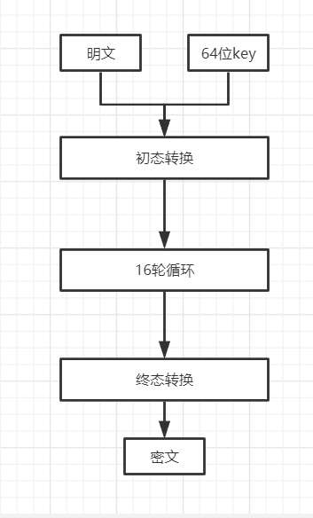
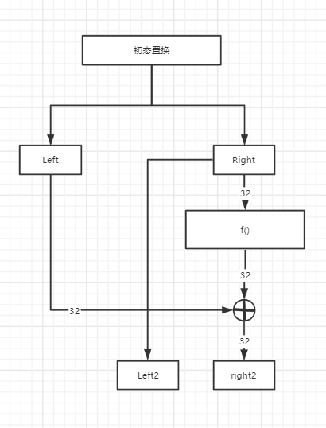
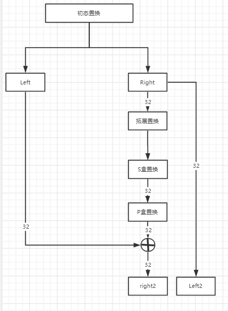
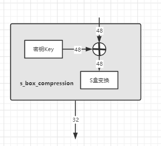
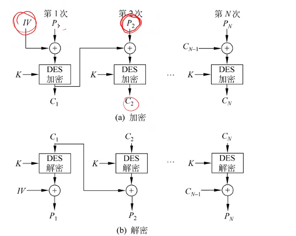
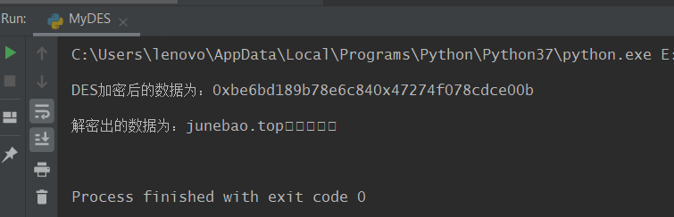

# DES加密算法原理及实现

DES是一种对称加密算法【即发送者与接收者持有相同的密钥】，它的基本原理是将要加密的数据划分为n个64位的块，然后使用一个56位的密钥逐个加密每一个64位的块，得到n个64位的密文块，最后将密文块拼接起来得到最终的密文

<!-- more -->

## 加密

### 加密过程

DES加密过程接收一个明文盒一个64位的密钥key，明文字符串会被转换为对各64位的块，加密过程以块位单位，经过初态转换，16轮循环加密，终态转换，最终每个64位的块都会被加密成一个64位的密文块，将得到的密文块拼起来，得到的就是最终加密后的结果。



```python
    def encode(self, enter: str, key: str):
        result = ""
        # 将输入的字符串处理为长度为64的块
        blocks = self.processing_encode_input(enter)
        for block in blocks:
            # 对每一块进行初态置换
            irb_result = self._init_replace_block(block)
            # 对每一块进行16轮循环加密
            block_result = self.iteration(irb_result, key, is_decode=False)
            # 对每一块进行终态置换
            block_result = self._end_replace_block(block_result)
            # 返回16进制形式的密文串
            result += str(hex(int(block_result.encode(), 2)))
        return result
```


### 1. 明文数据处理processing_encode_input

首先需要将字符串的明文转换为二进制，按64位一组，分成若干组，如果不够64位，就补零。

```python
    from bitarray import bitarray
    
    @staticmethod
    def _bit_encode(s: str) -> str:
        """
        将字符串转换为01字符串的形式
        """
        return bitarray(
            ''.join([bin(int('1' + hex(c)[2:], 16))[3:]
                     for c in s.encode('utf-8')])).to01()
    
    def processing_encode_input(self, enter: str) -> list:
        """
        将输入的字符串转换为二进制形式，并没64位为一组进行分割
        """
        result = []
        bit_string = self._bit_encode(enter)
        # 如果长度不能被64整除，就补零
        if len(bit_string) % 64 != 0:
            for i in range(64 - len(bit_string) % 64):
                bit_string += '0'
        for i in range(len(bit_string) // 64):
            result.append(bit_string[i * 64: i * 64 + 64])
        # print(f"转换为二进制后的初始明文： {result}")
        return result
```

### 2. 初态转换

初态转换是将初始的64位块按照 【IP置换表】的规则重新排序

```txt
58, 50, 42, 34, 26, 18, 10, 2, 
60, 52, 44, 36, 28, 20, 12, 4,
62, 54, 46, 38, 30, 22, 14, 6,
64, 56, 48, 40, 32, 24, 16, 8,
57, 49, 41, 33, 25, 17, 9, 1,
59, 51, 43, 35, 27, 19, 11, 3,
61, 53, 45, 37, 29, 21, 13, 5,
63, 55, 47, 39, 31, 23, 15, 7
```
IP 置换表中每一位的意思是：将原来第i位的元素填充到这，如第一个58就表示把原来比特串中第58位放在新串的第1位，第二个50表示把原来比特串的第50位放在新串的第2位......

```python
    @staticmethod
    def replace_block(block: str, replace_table: tuple) -> str:
        """
        对单个块进行置换
        Args:
            block: str, 要进行转换的64位长的01字符串
            replace_table: 转换表
        Return:
            返回转换后的字符串
        """
        result = ""
        for i in replace_table:
            try:
                result += block[i - 1]
            except IndexError:
                print(i)
                print(f"block= {block}, len={len(block)}")
                raise
        return result
    
    def _init_replace_block(self, block: str):
        """
        对一个块进行初态置换
        """
        replace_table = (
            58, 50, 42, 34, 26, 18, 10, 2,
            60, 52, 44, 36, 28, 20, 12, 4,
            62, 54, 46, 38, 30, 22, 14, 6,
            64, 56, 48, 40, 32, 24, 16, 8,
            57, 49, 41, 33, 25, 17, 9, 1,
            59, 51, 43, 35, 27, 19, 11, 3,
            61, 53, 45, 37, 29, 21, 13, 5,
            63, 55, 47, 39, 31, 23, 15, 7
        )
        return self.replace_block(block, replace_table)
```

### 3. 16轮循环加密iteration



每一轮循环加密的过程为：

1. 将初态置换后或上一次循环后得到的64位块分成左右各32位的子块Left盒Right
2. Right经过f函数转换后得到一个32位的串，这个串与Left做异或后得到下一轮循环的Right
3. 将这一轮原视的Right作为下一轮的Left
4. 拼接Left盒Right,进行下一轮循环

```python
    def iteration(self, block: str, key: str) -> str:
        for i in range(16):
            # 分成左右两个子块
            left, right = block[0: 32], block[32: 64]
            # 将这一轮原视的Right作为下一轮的Left
            next_left = right
            # f函数
            f_result = self._f_function(right, i)
            # f函数的输出与left做异或得到下一轮的right
            right = self._not_or(left, f_result)
            # 拼接，准备进行下一轮
            block = next_left + right
        return block[32:] + block[:32]
```

* 在最后一轮循环加密之后，left盒right是相反的，所以进行终态置换之前要换过来

#### 3.1 f函数



f函数有三部分组成：

1. 拓展置换
2. S盒置换
3. P盒置换

```python
    def _f_function(self, right: str, num: int):
        # 拓展置换
        right = self.block_extend(right)
        # S盒置换
        sbc_result = self.s_box_compression(num, right)
        # P盒置换
        return self.p_box_replacement(sbc_result)
```


##### 3.1.1 拓展置换

拓展置换的目的是将一个32位的串根据【拓展置换表】转换为48位，其实就是重复其中的某些位，达到混淆的目的。具体就是将32位的数据分成4*8小块，每个小块拓展为6位。

```txt
32, 1,  2,  3,  4,  5,
4,  5,  6,  7,  8,  9,
8,  9,  10, 11, 12, 13,
12, 13, 14, 15, 16, 17,
16, 17, 18, 19, 20, 21,
20, 21, 22, 23, 24, 25,
24, 25, 26, 27, 28, 29,
28, 29, 30, 31, 32, 1
```

拓展置换表中，每一行代表拓展后的一个小块，内部数字表示原来子块中01的位置，其实就是在每一个小块前面加上前一个小块的最后一个字符，后面加上下一个小块的第一个字符，比如有三个小块：

```txt
0 1 0 0     1 0 1 1     1 0 0 1
```

那么第二个小块拓展之后就是

```
0 1 0 1 1 1
```

```python
    @staticmethod
    def block_extend(block: str) -> str:
        """
        拓展置换
        """
        extended_block = ""
        extend_table = (
            32, 1, 2, 3, 4, 5,
            4, 5, 6, 7, 8, 9,
            8, 9, 10, 11, 12, 13,
            12, 13, 14, 15, 16, 17,
            16, 17, 18, 19, 20, 21,
            20, 21, 22, 23, 24, 25,
            24, 25, 26, 27, 28, 29,
            28, 29, 30, 31, 32, 1
        )
        for i in extend_table:
            extended_block += block[i - 1]
        return extended_block
```

##### 3.1.2 S盒置换



S盒置换有两步：

1. 与密钥${key}_i$做异或
2. S盒压缩

```python
    def s_box_compression(self, num: int, block48: str) -> str:
        """
        对经过拓展置换后的48位01串进行S盒压缩
        Args:
            num: 第几次迭代
            block48: right
        Return:
            返回经过S盒压缩后的32位01字符串
        """
        # 与密钥key做异或
        result_not_or = self._not_or(block48, self.child_keys[num])
        # S盒压缩
        return self._s_box_replace(result_not_or)
```


###### 密钥${key}_i$的获得


DES的原始密钥是一个64位的01串，其中8，16， 24， 32， 40， 48，56， 64位作为奇偶检验位，通过**密钥转换**去除，实际加密中使用的只有56位，这56位的密钥经过**密钥旋转**和**置换选择**会产生16个48位的子密钥，所以每次循环加密用到的子密钥都是不同的。


**密钥转换**的目的是将64位原始密钥转换为56位的密钥，并进行一次置换

* 依照的表是密钥转换表

  ```txt
  57,49,41,33,25,17,9,1,58,50,42,34,26,18,
  10,2,59,51,43,35,27,19,11,3,60,52,44,36,
  63,55,47,39,31,23,15,7,62,54,46,38,30,22,
  14,6,61,53,45,37,29,21,13,5,28,20,12,4
  ```
  
* 代码实现：

  ```python
      def key_conversion(self, key):
          """
          将64位原始密钥转换为56位的密钥，并进行一次置换
          """
          first_key = key
          key_replace_table = (
              57, 49, 41, 33, 25, 17, 9, 1, 58, 50, 42, 34, 26, 18,
              10, 2, 59, 51, 43, 35, 27, 19, 11, 3, 60, 52, 44, 36,
              63, 55, 47, 39, 31, 23, 15, 7, 62, 54, 46, 38, 30, 22,
              14, 6, 61, 53, 45, 37, 29, 21, 13, 5, 28, 20, 12, 4
          )
          return self.replace_block(first_key, key_replace_table)
  ```

  


**密钥旋转**：是为了保证16个子密钥各不相同。具体做法是将56位密钥分成两个28位的子串，然后将这两个子串进行循环旋转，具体规则依照**DesRotations**表

| **Round**     | 1    | 2    | 3    | 4    | 5    | 6    | 7    | 8    | 9    | 10   | 11   | 12   | 13   | 14   | 15   | 16   |
| ------------- | ---- | ---- | ---- | ---- | ---- | ---- | ---- | ---- | ---- | ---- | ---- | ---- | ---- | ---- | ---- | ---- |
| **Rotations** | 1    | 1    | 2    | 2    | 2    | 2    | 2    | 2    | 1    | 2    | 2    | 2    | 2    | 2    | 2    | 1    |

* Round表示第几轮旋转，也就是第几个key
* Rotations表示旋转次数

> * 除了第1， 2， 9， 16个key旋转1位，其他都旋转两位
>
> * 每次旋转是相对于上一次的结果而言的，比如第三个子密钥就是原视的两个28位串向左旋转4位得到的

* 代码实现

  ```python
      def spin_key(self, key: str):
          """
          旋转获得子密钥
          """
          kc = self.key_conversion(key)
          first, second = kc[0: 28], kc[28: 56]
          spin_table = (1, 2, 4, 6, 8, 10, 12, 14, 15, 17, 19, 21, 23, 25, 27, 28)
          for i in range(1, 17):
              first_after_spin = first[spin_table[i - 1]:] + first[:spin_table[i - 1]]
              second_after_spin = second[spin_table[i - 1]:] + second[:spin_table[i - 1]]
              print(f"旋转后的key： left: {first_after_spin}, right: {second_after_spin}")
              yield first_after_spin + second_after_spin
  ```


**置换选择**：密钥旋转之后拼接得到一个56位的串，置换选择可以选择其中48位作为最终的${key}_i$,置换选择依照**置换选择表**


* 置换选择表

  ```txt
  14,17,11,24,1,5,3,28,15,6,21,10,
  23,19,12,4,26,8,16,7,27,20,13,2,
  41,52,31,37,47,55,30,40,51,45,33,48,
  44,49,39,56,34,53,46,42,50,36,29,32  
  ```

* 代码实现

  ```python
      def key_selection_replacement(self, key: str):
          """
          通过选择置换得到48位的子密钥
          """
          key_select_table = (
              14, 17, 11, 24, 1, 5, 3, 28, 15, 6, 21, 10,
              23, 19, 12, 4, 26, 8, 16, 7, 27, 20, 13, 2,
              41, 52, 31, 37, 47, 55, 30, 40, 51, 45, 33, 48,
              44, 49, 39, 56, 34, 53, 46, 42, 50, 36, 29, 32
          )
          for child_key56 in self.spin_key(key):
              self.child_keys.append(self.replace_block(child_key56, key_select_table))
  ```

  

###### S盒压缩

密钥${key}_i$与拓展置换后的right做异或后得到一个48位的串，这个串必须压缩成32位才能作为下一轮的left。把这个48位的串分成8组，每组六位，压缩就是要把6位变成4位，这里用到了8张 4*16 的【S盒压缩表】

```python
s_box1 = [
    [14,4,13,1,2,15,11,8,3,10,6,12,5,9,0,7],
    [0,15,7,4,14,2,13,1,10,6,12,11,9,5,3,8],
    [4,1,14,8,13,6,2,11,15,12,9,7,3,10,5,0],
    [15,12,8,2,4,9,1,7,5,11,3,14,10,0,6,13],
],
s_box2 = [
    [15,1,8,14,6,11,3,4,9,7,2,13,12,0,5,10],
    [3,13,4,7,15,2,8,14,12,0,1,10,6,9,11,5],
    [0,14,7,11,10,4,13,1,5,8,12,6,9,3,2,15],
    [13,8,10,1,3,15,4,2,11,6,7,12,0,5,14,9],
],
s_box3 = [
    [10,0,9,14,6,3,15,5,1,13,12,7,11,4,2,8],
    [13,7,0,9,3,4,6,10,2,8,5,14,12,11,15,1],
    [13,6,4,9,8,15,3,0,11,1,2,12,5,10,14,7],
    [1,10,13,0,6,9,8,7,4,15,14,3,11,5,2,12],
],
s_box4 = [
    [7,13,14,3,0,6,9,10,1,2,8,5,11,12,4,15],
    [13,8,11,5,6,15,0,3,4,7,2,12,1,10,14,9],
    [10,6,9,0,12,11,7,13,15,1,3,14,5,2,8,4],
    [3,15,0,6,10,1,13,8,9,4,5,11,12,7,2,14],
],
s_box5 = [
    [2,12,4,1,7,10,11,6,8,5,3,15,13,0,14,9],
    [14,11,2,12,4,7,13,1,5,0,15,10,3,9,8,6],
    [4,2,1,11,10,13,7,8,15,9,12,5,6,3,0,14],
    [11,8,12,7,1,14,2,13,6,15,0,9,10,4,5,3],
],
s_box6 = [
    [12,1,10,15,9,2,6,8,0,13,3,4,14,7,5,11],
    [10,15,4,2,7,12,9,5,6,1,13,14,0,11,3,8],
    [9,14,15,5,2,8,12,3,7,0,4,10,1,13,11,6],
    [4,3,2,12,9,5,15,10,11,14,1,7,6,0,8,13],
],
s_box7 = [
    [4,11,2,14,15,0,8,13,3,12,9,7,5,10,6,1],
    [13,0,11,7,4,9,1,10,14,3,5,12,2,15,8,6],
    [1,4,11,13,12,3,7,14,10,15,6,8,0,5,9,2],
    [6,11,13,8,1,4,10,7,9,5,0,15,14,2,3,12],
],
s_box8 = [
    [13,2,8,4,6,15,11,1,10,9,3,14,5,0,12,7],
    [1,15,13,8,10,3,7,4,12,5,6,11,0,14,9,2],
    [7,11,4,1,9,12,14,2,0,6,10,13,15,3,5,8],
    [2,1,14,7,4,10,8,13,15,12,9,0,3,5,6,11],
]
```

具体做法是：

将经过拓展置换后得到的48位串与48位密钥做异或，得到48位密文串，每6个分一组，分8组，如第二组是`111011`就查找把第一位与最后一位取出得到`11`,转换为十进制3作为行号，中间四位`1101`转换为十进制13作为列号，查找s_box2的3行13列得到9，将9转换为二进制为`1001`就是这6为密文压缩后的结果，其他一样，最终会输出32位密文串。


代码实现

```python
    def _s_box_replace(self, block48: str) -> str:
        """
        S盒置换，将48位的输入转换为32位输出
        """
        s_box_table = (
            (
                (14, 4, 13, 1, 2, 15, 11, 8, 3, 10, 6, 12, 5, 9, 0, 7),
                (0, 15, 7, 4, 14, 2, 13, 1, 10, 6, 12, 11, 9, 5, 3, 8),
                (4, 1, 14, 8, 13, 6, 2, 11, 15, 12, 9, 7, 3, 10, 5, 0),
                (15, 12, 8, 2, 4, 9, 1, 7, 5, 11, 3, 14, 10, 0, 6, 13),
            ),
            (
                (15, 1, 8, 14, 6, 11, 3, 4, 9, 7, 2, 13, 12, 0, 5, 10),
                (3, 13, 4, 7, 15, 2, 8, 14, 12, 0, 1, 10, 6, 9, 11, 5),
                (0, 14, 7, 11, 10, 4, 13, 1, 5, 8, 12, 6, 9, 3, 2, 15),
                (13, 8, 10, 1, 3, 15, 4, 2, 11, 6, 7, 12, 0, 5, 14, 9),
            ),
            (
                (10, 0, 9, 14, 6, 3, 15, 5, 1, 13, 12, 7, 11, 4, 2, 8),
                (13, 7, 0, 9, 3, 4, 6, 10, 2, 8, 5, 14, 12, 11, 15, 1),
                (13, 6, 4, 9, 8, 15, 3, 0, 11, 1, 2, 12, 5, 10, 14, 7),
                (1, 10, 13, 0, 6, 9, 8, 7, 4, 15, 14, 3, 11, 5, 2, 12),
            ),
            (
                (7, 13, 14, 3, 0, 6, 9, 10, 1, 2, 8, 5, 11, 12, 4, 15),
                (13, 8, 11, 5, 6, 15, 0, 3, 4, 7, 2, 12, 1, 10, 14, 9),
                (10, 6, 9, 0, 12, 11, 7, 13, 15, 1, 3, 14, 5, 2, 8, 4),
                (3, 15, 0, 6, 10, 1, 13, 8, 9, 4, 5, 11, 12, 7, 2, 14),
            ),
            (
                (2, 12, 4, 1, 7, 10, 11, 6, 8, 5, 3, 15, 13, 0, 14, 9),
                (14, 11, 2, 12, 4, 7, 13, 1, 5, 0, 15, 10, 3, 9, 8, 6),
                (4, 2, 1, 11, 10, 13, 7, 8, 15, 9, 12, 5, 6, 3, 0, 14),
                (11, 8, 12, 7, 1, 14, 2, 13, 6, 15, 0, 9, 10, 4, 5, 3),
            ),
            (
                (12, 1, 10, 15, 9, 2, 6, 8, 0, 13, 3, 4, 14, 7, 5, 11),
                (10, 15, 4, 2, 7, 12, 9, 5, 6, 1, 13, 14, 0, 11, 3, 8),
                (9, 14, 15, 5, 2, 8, 12, 3, 7, 0, 4, 10, 1, 13, 11, 6),
                (4, 3, 2, 12, 9, 5, 15, 10, 11, 14, 1, 7, 6, 0, 8, 13),
            ),
            (
                (4, 11, 2, 14, 15, 0, 8, 13, 3, 12, 9, 7, 5, 10, 6, 1),
                (13, 0, 11, 7, 4, 9, 1, 10, 14, 3, 5, 12, 2, 15, 8, 6),
                (1, 4, 11, 13, 12, 3, 7, 14, 10, 15, 6, 8, 0, 5, 9, 2),
                (6, 11, 13, 8, 1, 4, 10, 7, 9, 5, 0, 15, 14, 2, 3, 12),
            ),
            (
                (13, 2, 8, 4, 6, 15, 11, 1, 10, 9, 3, 14, 5, 0, 12, 7),
                (1, 15, 13, 8, 10, 3, 7, 4, 12, 5, 6, 11, 0, 14, 9, 2),
                (7, 11, 4, 1, 9, 12, 14, 2, 0, 6, 10, 13, 15, 3, 5, 8),
                (2, 1, 14, 7, 4, 10, 8, 13, 15, 12, 9, 0, 3, 5, 6, 11),
            )
        )
        result = ""
        for i in range(8):
            row_bit = (block48[i * 6] + block48[i * 6 + 5]).encode("utf-8")
            line_bit = (block48[i * 6 + 1: i * 6 + 5]).encode("utf-8")
            row = int(row_bit, 2)
            line = int(line_bit, 2)
            # print(f"第{row}行， 第{line}列")
            data = s_box_table[i][row][line]
            no_full = str(bin(data))[2:]
            while len(no_full) < 4:
                no_full = '0' + no_full
            result += no_full
        return result
```

##### 2.1.3 P盒置换

p盒置换作用也是为了混淆，用到了【P盒置换表】，原理与其他置换一样

```python
    def p_box_replacement(self, block32: str) -> str:
        """
        P盒置换
        Return:
            返回经过P盒置换后的32位01串
        """
        p_box_replace_table = (
            16, 7, 20, 21, 29, 12, 28, 17, 1, 15, 23, 26, 5, 18, 31, 10,
            2, 8, 24, 14, 32, 27, 3, 9, 19, 13, 30, 6, 22, 11, 4, 25,
        )
        return self.replace_block(block32, p_box_replace_table)
```

### 4. 终态置换

与初态置换一样, 只不过使用的置换表不一样而已

* 终态置换表

```txt
 40, 8, 48, 16, 56, 24, 64, 32,
 39, 7, 47, 15, 55, 23, 63, 31,
 38, 6, 46, 14, 54, 22, 62, 30,
 37, 5, 45, 13, 53, 21, 61, 29,
 36, 4, 44, 12, 52, 20, 60, 28,
 35, 3, 43, 11, 51, 19, 59, 27,
 34, 2, 42, 10, 50, 18, 58, 26,
 33, 1, 41, 9, 49, 17, 57, 25
```

* 代码实现

```python
    def _end_replace_block(self, block: str) -> str:
        """
        对某一个块进行终态转换
        """
        replace_table = (
            40, 8, 48, 16, 56, 24, 64, 32,
            39, 7, 47, 15, 55, 23, 63, 31,
            38, 6, 46, 14, 54, 22, 62, 30,
            37, 5, 45, 13, 53, 21, 61, 29,
            36, 4, 44, 12, 52, 20, 60, 28,
            35, 3, 43, 11, 51, 19, 59, 27,
            34, 2, 42, 10, 50, 18, 58, 26,
            33, 1, 41, 9, 49, 17, 57, 25
        )
        return self.replace_block(block, replace_table)
```

## 解密

解密使用与加密相同的算法，只不过使用子密钥的顺序不同而已，加密过程第一轮循环使用$key_1$,解密过程第一轮循环使用$key_{16}$,可以在循环加密处添加一个标志位完成


## 运行模式

* ECB
* CBC




## 完整代码


```python
from bitarray import bitarray


class MyDES:
    def __init__(self):
        self.child_keys = []

    @staticmethod
    def _bit_encode(s: str) -> str:
        """
        将字符串转换为01字符串的形式
        """
        return bitarray(
            ''.join([bin(int('1' + hex(c)[2:], 16))[3:]
                     for c in s.encode('utf-8')])).to01()

    @staticmethod
    def _bit_decode(s: list):
        return ''.join([chr(i) for i in [int(b, 2) for b in s]])

    @staticmethod
    def _negate(s: str):
        result = ""
        try:
            for i in s:
                result += '0' if i == '1' else '1'
            return result
        except:
            print("密钥错误")
            raise

    @staticmethod
    def _replace_block(block: str, replace_table: tuple) -> str:
        """
        对单个块进行置换
        Args:
            block: str, 要进行转换的64位长的01字符串
            replace_table: 转换表
        Return:
            返回转换后的字符串
        """
        result = ""
        for i in replace_table:
            try:
                result += block[i - 1]
            except IndexError:
                print(i)
                # print(f"block= {block}, len={len(block)}")
                raise
        return result

    def _processing_encode_input(self, enter: str) -> list:
        """
        将输入的字符串转换为二进制形式，并没64位为一组进行分割
        """
        result = []
        bit_string = self._bit_encode(enter)
        # 如果长度不能被64整除，就补零
        if len(bit_string) % 64 != 0:
            for i in range(64 - len(bit_string) % 64):
                bit_string += '0'
        for i in range(len(bit_string) // 64):
            result.append(bit_string[i * 64: i * 64 + 64])
        # print(f"转换为二进制后的初始明文： {result}")
        return result

    @staticmethod
    def _processing_decode_input(enter: str) -> list:
        result = []
        try:
            input_list = enter.split("0x")[1:]
            int_list = [int("0x" + i, 16) for i in input_list]
            for i in int_list:
                bin_data = str(bin(i))[2:]
                while len(bin_data) < 64:
                    bin_data = '0' + bin_data
                result.append(bin_data)
            return result
        except Exception as e:
            raise

    def _key_conversion(self, key: str):
        """
        将64位原始密钥转换为56位的密钥，并进行一次置换
        """
        key = self._bit_encode(key)
        while len(key) < 64:
            key += '0'
        first_key = key[:64]
        key_replace_table = (
            57, 49, 41, 33, 25, 17, 9, 1, 58, 50, 42, 34, 26, 18,
            10, 2, 59, 51, 43, 35, 27, 19, 11, 3, 60, 52, 44, 36,
            63, 55, 47, 39, 31, 23, 15, 7, 62, 54, 46, 38, 30, 22,
            14, 6, 61, 53, 45, 37, 29, 21, 13, 5, 28, 20, 12, 4
        )
        return self._replace_block(first_key, key_replace_table)

    def _spin_key(self, key: str):
        """
        旋转获得子密钥
        """
        kc = self._key_conversion(key)
        first, second = kc[0: 28], kc[28: 56]
        spin_table = (1, 2, 4, 6, 8, 10, 12, 14, 15, 17, 19, 21, 23, 25, 27, 28)
        for i in range(1, 17):
            first_after_spin = first[spin_table[i - 1]:] + first[:spin_table[i - 1]]
            second_after_spin = second[spin_table[i - 1]:] + second[:spin_table[i - 1]]
            # print(f"旋转后的key： left: {first_after_spin}, right: {second_after_spin}")
            yield first_after_spin + second_after_spin

    def _key_selection_replacement(self, key: str):
        """
        通过选择置换得到48位的子密钥
        """
        # 先置空
        self.child_keys = []
        key_select_table = (
            14, 17, 11, 24, 1, 5, 3, 28, 15, 6, 21, 10,
            23, 19, 12, 4, 26, 8, 16, 7, 27, 20, 13, 2,
            41, 52, 31, 37, 47, 55, 30, 40, 51, 45, 33, 48,
            44, 49, 39, 56, 34, 53, 46, 42, 50, 36, 29, 32
        )
        for child_key56 in self._spin_key(key):
            self.child_keys.append(self._replace_block(child_key56, key_select_table))

    def _init_replace_block(self, block: str):
        """
        对一个块进行初态置换
        """
        replace_table = (
            58, 50, 42, 34, 26, 18, 10, 2,
            60, 52, 44, 36, 28, 20, 12, 4,
            62, 54, 46, 38, 30, 22, 14, 6,
            64, 56, 48, 40, 32, 24, 16, 8,
            57, 49, 41, 33, 25, 17, 9, 1,
            59, 51, 43, 35, 27, 19, 11, 3,
            61, 53, 45, 37, 29, 21, 13, 5,
            63, 55, 47, 39, 31, 23, 15, 7
        )
        return self._replace_block(block, replace_table)

    def _end_replace_block(self, block: str) -> str:
        """
        对某一个块进行终态转换
        """
        replace_table = (
            40, 8, 48, 16, 56, 24, 64, 32,
            39, 7, 47, 15, 55, 23, 63, 31,
            38, 6, 46, 14, 54, 22, 62, 30,
            37, 5, 45, 13, 53, 21, 61, 29,
            36, 4, 44, 12, 52, 20, 60, 28,
            35, 3, 43, 11, 51, 19, 59, 27,
            34, 2, 42, 10, 50, 18, 58, 26,
            33, 1, 41, 9, 49, 17, 57, 25
        )
        return self._replace_block(block, replace_table)

    @staticmethod
    def _block_extend(block: str) -> str:
        """
        拓展置换
        """
        extended_block = ""
        extend_table = (
            32, 1, 2, 3, 4, 5,
            4, 5, 6, 7, 8, 9,
            8, 9, 10, 11, 12, 13,
            12, 13, 14, 15, 16, 17,
            16, 17, 18, 19, 20, 21,
            20, 21, 22, 23, 24, 25,
            24, 25, 26, 27, 28, 29,
            28, 29, 30, 31, 32, 1
        )
        for i in extend_table:
            extended_block += block[i - 1]
        return extended_block

    @staticmethod
    def _not_or(a: str, b: str) -> str:
        """
        对两个01字符串做异或
        """
        result = ""
        size = len(a) if len(a) < len(a) else len(b)
        for i in range(size):
            result += '0' if a[i] == b[i] else '1'
        return result

    def _s_box_replace(self, block48: str) -> str:
        """
        S盒置换，将48位的输入转换为32位输出
        """
        s_box_table = (
            (
                (14, 4, 13, 1, 2, 15, 11, 8, 3, 10, 6, 12, 5, 9, 0, 7),
                (0, 15, 7, 4, 14, 2, 13, 1, 10, 6, 12, 11, 9, 5, 3, 8),
                (4, 1, 14, 8, 13, 6, 2, 11, 15, 12, 9, 7, 3, 10, 5, 0),
                (15, 12, 8, 2, 4, 9, 1, 7, 5, 11, 3, 14, 10, 0, 6, 13),
            ),
            (
                (15, 1, 8, 14, 6, 11, 3, 4, 9, 7, 2, 13, 12, 0, 5, 10),
                (3, 13, 4, 7, 15, 2, 8, 14, 12, 0, 1, 10, 6, 9, 11, 5),
                (0, 14, 7, 11, 10, 4, 13, 1, 5, 8, 12, 6, 9, 3, 2, 15),
                (13, 8, 10, 1, 3, 15, 4, 2, 11, 6, 7, 12, 0, 5, 14, 9),
            ),
            (
                (10, 0, 9, 14, 6, 3, 15, 5, 1, 13, 12, 7, 11, 4, 2, 8),
                (13, 7, 0, 9, 3, 4, 6, 10, 2, 8, 5, 14, 12, 11, 15, 1),
                (13, 6, 4, 9, 8, 15, 3, 0, 11, 1, 2, 12, 5, 10, 14, 7),
                (1, 10, 13, 0, 6, 9, 8, 7, 4, 15, 14, 3, 11, 5, 2, 12),
            ),
            (
                (7, 13, 14, 3, 0, 6, 9, 10, 1, 2, 8, 5, 11, 12, 4, 15),
                (13, 8, 11, 5, 6, 15, 0, 3, 4, 7, 2, 12, 1, 10, 14, 9),
                (10, 6, 9, 0, 12, 11, 7, 13, 15, 1, 3, 14, 5, 2, 8, 4),
                (3, 15, 0, 6, 10, 1, 13, 8, 9, 4, 5, 11, 12, 7, 2, 14),
            ),
            (
                (2, 12, 4, 1, 7, 10, 11, 6, 8, 5, 3, 15, 13, 0, 14, 9),
                (14, 11, 2, 12, 4, 7, 13, 1, 5, 0, 15, 10, 3, 9, 8, 6),
                (4, 2, 1, 11, 10, 13, 7, 8, 15, 9, 12, 5, 6, 3, 0, 14),
                (11, 8, 12, 7, 1, 14, 2, 13, 6, 15, 0, 9, 10, 4, 5, 3),
            ),
            (
                (12, 1, 10, 15, 9, 2, 6, 8, 0, 13, 3, 4, 14, 7, 5, 11),
                (10, 15, 4, 2, 7, 12, 9, 5, 6, 1, 13, 14, 0, 11, 3, 8),
                (9, 14, 15, 5, 2, 8, 12, 3, 7, 0, 4, 10, 1, 13, 11, 6),
                (4, 3, 2, 12, 9, 5, 15, 10, 11, 14, 1, 7, 6, 0, 8, 13),
            ),
            (
                (4, 11, 2, 14, 15, 0, 8, 13, 3, 12, 9, 7, 5, 10, 6, 1),
                (13, 0, 11, 7, 4, 9, 1, 10, 14, 3, 5, 12, 2, 15, 8, 6),
                (1, 4, 11, 13, 12, 3, 7, 14, 10, 15, 6, 8, 0, 5, 9, 2),
                (6, 11, 13, 8, 1, 4, 10, 7, 9, 5, 0, 15, 14, 2, 3, 12),
            ),
            (
                (13, 2, 8, 4, 6, 15, 11, 1, 10, 9, 3, 14, 5, 0, 12, 7),
                (1, 15, 13, 8, 10, 3, 7, 4, 12, 5, 6, 11, 0, 14, 9, 2),
                (7, 11, 4, 1, 9, 12, 14, 2, 0, 6, 10, 13, 15, 3, 5, 8),
                (2, 1, 14, 7, 4, 10, 8, 13, 15, 12, 9, 0, 3, 5, 6, 11),
            )
        )
        result = ""
        for i in range(8):
            row_bit = (block48[i * 6] + block48[i * 6 + 5]).encode("utf-8")
            line_bit = (block48[i * 6 + 1: i * 6 + 5]).encode("utf-8")
            row = int(row_bit, 2)
            line = int(line_bit, 2)
            # print(f"第{row}行， 第{line}列")
            data = s_box_table[i][row][line]
            no_full = str(bin(data))[2:]
            while len(no_full) < 4:
                no_full = '0' + no_full
            result += no_full
        return result

    def _s_box_compression(self, num: int, block48: str) -> str:
        """
        对经过拓展置换后的48位01串进行S盒压缩，有两部：
          1. 与key做异或
          2. 根据S盒压缩表经48位压缩为36位
        Args:
            num: 第几次迭代
            block48: right
        Return:
            返回经过S盒压缩后的32位01字符串
        """
        result_not_or = self._not_or(block48, self.child_keys[num])
        # print(f"与key 做异或后的结果{result_not_or}")
        return self._s_box_replace(result_not_or)

    def _p_box_replacement(self, block32: str) -> str:
        """
        P盒置换
        Return:
            返回经过P盒置换后的32位01串
        """
        p_box_replace_table = (
            16, 7, 20, 21, 29, 12, 28, 17, 1, 15, 23, 26, 5, 18, 31, 10,
            2, 8, 24, 14, 32, 27, 3, 9, 19, 13, 30, 6, 22, 11, 4, 25,
        )
        return self._replace_block(block32, p_box_replace_table)

    def _f_function(self, right: str, is_decode: bool, num: int):
        right = self._block_extend(right)
        if is_decode:
            sbc_result = self._s_box_compression(15 - num, right)
        else:
            sbc_result = self._s_box_compression(num, right)
        # print(f"s盒压缩后的结果:{sbc_result}")
        return self._p_box_replacement(sbc_result)

    def _iteration(self, block: str, key: str, is_decode: bool) -> str:
        self._key_selection_replacement(key)
        for i in range(16):
            left, right = block[0: 32], block[32: 64]
            next_left = right
            f_result = self._f_function(right, is_decode, i)
            right = self._not_or(left, f_result)
            block = next_left + right
        return block[32:] + block[:32]

    def encode(self, enter: str, key: str):
        result = ""
        blocks = self._processing_encode_input(enter)
        for block in blocks:
            irb_result = self._init_replace_block(block)
            block_result = self._iteration(irb_result, key, is_decode=False)
            block_result = self._end_replace_block(block_result)
            result += str(hex(int(block_result.encode(), 2)))
        return result

    def decode(self, cipher_text: str, key: str):
        result = []
        blocks = self._processing_decode_input(cipher_text)
        for block in blocks:
            irb_result = self._init_replace_block(block)
            block_result = self._iteration(irb_result, key, is_decode=True)
            block_result = self._end_replace_block(block_result)
            for i in range(0, len(block_result), 8):
                result.append(block_result[i: i+8])
        return self._bit_decode(result)


if __name__ == '__main__':
    key = "hahahha"
    md = MyDES()
    print("DES加密后的数据为：" + md.encode("junebao.top", key))
    print(f"解密出的数据为：" + md.decode("0xbe6bd189b78e6c840x47274f078cdce00b", key))

```




