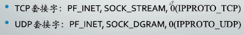

套接字

* 面向连接 SOCK_STREAM
* 面向消息 SOCK_DGRAM

<html>
    <head>
        <link rel="stylesheet" href="https://unpkg.com/diquick@1.4.21/diquick.css">

    </head>
    
    <body>
        <ul class="timeline">
  <li>
    <i data-mark="2019-01-01 14:22:11" class="bg-orange active"></i>
    
Content A

  </li>
  <li>
    <i data-mark="2019-01-01 14:22:11" class="bg-blue"></i>
    
Content B

  </li>
  <li>
    <i data-mark></i>
    
Content C

  </li>
</ul> 
    </body>
</html>

