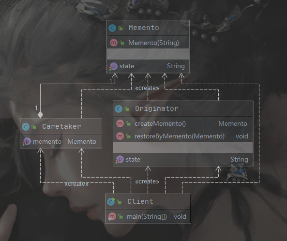

# 设计模式

> 参考：
>
> * 《大话设计模式》
> * [菜鸟教程|设计模式简介](https://www.runoob.com/design-pattern/design-pattern-intro.html)

## 设计模式的六大原则 

> 参考：
>
> * [设计模式六大原则](http://www.uml.org.cn/sjms/201211023.asp#6)

### 1. 单一职责原则

一个类只负责一个明确的功能 

**优点：**

* 降低类的复杂度，提高代码可读性和可维护性
* 降低变更时对其他功能的影响

### 2. 里氏替换原则

**原则一：**若 o1 是 C1 的一个实例化对象， o2 是 C2 的一个实例化对象，如果在使用 C1 的程序中将o1 替换为 o2 而程序行为没有发生变化，那么 C2 应该是 C1 的子类。

**原则二：**所有用到基类对象的地方，如果把基类对象替换成子类对象，程序行为不应该发生变化。

**实现方法：**

1. 子类可以实现父类的抽象方法，但不能覆盖父类的非抽象方法；
2. 允许子类拓展父类的方法
3. 当子类的方法重载父类的方法时，方法的前置条件（即方法的形参）要比父类方法的输入参数更宽松。
4. 当子类的方法实现父类的抽象方法时，方法的后置条件（即方法的返回值）要比父类更严格。

### 3. 依赖倒置原则

> 高层模块不应该依赖低层模块，二者都应该依赖其抽象；抽象不应该依赖细节；细节应该依赖抽象。

比如手机（Phone）依赖CPU，那么 Phone 就是一个高层模块， CPU 就是一的低层模块，Phone 显然不应该依赖一个具体的低层模块（如 Qualcomm865）：

```java
public class Phone {
    private Qualcomm cpu;

    Phone(){
        this.cpu = new Qualcomm();
    }

    public void printConfig(){
        System.out.println("cpu is" + this.cpu);
    }
}
```

不管是高通还是麒麟，都应该抽象为一个CPU类，然后各自实现，高层模块只依赖于抽象的低层模块。

**实现方法：**

1. 低层模块尽量都要有抽象类或接口，或者两者都有。
2. 变量的声明类型尽量是抽象类或接口。
3. 使用继承时遵循里氏替换原则。

### 4. 接口隔离原则

> 客户端不应该依赖它不需要的接口；一个类对另一个类的依赖应该建立在最小的接口上。
>
> 使用多个隔离的接口，比使用单个接口要好.

[接口隔离原则](http://www.uml.org.cn/sjms/201211023.asp#6)

### 5. 迪米特法则

> 一个对象应该对其他对象保持最少的了解。

高内聚，低耦合

### 6. 开闭原则

**对拓展开放，对修改封闭**：当系统变化时，尽量通过拓展来实现变化，而不是去修改原有代码；

## 简单工厂模式

> 2020 / 4 / 30 
>
> 参考：
>
> * [CSDN|简单工厂模式](https://blog.csdn.net/xingjiarong/article/details/49999121)

简单工厂通过传给工厂类的参数的不同，返回不同的对象，包括三部分组成：

1. 具体的”产品“
2. 工厂类（实例化并返回”产品“）
3. 客户端（使用”产品“）

### 为什么使用简单工厂：

1. ”产品“的创建过程可能很复杂，涉及到多个不同类之间的依赖，通过简单工厂将创建过程隐藏在工厂类中，一方面减轻了客户端使用该产品的难度，另一方面也防止了客户端错误创建产品造成的安全问题。
2. 将产品的生产和消费过程分离开，这样如果要有了一个新的产品，只需要把它加入到工厂类中，客户端需要时工厂类就会返回给它，否则的话，每次添加一个新的产品，都需要修改客户端代码，违反开闭原则。

### 简单工厂的缺点：

1. 系统过度依赖工厂类，工厂类作为一个”上帝类“，负责创建客户端需要的所有对象，导致一旦工厂类出错，整个系统就会崩溃。
2. 如果”产品类“特别多，工厂类中就会有很多个分支，造成工厂类异常庞大，难以维护。
3. 每次添加新的产品都要修改工厂类，从工厂类的角度看违反了”开闭原则“，也不利于系统拓展。
4. 工厂方法一般是静态方法，不利于继承。

### 适用场景

1. 工厂类负责创建的对象比较少：由于创建的对象较少，不会造成工厂方法中的业务逻辑太过复杂。

2. 客户端只知道传入工厂类的参数，对于如何创建对象不关心：客户端既不需要关心创建细节，甚至连类名都不需要记住，只需要知道类型所对应的参数。

### 例：

如果需要获取不同的手机对象，就可以使用简单工厂，具体的手机对象依赖于CPU， Camera等，通过简单工厂的封装，客户端获取 Phone 对象时就不需要了解具体的 ”生产过程“了.

> 实例化CPU， Camera 等配件时，也应该使用简单工厂。


```java
package pers.junebao.simple_factory;

import pers.junebao.simple_factory.fitting.*;
import pers.junebao.simple_factory.phone.Honor;
import pers.junebao.simple_factory.phone.OnePlus;
import pers.junebao.simple_factory.phone.Phone;

public class PhoneFactory {
    /**
     * 一个用来产生 Phone 对象的工厂方法
     * @param name 根据 name 产生不同的 Phone 的子类对象
     * @return 返回实例化后的对象，name 不匹配返回 null
     */
    public static Phone getPhone(String name) {
        if(name.toLowerCase().equals("oneplus")){
            // TODO：使用简单工厂重构
            CPU cpu = new Qualcomm();
            Camera camera = new Sony();
            return new OnePlus(cpu, camera);
        } else if (name.toLowerCase().equals("honor")) {
            CPU cpu = new Kirin();
            Camera camera = new Leica();
            return new Honor(cpu, camera);
        } else {
            return null;
        }
    }
}
```

```java
package pers.junebao.simple_factory;

import pers.junebao.simple_factory.phone.Phone;

public class Consumer {
    public static void main(String[] args) {
        Phone phone = PhoneFactory.getPhone("Honor");
        assert phone != null;
        phone.printConfig();
    }
}

```

[GitHub | 完整代码](https://github.com/520MianXiangDuiXiang520/DesignPatterns/tree/master/src/pers/junebao/simple_factory)

## 策略模式

> 参考：
>
> * [CSDN | 策略模式](https://blog.csdn.net/xingjiarong/article/details/50168853)
> * [百家号 | 策略模式](https://baijiahao.baidu.com/s?id=1638224488060180625&wfr=spider&for=pc)

如果某个系统需要不同的算法（如超市收银的优惠算法），那么可以把这些算法独立出来，使之之间可以相互替换，这种模式叫做策略模式，它同样具有三个角色：

1. 环境角色：使用策略的类
2. 抽象策略角色：策略共有的抽象类或接口
3. 具体策略角色：具体的策略的实现

### 策略模式的优缺点

优点：

1. 需要新的算法时，只需要拓展策略，而不需要修改原有代码，符合开闭原则。
2. 避免出现过多判断分支，提高代码可读性。
3. 算法间可方便的进行继承，替换。

缺点：

1. 客户端必须熟悉所有算法，并自行决定使用哪个策略
2. 策略模式将造成产生很多策略类，可以通过使用享元模式在一定程度上减少对象的数量。

### 适用场景

一个系统中有很多类，这些类之间只有**行为**表现不同时，可以使用策略模式，策略模式在实例化策略时可以配合使用简单工厂。

### 例：

比如一个收银系统，结算时有不同的优惠策略，如 九折， 五折，满100减10等，这些不同的优惠策略便是”具体策略角色“，而收银系统就是 ”环境角色“，还需要定义一个 ”抽象策略角色“：

```java
package pers.junebao.strategy_mode.discount;

// 抽象策略角色
public interface BaseDiscountStrategy {
    double preferentialAlgorithm(double money);
}

```

```java
package pers.junebao.strategy_mode.discount;

// 折扣优惠(具体策略角色)
public class Discount implements BaseDiscountStrategy {
    private double discount;
    public Discount(double discount) {
    // Discount(double discount) {
        if(discount > 1)
            discount = 1;
        else if(discount < 0)
            discount = 0.1;
        this.discount = discount;
    }

    @Override
    public double preferentialAlgorithm(double money) {
        return money * this.discount;
    }
}

```

```java
package pers.junebao.strategy_mode.discount;

// 满减优惠(具体策略角色)
public class FullReduction implements BaseDiscountStrategy {

    private double discountPrice;  //优惠金额
    private double baseline;  // 满减条件

    FullReduction(double baseline, double price) {
        this.baseline = baseline;
        this.discountPrice = price;
    }

    @Override
    public double preferentialAlgorithm(double money) {
        if(money >= this.baseline)
            money -= this.discountPrice;
        return money;
    }
}

```

这样，环境角色就可以自己决定使用哪种策略而不用修改代码了

```java
package pers.junebao.strategy_mode;

import pers.junebao.strategy_mode.discount.BaseDiscountStrategy;
import pers.junebao.strategy_mode.discount.Discount;

public class CashRegisterSystem {
    public static void main(String[] args) {
        BaseDiscountStrategy ds = new Discount(0.9);
        double purchasingPrice = 1500;
        double amountsPayable = ds.preferentialAlgorithm(purchasingPrice);
        System.out.println(amountsPayable);
    }
}
```

对于这些具体策略，可以使用简单工厂，进一步屏蔽策略的具体细节

```java
package pers.junebao.strategy_mode.discount;

public class StrategyFactory {
    public static BaseDiscountStrategy getDiscountStrategy(String name) {
        BaseDiscountStrategy result = null;
        switch (name){
            case "九折":{
                result = new Discount(0.9);
                break;
            }
            case "五折": {
                result = new Discount(0.5);
                break;
            }
            case "满100减10": {
                result = new FullReduction(100, 10);
                break;
            }
            case "满1000减200": {
                result = new FullReduction(1000, 200);
                break;
            }
            default:
                result = new OriginalPrice();
        }
        return result;
    }
}

```


```java
BaseDiscountStrategy ds = StrategyFactory.getDiscountStrategy("满1000减200");
```

[GitHub | 完整代码](https://github.com/520MianXiangDuiXiang520/DesignPatterns/tree/master/src/pers/junebao/strategy_mode)

## 装饰模式(俄罗斯套娃？)

> 装饰模式：动态的给某些对象添加额外的功能
>
> 参考：
>
> * [简书 | 装饰模式](https://www.jianshu.com/p/ff308c759f0a)
>
> * [博客园 | 简说设计模式——装饰模式](https://www.cnblogs.com/adamjwh/p/9036358.html)
>
> *  [博客园 | 装饰器模式 Decorator 结构型 设计模式 (十)](https://www.cnblogs.com/noteless/p/9603041.html)

### 什么是装饰模式

装饰模式也叫装饰器模式，python中的装饰器就是这种模式的体现，对于一个类，如果要添加一个新功能，除了修改代码外（违反开闭原则），可以使用继承，但通过继承添加新功能并不适合所有场景，如

1. 类不可见或不允许继承
2. 需要对一批类似的兄弟类添加同一个新功能时，继承会产生大量的子类
3. 希望新功能的添加和撤销是动态的
4. ......

装饰模式中的对象包括：

1. 装饰器（用来为**被装饰对象**动态添加新功能）

2. 抽象被装饰对象（所有能被装饰对象的抽象）

3. 被装饰对象

客户端如果希望给某个对象动态添加一个新功能，就可以把这个对象（被装饰对象）传递给装饰器，由装饰器实现新功能，并保存一个被装饰对象的引用，并返回给客户端一个装饰器对象，这样，被装饰对象原来的行为和属性并没有改变，甚至被装饰对象本身就没有改变，只是在外面套了一个壳子，新功能是这个壳子提供的。就像TCP/IP协议栈中，应用层的数据包到传输层通过加TCP或UDP首部来传输一样。

### 装饰模式优缺点

优点：

1. 一个装饰器可以给多个不同的类动态添加新功能
2. 新功能由装饰器实现，不需要修改被装饰对象，有一定的安全性
3. 多个装饰器可以配合嵌套使用，以此实现更复杂的功能
4. 新功能不影响原来的功能，添加和撤销都方便

缺点：

1. 过多的装饰类可能使程序变得很复杂

2. > 装饰模式是针对抽象组件（Component）类型编程。但是，如果你要针对具体组件编程时，就应该重新思考你的应用架构，以及装饰者是否合适。当然也可以改变Component接口，增加新的公开的行为，实现“半透明”的装饰者模式。在实际项目中要做出最佳选择。
   >
   > 作者：[慵懒的阳光丶](https://www.jianshu.com/p/ff308c759f0a)

### 适用场景

1. 要添加的新功能与原有类关联不大时
2. 新功能需要方便添加和撤销时
3. 不能或不方便通过继承实现新功能时

### 例

比如卖烤冷面，最基本的就是面（抽象被装饰对象）具体的就是烤冷面（被装饰对象），然后可以往面里面加各种配料（抽象装饰器），如鸡蛋，辣条等（具体装饰器），由于不同配料的加入顺序对最后的烤冷面有影响，所以如果要用继承拓展“烤冷面”，那先加鸡蛋再加辣条和先加辣条再加鸡蛋就需要写两个子类，造成冗余重复，这种场景就适合适用装饰模式。

抽象被装饰对象

```java
package pers.junebao.decorator_pattern;

public abstract class Noodles {
    public String rawMaterial;  // 配料
    public abstract void sayWhoAmI();
}
```

具体的被装饰对象：

```java
package pers.junebao.decorator_pattern;

public class BakedColdNoodles extends Noodles {

    BakedColdNoodles() {
        this.rawMaterial = "面";  // 最原始的烤冷面，配料只有面
    }

    @Override
    public void sayWhoAmI() {
        System.out.println("我是普通烤冷面！");
    }
}

```

抽象装饰器：

```java
package pers.junebao.decorator_pattern.decorator;

import pers.junebao.decorator_pattern.Noodles;

public abstract class Burden extends Noodles {
    public Noodles noodles;  // 装饰器中保留一份被装饰对象的引用，方便客户端使用
    public Burden(Noodles noodles) {
        this.noodles = noodles;
    }
}
```

* 装饰器是为某一类对象提供装饰的（这里就是实现了Noodles 的类）

具体的装饰器类：

* 加鸡蛋

  ```java
  package pers.junebao.decorator_pattern.decorator;
  
  import pers.junebao.decorator_pattern.Noodles;
  
  public class AddEggs extends Burden {
  
      public AddEggs(Noodles noodles) {
          super(noodles);
          this.rawMaterial = noodles.rawMaterial + ", 鸡蛋";
      }
  
  
      @Override
      public void sayWhoAmI() {
          System.out.println("我是加了鸡蛋的烤冷面！！");
      }
  
  }
  ```

* 加辣条

  ```java
  package pers.junebao.decorator_pattern.decorator;
  
  import pers.junebao.decorator_pattern.Noodles;
  
  public class AddSpicyStrips extends Burden{
      public AddSpicyStrips(Noodles noodles) {
          super(noodles);
          this.rawMaterial = noodles.rawMaterial + " ,辣条";
      }
  
      @Override
      public void sayWhoAmI() {
          System.out.println("我是加了辣条的烤冷面！！");
      }
  }
  ```

客户端：

```java
package pers.junebao.decorator_pattern;

import pers.junebao.decorator_pattern.decorator.AddEggs;
import pers.junebao.decorator_pattern.decorator.AddSpicyStrips;

public class Main {
    public static void main(String[] args) {
        Noodles bcn = new BakedColdNoodles();
        Noodles bcnAddEgg = new AddEggs(bcn);
        bcnAddEgg.sayWhoAmI();
        System.out.println(bcnAddEgg.rawMaterial);
        Noodles bcnEggSpicyS = new AddSpicyStrips(bcnAddEgg);
        bcnEggSpicyS.sayWhoAmI();
        System.out.println(bcnEggSpicyS.rawMaterial);
    }
}
/*
我是加了鸡蛋的烤冷面！！
面, 鸡蛋
我是加了辣条的烤冷面！！
面, 鸡蛋 ,辣条
 */
```

这样如果想先加辣条在家鸡蛋，就可以使用AddSpicyStrips先装饰BakedColdNoodles，再用AddEggs装饰AddSpicyStrips。

[GitHub | 完整代码](https://github.com/520MianXiangDuiXiang520/DesignPatterns/tree/master/src/pers/junebao/decorator_pattern)

## 代理模式

> 代理模式( Proxy)：为其他对象提供一种代理以控制对这个对象的访问。
>
> 参考：[refactoringguru | proxy](https://refactoringguru.cn/design-patterns/proxy)

### 什么是代理模式

有时候如果想要访问某个对象，但又没办法直接访问或不方便直接访问，可以使用代理模式，代理模式为想要访问的那个真实对象提供一种“替身”，将客户端直接对服务端的访问转换为客户端只与代理交互，由代理处理具体的和服务端的交互，代理模式有四种角色，分别是：

1. 客户端
2. 服务端
3. 代理
4. 抽象服务接口


代理中保留一个真实Server的对象，并且代理和真实Server实现同一个接口，这样对客户端来说Proxy就可以代替Server了，客户端想要调用Server的某个方法时，直接与代理交互，再由代理去调用Server的具体方法。

### 代理的优缺点

优点：

> *  你可以在客户端毫无察觉的情况下控制服务对象。
> *  如果客户端对服务对象的生命周期没有特殊要求， 你可以对生命周期进行管理。
> *  即使服务对象还未准备好或不存在， 代理也可以正常工作。
> *  [开闭原则](https://refactoringguru.cn/didp/principles/solid-principles/ocp)。 你可以在不对服务或客户端做出修改的情况下创建新代理。

缺点：

> *  代码可能会变得复杂， 因为需要新建许多类。
> *  服务响应可能会延迟。

### 代理的类型和使用场景

#### 1. 远程代理

当我们需要一个**远程对象**时，可以通过一个本地代理去访问，所谓远程对象是指远程的资源，包括可能不同命名空间，不同机器的资源等，如果客户端直接访问远程资源，可能涉及到复杂的数据交互和传输，通过代理，我们可以把这些数据交互和传输的过程隐藏在代理里面，由代理去与远程资源交互，并返回客户端需要的数据，这样对客户端来说，访问远程资源就和访问本地资源一样了。以此简化客户端代码。

#### 2. 虚拟代理

虚拟代理的主要作用是**延迟初始化**：

> 如果你有一个偶尔使用的重量级服务对象，一直保持该对象运行会消耗系统资源, 时可使用代理模式.
>
> 你无需在程序启动时就创建该对象， 可将对象的初始化延迟到真正有需要的时候。

比如网站图片的加载, 真实的图片可能很大,如果在构造的时候就直接加载真实的图片,就会导致加载时间过长,所以可以使用代理,用很小的缩略图来代替真实的图片,直到用户点机缩略图时再异步的加载大图.

虚拟代理应该使用缓存避免重量级对象多次重复加载.

#### 3. 保护代理

如果只有拥有特定权限的用户才能访问特定对象,就可以在代理中对用户权限进行判断,并根据权限返回不同的结果.

## 工厂方法模式

> **define an interface or abstract class for creating an object but let the subclasses decide which class to instantiate.**
>
> 参考：
>
> 1. [refactoringguru | factory-method](https://refactoringguru.cn/design-patterns/factory-method)
> 2. [javatpoint | factory-method-design-pattern](https://www.javatpoint.com/factory-method-design-pattern)
> 3. [博客园| 工厂方法](https://www.cnblogs.com/gdwkong/p/8413342.html)

### 简单工厂的问题

简单工厂把可能很复杂的对象创建过程分装在工厂类内部，客户端只需要给简单工厂一个“类的标志”，工厂类就能动态返回一个实例化对象，这样的好处是简化了客户端操作，从客户端按说，符合开闭原则，但每次添加新的产品，都需要修改工厂类，添加新的判断逻辑，不符合**开闭原则**。为了解决简单工厂的这个问题，工厂方法中会先定义一个创建对象的接口或抽象类，然后让子类去决定实例化哪个类。

### 工厂方法的优点

1. 客户端只需要知道产品对应的接口即可，无需关心产品的具体实现细节。
2. 比简单工厂有更好的可拓展性，添加新产品只需要实现接口即可。
3. 耦合度进一步下降。

### 适用场景

1. 如果无法预知对象确切类别及其依赖关系时
2. 需要将类的实例化过程延迟到其子类时
3. 工厂方法可以复用创建好的对象来节省资源（缓存）

### 例


所有工厂类的接口：

```java
public interface IPhoneFactory {
    BasePhone createPhone();
}
```

具体的工厂实现类中实例化产品：

```java
public class HonorFactory implements IPhoneFactory {
    @Override
    public BasePhone createPhone() {
        BaseCPU cpu = new KirinFactory().createCPU();
        BaseCamera camera = new LeicaFactory().createCamera();
        return new Honor(cpu, camera);
    }
}
```

```java
public class OnePlusFactory implements IPhoneFactory {
    @Override
    public BasePhone createPhone() {
        BaseCPU cpu = new QualcommFactory().createCPU();
        BaseCamera camera = new SonyFactory().createCamera();
        return new OnePlus(cpu, camera);
    }
}
```

客户端只需要知道相关接口或抽象类即可，无需关心产品细节

```java
public class Consumer {
    public static void main(String[] args) {
        BasePhone onePlus = new OnePlusFactory().createPhone();
        onePlus.printConfig();
        BasePhone honor = new HonorFactory().createPhone();
        honor.printConfig();
    }
}
```

[GitHub | 完整代码](https://github.com/520MianXiangDuiXiang520/DesignPatterns/tree/master/src/pers/junebao/factory_method)

## 原型模式(clone?)

> Prototype pattern refers to creating duplicate object while keeping performance in mind. This type of design pattern comes under creational pattern as this pattern provides one of the best ways to create an object.
>
> 参考：
>
> 1. [tutorialspoint | prototype_pattern](https://www.tutorialspoint.com/design_pattern/prototype_pattern.htm)
> 2. [博客园 | 原型模式](https://www.cnblogs.com/fengyumeng/p/10646487.html)
> 3. [博客园 | Java深拷贝与序列化](https://www.cnblogs.com/NaLanZiYi-LinEr/p/9192734.html)

原型模式是通过复制已有对象来快速创建新对象的方法，它适用于创建那些实例化很慢的对象，比如数据库连接对象，在创建好这样的对象后，我们可以缓存一份，下次需要这种对象时，我们可以直接返回一个该对象的拷贝。

### 使用场景

1. 需要大量相似对象时，如果在类中需要大量相似的对象，并且这些对象中有很多属性都是一样的，只有个别属性需要定制时，可以使用原型模式，因为直接从内从中复制对象比new一个新对象的性能要高得多。
2. 如果一个对象的实例化过程很耗时耗力，可以使用原型模式。

### Java Cloneable接口

Java中提供了一个标记接口`Cloneable`，类如果实现了这个接口就可以使用`Object`类中定义的`clone`方法

> 如果没有实现Cloneable接口，直接调用`clone()`会抛出`CloneNotSupportedException`

`Object clone()`会返回当前对象的一个**浅拷贝**

### 深拷贝和浅拷贝

根据不同的对象类型，拷贝的内容也各不相同：

1. **基本数据类型**，如int，char等，直接拷贝**值**
2. 对于**字符串**，拷贝时只复制**引用**，当字符串的值改变时，会从字符串池中重新生成新的字符串，最终结果和拷贝值一样
3. 对于**对象**，拷贝时只**复制引用**，如果要复制值，需要使用**深拷贝**

```java
public class Out implements Cloneable{
    private String outName;
    private In in;

    public Out(String outName) {
        this.outName = outName;
    }

    public void setIn(In in) {
        this.in = in;
    }

    @Override
    public String toString() {
        return "Out{" +
                "outName='" + outName + '\'' +
                ", in=" + in +
                '}';
    }

    @Override
    protected Out clone() throws CloneNotSupportedException {
        return (Out) super.clone();
    }

    public static void main(String[] args) {
        Out out = new Out("out");
        In in = new In("in name");
        out.setIn(in);

        Out out1 = null;
        try {
            // in 是一个object类型，所以在调用clone()时只复制了in的引用
            out1 = out.clone();
        } catch (CloneNotSupportedException e) {
            e.printStackTrace();
        }
        assert out1 != null;
        // 改变out1.in的name也会改变out中in的name
        out1.in.setName("out1 in");
        System.out.println(out);
        System.out.println(out1);
    }
}
/*
Out{outName='out', in=In{name='out1 in'}}
Out{outName='out', in=In{name='out1 in'}}
*/
```


#### 深拷贝 DeepCopy

Java中实现深拷贝可以手动拷贝object类型的属性，但如果这个类型中还有object类型，就会很麻烦。

```java
@Override
protected DCOut clone() throws CloneNotSupportedException {
    DCOut copy = (DCOut) super.clone();
    In copyIn = (In) this.in.clone();
    copy.setIn(copyIn);
    return copy;
}
```

还可以使用`Serializable`接口，通过序列化，将堆中的对象数据信息复制一份到堆外，再反序列化成新的克隆对象

```java
import java.io.*;

public class DeepClone implements Serializable {
    private Object obj;

    public DeepClone(Object obj){
        this.obj = obj;
    }

    public Object deepClone() {
        Object result = null;
        //序列化
        ByteArrayOutputStream baos = new ByteArrayOutputStream();
        ObjectOutputStream oos = null;
        try {
            oos = new ObjectOutputStream(baos);
            oos.writeObject(obj);
        } catch (IOException e) {
            e.printStackTrace();
        }
        // 反序列化
        ByteArrayInputStream bais = new ByteArrayInputStream(baos.toByteArray());
        ObjectInputStream  ois = null;
        try {
            ois = new ObjectInputStream(bais);
            result = ois.readObject();
        } catch (IOException | ClassNotFoundException e) {
            e.printStackTrace();
        }
        return result;
    }
}

```

#### python中的深拷贝和浅拷贝

```python
In [1]: import copy

In [2]: a = [i for i in range(10)]

In [3]: b = copy.copy(a)

In [4]: a is b
Out[4]: False

In [5]: c = [[1, 2], [3, 4]]

In [6]: d = copy.copy(c)

In [7]: d is c
Out[7]: False

In [8]: d[0] is c[0]
Out[8]: True

In [9]: e = copy.deepcopy(c)

In [10]: e[0] is c[0]
Out[10]: False

In [11]:
```

python内置的copy模块提供了深拷贝和浅拷贝的功能，python中浅拷贝只会拷贝父对象，不会拷贝父对象内部的子对象

> python切片属于浅拷贝

### 例

《大话设计模式》里简历的例子

```java
package pers.junebao.prototype_pattern;

import pers.junebao.prototype_pattern.deep_copy.DeepClone;

import java.io.Serializable;

public class Resume implements Cloneable, Serializable {
    private String name;
    private String education;
    private String sex;

    Resume(String name) {
        this.name = name;
    }

    public void setName(String name) {
        this.name = name;
    }

    public void setEducation(String education) {
        this.education = education;
    }

    public void setSex(String sex) {
        this.sex = sex;
    }


    public void print(){
        System.out.println("name: " + this.name);
        System.out.println("sex : " + this.sex);
        System.out.println("education: " + this.education);
    }

    @Override
    public Resume clone() {
        Resume resume = null;
        // 深拷贝
        resume = (Resume) DeepClone.deepClone(this);
        return resume;
    }
}

```

```java
package pers.junebao.prototype_pattern;

public class Main {
    public static void main(String[] args) {
        Resume resume = new Resume("JuneBao");
        resume.setSex("男");
        resume.setEducation("本科");
        Resume resume1 = resume.clone();
        resume1.setSex("女");
        resume.print();
        resume1.print();
    }
}
```
[GitHub | 完整代码](https://github.com/520MianXiangDuiXiang520/DesignPatterns/tree/master/src/pers/junebao/prototype_pattern)

## 模板方法

> 模板方法：定义一个操作中的算法的骨架，而将一些步骤延迟到子类中。 模板方法使得子类可以不改变一个算法的结构即可重定义该算法的某些特定步骤。
>
> 参考：
>
> 1. [CSDN | 模板方法](https://blog.csdn.net/hguisu/article/details/7564039)
> 2. [refactoringguru | template-method](https://refactoringguru.cn/design-patterns/template-method)
> 3. [refactoringguru | strategy](https://refactoringguru.cn/design-patterns/strategy)

### 什么是模板方法

> 当不变的和可变的行为在方法的子类实现中混合在一起的时候,不变的行为就会在子类中重复出现。我们通过模板方法模式把这些不变的行为搬移到单一的地方,这样就帮助子类摆脱重复的不变行为的纠缠。

如果多个类的结构都一样，只有具体的算法不相同时，我们可以把相同的结构抽象为一个公共接口或抽象类（模板）在模板里“提前”调用子类的具体实现方法，子类只需要重写自己特有的算法即可，以此可以精简代码，提高可维护性。

Template是一个抄作业的模板，抄作业时除了名字别的都一样，所以具体的子类（Student1）只需要自己实现写名字的方法（writeName）即可，不同的实现类调用doHomework时，除了writeName是自己实现的，别的都是一样的。

```java
public abstract class Template {
    abstract String writeName();

    public final void doHomework(){
        System.out.println("name: " + writeName());
        System.out.println("别人的作业 ");
    }
}
```

```java
public class Student1 extends Template {
    @Override
    String writeName() {
        return "student1";
    }
}
```

* 模板中的顶级模块（doHomework）一般定义为`final`以防止被子类修改而违反**开闭原则**

* 模板中的抽象方法（writeName）的作用仅仅是迫使子类必须实现，所以一般定义为`protected `而不是公开给客户端。

### 实现方式

1. 将现有的算法拆分为多个子模块，分析每个子模块，找出可重用的模块
2. 将可重用的模块进行抽象
3. 子类实现接口或抽象类后重写特有模块


### 优缺点

优点：

1. 可以减少代码冗余，提高可读性和可维护性
2. 一个类修改了自己的算法，对其他类影响很小

缺点：

1. 模板方法采用的是一种**反向控制结构（好莱坞模式）**，即父类调用子类的方法，违反了**里氏替换原则**
2. 模板方法中的步骤越多， 其维护工作就可能会越困难。

### 模板方法和策略模式

模板方法和策略模式都是针对多个类的不同算法的，有时两者可以互相替换使用，不同点在于策略模式使用**组合**方式，你可以通过对相应行为提供不同的策略来改变对象的部分行为，它在对象层次上运作， 因此允许在运行时切换行为。；模板方法是通过**继承**实现的，在类层次上运作， 因此它是静态的。

| 模板方法                                                     | 策略模式                                                     |
| ------------------------------------------------------------ | ------------------------------------------------------------ |
|  |  |

### 例

《大话设计模式》里试卷的例子

```java
public  abstract class ExaminationPaper {
    abstract String result1();
    abstract String result2();
    public final void question1(){
        System.out.println("喝消毒液能不能杀死病毒？");
        System.out.println("result is : " + result1());
    }

    public final void question2(){
        System.out.println("怎么优雅的吃撒尿牛丸？");
        System.out.println("result is: " + result2());
    }
}
```

```java
public class Trump extends ExaminationPaper {
    @Override
    String result1() {
        return "能！";
    }

    @Override
    String result2() {
        return "不会！";
    }
}
```

[GitHub | 完整代码](https://github.com/520MianXiangDuiXiang520/DesignPatterns/tree/master/src/pers/junebao/template_method)

## 外观模式

> 外观模式( Facade),为子系统中的一组接口提供一个一致的界面,此模式定义了一个高层接口,这个接口使得这一子系统更加容易使用。
>
> 参考：
>
> 1. [refactoringguru | facade](https://refactoringguru.cn/design-patterns/facade)
> 2. [CSDN | 设计模式（九）外观模式Facade（结构型）](https://blog.csdn.net/hguisu/article/details/7533759)
> 3. [CSDN | 外观模式 ( 概念 | 适用场景 | 优缺点 | 代码示例 )](https://blog.csdn.net/shulianghan/article/details/105339213)

### 什么是外观模式

为一些可能很复杂的子系统提供一个高层接口（facade),让facade与这些子系统交互，客户端只与facade交互，以此简化客户端操作，降低代码耦合度。


### 适用场景

1. 子系统越来越复杂时，可以使用外观模式封装一些快捷的操作，让客户端只与Facade交互。

2. 当处理一个老旧的系统时，由于这些代码老旧且难以维护，可以使用外观模式将所有与原来系统的交互过程交给Facade，新的模块直接与Facade交互，简化操作，提高开发效率。

3. > 需要将子系统组织为多层结构时，可以使用外观模式； 创建外观来定义子系统中各层次的入口。 你可以要求子系统仅使用外观来进行交互， 以减少子系统之间的耦合

### 优缺点

> 优点：
> * 减少了系统的相互依赖
>
> * 提高了灵活性。不管系统内部如何变化，只要不影响到外观对象，任你自由活动
>
> * 提高了安全性。想让你访问子系统的哪些业务就开通哪些逻辑，不在外观上开通的方法，你就访问不到
>
> 缺点：
>
> * 不符合开不原则，修改很麻烦

### 例

网购下单的过程可能包括生成订单，支付， 创建物流等多个步骤，对客户端来说，很复杂， 所以可以使用外观模式建立一个购物的Facade,客户端只需要传递要购买的货物给Facade,Facade负责后续与订单，支付等子模块交互。

```java
package pers.junebao.facade_pattern;

public class ShoppingFacade {
    private final Order order;
    private final Pay pay;
    private final Logistics logistics;
    private static volatile ShoppingFacade sh;

    private ShoppingFacade(){
        order = new Order();
        pay = new Pay();
        logistics = new Logistics();
    }

    public static ShoppingFacade createShoppingFacade() {
        if(sh == null){
           synchronized (ShoppingFacade.class) {
               if(sh == null) {
                   sh = new ShoppingFacade();
               }
           }
        }
        return sh;
    }

    public void buy(Goods goods) {
        // 创建订单
        Order o = order.createOrder(goods.name);
        if(o == null){
            System.out.println("订单创建失败");
        } else {
            // 支付
            if(pay.successPay(o)){
                // 生成物流信息
                String logisticsInfo = logistics.createLogisticsInfo(o);
                System.out.println(o.goodName + " | " + logisticsInfo);
            } else {
                System.out.println("支付失败");
            }
        }
    }
}

```

* Facade一般定义为单例的

```java
public class Client {
    public static void main(String[] args) {
        ShoppingFacade shoppingFacade = ShoppingFacade.createShoppingFacade();
        shoppingFacade.buy(new Goods("口罩"));
    }
}
```

[GitHub | 完整代码](https://github.com/520MianXiangDuiXiang520/DesignPatterns/tree/master/src/pers/junebao/facade_pattern)

### 外观与代理

外观和代理有些类似，都是把复杂的客户端操作分装在一起，但不同的是代理与它代理的对象都实现了相同的接口，所以代理可以和它代理的对象互换，同时在客户端看来，代理就是真实对象；但外观模式中Facade与子模块本身不存在必须的连接，客户端同样感知不到真实子系统的存在。

## 建造者模式（生成器模式）

> 建造者模式（Builder）将一个复杂对象的构建和表示分离，使同样的构建过程可以创建不同的表示。
>
> 参考：
>
> 1. [geeksforgeeks |builder-design-pattern/](https://www.geeksforgeeks.org/builder-design-pattern/)
> 2. [CSDN | 设计模式（三）建造者模式Builder（创建型）](https://blog.csdn.net/hguisu/article/details/7518060)

建造者模式被用来一步一步的构造一些复杂对象，这些对象被构建的步骤（过程）都一样，所以可以把**对象的构建过程**抽离出去作为一个接口或抽象类（Builder），然后具体的建造者（ConcreteBuilder）实现Builder，提供每一步具体做的事。用户需要某个产品时，调用指导者（Director），Director会控Builder按步骤生产具体产品，并返回给用户。

比如要修一个房子，所有修房子的基本步骤是一样的，先打地基，再修四壁，再封顶，最后装修，但具体修不同房子时这些步骤的具体实现却不相同，所以可以把基本步骤抽象到一起（Builder），

```java
public interface BuildHoseBase {
    void foundation();
    void buildWall();
    void buildTop();
    void decoration();
}
```

然后不管是修别墅还是茅草屋，都分别实现这个方法，填写他们自己特有的具体动作（ConcreteBuilder）

```java
public class BuildThatchedHouse implements BuildHoseBase {
    @Override
    public void foundation() {
        System.out.println("茅草屋打什么地基");
    }
    
    @Override
    public void buildWall() {
        System.out.println("插一圈竹子做墙");
    }
    
    @Override
    public void buildTop() {
        System.out.println("房顶搭上茅草");
    }

    @Override
    public void decoration() {
        System.out.println("门口种朵花");
    }
}

public class BuildVilla implements BuildHoseBase {
    // ......
}
```

然后指导者Director负责按顺序调用ConcreteBuilder中的这些方法

```java
public class BuildHouseDirector {
    private BuildHoseBase bb;

    BuildHouseDirector(BuildHoseBase bb){
        this.bb = bb;
    }

    public void build(){
        bb.decoration();
        bb.buildWall();
        bb.buildTop();
        bb.buildTop();
    }
}
```

客户端只需要与Director交互即可

```java
public class Client {
    public static void main(String[] args) {
        new BuildHouseDirector(new BuildThatchedHouse()).build();
    }
}
```


组成角色：

1. 抽象的建造者（Builder）：定义产品被构建的过程或组成成分
2. 具体的建造者（ConcreteBuilder）：实现了Builder的类，定义了构建产品的每一步的具体动作
3. 指导者（Director）：生成器Builder负责每一步骤应该怎么做，指导者Director负责按指定步骤调用生成器生成最终产品；客户端只和指导者交互。
4. 产品（Product）：指导者根据客户端要求创建出的具体的对象。


### 优缺点

优点：

1. 隔离了复杂对象的创建和表示，简化了客户端使用的难度
2. 同一创建过程可以创建不同的产品
3. 通过使用建造者模式，对于一些需要很多默认参数的构造器可以不必用”重叠构造函数 （telescopic constructor）“
4. 添加新的产品不需要修改原有代码，符合开闭原则

缺点：

1. 建造者模式只适用于创建具有相同创建过程的对象，对于相差甚大的复杂对象，不适用于创建者模式，可以使用工厂模式
2. 增加多个类，代码复杂度提高。

### 例

>   例子2：计算工资：工资的计算一般是：底薪+奖金-税。但底薪分为一级8000、二级6000、三级4000三个等级。根据岗位不同奖金的发放也不一样，管理及日常事务处理岗位（A类）每月根据领导及同事间的评议得分计算奖金，销售岗位（B类）则根据销售额发放提成。税金则根据奖金和底薪的数额进行计算。由此看出该工资的计算方式是比较稳定的构建算法，但对工资的每一部分都会根据不同的情况产生不同的算法，如何将客户端与变化巨烈的底薪、奖金和税金计算方式分离呢，这也比较适合用建造者模式。
> 
> 原文链接：https://blog.csdn.net/hguisu/article/details/7518060

```java
public interface CalculateWagesBuilder {
    double calculateBaseWages();
    double calculateBonus();
    default double calculateTax(){
        return (calculateBaseWages() + calculateBonus()) * 0.3;
    }
}
```

* 不管是哪种类型的员工，计算工资的方式都是先计算基本工资，再计算奖金，最后计算税款

```java
public interface ClassA extends CalculateWagesBuilder {

    // 模拟评分
    default float getScore() {
        return new Random().nextFloat();
    }

    @Override
    default double calculateBonus() {
        return 1000 * getScore();
    }
}

public interface ClassB extends CalculateWagesBuilder{
    //......
}

public interface FirstLevel extends CalculateWagesBuilder{
    //......
}

public interface SecondLevel extends CalculateWagesBuilder{
    //......
}

public class FirstLevelAClass implements FirstLevel, ClassA{}
public class FirstLevelBClass implements FirstLevel, ClassB{}
public class SecondLevelAClass implements SecondLevel, ClassA{}
public class SecondLevelBClass implements SecondLevel, ClassB{}
```

* 分别实现A类， B类，一级， 二级员工具体工资的计算方法（ConcreteBuilder）

```java
public class Director {
    private CalculateWagesBuilder cwb;
    Director(CalculateWagesBuilder cwb){
        this.cwb = cwb;
    }

    public double calculate(){
        double baseWages = cwb.calculateBaseWages();
        System.out.println("基本工资： " + baseWages + " 元");
        double bonus = cwb.calculateBonus();
        System.out.println("奖金： " + bonus + " 元");
        double tax = cwb.calculateTax();
        System.out.println("税款： " + tax + " 元");
        return baseWages + bonus - tax;
    }
}
```

* 指挥者，根据用户需求计算最终工资

```java
public class Client {
    public static void main(String[] args) {
        double finalWages = new Director(new FirstLevelAClass()).calculate();
        System.out.println("一级A类员工 xxx 的最终工资为： " + finalWages + " 元");
    }
}
/*
基本工资： 8000.0 元
奖金： 545.5223999023438 元
税款： 2622.01669921875 元
一级A类员工 xxx 的最终工资为： 5923.505700683594 元
 */
```

[GitHub | 完整代码](https://github.com/520MianXiangDuiXiang520/DesignPatterns/tree/master/src/pers/junebao/builder_mode)

### 建造者与工厂模式

建造者模式相比工厂模式多了指挥者，适用于创建比工厂创建的对象更加的对象，且工厂创建的对象之间不存在直接的联系，建造者创建的对象要求构建步骤相同。

## 观察者模式

> 观察者模式又叫**发布订阅**模式，它定义了一种一对多的依赖关系,让多个观察者对象同时监听某一个主题对象。这个主题对象在状态发生变化时会通知所有观察者对象,使它们能够自动更新自己。
>
> 参考：
>
> * [design-patterns.readthedocs |观察者模式](https://design-patterns.readthedocs.io/zh_CN/latest/behavioral_patterns/observer.html#id16)
>* [refactoringguru | 观察者模式](https://refactoringguru.cn/design-patterns/observer)
> * [博客园 | 简说设计模式——观察者模式](https://www.cnblogs.com/adamjwh/p/10913660.html)
>* [CSDN | 设计模式 ( 十五 ) 观察者模式Observer（对象行为型）](http://blog.csdn.net/hguisu/article/details/7556625)

有时需要在对象和对象之间建立一种一对多的联系，使得某个对象（频道/目标）发生改变时，能够通知其他对他感兴趣的对象（订阅者/观察者）使之能够及时根据**目标**的变化更新自己的状态。

组成：

1. 目标（Subject）：它是具体目标的一个抽象，有时可以只有具体目标，一般包含一个用来保存所有订阅（观察）此目标的**容器**以及**添加删除订阅者的方法**和通知所有订阅者的**方法**。

   ```java
   public abstract class Subject {
       private Set<Observer> observers = new HashSet<>();
   
       void addObserver(Observer observer) {
           observers.add(observer);
       }
   
       void delObserver(Observer observer){
           observers.remove(observer);
       }
   
       /**
        * 通知所有订阅者
        */
       void noticeAll() {
           for (Observer observer : observers) {
               observer.update();
           }
       }
   
   }
   ```

   

2. 具体目标（ConcreteSubject）: 目标的具体实现

3. 观察者（Observer）：具体观察者的抽象，一般是一个接口，接口中至少有一个当目标发生变化后更新自己的方法。

   ```java
   public interface Observer {
       void update();
   }
   ```

   

4. 具体观察者（ConcreteObserver）：观察者的具体实现。

   ```java
   public class ConcreteObserver implements Observer {
       @Override
       public void update() {
           System.out.println("更新了");
       }
   }
   ```


### 使用场景

> * 一个抽象模型有两个方面，其中一个方面依赖于另一个方面。将这些方面封装在独立的对象中使它们可以各自独立地改变和复用。
> * 一个对象的改变将导致其他一个或多个对象也发生改变，而不知道具体有多少对象将发生改变，可以降低对象之间的耦合度。
> * 一个对象必须通知其他对象，而并不知道这些对象是谁。
> * 需要在系统中创建一个触发链，A对象的行为将影响B对象，B对象的行为将影响C对象……，可以使用观察者模式创建一种链式触发机制

实例：

> MVC模式是一种架构模式，它包含三个角色：模型(Model)，视图(View)和控制器(Controller)。观察者模式可以用来实现MVC模式，观察者模式中的观察目标就是MVC模式中的模型(Model)，而观察者就是MVC中的视图(View)，控制器(Controller)充当两者之间的中介者(Mediator)。当模型层的数据发生改变时，视图层将自动改变其显示内容。

### 优缺点

优点：

1. 符合开闭原则，引入新的订阅者无需修改发布者代码
2. 可以在运行时动态建立对象之间的联系
3. 支持广播
4. 观察者模式可以实现表示层和数据逻辑层的分离，并定义了稳定的消息更新传递机制，抽象了更新接口，使得可以有各种各样不同的表示层作为具体观察者角色。
5. 观察者模式在观察目标和观察者之间建立一个抽象的耦合。

缺点：

1. 如果观察者和目标存在循环订阅，可能导致系统崩溃
2. 观察者只能知道目标变换了，不知道目标怎么变化的
3. 如果观察者和目标之间存在多个观察者，这样消息传递会很费时
4. 通知顺序可能是随机的

### Java对观察者模式的支持

Java util包中提供了 `Observer`接口和`Observable`类，前者就是观察者接口，后者相当于目标 Subject，实现具体目标时可以继承该类。

```java
public interface Observer {
    void update(Observable o, Object arg);
}
```

* 相比自己定义的`Observer`接口， 官方的update方法多了两个参数，第一个参数是被观察者（目标）的一个引用，第二个参数是目标发生变化时调用`notifyObservers`方法时传递过来的。

`Observable`类中定义的方法和上面的`Subject`类似,但是它做了更完整的的并发控制，并且使用了一个布尔变量`changed`标识目标是否被修改，并使用`setChanged()`和`CleanChanged()`两个方法控制这个变量，只有这个变量是`true`时，才会通知所有观察者，通知完后重新置为`false`,所以如果要让自己的方法调用时通知所有观察者，需要调用`setChanged()`

### 例

不同的顾客可以订阅不同的电视频道，电视频道发布新电视时，通知所有订阅者

```java
import java.util.Observable;

public class CCTV1 extends Observable {
    public void release(){
        this.setChanged();
        this.notifyObservers();
    }
}
```

```java
import java.util.Observable;
import java.util.Observer;

public class Customer implements Observer {
    @Override
    public void update(Observable o, Object arg) {
        System.out.println( o.getClass().getSimpleName() + " 发布新节目");
    }
}
```

```java
public class Client {
    public static void main(String[] args) {
        CCTV1 cctv1 = new CCTV1();
        Customer customer1 = new Customer();
        // 顾客1订阅CCTV1
        cctv1.addObserver(customer1);
        cctv1.release();
    }
}
```

[GitHub | 完整代码](https://github.com/520MianXiangDuiXiang520/DesignPatterns/tree/master/src/pers/junebao/observer_pattern)

## 抽象工厂模式

> 抽象工厂模式( Abstract Factory),提供一个创建一系列相关或相互依赖对象的接口,而无需指定它们具体的类。
>
> 参考:
>
> * [refactoringguru | abstract-factory](https://refactoringguru.cn/design-patterns/abstract-factory)
> * [readthedocs | 抽象工厂模式(Abstract Factory)](https://design-patterns.readthedocs.io/zh_CN/latest/creational_patterns/abstract_factory.html)

工厂方法中每一个工厂只提供一种产品，为此，抽象工厂将工厂方法中的所用工厂向上抽象出一个**抽象工厂**，将所有产品向上抽象出**抽象产品**，这样抽象工厂模式中的角色就包括：

* AbstractFactory：抽象工厂
* ConcreteFactory：具体工厂
* AbstractProduct：抽象产品
* Product：具体产品


### 简单工厂，工厂方法，抽象工厂

对比三种工厂模式，简单工厂直接在一个**静态工厂**中返回产品实例，没有对产品或工厂做任何抽象，是最简单粗暴的工厂模式，但每次添加新的产品都要修改工厂类，违反**开闭原则**，后来工厂方法将工厂类向上抽象出一个**“抽象工厂接口”**，让每一个具体的工厂类只返回一种产品，这样添加新产品时只需要给“抽象工厂接口”添加新的实现类即可，但工厂方法的问题在于每个具体工厂只能生产一种产品，因此，在抽象工厂中，把一系列产品进一步分装为**抽象产品**，具体工厂就可以产生产生多个产品了。

> 当抽象工厂模式中每一个具体工厂类只创建一个产品对象，也就是只存在一个产品等级结构时，抽象工厂模式退化成工厂方法模式；当工厂方法模式中抽象工厂与具体工厂合并，提供一个统一的工厂来创建产品对象，并将创建对象的工厂方法设计为静态方法时，工厂方法模式退化成简单工厂模式。

### 实现方法

> 模拟在 MySQL 或 SQLServer 数据库中对用户信息（User）和部门信息（Department）的查询（select）和插入（insert）功能。（假设MySQL 和 SQLServer 中的查询和插入语句不同），同时希望客户端对数据库的变更不敏感。

要实现的功能是在 MySQL 或 SQL Server 中实现对 User 和 Department 的插入和查询，把 SQL Server 的插入和查询看作 MySQL 插入查询的变体，那么就可以把系统功能抽象为对 User 的操作和对 Department 的操作，分别建立两个接口表示：

```java
public interface IUserDao {
    void insert(User user);
    void select(String name);
}
```

```java
public interface IDepartDao {
    Department select(String name);
    void insert(Department department);
}
```

由于 MySQL 和 SQLServer 中的查询和插入语句不同， 所以他们分别实现这两个接口，表示两种数据库具体的操作细节。

```java
public class MySQLUserDao implements IUserDao {
    @Override
    public void insert(User user) {
        System.out.println("使用MySQL的插入方法把User插入表中");
    }

    @Override
    public void select(String name) {
        System.out.println("使用MySQL中的查询方法查询name");
    }
}

public class MySQLDepartDao implements IDepartDao {
    // ......
}

public class SQLServerUserDao implements IUserDao {
    // ......
}

public class SQLServerDepartDao implements IDepartDao {
    // ......
}
```

然后就需要一个工厂来产生具体的用来操作数据的对象，如果采用工厂方法，就要建立四个工厂类，产品更多时，显然不合适，但其实`MySQLUserDao`和`MySQLDepartDao`可以看作是一类对象（MySQL处理数据的对象），`SQLServerUserDao`和`SQLServerDepartDao`可以看作是一类对象（SQL Server处理数据的对象），这样只需要建立两个工厂类就可以了，这两个工厂类又可以向上抽象（他们都是返回一个`IUserDao`对象， 一个`IDepartDao`）对象，所以最终为：

```java
public interface IFactor {
    IUserDao getUserDao();
    IDepartDao getDepartDao();
}
```

```java
public class MySQLFactory implements IFactor {
    @Override
    public IDepartDao getDepartDao() {
        return new MySQLDepartDao();
    }

    @Override
    public IUserDao getUserDao() {
        return new MySQLUserDao();
    }
}
```

```java
public class SQLServerFactory implements IFactor {
    @Override
    public IDepartDao getDepartDao() {
        return new SQLServerDepartDao();
    }

    @Override
    public IUserDao getUserDao() {
        return new SQLServerUserDao();
    }
}
```

客户端代码：

```java
public class Client {
    public static void main(String[] args) {
        IFactor factor = new MySQLFactory();
        IUserDao userDao = factor.getUserDao();
        IDepartDao departDao = factor.getDepartDao();
        userDao.insert(new User("1", "张三"));
        userDao.select("张三");
    }
}
```


#### 实现方法总结

1. 判断要实现的多个功能是否存在 “变体” 的情况，**找出抽象产品**（对User 和 Department的操作）并**定义抽象产品接口**（IUserDao， IDepartDao）
2. 实现每个变体的具体产品
3. 声明抽象工厂接口， 并且在接口中为所有抽象产品提供一组构建方法。
4. 实现具体工厂

### 反射改进抽象工厂

如果抽象工厂中加入了新的产品，那首先必须改变抽象工厂接口,其次所有的具体工厂类也要跟着修改，为此可以选择放弃工厂方法的思想，改用简单工厂的思想。

```java
public class DaoFactory {
    private static String db = "MySQL";
//    private static String db = "SQLServer";
    
    public static IUserDao getUserDao(){
        switch (db){
            case "MySQL":
                return new MySQLUserDao();
            case "SQLServer":
                return new SQLServerUserDao();
            default:
                return null;
        }
    }
    
    public static IDepartDao getDepartDao(){
        switch (db){
            case "MySQL":
                return new MySQLDepartDao();
            case "SQLServer":
                return new SQLServerDepartDao();
            default:
                return null;
        }
    }
}
```


放弃抽象工厂接口以及具体工厂类后，如果要添加新产品，只要修改`DaoFactory`一个类就可以了，并且由于在`DaoFactory`中定义了要使用的数据库的类型（变体），换数据库时，就只需要改变`DaoFactory`就可以了，进一步降低了与客户端的耦合度。但简单工厂“从工厂内看”不符合开闭原则，如果要新添加一个数据库（新添加一种变体）如Oricle, 使用工厂方法时只需要添加一个抽象工厂接口的实现类（满足开闭原则），现在需要修改`DaoFactory`（不符合开闭原则），为此可以使用反射。

```java
package pers.junebao.abstract_factory.db;

public class DaoFactory {
    private static String db = "MySQL";
//    private static String db = "SQLServer";

    public static IUserDao getUserDao(){
        try {
            try {
                return (IUserDao) Class.forName("pers.junebao.abstract_factory.db.SQLServer" + db + "UserDao").newInstance();
            } catch (InstantiationException | IllegalAccessException e) {
                e.printStackTrace();
                return null;
            }
        } catch (ClassNotFoundException e) {
            e.printStackTrace();
            return null;
        }
    }

    public static IDepartDao getDepartDao(){
        try {
            try {
                return (IDepartDao) Class.forName("pers.junebao.abstract_factory.db." + db + "DepartDao").newInstance();
            } catch (InstantiationException | IllegalAccessException e) {
                e.printStackTrace();
                return null;
            }
        } catch (ClassNotFoundException e) {
            e.printStackTrace();
            return null;
        }
    }
}

```

[GitHub | 完整代码](https://github.com/520MianXiangDuiXiang520/DesignPatterns/tree/master/src/pers/junebao/abstract_factory)

完整类名，选择的数据库名这些都可以放到配置文件中，进一步降低修改成本

### 使用场景和优缺点

适用场景：

1. 客户端不应该关心产品具体的创建细节时（所有工厂方法适用）
2. 系统中存在多个“变种”，并且同一时刻只使用其中一个。

优点：

> * 抽象工厂模式隔离了具体类的生成，使得客户并不需要知道什么被创建。由于这种隔离，更换一个具体工厂就变得相对容易。所有的具体工厂都实现了抽象工厂中定义的那些公共接口，因此只需改变具体工厂的实例，就可以在某种程度上改变整个软件系统的行为。另外，应用抽象工厂模式可以实现高内聚低耦合的设计目的，因此抽象工厂模式得到了广泛的应用。
> * 当一个产品族中的多个对象被设计成一起工作时，它能够保证客户端始终只使用同一个产品族中的对象。这对一些需要根据当前环境来决定其行为的软件系统来说，是一种非常实用的设计模式。
> * 增加新的具体工厂和产品族很方便，无须修改已有系统，符合“开闭原则”。

缺点:

> * 在添加新的产品对象时，难以扩展抽象工厂来生产新种类的产品，这是因为在抽象工厂角色中规定了所有可能被创建的产品集合，要支持新种类的产品就意味着要对该接口进行扩展，而这将涉及到对抽象工厂角色及其所有子类的修改，显然会带来较大的不便。
> * 开闭原则的倾斜性（增加新的工厂和产品族容易，增加新的产品等级结构麻烦）。

## 状态模式

> 允许一个对象内部状态改变时改变其行为，使得这个对象看起来改变了其类。

如果一个对象的行为取决于其内部的一个或多个动态变化的属性的值，那么这些属性被称之为**状态（state）**，这类对象被称之为**有状态的对象（stateful）**，行为与状态间的转换关系可以由**状态转换图**体现，如进程间的状态转换关系


如果将进程视为一个对象，这个对象就拥有**新建**，**就绪**，**运行**，**阻塞**，**终止**五种状态，对象的具体行为就会由状态决定。如果直接使用多个`if else`来描述这个状态，就违反了**开闭原则**，所以引入了**状态模式**，状态模式**允许一个对象内部状态改变时改变其行为，使得这个对象看起来改变了其类。**

### 实现方法

状态模式包含三部分：

1. **上下文 Context**：上下文中保存了一个具体对象状态的引用，一般来说这个引用会有一个初始值表示初始状态，其次上下文还应该包含一个`setState()`方法，用来修改当前状态；最后上下文还要包含一个或多个**行为方法**，这些行为方法是开放给客户端使用的，上下文中的行为方法应该是调用具体状态对象对应的行为方法。
2. **抽象状态类 State**：抽象状态类声明了每个具体状态类应该实现的行为（方法），大多数情况下，这些方法因该有一个上下文对象的参数，用来将当前状态修改为下一个状态
3. **具体状态类 ConcreteState**。

例：

投简历找工作的过程中，存在三个状态：


1. **新投递状态（NewDeliveryStare）**：这个状态对应的动作是简历审批，如果通过，进入下一个面试状态，否则进入回绝状态
2. **面试状态（InterviewState）**：这一状态对应的动作是面试，通过进入“通过状态”，否则进入回绝状态
3. **通过状态（PassState)**：一个终态
4. **回绝状态（RefuseState）**：另一个终态

首先建立抽象状态类：

```java
package pers.junebao.state.recruitment;

public interface IState {
    /**
     * 每个具体状态类应该实现的行为（方法）
     * @param context 当前的上下文对象，方便在具体实现中修改状态
     */
    void header(Context context);
}

```

* `header()`是在某个状态下，系统应该做的事（这个例子里应该分成两个：每个状态公司系统做的事和每个状态展示给应聘者的东西）

建立上下文类

```java
package pers.junebao.state.recruitment;

public class Context {
    // 初始状态为 新投递
    private IState state = new NewDeliveryStare();

    protected void setState(IState state) {
        this.state = state;
    }

    // 展示给客户端的方法，其实内部调用状态类的header方法
    public void header(){
        this.state.header(this);
    }
}

```

实现抽象状态类`IState`完成具体状态类

* 新投递状态

  ```java
  package pers.junebao.state.recruitment;
  
  import java.util.Scanner;
  
  public class NewDeliveryStare implements IState {
      private boolean resumeApproval(){
          System.out.println("简历是否合格（Y/N）：");
          String input = new Scanner(System.in).next();
          return "Y".equals(input) || "y".equals(input);
      }
  
      @Override
      public void header(Context context) {
          if(resumeApproval()){
              System.out.println("恭喜通过简历评估，请等待面试...");
              context.setState(new InterviewState());
          } else {
              System.out.println("简历评估未通过！");
              context.setState(new RefuseState());
          }
  
      }
  }
  ```

* 面试状态

  ```java
  package pers.junebao.state.recruitment;
  
  import java.util.Scanner;
  
  public class InterviewState implements IState {
      private boolean interview(){
          System.out.println("面试是否合格（Y/N）：");
          String input = new Scanner(System.in).next();
          return "Y".equals(input) || "y".equals(input);
      }
  
      @Override
      public void header(Context context) {
          if(interview()){
              System.out.println("恭喜通过面试，即将发放offer!!");
              context.setState(new PassState());
          } else {
              System.out.println("未能通过面试！！");
              context.setState(new RefuseState());
          }
      }
  }
  ```

* 通过状态

  ```java
  package pers.junebao.state.recruitment;
  
  public class PassState implements IState {
      @Override
      public void header(Context context) {
          System.out.println("恭喜您已通过所有考核！！！");
      }
  }
  
  ```

* 回绝状态

  ```java
  package pers.junebao.state.recruitment;
  
  public class RefuseState implements IState {
      @Override
      public void header(Context context) {
          System.out.println("已回绝！！");
      }
  }
  
  ```

客户端：

```java
package pers.junebao.state.recruitment;

public class Client {
    public static void main(String[] args) {
        Context context = new Context();
        context.header();
        context.header();
        context.header();
    }
}
```

运行结果：

|                           result1                            |                           result2                            |                           result3                            |
| :----------------------------------------------------------: | :----------------------------------------------------------: | :----------------------------------------------------------: |
|  |  |  |

[GitHub | 完整代码](https://github.com/520MianXiangDuiXiang520/DesignPatterns/tree/master/src/pers/junebao/state)

### 适用场景及优缺点

**适用场景：**

* 适用于对象行为要随可确定的状态的动态改变而改变的场景。

**优点：**

* 通过将具体的行为分装到具体状态类中，避免了使用大量`if else`，提高了代码可读性和可拓展性，一定程度上符合开闭原则。
* context里提供给客户端的方法调用的其实是具体状态类里的方法，但客户端并不能感知到这一点，对客户端来说感觉就像是更改了方法。
* 可以让多个环境对象共享一个状态对象，从而减少系统中对象的个数。

**缺点：**

* 结构和实现都比较复杂，并且会增加许多类，使用不当会导致代码混乱。
* 不同状态之间一般存在复杂的关联关系，修改或添加具体状态可能会导致 “ 牵一发而动全身 ”，并不是完全符合开闭原则。

### 状态模式与策略模式

> [状态](https://refactoringguru.cn/design-patterns/state)可被视为[策略](https://refactoringguru.cn/design-patterns/strategy)的扩展。 两者都基于组合机制： 它们都通过将部分工作委派给 “帮手” 对象来改变其在不同情景下的行为。 策略使得这些对象相互之间完全独立， 它们不知道其他对象的存在。 但*状态*模式没有限制具体状态之间的依赖， 且允许它们自行改变在不同情景下的状态。

共同点：

* 都基于组合机制
* 都是将行为划分为更小的组件来委派给 “ 帮手” 去做
* 都可以避免使用大量`if else`

不同点：

* 不同策略之间联系不大，甚至一个策略可以完全不知道其他策略的存在
* 不同状态之间一般存在复杂的联系，以允许从一个状态切换到另一个状态

## 适配器模式

> **适配器模式( Adapter)**,将一个类的接口转换成客户希望的另外一个接口。 Adapter模式使得原本由于接口不兼容而不能一起工作的那些类可以一起工作。

适配器模式包括**类适配器**和**对象适配器**两种，类适配器是适配器类同时实现目标抽象类和适配者类，这样需要编程语言支持多继承。

```python
class Target:
    def show(self):
        print("Target")


class Adaptee:
    def show(self):
        print("Adaptee")


class Adapter(Target, Adaptee):
    def show(self):
        Adaptee().show()


class Client:
    def test(self, target: Target):
        target.show()


if __name__ == '__main__':
    Client().test(Adapter())
```

对象适配器实现了其中一个对象的接口， 并对另一个对象进行封装。

如客户端必须需要一个`Target`类型的对象

```java
public interface Target {
}

public class Client {
    public void test(Target target){
        System.out.println(target);
    }
}
```

但却只能提供一个`Give`类型对象(**`Target`和`Give` 只是类型不同，数据和行为都相同**)

```java
public class Give {
    void show(){
        System.out.println(" Give ");
    }
}
```

为了可以让让`Give`正常工作，使用**适配器模式**，定义一个适配器类（或接口），实现目标接口，封装提供的接口对象

```java
public class Adapter implements Target {
    private Give give;

    Adapter(Give give){
        this.give = give;
    }

    public void show() {
        give.show();
    }
}
```

这样先把`Give`对象传递给`Adapter`再把`Adapter`对象传给`Client`就可以让`Give`和`Client`一起正常工作了。

```txt
public static void main(String[] args) {
    new Client().test(new Adapter(new Give()));
}
```


### 适用环境

1. 系统需要使用现有的类，而这些类的接口不符合系统的需要。
   * 适配器模式是接口不符且无法修改的情况下的无奈之举，例如在使用第三方模块时，无需为此修改自己的系统，这时可以选择使用适配器模式，但如果是由于前期设计不好导致接口不符，且二者其一的代码允许修改，应该尽量选择重构来统一接口而不是适配器。
2. 想要建立一个可以重复使用的类，用于与一些彼此之间没有太大关联的一些类，包括一些可能在将来引进的类一起工作。

### 优缺点

**优点：**

> * 将目标类和适配者类解耦，通过引入一个适配器类来重用现有的适配者类，而无须修改原有代码。
> * 增加了类的透明性和复用性，将具体的实现封装在适配者类中，对于客户端类来说是透明的，而且提高了适配者的复用性。
> * 灵活性和扩展性都非常好，通过使用配置文件，可以很方便地更换适配器，也可以在不修改原有代码的基础上增加新的适配器类，完全符合“开闭原则”。

**缺点：**

* > 对于类适配器，并不能很好支持 Java 这种只支持单继承的语言。

* > 对于对象适配器，要想置换适配者类的方法就不容易。如果一定要置换掉适配者类的一个或多个方法，就只好先做一个适配者类的子类，将适配者类的方法置换掉，然后再把适配者类的子类当做真正的适配者进行适配，实现过程较为复杂。

## 备忘录模式

> **备忘录模式**是一种行为设计模式， 允许在不暴露对象实现细节的情况下保存和恢复对象之前的状态。

备忘录模式又叫**快照模式**，用于在**不破坏原对象封装**的条件下保存对象某一时刻的 “状态” ，作为一个 “备忘录（或快照）” ，并且可以在原对象改变后通过备忘录恢复 原来的状态，最典型的例子是游戏存档。

备忘录模式涉及到的成员角色包括：

* 发起者（Originator）：发起者负责生成备忘录并根据备忘录恢复对象状态
* 备忘录（Memento）：备忘录对象应该只能被发起者创建和修改
* 负责人（Caretaker）：只负责存储备忘录对象，甚至不应该读备忘录



**代码：**

```java
public class Originator {
    private String state = "OFF";
    /**
     * 创建备忘录，保存当前状态
     * @return 返回保存了当前对象状态的备忘录对象
     */
    public Memento createMemento(){
        return new Memento(this.state);
    }

    /**
     * @param memento 恢复 memento 中保存的对象状态
     */
    public void restoreByMemento(Memento memento){
        this.state = memento.getState();
    }

    public String getState() {
        return state;
    }

    public void setState(String state) {
        this.state = state;
    }
}
```

```java
public class Memento {
    private String state;

    public Memento(String state) {
        this.state = state;
    }

    public String getState() {
        return state;
    }

    public void setState(String state) {
        this.state = state;
    }
}
```

管理者只负责保存备忘录对象，不会去修改或查看

```java
public class Caretaker {
    private Memento memento;

    public Memento getMemento() {
        return memento;
    }

    public void setMemento(Memento memento) {
        this.memento = memento;
    }
}
```

```java
public class Client {
    public static void main(String[] args) {
        Originator originator = new Originator();
        System.out.println(originator.getState());

        // 保存状态
        Memento memento = originator.createMemento();
        Caretaker caretaker = new Caretaker();
        caretaker.setMemento(memento);

        // 修改状态
        originator.setState("ON");
        System.out.println(originator.getState());

        // 恢复状态
        originator.restoreByMemento(caretaker.getMemento());
        System.out.println(originator.getState());
    }
}
```

在上面的结构中对象状态被保存在备忘录中，备忘录保存在管理者中，这样存在的问题是备忘录中的状态信息对所有人透明，管理者和客户端其实都可以修改备忘录中的状态，存在一定的风险，也并没有很好的实现封装，这属于一种**白盒模式**，除了这种模式，可以将备忘录角色 Memento 作为 发起者 Originator 的私有内部类，这样备忘录中存储的状态就只有发起者可以操纵了。管理者可以通过一个**标记接口 MementoIF **存储备忘录，但由于是标记接口，管理者并不能操纵备忘录